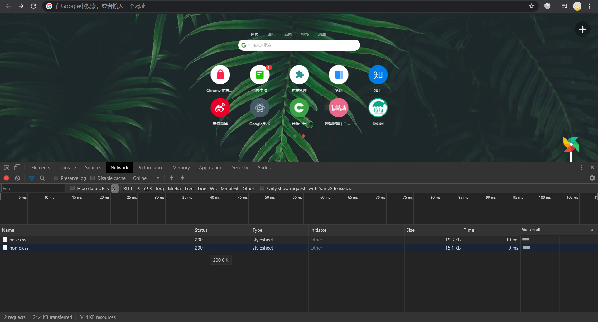
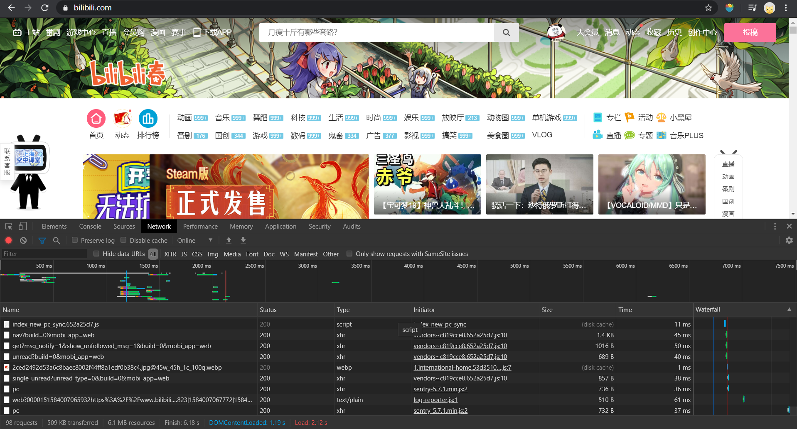
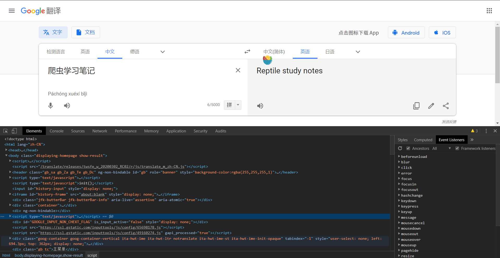

# HTTP基本原理

本节内容是了解HTTP的基本原理，以及在浏览器中输入URL，回车到获取网页内容之间的过程。

 

## URL, URN与URI

URL全称为"Universal Resource Locator"，即统一资源定位符。

URN全称为"Universal Resource Name"，即统一资源名称。

URI全称为"Uniform Resource Identifier"，即统一资源标志符。

 

例如，[https://www.runoob.com/python3/python3-multithreading.html](https://www.runoob.com/python3/python3-multithreading.html)，它既是URL也是URI。
在这个网页中介绍了python3多线程相关知识，我们通过这个URL/URI来访问它，这其中包括了访问协议HTTPS，访问路径和资源名称python3-multithreading.html。

URL是URI的子集，URN只命名了一个资源，例如书籍的ISBN，参考文献的标注等等。可以说URL，URN一起组成了URI。

但是鉴于URN的使用极少，因此所有的URI都是URL，网页的链接称URL或者URI都可以，不作区分。

## 超文本

超文本(Hypertext)是一种可以显示在电脑显示器或其他电子设备的文本，其中的文字包含有可以链接到其他字段或者文档的超链接，允许从当前阅读位置直接切换到超链接所指向的文字。超文本文档通过超链接相互链接，超链接通常通过鼠标点击，按键设置或触屏来点阅。来源于[维基百科](https://zh.wikipedia.org/wiki/%E8%B6%85%E6%96%87%E6%9C%AC)。

浏览器中看到的网页都是由超文本解析而来，它们是一系列的HTML代码，这些HTML代码就称为超文本。

在Chrome浏览器中按下快捷键F12，可以在Elements部分看到网页的HTML源代码。

## HTTP和HTTPS

在[https://www.bilibili.com](https://www.bilibili.com)中，URL的开头是https，它便是访问资源所需要的协议类型，有时候会有以http，sfp，sftp等等开头的URL，这些都是不同的访问协议，我们见的最多的便是http或者https协议了。

 

超文本传输协议(HyperText Transfer Protocol，缩写：HTTP)是一种用于分布式，协作式和超媒体信息系统的应用层协议。HTTP是万维网的数据通信的基础。

设计HTTP最初的目的是为了提供一种发布和接收HTML页面的方法。通过HTTP或者HTTPS协议请求的资源由统一资源标识符URI来标识。

目前广泛使用的版本是HTTP 1.1。参考于[维基百科](https://zh.wikipedia.org/wiki/%E8%B6%85%E6%96%87%E6%9C%AC%E4%BC%A0%E8%BE%93%E5%8D%8F%E8%AE%AE)。

 

超文本传输安全协议(HyperText Transfer Protocol Secure，缩写：HTTPS；常称为HTTP over TLS，HTTP over SSL或HTTP Secure)是一种通过计算机网络进行安全通信的传输协议。HTTPS经由HTTP进行通信，但利用SSL/TLS来加密数据包。
参考于[维基百科](https://zh.wikipedia.org/wiki/%E8%B6%85%E6%96%87%E6%9C%AC%E4%BC%A0%E8%BE%93%E5%AE%89%E5%85%A8%E5%8D%8F%E8%AE%AE)。

HTTPS传输的内容经SSL加密，所以它比HTTP更安全。

 

### HTTP请求过程

当我们在浏览器中输入一个URL，回车后浏览器显示页面内容，这之间发生了什么？

这是一个很经典的问题，面试中经常出现，这里作一个简单的解释。

当我们往浏览器地址栏输入URL，浏览器会解析URL，找到对应的服务器，浏览器向网站所在的服务器发送了一个请求，网站的服务器接收到这个请求后进行处理和解析，然后返回对应的响应，接着传回给浏览器。响应里会包含了页面的源代码等内容，浏览器再对其进行解析，将网页呈现了出来。

打开Chrome浏览器，右键检查，选择“检查”，可以查看地址栏输入URL后回车，发生了怎样的网络请求。

例如输入bilibili的网址。

每个列的作用这里就不作详细介绍了，有兴趣的可以查阅相关资料。

下面我们来介绍一下请求和响应都包含哪些内容。

### 请求

请求是由客户端向服务端发出，由4部分内容：

请求方法(RequestMethod)

请求的网址(RequestURL)

请求头(RequestHeaders)

请求体(Request Body)。

 

#### 请求方法

HTTP1.0 定义了三种请求方法：GET，POST和HEAD方法。

HTTP1.1 新增了六种请求方法：OPTIONS，PUT，PATCH，DELETE，TRACE和CONNECT方法。

常用的请求方法是GET和POST。

GET请求的参数会直接包含在URL中，提交的数据至多为1024字节；POST请求通常在表单提起时发起，数据以表单形式传输，不在URL中，数据量没有限制。
显然POST比GET更安全，也适用于文件传输。

HTTP的请求与其描述如下表所示：

| 方法 | 描述 |
| :----: | :----: |
| GET | 请求指定的页面信息，并返回实体主体|
| HEAD|类似于GET请求，只不过返回的响应中没有具体的内容，用于获取报头|
|PUT|从客户端向服务器传送的数据取代指定的文档的内容|
|DELETE	|请求服务器删除指定的页面|
|CONNECT|HTTP/1.1协议中预留给能够将连接改为管道方式的代理服务器|
|OPTIONS|允许客户端查看服务器的性能|
| TRACE|回显服务器收到的请求，主要用于测试或诊断|
|PATCH	| 是对PUT方法的补充，用来对已知资源进行局部更新|
|POST|向指定资源提交数据进行处理请求(例如提交表单或者上传文件)。数据被包含在请求体中。POST 请求可能会导致新的资源的建立和/或已有资源的修改|

更多信息可参考，[https://www.runoob.com/http/http-methods.html](https://www.runoob.com/http/http-methods.html)。

 

#### 请求的网址

即URL，确定我们需要访问的资源。

#### 请求头

请求头，用来说明服务器要使用的附加信息，比较重要的信息有Cookie，Referer，User-Agent等。

部分请求头及其描述如下表：

| 方法 | 描述 |
| :----: | :----: |
|Accept| 指定客户端能够接收的内容类型|
| Accept-Charset|浏览器可接受的字符编码集|
| Accept-Encoding | 指定浏览器可以支持的web服务器返回内容压缩编码类型|
| Accept-Language | 浏览器可接受的语言 |
| Cookie | HTTP请求发送时，会把保存在该请求域名下的所有cookie值一起发送给web服务器|
| Content-Length | 请求的内容长度 |
| Content-Type | 请求的与实体对应的MIME信息|
| Host| 指定请求的服务器的域名和端口号|
|Referer|先前网页的地址，当前请求网页紧随其后,即来路|
|User-Agent|User-Agent的内容包含发出请求的用户信息|

更多信息可参考，[维基百科](https://en.wikipedia.org/wiki/List_of_HTTP_header_fields)。

#### 请求体

请求体一般承载的内容是POST请求中的表单数据，而对于GET请求，请求体则为空。

当我们填写自己的用户名和密码时，提交时这些信息就会以表单形式传送给服务器，需要指定Content-Type为application/x-www-form-urlencoded，这样才能以表单形式提交给服务器。
如果提交JSON类型的数据时，Content-Type就的为application/json。

在爬虫中，我们需要设定正确的Content-Type，才能得到预期的请求，否则在提交POST请求后会无法正常相应。

更多Content-Type和POST提交数据方式的关系，可参考[https://tool.oschina.net/commons](https://tool.oschina.net/commons)。

 

### 响应

响应，由服务端返回给客户端，可以分为三部分：

响应状态码(Response Status Code)

响应头(Response Headers)

响应体(Response Body)。

 

#### 响应状态码

响应状态码表示服务器的响应状态，如200代表服务器正常响应，301代表资源(网页等)被永久转移到其它URL，404代表页面未找到，500代表服务器内部发生错误。

更多HTTP状态码分类可参见，[https://www.runoob.com/http/http-status-codes.html](https://www.runoob.com/http/http-status-codes.html)。

#### 响应头

响应头包含了服务器对请求的应答信息，如Content-Type，Server，Set-Cookie等。下面简要说明一些常用的头信息

| 方法 | 描述 |
| :----: | :----: |
|Allow | 服务器支持哪些请求方法(如GET，POST等)|
|Content-Encoding|指定响应内容的编码|
|Content-Type|表示后面的文档属于什么MIME类型。Servlet默认为text/plain|
|Date| 标识响应产生的时间，用setDateHeader来设置这个头以避免转换时间格式的麻烦|
|Expires|应该在什么时候认为文档已经过期，从而不再缓存它|
|Set-Cookie|设置Cookies。响应头中的Set-Cookie告诉浏览器需要将此内容放在Cookies中，下次请求携带Cookies请求|
|Server	|服务器名字。Servlet一般不设置这个值，而是由Web服务器自己设置|

#### 响应体

响应的正文数据都在响应体中，比如请求网页时，它的响应体就是网页的 HTML 代码；请求一张图片时，它的响应体就是图片的二进制数据。我们做爬虫请求网页后，要解析的内容就是响应体，

在浏览器右键，就可以看到网页的源代码，也就是响应体的内容，它是解析的目标。

在做爬虫时，我们主要通过响应体得到网页的源代码，JSON数据等，然后从中做相应内容的提取。
