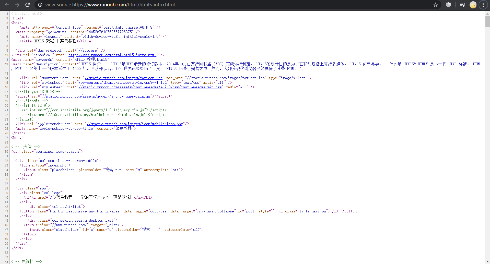
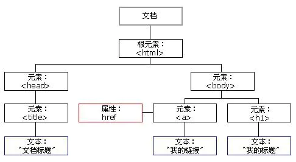
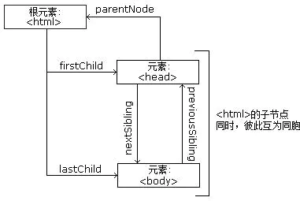

# Web网页基础

本节内容介绍网页的基本组成，结构和节点。

<br>

## 网页的组成

网页由三大部分组成：HTML，CSS和JavaScript。

## HTML

超文本标记语言(HyperText Markup Language，简称：HTML)是一种用于创建网页的标准标记语言。HTML是一种基础技术，常与CSS，JavaScript一起被众多网站用于设计网页，网页应用程序以及移动应用程序的用户界面。网页浏览器可以解析HTML文件，并将其渲染成可视化网页。

HTML允许嵌入图像与对象，并且可以用于创建交互式表单，它被用来结构化信息——例如标题，段落和列表等等，也可用来在一定程度上描述文档的外观和语义。
HTML的语言形式为尖括号包围的HTML元素(如\<html\>)，浏览器使用HTML标签和脚本来诠释网页内容，但不会将它们显示在页面上。

参考于[维基百科](https://zh.wikipedia.org/wiki/HTML)。

例如https://www.runoob.com/html/html5-intro.html介绍了HTML5的相关内容。

在Chrome浏览器中，我们可以通过右键查看网页的HTML源代码。



更多HTML5内容可以参考上述网址，[https://www.runoob.com/html/html5-intro.html](https://www.runoob.com/html/html5-intro.html)。

## CSS

层叠样式表(Cascading Style Sheets)是一种用来表现HTML(标准通用标记语言的一个应用)或XML(标准通用标记语言的一个子集)等文件样式的计算机语言。CSS不仅可以静态地修饰网页，还可以配合各种脚本语言动态地对网页各元素进行格式化。

CSS 能够对网页中元素位置的排版进行像素级精确控制，支持几乎所有的字体字号样式，拥有对网页对象和模型样式编辑的能力。

来源于[百度百科](https://baike.baidu.com/item/CSS/5457)。

更多CSS内容可以参考[https://www.runoob.com/css/css-tutorial.html](https://www.runoob.com/css/css-tutorial.html)。

## JavaScript

JavaScript(通常缩写为JS)是一种高级的，解释型的编程语言。JavaScript是一门基于原型、函数先行的语言，是一门多范式的语言，它支持面向对象编程，命令式编程，以及函数式编程。它提供语法来操控文本，数组，日期以及正则表达式等，不支持I/O，比如网络，存储和图形等，但这些都可以由它的宿主环境提供支持。它已经由ECMA(欧洲电脑制造商协会)通过ECMAScript实现语言的标准化。它被世界上的绝大多数网站所使用，也被世界主流浏览器(Chrome，IE，Firefox，Safari，Opera)支持。

在客户端，JavaScript在传统意义上被实现为一种解释语言，但在最近，它已经可以被即时编译(JIT)执行。随着最新的HTML5和CSS3语言标准的推行它还可用于游戏，桌面和移动应用程序的开发和在服务器端网络环境运行，如Node.js。

来源于[维基百科](https://zh.wikipedia.org/wiki/JavaScript)。

更多JavaScript内容可参考[https://www.w3school.com.cn/js/index.asp](https://www.w3school.com.cn/js/index.asp)。

总的来说，HTML定义了网页的内容和结构，CSS描述了网页的布局，JavaScript定义了网页的行为。

## 网页结构

来看一个含[HTML](../../codes/Module_1/lecture_2/index.html)和[CSS](../../codes/Module_1/lecture_2/style.css)的例子

[index.html](../../codes/Module_1/lecture_2/index.html) :
```html5
<!DOCTYPE html>
<html lang="en" dir="ltr">
  <head>
    <meta charset="utf-8">
    <title></title>
    <link rel="stylesheet" href="style.css">
  </head>
  <body>
    <div class="text">
      Gradient Background Animation
    </div>
  </body>
</html>
```
[style.css](../../codes/Module_1/lecture_2/style.css) :
```css
body{
  margin: 0;
  padding: 0;
  font-family: "montserrat";
  background-image: linear-gradient(125deg,#2c3e50,#27ae60,#2980b9,#e74c3c,#8e44ad);
  background-size: 400%;
  animation: bganimation 15s infinite;
}

.text{
  color: white;
  text-align: center;
  text-transform: uppercase;
  margin: 300px 0;
  font-size: 22px;
}

@keyframes bganimation {
  0%{
    background-position: 0% 50%;
  }
  50%{
    background-position: 100% 50%;
  }
  100%{
    background-position: 0% 50%;
  }
}
```

它是一个动态的效果，背景色是随时间渐变的：


这便是一个简单的例子了。

## 节点树及节点间的关系

在HTML中所有标签定义的内容全都是节点，它们构成了一个HTML DOM树。

DOM，全称Document Object Model，即文档对象模型。它定义了访问HTML和XML的标准：
```text
W3C 文档对象模型(DOM)是中立于平台和语言的接口，它允许程序和脚本动态地访问和更新文档的内容，结构和样式。
```

W3C DOM标准被分为3个不同的部分
```text
核心DOM - 针对任何结构化文档的标准模型

XML DOM - 针对XML文档的标准模型

HTML DOM - 针对HTML文档的标准模型
```

根据W3C的HTML DOM 标准，HTML文档中的所有内容都是节点：
```text
整个文档是一个文档节点

整个HTML元素是一个元素节点

HTML元素内的文本是文本节点

每个HTML属性是属性节点

注释是注释节点
```

HTML DOM将HTML文档视作树结构，这种结构称为节点树，如图：



通过HTML DOM，树中所有节点均可通过JavaScript进行访问，所有HTML节点元素均可被修改，也可被创建或删除。

节点树中的节点彼此拥有层级关系。常用parent(父)，child(子)和sibling(兄弟)等术语描述这些关系。父节点拥有子节点，同级的子节点被称为兄弟节点。

在节点树中，顶端节点被称为根(root)，除了根节点之外每个节点都有父节点，同时拥有任意数量的子节点或兄弟节点。

节点树及节点之间的关系：



此部分内容参考[https://www.w3school.com.cn/htmldom/dom_nodes.asp](https://www.w3school.com.cn/htmldom/dom_nodes.asp)。

## CSS选择器

在CSS中，选择器是一种模式，用于选择需要添加样式的元素，版本有CSS1，CSS2，CSS3。

常见的CSS选择器如下表：

|选择器|	示例|	示例说明|	CSS版本|
| :----: | :----: |:----: | :----: |
|.class|.intro|选择所有class="intro"的元素|1|
|#id|#firstname|选择所有id="firstname"的元素|1|
|*|	*|选择所有元素|2|
|element|p|选择所有\<p\>元素|1|
|[attribute]|[target]|选择所有带有target属性元素|2|
|[attribute=value]|[target=-blank]|选择所有使用target="-blank"的元素|2 |

用的较多的是选择器是根据id，class，标签名来筛选。

更多CSS选择器内容参考[https://www.w3school.com.cn/cssref/css_selectors.asp](https://www.w3school.com.cn/cssref/css_selectors.asp)。

XPath选择器内容将在之后介绍。

<br>

本节内容只是简单地介绍了Web网页，每一块都会涉及很多东西，这里也只能泛泛而谈，详细内容还需要具体学习。

推荐几个学习web的网站：

[https://www.runoob.com/](https://www.runoob.com/)

[https://www.w3school.com.cn/](https://www.w3school.com.cn/)

[https://developer.mozilla.org/zh-CN/](https://developer.mozilla.org/zh-CN/)


