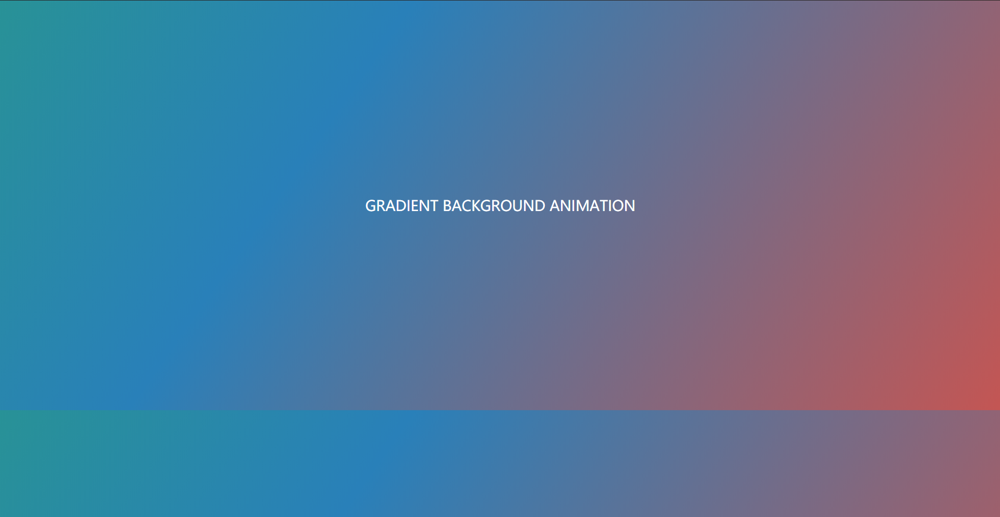

# Web 网页基础

本节内容介绍网页的基本组成，结构和节点。

---
---

## 网页的组成

网页由三大部分组成：
* HTML
* CSS
* JavaScript

---

## HTML

超文本标记语言 (HyperText Markup Language，简称：HTML) 是一种用于创建网页的标准标记语言。HTML 是一种基础技术，常与 CSS，JavaScript 一起被众多网站用于设计网页，网页应用程序以及移动应用程序的用户界面。网页浏览器可以解析HTML文件，并将其渲染成可视化网页。

HTML 允许嵌入图像与对象，并且可以用于创建交互式表单，它被用来结构化信息——例如标题，段落和列表等等，也可用来在一定程度上描述文档的外观和语义。

HTML 的语言形式为尖括号包围的 HTML 元素(如\<html\>)，浏览器使用 HTML 标签和脚本来诠释网页内容，但不会将它们显示在页面上。

参考于 [维基百科](https://zh.wikipedia.org/wiki/HTML) 。

例如 [https://www.runoob.com/html/html5-intro.html](https://www.runoob.com/html/html5-intro.html) 介绍了 HTML5 的相关内容。

在 Chrome 浏览器中，我们可以通过右键查看网页的 HTML 源代码。


更多 HTML5 内容可以参考上述网址，[https://www.runoob.com/html/html5-intro.html](https://www.runoob.com/html/html5-intro.html) 。

---

## CSS

层叠样式表 (Cascading Style Sheets) 是一种用来表现 HTML(标准通用标记语言的一个应用)或 XML(标准通用标记语言的一个子集)等文件样式的计算机语言。CSS 不仅可以静态地修饰网页，还可以配合各种脚本语言动态地对网页各元素进行格式化。

CSS 能够对网页中元素位置的排版进行像素级精确控制，支持几乎所有的字体字号样式，拥有对网页对象和模型样式编辑的能力。

来源于 [百度百科](https://baike.baidu.com/item/CSS/5457) 。

更多 CSS 内容可以参考 [https://www.runoob.com/css/css-tutorial.html](https://www.runoob.com/css/css-tutorial.html) 。

在 HTML 中，使用用 link 标签即可引入写好的 CSS 文件。

---

## JavaScript

JavaScript (通常缩写为JS) 是一种高级的，解释型的编程语言。JavaScript 是一门基于原型、函数先行的语言，是一门多范式的语言，它支持面向对象编程，命令式编程，以及函数式编程。它提供语法来操控文本，数组，日期以及正则表达式等，不支持I/O，比如网络，存储和图形等，但这些都可以由它的宿主环境提供支持。它已经由ECMA(欧洲电脑制造商协会)通过 ECMAScript 实现语言的标准化。它被世界上的绝大多数网站所使用，也被世界主流浏览器(Chrome，IE，Firefox，Safari，Opera)支持。

在客户端，JavaScript 在传统意义上被实现为一种解释语言，但在最近，它已经可以被即时编译 (JIT) 执行。随着最新的 HTML5 和 CSS3 语言标准的推行它还可用于游戏，桌面和移动应用程序的开发和在服务器端网络环境运行，如 Node.js。

来源于 [维基百科](https://zh.wikipedia.org/wiki/JavaScript) 。

更多 JavaScript 内容可参考 [https://www.w3school.com.cn/js/index.asp](https://www.w3school.com.cn/js/index.asp) 。

在 HTML 中通过 script 标签即可引入写好的 js 文件。

总的来说
* HTML 定义了网页的内容和结构
* CSS 描述了网页的布局
* JavaScript 定义了网页的行为

---

## 网页结构

来看一个含 [HTML](../../codes/Module_1/lecture_2/index.html) 和 [CSS](../../codes/Module_1/lecture_2/style.css) 的例子

[index.html](../../codes/Module_1/lecture_2/index.html) :
```html5
<!DOCTYPE html>
<html lang="en" dir="ltr">
  <head>
    <meta charset="utf-8">
    <title></title>
    <link rel="stylesheet" href="style.css">
  </head>
  <body>
    <div class="text">
      Gradient Background Animation
    </div>
  </body>
</html>
```

[style.css](../../codes/Module_1/lecture_2/style.css) :
```css
body{
  margin: 0;
  padding: 0;
  font-family: "montserrat";
  background-image: linear-gradient(125deg,#2c3e50,#27ae60,#2980b9,#e74c3c,#8e44ad);
  background-size: 400%;
  animation: bganimation 15s infinite;
}

.text{
  color: white;
  text-align: center;
  text-transform: uppercase;
  margin: 300px 0;
  font-size: 22px;
}

@keyframes bganimation {
  0%{
    background-position: 0% 50%;
  }
  50%{
    background-position: 100% 50%;
  }
  100%{
    background-position: 0% 50%;
  }
}
```

它是一个动态的效果，背景色是随时间渐变的：



这便是一个简单的例子。

---

## 节点树及节点间的关系

在 HTML 中所有标签定义的内容全都是节点，它们构成了一个 HTML DOM 树。

DOM，全称 Document Object Model，即文档对象模型。它定义了访问 HTML 和 XML 的标准：
```text
W3C 文档对象模型 (DOM) 是中立于平台和语言的接口，它允许程序和脚本动态地访问和更新文档的内容，结构和样式。
```

W3C DOM 标准被分为 3 个不同的部分
* 核心 DOM - 针对任何结构化文档的标准模型
* XML DOM - 针对 XML 文档的标准模型
* HTML DOM - 针对 HTML 文档的标准模型

根据 W3C 的 HTML DOM 标准，HTML 文档中的所有内容都是节点：
* 整个文档是一个文档节点
* 整个 HTML 元素是一个元素节点
* HTML 元素内的文本是文本节点
* 每个 HTML 属性是属性节点
* 注释是注释节点

HTML DOM 将 HTML 文档视作树结构，这种结构称为节点树，如图：


通过 HTML DOM，树中所有节点均可通过 JavaScript 进行访问，所有 HTML 节点元素均可被修改，也可被创建或删除。

节点树中的节点彼此拥有层级关系。常用 parent(父)，child(子) 和 sibling(兄弟) 等术语描述这些关系。父节点拥有子节点，同级的子节点被称为兄弟节点。

在节点树中，顶端节点被称为根 (root)，除了根节点之外每个节点都有父节点，同时拥有任意数量的子节点或兄弟节点。

节点树及节点之间的关系：


此部分内容参考 [https://www.w3school.com.cn/htmldom/dom_nodes.asp](https://www.w3school.com.cn/htmldom/dom_nodes.asp) 。

---

## CSS选择器

在 CSS 中，选择器是一种模式，用于选择需要添加样式的元素，版本有 CSS1，CSS2，CSS3。

在 CSS 中，我们使用 CSS 选择器来定位节点。例如，上例中 div 节点的 id 为 container，那么就可以表示为 #container，其中 # 开头代表选择 id，其后紧跟 id 的名称。

另外，如果我们想选择 class 为 wrapper 的节点，便可以使用 .wrapper，这里以点“.”开头代表选择 class，其后紧跟 class 的名称。另外，还有一种选择方式，那就是根据标签名筛选，例如想选择二级标题，直接用 h2 即可。这是最常用的 3 种表示，分别是 **根据 id、class、标签名筛选**。

另外，CSS 选择器还支持嵌套选择，各个选择器之间加上空格分隔开便可以代表嵌套关系，如 #container .wrapper p 则代表先选择 id 为 container 的节点，然后选中其内部的 class 为 wrapper 的节点，然后再进一步选中其内部的 p 节点。

另外，如果不加空格，则代表并列关系，如 div#container .wrapper p.text 代表先选择 id 为 container 的 div 节点，然后选中其内部的 class 为 wrapper 的节点，再进一步选中其内部的 class 为 text 的 p 节点。

<br>

常见的 CSS 选择器如下表：

|选择器|	示例|	示例说明|	CSS版本|
| :----: | :----: |:----: | :----: |
|.class|.intro|选择所有 class="intro" 的元素|1|
|#id|#firstname|选择所有 id="firstname" 的元素|1|
|*|	*|选择所有元素|2|
|element|p|选择所有 \<p\> 元素|1|
|[attribute]|[target]|选择所有带有 target 属性元素|2|
|[attribute=value]|[target=-blank]|选择所有使用 target="-blank" 的元素|2 |

详细表格：

|选择器|例子|例子描述|
| :----: | :----: |:----: |
|.class	|.intro |	选择 class="intro" 的所有节点|
|#id|	#firstname|	选择 id="firstname" 的所有节点|
|*|	*	|选择所有节点|
|element|	p	|选择所有 p 节点|
|element,element|	div,p	|选择所有 div 节点和所有 p 节点|
|element element|	div p	|选择 div 节点内部的所有 p 节点|
|element>element	|div>p|	选择父节点为 div 节点的所有 p 节点|
|element+element|	div+p|	选择紧接在 div 节点之后的所有 p 节点|
| [attribute]	|[target]	|选择带有 target 属性的所有节点|
|[attribute=value]|	[target=blank]|	选择 target="blank" 的所有节点|
|[attribute~=value]	|[title~=flower]	|选择 title 属性包含单词 flower 的所有节点|
|:link	|a:link	|选择所有未被访问的链接|
|:visited	|a:visited|	选择所有已被访问的链接|
|:active	|a:active|	选择活动链接|
|:hover	|a:hover	|选择鼠标指针位于其上的链接|
|:focus	|input:focus	|选择获得焦点的 input 节点|
|:first-letter|	p:first-letter|	选择每个 p 节点的首字母|
|:first-line	|p:first-line|	选择每个 p 节点的首行|
|:first-child	|p:first-child|	选择属于父节点的第一个子节点的所有 p 节点|
|:before|	p:before|	在每个 p 节点的内容之前插入内容|
|:after|	p:after|	在每个 p 节点的内容之后插入内容|
|:lang(language)	|p:lang	|选择带有以 it 开头的 lang 属性值的所有 p 节点|
|element1~element2|	p~ul|	选择前面有 p 节点的所有 ul 节点|
|[attribute^=value]	|a[src^="https"]	|选择其 src 属性值以 https 开头的所有 a 节点|
|```[attribute$=value]```|	```a[src$=".pdf"]```|	选择其 src 属性以.pdf 结尾的所有 a 节点|
|[attribute*=value]	|a[src*="abc"]|	选择其 src 属性中包含 abc 子串的所有 a 节点|
|:first-of-type|	p:first-of-type|	选择属于其父节点的首个 p 节点的所有 p 节点|
|:last-of-type|	p:last-of-type|	选择属于其父节点的最后 p 节点的所有 p 节点|
|:only-of-type|	p:only-of-type|	选择属于其父节点唯一的 p 节点的所有 p 节点|
|:only-child|	p:only-child|	选择属于其父节点的唯一子节点的所有 p 节点|
|:nth-child(n)|	p:nth-child	|选择属于其父节点的第二个子节点的所有 p 节点|
|:nth-last-child(n)	|p:nth-last-child	|同上，从最后一个子节点开始计数|
|:nth-of-type(n)|	p:nth-of-type	|选择属于其父节点第二个 p 节点的所有 p 节点|
|:nth-last-of-type(n)	|p:nth-last-of-type|	同上，但是从最后一个子节点开始计数|
|:last-child|	p:last-child|	选择属于其父节点最后一个子节点的所有 p 节点|
|:root|	:root|	选择文档的根节点|
|:empty	|p:empty	|选择没有子节点的所有 p 节点（包括文本节点）|
|:target	|#news:target|	选择当前活动的 #news 节点|
|:enabled	|input:enabled	|选择每个启用的 input 节点|
|:disabled	|input:disabled	|选择每个禁用的 input 节点|
|:checked|	input:checked|	选择每个被选中的 input 节点|
|:not(selector)	|:not	|选择非 p 节点的所有节点|
|::selection	|::selection	|选择被用户选取的节点部分|

<br>

更多 CSS 选择器内容参考 [https://www.w3school.com.cn/cssref/css_selectors.asp](https://www.w3school.com.cn/cssref/css_selectors.asp) 。

XPath 选择器内容将在之后介绍。

---
---

本节内容只是简单地介绍了 Web 网页，每一块都会涉及很多东西，这里也只能泛泛而谈，详细内容还需要具体学习。

推荐几个学习 web 的网站：
* [https://www.runoob.com/](https://www.runoob.com/)

* [https://www.w3school.com.cn/](https://www.w3school.com.cn/)

* [https://developer.mozilla.org/zh-CN/](https://developer.mozilla.org/zh-CN/)


