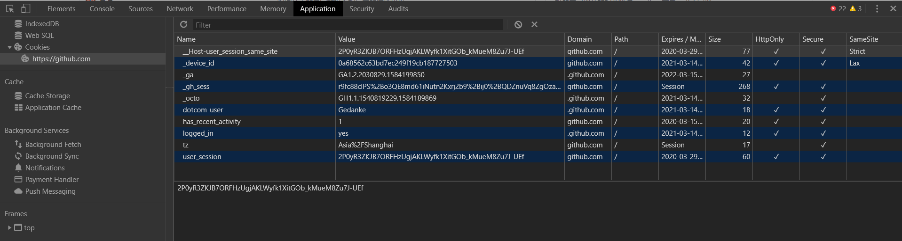

# Session 与 Cookies 

我们浏览网页时需要登陆，当我们登陆进去后，可以连续访问该网站。有时候我们一会儿不访问它了，再次浏览发现处于未登录状态，而有时候我们关闭网页或者浏览器，再次访问依然处于登陆状态，这是为什么呢？

这其中涉及到 Session 与 Cookies 了，本节我们将介绍它们。

---
---

## 静态网页与动态网页

浏览器从服务器得到的超文本标记文档的后缀通常有两大类：
* 静态页面：htm，html，shtml，xml
* 动态页面：asp，jsp，php，perl，cgi

静态网页是指存放在服务器文件系统中实实在在的 HTML 文件。当用户在浏览器中输入页面的 URL，然后回车，浏览器就会将对应的 html 文件下载，渲染并呈现在窗口中。早期的网站通常都是由静态页面制作的。
如 [https://www.runoob.com/css/css-tutorial.html](https://www.runoob.com/css/css-tutorial.html) 是一个静态网页。

动态网页是相对于静态网页而言的。当浏览器请求服务器的某个页面时，服务器根据当前时间，环境参数，数据库操作等动态的生成 HTML 页面，然后在发送给浏览器(后面的处理就跟静态网页一样了)。而 [https://www.w3school.com.cn/htmldom/dom_nodes.asp](https://www.w3school.com.cn/htmldom/dom_nodes.asp) 是一个动态网页。

动态网页中的“动态”是指服务器端页面的动态生成，相反，“静态”则指页面是实实在在的，独立的文件。静态网页简单安全，加载快但可维护性，交互性差。动态网页可维护性号，内容丰富但成本高，对安全性和保密性要求高。

更多内容可参考 [https://www.jianshu.com/p/649d2a0ebde5](https://www.jianshu.com/p/649d2a0ebde5) 。

---

## 无状态 HTTP

HTTP 的无状态是指 HTTP 协议对事务处理是没有记忆能力的，也就是说服务器不知道客户端是什么状态。

我们向服务器发送请求，服务器解析请求返回相应，这个过程是独立的，也就是在此之前之后的事情服务器并不知道，它也不会去记录。

更多 HTTP 的无状态，可参考 [https://www.cnblogs.com/bellkosmos/p/5237146.html](https://www.cnblogs.com/bellkosmos/p/5237146.html) 。

那问题就来了，我们在连续访问网页时，每次请求和响应对于服务器而言都是独立的，如果当前处理需要之前的信息，就需要传递很多前面的重复请求，这会浪费时间和资源，显然对客户端和服务端都是不利的。

为了保存 HTTP 连接状态，Session 和 Cookies 应运而生。
* Session 位于服务端，用来保存用户的 Session 信息
* Cookies 位于客户端，有了 Cookies，浏览器在下次访问网页时会带上它并发送给服务器，服务器通过识别 Cookies 并鉴定出用户，然后判断用户的状态，进而返回对应的响应。

Cookies 相当于一种凭证，下次请求时带上它，一些重复的请求就不需要携带了。

在爬虫中，我们一般将登陆成功后获取的 Cookies 放在请求头中，这样就不需要重新登陆了。

---

## Session

Session：在计算机中，尤其是在网络应用中，称为“会话控制”，指有始有终的一系列动作或者消息。

Session 对象存储特定用户会话所需的属性及配置信息。这样，当用户在应用程序的 Web 页之间跳转时，存储在 Session 对象中的变量将不会丢失，而是在整个用户会话中一直存在下去。当用户请求来自应用程序的 Web 页时，如果该用户还没有会话，则 Web 服务器将自动创建一个 Session 对象。当会话过期或被放弃后，服务器将终止该会话。
来源于 [百度百科](https://baike.baidu.com/item/Session/479100) 。

---

## Cookies

Cookie，有时也用其复数形式 Cookies。类型为“小型文本文件”，是某些网站为了辨别用户身份，进行 Session 跟踪而储存在用户本地终端上的数据(通常经过加密)，由用户客户端计算机暂时或永久保存的信息。
来源于 [百度百科](https://baike.baidu.com/item/cookie/1119) 。

---

## Session 维持 

当客户端第一次请求服务器时，服务器会返回一个带有 Set-Cookie 字段的响应给客户端，用来标记是哪一个用户，客户端浏览器会把 Cookies 保存起来。当浏览器下一次再请求该网站时，浏览器会把此 Cookies 放到请求头一起提交给服务器，Cookies 携带了Session ID信息，服务器检查该 Cookies 即可找到对应的 Session 是什么，然后再判断 Session 来以此来辨认用户状态。

成功登陆某个网站后，服务器会告诉客户端设置哪些 Cookies 消息，之后访问页面时客户端把 Cookies 发送给服务器，服务器找到相应的 Session 解析判断，若用户处于登陆状态，则返回登陆之后才可以查看的内容。

反之，若 Cookies 无效的，或者 Session 过期了，对于登陆后才能查看的内容我们将无法访问。

客户端的 Cookies 和服务端的 Session 需要配合协作，实现登录 Session 的控制。

更多内容可查看 [https://www.jianshu.com/p/25802021be63](https://www.jianshu.com/p/25802021be63) 。

---

## 结构属性

以 github 为例，再 Chrome 中按下 F12，选择 Application，选中左侧 Storage 的 Cookies ，点开。

有很多的列，都是 Cooki e 的属性，简介如下：
* Name: Cookie 的名称
* Value: Cookie 的值，如果值为 Unicode 字符，需要为字符编码。如果值为二进制数据，则需要使用 BASE64 编码
* Max Age: Cookie 失效时间
* Path: Cookie 的路径
* Domain: 可以访问该 Cookie 的域名
* Size: Cookie 大小
* Http: Cookie 的 httponly 属性，为 True，只有在 HTTP Headers 中会带有此 Cookie 的信息
* Secure: 即该 Cookie 是否仅被使用安全协议传输默认为 false

有关 BASE 内容可参考[https://blog.csdn.net/wo541075754/article/details/81734770](https://blog.csdn.net/wo541075754/article/details/81734770) 。

---

## 会话 Cookie 和持久 Cookie

字面理解，会话 Cookie 是把 Cookie 放到浏览器内存里，浏览器关闭后就失效了，而持久 Cookie 保存到硬盘在，之后可以继续使用。

其实准确来说没有所谓的会话和持久之分，这是 Cookie 的 Max Age 或 Expires 字段设置的时间不同导致。

很多网站使用的是会话 Cookie，退出浏览器后就被删除了，不在保存登陆状态，如果将其保存到硬盘上或者改写请求头，将其发送给服务器，我们依然可以处于登陆状态

对于 Session 来说，它也有一个失效时间，超过这个时间，服务器就会删除它以节省空间。

----
----