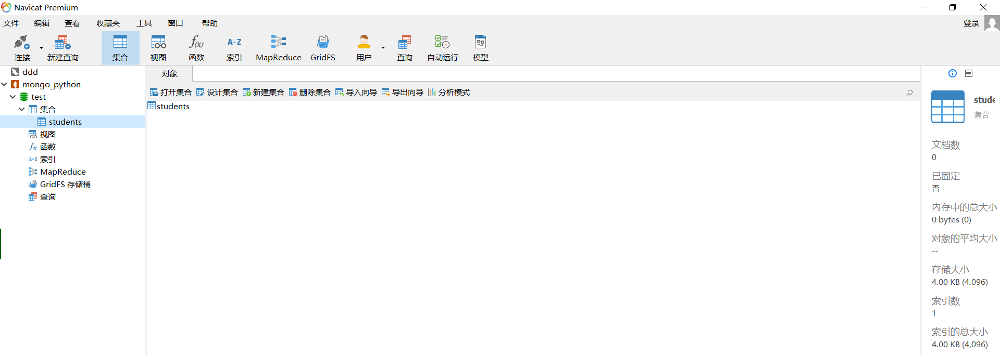
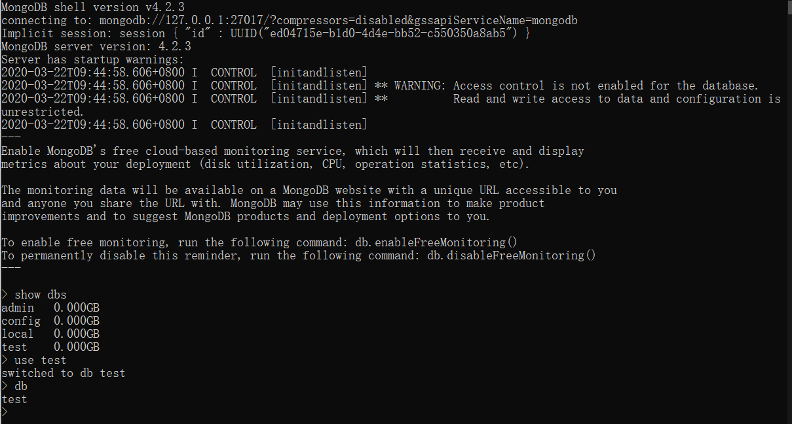
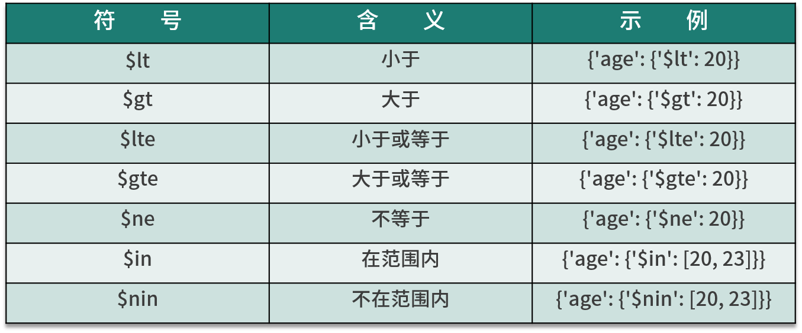
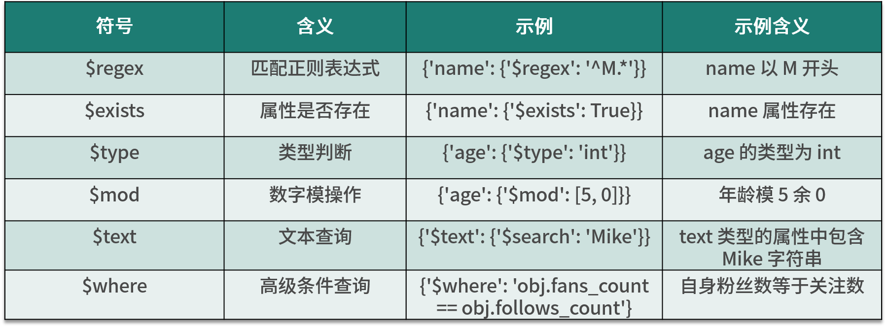
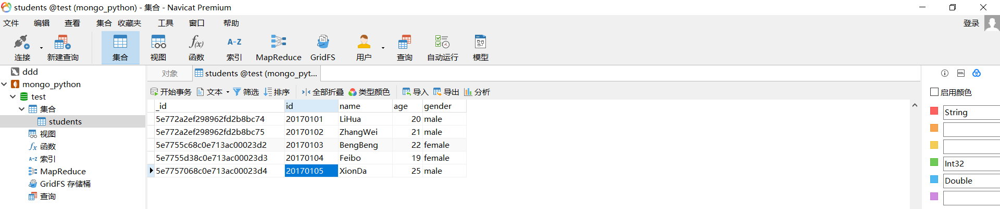

# MongoDB 用法

从 HTML 中提取了数据后，存放数据的方式多种多样，文件形式当然可以，但是不利于检索。既方便存放，又利于检索，莫过于数据库了。

数据库可以分为 **关系型数据库和非关系型数据库**，本课时我们使用的是非关系型数据库 - MongoDB。

MongoDB 是由 C++ 语言编写的非关系型数据库，是一个基于分布式文件存储的开源数据库系统，其内容存储形式类似 JSON 对象，它的字段值可以包含其他文档，数组及文档数组，非常灵活。

---
---

## 准备工作

安装 MongoDB，可以参考：
* win10 [https://www.cnblogs.com/TM0831/p/10606624.html](https://www.cnblogs.com/TM0831/p/10606624.html) 
* ubuntu [https://blog.csdn.net/yutu75/article/details/110941936#commentBox](https://blog.csdn.net/yutu75/article/details/110941936#commentBox)

注意：这里我们为了学习，仅使用 MongoDB 最基本的单机版，MongoDB 还有主从复制，副本集，分片集群等集群架构，可用性可靠性更好，如有需要可以自行搭建相应的集群进行使用。

使用 Python 来操作 MongoDB，需安装 ```pymongo```：

```shell script
pip3 install pymongo
```

使用 MongoDB 的话，可以使用图形化工具，例如 Navicat。



也可以在命令行中：



---

## 连接 MongoDB

连接 MongoDB 时，需要使用 ```pymongo``` 里面的 ```MongoClient```。我们只需要向其传入 MongoDB 的 IP 及端口即可，其中第一个参数为地址 ```host``` ，第二个参数为端口 ```port``` (如果不给它传递参数，则默认是 27017 )。

[示例](../../codes/Module_2/lecture_10/lecture_10_1.py) 如下：

```python
# -*- coding: utf-8 -*-

import pymongo

client = pymongo.MongoClient(host="localhost", port=27017)
```

或者 ```MongoClient``` 的第一个参数host还可以直接传入 MongoDB 的连接字符串，它以 ```mongodb``` 开头：

```shell script
client = pymongo.MongoClient("mongodb://localhost:27017/")
```

---

## 指定数据库

MongoDB 中可以建立多个数据库，需要提前创建数据库和集合，接下来我们需要指定操作其中一个数据库。这里我们以 ```test``` 数据库作为下一步需要在程序中指定使用的例子：

```shell script
db = client.test
print(db)
```

这里调用 ```client``` 的 ```test``` 属性即可返回 ```test``` 数据库。当然，我们也可以这样指定：

```shell script
db = client["test"]
print(db)
```

结果为：

```textmate
Database(MongoClient(host=['localhost:27017'], document_class=dict, tz_aware=False, connect=True), 'test')
```

---

## 指定集合

MongoDB 的每个数据库又包含许多集合 (collection)，它们类似于关系型数据库中的表。

这里我们指定一个名称为 students 的集合，可以提前创建集合。与指定数据库类似，指定集合也有两种方式：

```shell script
collection = db.students
```

或者：

```shell script
collection = db["students"]
```

---

## 插入数据

对 ```students``` 这个集合新建一条学生数据，这条数据以字典形式表示：

```python
student = {
    "id": "20170101",
    "name": "LiHua",
    "age": 20,
    "gender": "male"
}
```

新建的这条数据里指定了学生的学号，姓名，年龄和性别。接下来，使用 ```collection``` 的 ```insert``` 方法即可插入数据：

```shell script
result = collection.insert(student)
print(result)
```

结果为：

```shell script
D:/Nut_cloud/notes/Reptile_study_notes_local/codes/Module_2/lecture_10/lecture_10_1.py:15: DeprecationWarning: insert is deprecated. Use insert_one or insert_many instead.
  result = collection.insert(student)
5e77284889ab8b3b7a297904
```

在 MongoDB 中，每条数据其实都有一个 _id 属性来唯一标识。如果没有显式指明该属性，MongoDB 会自动产生一个 ```ObjectId``` 类型的 _id 属性。```insert()``` 方法会在执行后返回 _id 值。

我们也可以同时插入多条数据，只需要以列表形式传递即可，示例如下：

```shell script
student1 = {
    "id": "20170101",
    "name": "LiHua",
    "age": 20,
    "gender": "male"
}
student2 = {
    "id": "20170102",
    "name": "ZhangWei",
    "age": 21,
    "gender": "male"
}
result = collection.insert([student1, student2])
print(result)
```

结果为：

```shell script
D:/Nut_cloud/notes/Reptile_study_notes_local/codes/Module_2/lecture_10/lecture_10_1.py:21: DeprecationWarning: insert is deprecated. Use insert_one or insert_many instead.
  result = collection.insert([student1, student2])
[ObjectId('5e772a559d751e7ba721e25f'), ObjectId('5e772a559d751e7ba721e260')]
```

返回结果是对应的 _id 的集合。

这里两次操作都给出了一个警告：

```shell script
DeprecationWarning: insert is deprecated. Use insert_one or insert_many instead.
```

在 ```PyMongo``` 中，官方已经不推荐使用 ```insert``` 方法了，其推荐使用 ```insert_one``` 和 ```insert_many``` 方法来分别插入单条记录和多条记录。

那么我们对之前的例子稍作修改：

插入一条数据：

```shell script
student = {
    "id": "20170101",
    "name": "LiHua",
    "age": 20,
    "gender": "male"
}
result = collection.insert_one(student)
print(result)
print(result.inserted_id)
```

结果为：

```textmate
<pymongo.results.InsertOneResult object at 0x00000234E524FF48>
5e772aef1ebc0e7aa80119f5
```

与 ```insert``` 方法不同，这次返回的是 ```InsertOneResult``` 对象，我们可以调用其 ```inserted_id``` 属性获取 _id。

对于 ```insert_many``` 方法，我们可以将数据以列表形式传递，示例如下：

```shell script
student1 = {
    "id": "20170101",
    "name": "LiHua",
    "age": 20,
    "gender": "male"
}
student2 = {
    "id": "20170102",
    "name": "ZhangWei",
    "age": 21,
    "gender": "male"
}
result = collection.insert_many([student1, student2])
print(result)
print(result.inserted_ids)
```

结果为：

```textmate
<pymongo.results.InsertManyResult object at 0x000001EEC73FBFC8>
[ObjectId('5e772d587cb46b155cfdc0cb'), ObjectId('5e772d587cb46b155cfdc0cc')]
```

该方法返回的类型是 ```InsertManyResult```，调用 ```inserted_ids``` 属性可以获取插入数据的 _id 列表。

---

## 查询

插入数据后，我们可以利用 ```find_one``` 或 ```find``` 方法进行查询，其中 ```find_one``` 查询得到的是单个结果，```find``` 则返回一个生成器对象。

[示例](../../codes/Module_2/lecture_10/lecture_10_2.py) 如下：

```python
# -*- coding: utf-8 -*-

import pymongo

client = pymongo.MongoClient(host="localhost", port=27017)
db = client.test
collection = db.students

result = collection.find_one({"name": "LiHua"})
print(type(result))
print(result)
```

结果为：

```textmate
<class 'dict'>
{'_id': ObjectId('5e7739b2b0de20fb9b5a3e6a'), 'id': '20170101', 'name': 'LiHua', 'age': 20, 'gender': 'male'}
```

成功得到查询结果，可以发现它多了 _id 属性，这就是 MongoDB 在插入过程中自动添加的。

此外，我们也可以根据 ```ObjectId``` 来查询，此时需要调用 ```bson``` 库里面的 ```objectid``` 方法。

```shell script
from bson.objectid import ObjectId

result = collection.find_one({'_id': ObjectId('5e7739b2b0de20fb9b5a3e6a')})
print(result)
```

结果为：

```textmate
{'_id': ObjectId('5e7739b2b0de20fb9b5a3e6a'), 'id': '20170101', 'name': 'LiHua', 'age': 20, 'gender': 'male'}
```

其查询结果依然是字典类型，如果查询结果不存在，则会返回 ```None```。

对于多条数据的查询，我们可以使用 ```find``` 方法。例如，这里查找年龄为 20 的数据：

```shell script
results = collection.find({"age": 20})
print(results)
for result in results:
    print(result)
```

结果为：

```textmate
<pymongo.cursor.Cursor object at 0x00000289D0C1DCC0>
{'_id': ObjectId('5e7739b2b0de20fb9b5a3e6a'), 'id': '20170101', 'name': 'LiHua', 'age': 20, 'gender': 'male'}
```

可能出现多个结果，这种情况可能是之前多次插入相同的数据造成的。

返回结果是 ```Cursor``` 类型，它相当于一个生成器，我们需要遍历获取的所有结果，其中每个结果都是字典类型。

如果要查询年龄大于 20 的数据，则写法如下：

```shell script
results = collection.find({"age": {"$gt": 20}})
print(list(results))
```

结果为：
```textmate
[{'_id': ObjectId('5e7739b2b0de20fb9b5a3e6b'), 'id': '20170102', 'name': 'ZhangWei', 'age': 21, 'gender': 'male'}]
```

常见的比较符号如下表：



另外，还可以进行正则匹配查询。例如，查询名字以 L 开头的学生数据，示例如下：

```shell script
results = collection.find({"name": {"$regex": "^L.*"}})
print(list(results))
```

结果为：

```textmate
[{'_id': ObjectId('5e7739b2b0de20fb9b5a3e6a'), 'id': '20170101', 'name': 'LiHua', 'age': 20, 'gender': 'male'}]
```

这里使用 ```$regex``` 来指定正则匹配，```^L.*``` 代表以 L 开头的正则表达式。

常见的功能符号如下表：



更多内容可参见官方文档，[https://docs.mongodb.com/manual/reference/operator/query/](https://docs.mongodb.com/manual/reference/operator/query/) 。

---

## 计数

要统计查询结果有多少条数据，可以调用 ```count``` 方法。我们以统计所有数据条数为例。

[示例](../../codes/Module_2/lecture_10/lecture_10_3.py) 如下：

```python
# -*- coding: utf-8 -*-

import pymongo

client = pymongo.MongoClient(host="localhost", port=27017)
db = client.test
collection = db.students
count = collection.find().count()
print(count)
```

结果为：

```textmate
D:/Nut_cloud/notes/Reptile_study_notes_local/codes/Module_2/lecture_10/lecture_10_3.py:8: DeprecationWarning: count is deprecated. Use Collection.count_documents instead.
  count = collection.find().count()
2
```

这里给出了建议使用 ```count_documents``` 的提示，```count_documents``` 方法适用于带条件的查询，```estimated_document_count``` 可以不带查询条件。

```shell script
count = collection.estimated_document_count()
print(count)
```

结果为：

```textmate
2
```

查询符合某个条件的数据：

```shell script
count = collection.count_documents({"age": 20})
print(count)
```

结果为：

```textmate
1
```

---

## 排序

排序时，我们可以直接调用 ```sort``` 方法，并在其中传入排序的字段及升降序标志。

[示例](../../codes/Module_2/lecture_10/lecture_10_4.py) 如下：

```python
# -*- coding: utf-8 -*-

import pymongo

client = pymongo.MongoClient(host="localhost", port=27017)
db = client.test
collection = db.students

results = collection.find().sort("name", pymongo.ASCENDING)
print([result["name"] for result in results])
```

结果为：

```textmate
['LiHua', 'ZhangWei']
```

这里我们调用 ```pymongo.ASCENDING``` 指定升序。如果要降序排列，可以传入 ```pymongo.DESCENDING``` 。

```shell script
results = collection.find().sort("name", pymongo.DESCENDING)
print([result["name"] for result in results])
```

结果为：

```textmate
['ZhangWei', 'LiHua']
```

---

## 偏移

如果我们只需要取某几个元素，可以使用 ```skip``` 方法偏移几个位置。

鉴于数据量太小，可以增加若干数据，这里我选择在 Navicat 中添加。



比如偏移 2，就代表忽略前两个元素，得到第 3 个及以后的元素。

[示例](../../codes/Module_2/lecture_10/lecture_10_5.py) 如下：

```python
# -*- coding: utf-8 -*-

import pymongo

client = pymongo.MongoClient(host="localhost", port=27017)
db = client.test
collection = db.students

results = collection.find().sort("name", pymongo.ASCENDING).skip(2)
print([result["name"] for result in results])
```

结果为：

```textmate
['LiHua', 'XionDa', 'ZhangWei']
```

另外，我们还可以用 ```limit``` 方法指定要取的结果个数。

```shell script
results = collection.find().sort("name", pymongo.ASCENDING).skip(2).limit(2)
print([result["name"] for result in results])
```

结果为：

```textmate
['LiHua', 'XionDa']
```

如果不使用 ```limit``` 方法，原本会返回 3 个结果，加了限制后，就会截取两个结果返回。

值得注意的是，在数据量非常庞大的时候，比如在查询千万，亿级别的数据库时，最好不要使用大的偏移量，因为这样很可能导致内存溢出。

若记录好上次查询的 _id，此时可以使用类似如下操作来查询：

```shell script
from bson.objectid import ObjectId

results = collection.find({"_id": {"$gt": ObjectId("5e772a2ef298962fd2b8bc75")}})
print(results)
print(list(results))
```

结果为：

```textmate
<pymongo.cursor.Cursor object at 0x000001D25726DC50>
[{'_id': ObjectId('5e7739b2b0de20fb9b5a3e6a'), 'id': '20170101', 'name': 'LiHua', 'age': 20, 'gender': 'male'}, {'_id': ObjectId('5e7739b2b0de20fb9b5a3e6b'), 'id': '20170102', 'name': 'ZhangWei', 'age': 21, 'gender': 'male'}, {'_id': ObjectId('5e7755c68c0e713ac00023d2'), 'id': '20170103', 'name': 'BengBeng', 'age': 22.0, 'gender': 'female'}, {'_id': ObjectId('5e7755d38c0e713ac00023d3'), 'id': '20170104', 'name': 'Feibo', 'age': 19.0, 'gender': 'female'}, {'_id': ObjectId('5e7757068c0e713ac00023d4'), 'id': '20170105', 'name': 'XionDa', 'age': 25.0, 'gender': 'male'}]
```

---

## 更新

对于数据更新，我们可以使用 ```update``` 方法，指定更新的条件和更新后的数据即可。

[示例](../../codes/Module_2/lecture_10/lecture_10_6.py) 如下：

```python
# -*- coding: utf-8 -*-

import pymongo

client = pymongo.MongoClient(host="localhost", port=27017)
db = client.test
collection = db.students

condition = {"name": "ZhangWei"}
student = collection.find_one(condition)
student["age"] = 25
result = collection.update(condition, student)
print(result)
```

结果为：

```textmate
D:/Nut_cloud/notes/Reptile_study_notes_local/codes/Module_2/lecture_10/lecture_10_6.py:12: DeprecationWarning: update is deprecated. Use replace_one, update_one or update_many instead.
  result = collection.update(condition, student)
{'n': 1, 'nModified': 0, 'ok': 1.0, 'updatedExisting': True}
```

这里我们要更新 name 为 Kevin 的数据的年龄：首先指定查询条件，然后将数据查询出来，修改年龄后调用 ```update``` 方法将原条件和修改后的数据传入。

返回结果是字典形式，ok 代表执行成功，```nModified``` 代表影响的数据条数。

另外，我们也可以使用 ```$set``` 操作符对数据进行更新。

```shell script
result = collection.update(condition, {"$set": student})
print(result)
```

结果为：

```textmate
D:/Nut_cloud/notes/Reptile_study_notes_local/codes/Module_2/lecture_10/lecture_10_6.py:15: DeprecationWarning: update is deprecated. Use replace_one, update_one or update_many instead.
  result = collection.update(condition, {"$set": student})
{'n': 1, 'nModified': 0, 'ok': 1.0, 'updatedExisting': True}
```

这样可以只更新 student 字典内存在的字段。如果原先还有其他字段，则不会更新，也不会删除。而如果不用 ```$set``` 的话，则会把之前的数据全部用 student 字典替换；如果原本存在其他字段，则会被删除。

上面的两个例子都有一样的警告：

```textmate
DeprecationWarning: update is deprecated. Use replace_one, update_one or update_many instead.
```

```update``` 方法是官方不推荐使用的方法。这里也分为 ```update_one``` 方法和 ```update_many``` 方法，用法更加严格，它们的第 2 个参数需要使用 ```$``` 类型操作符作为字典的键名。

示例如下：

```shell script
condition = {"name": "ZhangWei"}
student = collection.find_one(condition)
student["age"] = 26
result = collection.update_one(condition, {"$set": student})
print(result)
print(result.matched_count, result.modified_count)
```

结果为：

```textmate
<pymongo.results.UpdateResult object at 0x00000298F9406948>
1 1
```

上面的例子中调用了 ```update_one``` 方法，使得第 2 个参数不能再直接传入修改后的字典，而是需要使用 ```{'$set':student}``` 这样的形式，其返回结果是 ```UpdateResult``` 类型。然后分别调用 ```matched_count``` 和 ```modified_count``` 属性，可以获得匹配的数据条数和影响的数据条数。

再看一个 [例子](../../codes/Module_2/lecture_10/lecture_10_7.py) ：

```python
# -*- coding: utf-8 -*-

import pymongo

client = pymongo.MongoClient(host="localhost", port=27017)
db = client.test
collection = db.students

condition = {"age": {"$gt": 20}}
result = collection.update_one(condition, {"$inc": {"age": 1}})
print(result)
print(result.matched_count, result.modified_count)
```

结果为：

```textmate
<pymongo.results.UpdateResult object at 0x0000012DF610F4C8>
1 1
```

这里指定查询条件为年龄大于 20，然后更新条件为 ```{'$inc': {'age': 1}}```，表示年龄加 1，执行之后会将第一条符合条件的数据年龄加 1。

可以看到匹配条数为 1 条，影响条数也为 1 条。

如果调用 ```update_many``` 方法，则会将所有符合条件的数据都更新：

```shell script
condition = {"age": {"$gt": 20}}
result = collection.update_many(condition, {"$inc": {"age": 1}})
print(result)
print(result.matched_count, result.modified_count)
```

结果为：

```textmate
<pymongo.results.UpdateResult object at 0x0000024458879908>
3 3
```

这时所有匹配到的数据都会被更新。

---

## 删除

删除操作比较简单，直接调用 ```remove``` 方法指定删除的条件即可，此时符合条件的所有数据均会被删除。

[示例](../../codes/Module_2/lecture_10/lecture_10_8.py) 如下：

```python
# -*- coding: utf-8 -*-

import pymongo

client = pymongo.MongoClient(host="localhost", port=27017)
db = client.test
collection = db.students

result = collection.remove({"name": "FeiBo"})
print(result)
```

结果为：

```textmate
D:/Nut_cloud/notes/Reptile_study_notes_local/codes/Module_2/lecture_10/lecture_10_8.py:9: DeprecationWarning: remove is deprecated. Use delete_one or delete_many instead.
  result = collection.remove({"name": "FeiBo"})
{'n': 0, 'ok': 1.0}
```

结果给出了一个提示：

```shell script
DeprecationWarning: remove is deprecated. Use delete_one or delete_many instead.
```

推荐我们使用 ```delete_one``` 和 ```delete_many```。

```shell script
result = collection.delete_one({"name": "ZhangWei"})
print(result)
print(result.deleted_count)
result = collection.delete_many({"age": {"$lt": 22}})
print(result.deleted_count)
```

结果为：

```textmate
1
2
```

```delete_one``` 即删除第一条符合条件的数据，```delete_many``` 即删除所有符合条件的数据。它们的返回结果都是 ```DeleteResult``` 类型，可以调用 ```deleted_count``` 属性获取删除的数据条数。

---

## 其他操作

另外，```PyMongo``` 还提供了一些组合方法，如 ```find_one_and_delete```，```find_one_and_replace``` 和 ```find_one_and_update```，它们分别用于查找后删除，替换和更新操作，其使用方法与上述方法基本一致。

另外，我们还可以对索引进行操作，相关方法有 ```create_index```，```create_indexes``` 和 ```drop_index``` 等。

更多 ```PyMongo``` 内容可以参见官方文档，[https://api.mongodb.com/python/current/api/pymongo/collection.html](https://api.mongodb.com/python/current/api/pymongo/collection.html) 。

更多关于对数据库和集合的操作可以参考官方文档：[https://api.mongodb.com/python/current/api/pymongo/](https://api.mongodb.com/python/current/api/pymongo/) 或者 [https://www.runoob.com/mongodb/mongodb-tutorial.html](https://www.runoob.com/mongodb/mongodb-tutorial.html) 。

---
---