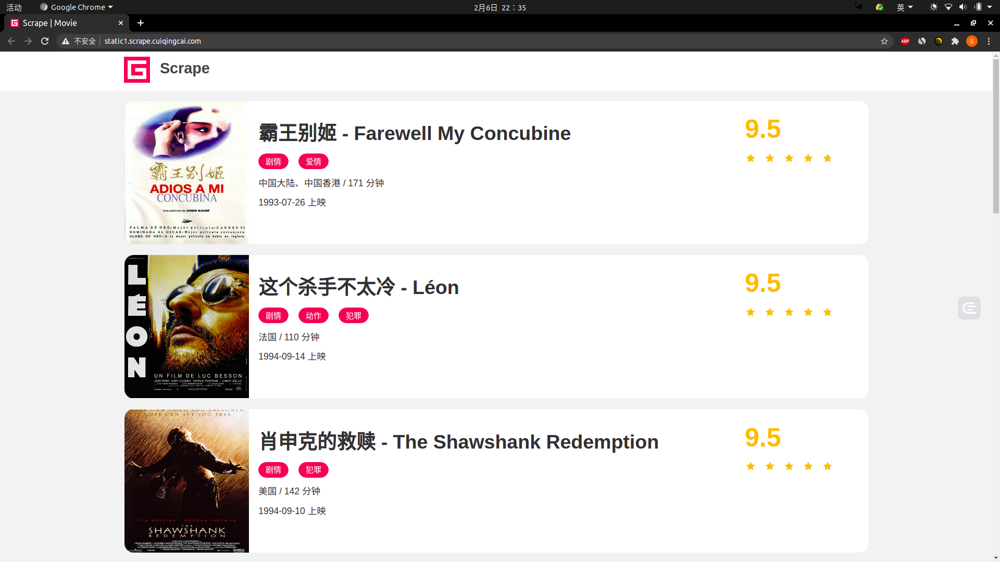
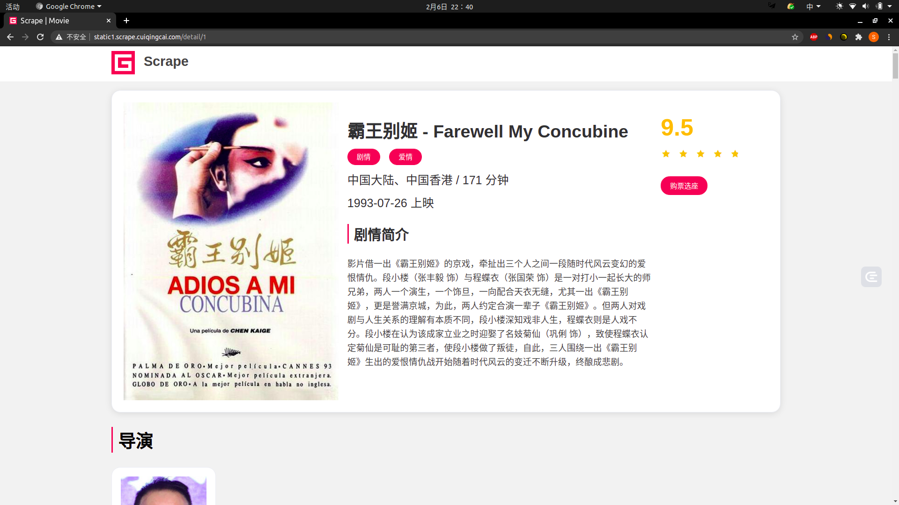
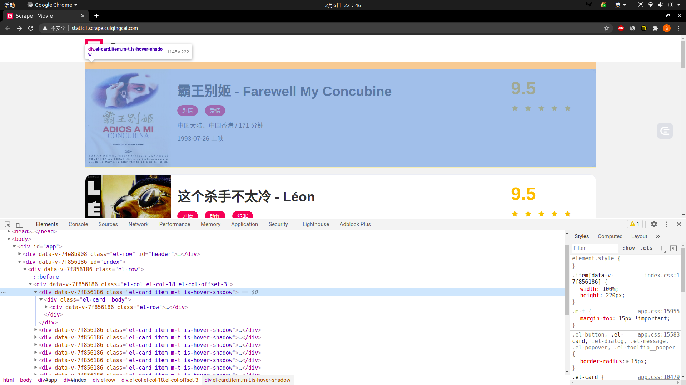
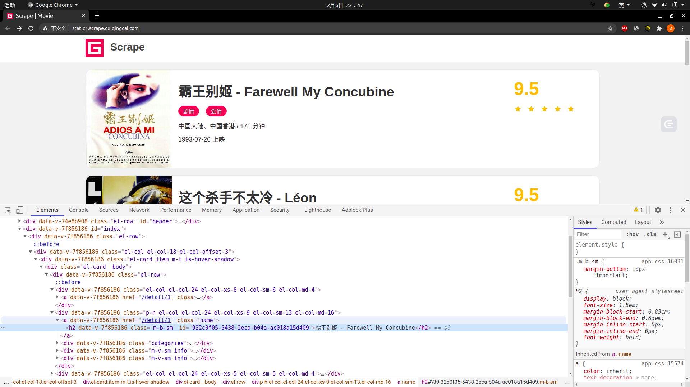
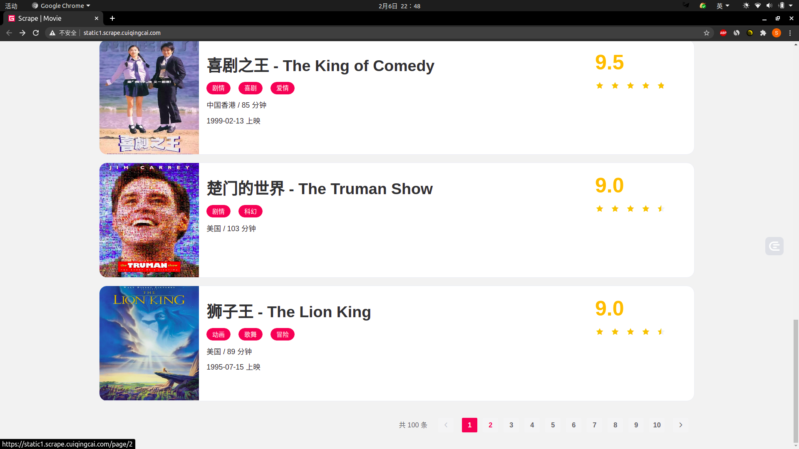

# Requests + PyQuery + PyMongo 实战

在学习了多进程、requests、正则表达式、pyquery、PyMongo 等的基本用法后，我们就来实现一个完整的网站爬虫案例，把前面学习的知识点串联起来，同时加深对这些知识点的理解。

---
---

## 准备工作

我们需要做好如下的工作：

* 安装好 ```Python3``` (最低为 3.6 版本)，并能成功运行 ```Python3``` 程序
* 了解 ```Python``` 多进程的基本原理
* 了解 ```Python HTTP``` 请求库 ```requests``` 的基本用法
* 了解正则表达式的用法和 ```Python``` 中正则表达式库 ```re``` 的基本用法
* 了解 ```Python HTML``` 解析库 ```pyquery``` 的基本用法
* 了解 ```MongoDB``` 并安装和启动 ```MongoDB``` 服务
* 了解 ```Python``` 的 ```MongoDB``` 操作库 ```PyMongo``` 的基本用法

---

## 爬取目标

我们以一个基本的静态网站作为案例进行爬取，链接为： [https://static1.scrape.cuiqingcai.com/](https://static1.scrape.cuiqingcai.com/)
，这个网站里面包含了一些电影信息，界面如下：



首页是一个影片列表，每栏里包含了这部电影的封面、名称、分类、上映时间、评分等内容。

点开其中一部电影，会进入电影的详情页面，会得到如下页面：



这里显示了剧情简介、导演、演员等信息。

我们的目标是：

* 用 ```requests``` 爬取这个站点每一页的电影列表，顺着列表再爬取每个电影的详情页
* 用 ```pyquery``` 和正则表达式提取每部电影的名称、封面、类别、上映时间、评分、剧情简介等内容
* 把以上爬取的内容存入 ```MongoDB``` 数据库
* 使用多进程实现爬取的加速

---

## 爬取列表页

爬取的第一步便是从列表页入手，首先观察一下列表页的结构和翻页规则。在浏览器中访问 [https://static1.scrape.cuiqingcai.com/](https://static1.scrape.cuiqingcai.com/)
，打开浏览器开发者工具，观察每一个电影信息区块对应的 HTML，以及进入到详情页的 URL 是怎样的，如图所示：



可以看到每部电影对应的区块都是一个 div 节点，它的 ```class``` 属性都有 el-card 这个值。每个列表页有 10 个这样的 div 节点，也就对应着 10 部电影的信息。

我们再分析下从列表页是怎么进入到详情页的，我们选中电影的名称，看下结果：



可以看到这个名称实际上是一个 h2 节点，其内部的文字就是电影的标题。

h2 节点的外面包含了一个 a 节点，这个 a 节点带有 ```href``` 属性，这就是一个超链接，其中 ```href``` 的值为 ```/detail/1```，这是一个相对网站的根
URL [https://static1.scrape.cuiqingcai.com/](https://static1.scrape.cuiqingcai.com/) 路径，加上网站根 URL
就构成了 [https://static1.scrape.cuiqingcai.com/detail/1](https://static1.scrape.cuiqingcai.com/detail/1) ，也就是这部电影详情页的
URL。我们只需要提取这个 ```href``` 属性就能构造出详情页的 URL 并接着爬取了。

接下来我们来分析下翻页的逻辑，拉到页面的最下方，可以看到分页页码，如图所示：



页面显示一共有 100 条数据，10 页的内容，因此页码最多是 10。接着点击第 2 页，如图所示：


可以看到网页的 URL 变成了 [https://static1.scrape.cuiqingcai.com/page/2](https://static1.scrape.cuiqingcai.com/page/2) ，相比根 URL
多了 ```/page/2``` 这部分内容。网页的结构保持不变。

接着我们查看第 3 页、第 4 页等内容，可以发现有这么一个规律，每一页的 URL 最后分别变成了 ```/page/3、/page/4``` 。所以，```/page``` 后面跟的就是列表页的页码，当然第 1 页也是一样，我们在根
URL 后面加上 ```/page/1``` 也是能访问的，只不过网站做了一下处理，默认的页码是 1，所以显示第 1 页的内容。

分析到这里，逻辑基本就清晰了。

如果我们要完成列表页的爬取，可以这么实现：

* 遍历页码构造 10 页的索引页 URL
* 从每个索引页分析提取出每个电影的详情页 URL

现在我们就实现这个过程吧。

首先，我们需要先定义一些基础的变量，并引入一些必要的库，[代码](../../codes/Module_2/lecture_11/lecture_11_1.py) 如下：

```python
# -*- coding: utf-8 -*-


import re
import requests
import logging
import pymongo
from pyquery import PyQuery
from urllib.parse import urljoin

logging.basicConfig(level=logging.INFO, format='%(asctime)s - %(levelname)s: %(message)s')

ROOT_URL = "https://static1.scrape.cuiqingcai.com"
PAGE_NUM = 10
```

这里我们引入了 ```requests``` 用来爬取页面，```logging``` 用来输出信息，```re``` 用来实现正则表达式解析，```pyquery``` 用来直接解析网页，```pymongo``` 用来实现 ```MongoDB``` 存储，```urljoin``` 用来做 URL 的拼接。

接着定义日志输出级别和输出格式，完成之后再定义 ```ROOT_URL``` 为当前站点的根 URL，```PAGE_NUM``` 为需要爬取的总页码数量。

定义好了之后，我们来实现一个页面爬取的方法吧，实现如下：

```python
def scrape_page(url: str):
    """
    
    :param url: 
    :return: 
    """
    logging.info('scraping %s...', url)
    try:
        response = requests.get(url, headers=headers, verify=False)
        if response.status_code == 200:
            return response.text
        logging.error('get invalid status code %s while scraping %s', response.status_code, url)
    except requests.RequestException:
        logging.error('error occurred while scraping %s', url, exc_info=True)
```

考虑到我们不仅要爬取列表页，还要爬取详情页，所以在这里我们定义一个较通用的爬取页面的方法，叫作 scrape_page，它接收一个 url 参数，返回页面的 html 代码。

这里我们首先判断状态码是不是 200，如果是，则直接返回页面的 HTML 代码，如果不是，则会输出错误日志信息。另外，这里实现了 requests 的异常处理，如果出现了爬取异常，则会输出对应的错误日志信息。这时我们将 logging 的 error 方法的 exc_info 参数设置为 True 则可以打印出 Traceback 错误堆栈信息。

好了，有了 scrape_page 方法之后，我们给这个方法传入一个 url，正常情况下它就可以返回页面的 HTML 代码了。

在这个基础上，我们来定义列表页的爬取方法吧，实现如下：

```python
def scrape_index(page: int):
    """
    
    :param page: 
    :return: 
    """
    index_url = f'{ROOT_URL}/page/{page}'
    return scrape_page(index_url)
```

方法名称叫作 scrape_index，这个方法会接收一个 page 参数，即列表页的页码，我们在方法里面实现列表页的 URL 拼接，然后调用 scrape_page 方法爬取即可得到列表页的 HTML 代码了。

获取了 HTML 代码后，下一步就是解析列表页，并得到每部电影的详情页的 URL 了，实现如下：

```python
def parse_index(html: str):
    """
    
    :param html: 
    :return: 
    """
    doc = PyQuery(html)
    links = doc(".el-card .name")
    for link in links.items():
        href = link.attr("href")
        detail_url = urljoin(ROOT_URL, href)
        logging.info('get detail url %s', detail_url)
        yield detail_url
```

在这里我们定义了 parse_index 方法，它接收一个 html 参数，即列表页的 HTML 代码。接着我们用 pyquery 新建一个 PyQuery 对象，完成之后再用 .el-card .name 选择器选出来每个电影名称对应的超链接节点。我们遍历这些节点，通过调用 attr 方法并传入 href 获得详情页的 URL 路径，得到的 href 就是我们在上文所说的类似  /detail/1  这样的结果。由于这并不是一个完整的 URL，所以我们需要借助 urljoin 方法把 BASE_URL 和 href 拼接起来，获得详情页的完整 URL，得到的结果就是类似 https://static1.scrape.cuiqingcai.com/detail/1 这样完整的 URL 了，最后 yield 返回即可。

这样我们通过调用 parse_index 方法传入列表页的 HTML 代码就可以获得该列表页所有电影的详情页 URL 了。

好，接下来我们把上面的方法串联调用一下，实现如下：

```python

```


