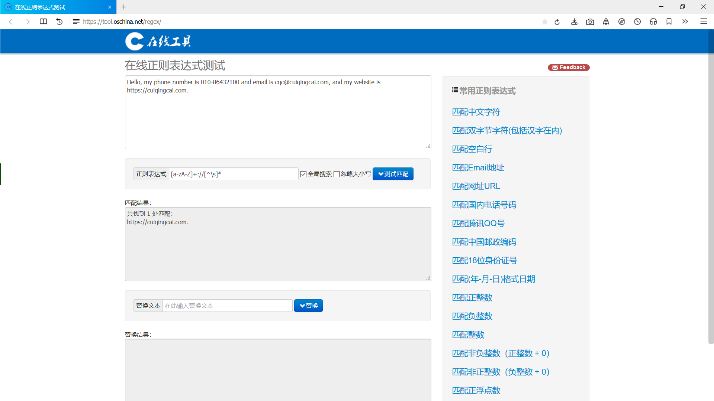

# 正则表达式

上节，我们通过Requests得到了网页的源代码，如何从中获取有用的信息呢？

正则表达式便是一个行之有效的方法，它示处理字符串的强大工具，很多高级语言都支持它，Python也不例外。

## 实例

打开开源中国提供的正则表达式测试工具，[https://tool.oschina.net/regex/](https://tool.oschina.net/regex/)，输入待匹配文本和正则表达式，即可得到匹配结果。

例如，输入以下文本：
```textmate
Hello, my phone number is 010-86432100 and email is cqc@cuiqingcai.com, and my website is https://cuiqingcai.com.
```
如果想提取其中的URL的话，可以输入以下正则表达式：
```textmate
[a-zA-Z]+://[^\s]*
```
结果如下：



我们得到了文本中的URL。

当然，你也可以选择右侧的常用正则表达式进行匹配。

正则表达式它可以按一定的规则将特定的文本提取出来，例如，电子邮件是有其特定的组成格式的：一段字符串+@符号+某个域名。而URL的组成格式则是协议类型+冒号加双斜线+域名和路径。

如上面提取URL的正则表达式中，a-z匹配任意的小写字母，A-Z匹配任意的小写字母，\s匹配任意的空白字符，* 匹配前面任意多个字符。

这样，我们就把源代码中的URL提取出来了。

下表是常用的匹配规则：

|模式|描述|
|:----:|:----:|
|\w|匹配字母，数字及下划线|
|\W|匹配不是字母，数字及下划线的字符|
|\s|匹配任意空白字符，等价于 [\t\n\r\f]|
|\S|匹配任意非空字符|
|\d|匹配任意数字，等价于[0~9]|
|\D|匹配任意非数字的字符|
|\A|匹配字符串开头|
|\Z|匹配字符串结尾，如果存在换行，只匹配到换行前的结束字符串|
|\z|匹配字符串结尾，如果存在换行，同时还会匹配换行符|
|\G|匹配最后匹配完成的位置|
|\n|匹配一个换行符|
|\t|匹配一个制表符|
|^|匹配一行字符串的开头|
|$|匹配一行字符串的结尾|
|.|匹配任意字符，除了换行符，当re.DOTALL标记被指定时，则可以匹配包括换行符的任意字符|
|[...]|用来表示一组字符，单独列出，比如[amk]匹配a，m或k|
|[^...]|不在[]中的字符，比如匹配除了a，b，c之外的字符|
|*|匹配0个或多个表达式|
|+|匹配1个或多个表达式|
|?|匹配0个或1个前面的正则表达式定义的片段，非贪婪方式|
|{n}|精确匹配n个前面的表达式|
|{n, m}|匹配n到m次由前面正则表达式定义的片段，贪婪方式|
|$a\mid b$|匹配a或b|
|()|匹配括号内的表达式，也表示一个组|

Python中re库提供了正则表达式的实现，下面就来了解它的一些常用方法。

## match

match方法，向它传入待匹配的字符串，以及正则表达式，就可以检测这个正则表达式是否匹配字符串。

match方法会尝试从字符串的起始位置匹配正则表达式，如果匹配，就返回匹配成功的结果；如果不匹配，就返回None。

[示例](../../codes/Module_2/lecture_8/lecture_8_1.py)如下：
```python
# -*- coding: utf-8 -*-

import re

content = "Hello 123 4567 World_This is a Regex Demo"
print(len(content))
pattern_str = "^Hello\s\d\d\d\s\d{4}\s\w{10}"
pattern = re.compile(pattern_str)
result = re.match(pattern, content)
print(result)
print(result.group())
print(result.span())
```
结果为：
```textmate
41
<re.Match object; span=(0, 25), match='Hello 123 4567 World_This'>
Hello 123 4567 World_This
(0, 25)
```
来看这个正则表达式：
```textmate
^Hello\s\d\d\d\s\d{4}\s\w{10}
```
解释下这个正则表达式的规则：
```textmate
开头的^匹配字符串的开头，也就是以Hello开头。
\s匹配空白字符，用来匹配目标字符串的空格。
\d匹配数字，3个\d匹配123。
再写1个\s匹配空格。
后面的4567，其实依然能用4个\d来匹配，但是这样比较烦琐，所以后面跟{4}代表匹配前面的规则4次，也就是匹配4个数字。
后面再紧接1个空白字符，最后\w{10}匹配10个字母及下划线。
```
在match方法中，第一个参数传入正则表达式，第二个参数传入要匹配的字符串。

在匹配结果result中有两个方法：group方法输出匹配的内容，结果是Hello 123 4567 World_This，这恰好是正则表达式规则所匹配的内容。span方法输出匹配的范围，结果是(0, 25)，这就是匹配到的结果字符串在原字符串中的位置范围。

现在，我们基本知道了如何使用正则表达式匹配一段文本了。

## 匹配目标

刚刚我们用match方法得到了匹配的字符串，如果我们想从字符串中提取一部分内容的话，可以使用()括号待提取的子字符串括起来。()实际上标记了一个子表达式的开始和结束位置，被标记的每个子表达式会依次对应每一个分组，调用group方法传入分组的索引即可获取提取的结果。

[示例](../../codes/Module_2/lecture_8/lecture_8_2.py)如下：
```python
# -*- coding: utf-8 -*-

import re

content = "Hello 1234567 World_This is a Regex Demo"
pattern_str = "^Hello\s(\d+)\sWorld"
pattern = re.compile(pattern_str)
result = re.match(pattern, content)
print(result)
print(result.group())
print(result.group(0))
print(result.group(1))
print(result.span())
```
结果为：
```textmate
<re.Match object; span=(0, 19), match='Hello 1234567 World'>
Hello 1234567 World
Hello 1234567 World
1234567
(0, 19)
```
这里我们想提取数字部分，将数字部分的正则表达式\d+用()标注起来(\d+)，调用group(1)可以得到结果。

如果正则表达式后面还有()包括的内容，使用group(2)，group(3)来获取，我们可以发现group(0)实际上是所有的匹配结果，和group()等价。

## 通用匹配

我们可以对刚才的正则表达式进行简化，即使用万能匹配.*。其中.可以匹配任意字符(除换行符)，*代表匹配前面的字符无限次，有了它，我们就不需要按个考虑空白字符\s，数字\d等等情况了。

简化上述例子，[程序](../../codes/Module_2/lecture_8/lecture_8_3.py)如下：
```python
# -*- coding: utf-8 -*-

import re

content = "Hello 1234567 World_This is a Regex Demo"
pattern_str = "^Hello.*Demo$"
pattern = re.compile(pattern_str)
result = re.match(pattern, content)
print(result)
print(result.group())
print(result.span())
```
结果如下：
```textmate
<re.Match object; span=(0, 40), match='Hello 1234567 World_This is a Regex Demo'>
Hello 1234567 World_This is a Regex Demo
(0, 40)
```
中间的数字，空白字符，字符我们全部使用.*代替了，并在末尾加上了一个结束字符$，它成功匹配了所有的字符串。

可以看出.*极大地简化了正则表达式的书写。

## 贪婪与非贪婪

通配符.*有时候会事与愿违。

来看这个[例子](../../codes/Module_2/lecture_8/lecture_8_4.py)：
```python
# -*- coding: utf-8 -*-

import re

content = "Hello 1234567 World_This is a Regex Demo"
pattern_str = "^He.*(\d+).*Demo$"
pattern = re.compile(pattern_str)
result = re.match(pattern, content)
print(result)
print(result.group(1))
```
结果为：
```textmate
<re.Match object; span=(0, 40), match='Hello 1234567 World_This is a Regex Demo'>
7
```
我们的想法是获取中间的数字，并使用了分组(\d+)，数字两边的内容较多，所以直接使用了.*，但运行结果却只有数字7，这是为什么呢？。

这里便是贪婪与非贪婪匹配了。在贪婪匹配下，.*会匹配尽可能多的字符。正则表达式中.*后面是\d+，也就是至少一个数字，此时.*就尽可能匹配多的字符，这里就把123456匹配了，给\d+只留下了7。

显然这样事与愿违，因为前面的.*太”贪婪“了，导致后面的没有匹配到预期内容。我们可以使用非贪婪匹配，写法是.*?，来看下效果吧。

[示例](../../codes/Module_2/lecture_8/lecture_8_5.py)如下：
```python
# -*- coding: utf-8 -*-

import re

content = "Hello 1234567 World_This is a Regex Demo"
pattern_str = "^He.*?(\d+).*Demo$"
pattern = re.compile(pattern_str)
result = re.match(pattern, content)
print(result)
print(result.group(1))
```
结果为：
```textmate
<re.Match object; span=(0, 40), match='Hello 1234567 World_This is a Regex Demo'>
1234567
```
成功得到了预期内容，因为数字匹配前面的.*是非贪婪匹配，把hello后面的空白字符匹配后就没有继续匹配之后的数字了，\d+自然也就匹配到数字了。

所以，在做匹配的时候，字符串中间尽量使用非贪婪匹配，也就是用.*? 来代替.*，以免丢失匹配结果。

但是如果正则表达式结尾是.*?，就有可能匹配不到任何内容了，因为它是非贪婪匹配，匹配尽可能少的字符。

[示例](../../codes/Module_2/lecture_8/lecture_8_6.py)如下：
```python
# -*- coding: utf-8 -*-

import re

content = "https://weibo.com/comment/kEraCN"
result1 = re.match("https.*?comment/(.*?)", content)
result2 = re.match("https.*?comment/(.*)", content)
print("result1: ", result1.group(1))
print("result2: ", result2.group(1))
```
结果为：
```textmate
result1:  
result2:  kEraCN
```
可以看到，.*?没有匹配到任何结果，而.*则尽量匹配多的内容，成功得到了匹配结果。

## 修饰符

正则表达式可以包含一些可选标志修饰符来控制匹配的模式。修饰符被指定为一个可选的标志。

[示例](../../codes/Module_2/lecture_8/lecture_8_7.py)如下：
```python
# -*- coding: utf-8 -*-

import re

content = '''Hello 1234567 World_This 
is a Regex Demo
'''
result = re.match("^He.*?(\d+).*?Demo$", content)
# result = re.match("^He.*?(\d+).*?Demo$", content, re.S)
print(result.group(1))
```
报错了：
```textmate
Traceback (most recent call last):
  File "D:/Nut_cloud/notes/Reptile_study_notes_local/codes/Module_2/lecture_8/lecture_8_7.py", line 10, in <module>
    print(result.group(1))
AttributeError: 'NoneType' object has no attribute 'group'
```
我们在字符串中加入了换行符，再次运行，却报错了，正则表达式没有匹配到字符串，返回NoneType，NoneType没有group方法。

因为我们匹配的是除换行符之外的任意字符，遇到换行符，.*?便不能匹配了。

这里只要加上一个修饰符re.S，即可解决。
```textmate
result = re.match("^He.*?(\d+).*?Demo$", content, re.S)
```
结果为：
```textmate
1234567
```
有了re.S，就可以匹配文本间的换行了。

常见的修饰符如下：

|修饰符|描述|
|:----:|:----:|
|re.I|使匹配对大小写不敏感|
|re.L|做本地化识别(locale-aware)匹配|
|re.M|多行匹配，影响^和$|
|re.S|使匹配包括换行在内的所有字符|
|re.U|根据Unicode字符集解析字符，这个标志影响\w，\W，\b和\B|
|re.X|该标志通过给予你更灵活的格式以便你将正则表达式写得更易于理解|

网页匹配中常用的有re.Sh和re.I。

## 转义匹配

如果匹配用于正则表达式的特殊字符时，在字符前加上反斜线\转义即可。

[示例](../../codes/Module_2/lecture_8/lecture_8_8.py)如下：
```python
# -*- coding: utf-8 -*-

import re

content = "(百度)www.baidu.com"
result = re.match("\(百度\)www\.baidu\.com", content)
print(result)
print(result.group())
```
结果为：
```textmate
<re.Match object; span=(0, 17), match='(百度)www.baidu.com'>
(百度)www.baidu.com
```
匹配成功。

## search

之前我们使用的match的方法是从字符串首部开始匹配的，一旦开头不匹配，整个匹配便失败了。

先看个[例子](../../codes/Module_2/lecture_8/lecture_8_9.py)：
```python
# -*- coding: utf-8 -*-

import re

content = "Extra strings Hello 1234567 World_This is a Regex Demo Extra strings"
pattern_str = "Hello.*?(\d+).*?Demo"
result = re.match(pattern_str, content)
# result = re.search(pattern_str, content)
print(result)
# print(result.group(1))
```
结果为：
```textmate
None
```
这里的字符串是以Extra开头的，但正则表达式是以Hello开头，从字符串开头无法匹配，所以结果为None。

re库中还有个方法是search，它会扫描整个字符串，返回第一个成功匹配的结果，如果没有到则返回None。

我们改用search方法，结果如下：
```textmate
<re.Match object; span=(14, 54), match='Hello 1234567 World_This is a Regex Demo'>
1234567
```
成功得到结果，为了匹配方便，尽可能使用search方法。

再看几个示例。

我们来提取这个HTML文本。
```html
<div id="songs-list">
    <h2 class="title">经典老歌</h2>
    <p class="introduction">
        经典老歌列表
    </p>
    <ul id="list" class="list-group">
        <li data-view="2">一路上有你</li>
        <li data-view="7">
            <a href="/2.mp3" singer="任贤齐">沧海一声笑</a>
        </li>
        <li data-view="4" class="active">
            <a href="/3.mp3" singer="齐秦">往事随风</a>
        </li>
        <li data-view="6"><a href="/4.mp3" singer="beyond">光辉岁月</a></li>
        <li data-view="5"><a href="/5.mp3" singer="陈慧琳">记事本</a></li>
        <li data-view="5">
            <a href="/6.mp3" singer="邓丽君">但愿人长久</a>
        </li>
    </ul>
</div>
```
首先，我们尝试提取class为active的li节点内部超链接包含的歌手名和歌名，此时需要提取第三个li节点下a节点的singer属性和文本。

此时，正则表达式可以用li开头，然后寻找一个标志符active，中间的部分可以用.*?来匹配。

接下来，要提取singer这个属性值，所以还需要写入singer="(.*?)"，这里需要提取的部分用小括号括起来，以便用group方法提取出来，它的两侧边界是双引号。

然后还需要匹配a节点的文本，其中它的左边界是>，右边界是</a>。目标内容依然用(.*?)来匹配，所以最后的正则表达式就变成了：
```textmate
<li.*?active.*?singer="(.*?)">(.*?)</a>
```
由于代码有换行，所以这里第三个参数需要传入re.S。

[程序](../../codes/Module_2/lecture_8/lecture_8_10.py)如下：
```python
# -*- coding: utf-8 -*-

import re

html = '''
<div id="songs-list">
    <h2 class="title">经典老歌</h2>
    <p class="introduction">
        经典老歌列表
    </p>
    <ul id="list" class="list-group">
        <li data-view="2">一路上有你</li>
        <li data-view="7">
            <a href="/2.mp3" singer="任贤齐">沧海一声笑</a>
        </li>
        <li data-view="4" class="active">
            <a href="/3.mp3" singer="齐秦">往事随风</a>
        </li>
        <li data-view="6"><a href="/4.mp3" singer="beyond">光辉岁月</a></li>
        <li data-view="5"><a href="/5.mp3" singer="陈慧琳">记事本</a></li>
        <li data-view="5">
            <a href="/6.mp3" singer="邓丽君">但愿人长久</a>
        </li>
    </ul>
</div>
'''
pattern = '<li.*?active.*?singer="(.*?)">(.*?)</a>'
result = re.search(pattern, html, re.S)
if result:
    print(result.group(1), result.group(2))
```
结果为：
```textmate
齐秦 往事随风
```
可以看到，这正是class为active的li节点内部的超链接包含的歌手名和歌名。

如果正则表达式不加active(也就是匹配不带class为active的节点内容)，那会怎样呢？我们将正则表达式中的active去掉。

改写为：
```textmate
pattern = '<li.*?singer="(.*?)">(.*?)</a>'
result = re.search(pattern, html, re.S)
if result:
    print(result.group(1), result.group(2))
```
结果为：
```textmate
任贤齐 沧海一声笑
```
search会找到第一个符合条件的结果，把active标签去掉后，从字符串开头开始搜索，此时符合条件的节点就变成了第二个li节点，后面的不再匹配，所以运行结果变成第二个li节点中的内容。

在前两次匹配中，search方法的第三个参数都加了re.S，这使得.*?可以匹配换行，所以含有换行的li节点被匹配到了。如果我们将其去掉，结果会是什么？

代码改写为：
```textmate
pattern = '<li.*?singer="(.*?)">(.*?)</a>'
result = re.search(pattern, html)
if result:
    print(result.group(1), result.group(2))
```
结果为：
```textmate
beyond 光辉岁月
``` 
可以看到，结果变成了第四个li节点的内容。这是因为第二个和第三个li节点都包含了换行符，去掉re.S之后，.*?已经不能匹配换行符，所以正则表达式不会匹配到第二个和第三个li节点，而第四个li节点中不包含换行符，所以成功匹配。

鉴于绝大部分的HTML文本都包含了换行符，所以尽量都需要加上re.S修饰符，以免出现匹配不到的问题。

## findall

该方法会搜索整个字符串，然后返回匹配正则表达式的所有内容。

还是上面的HTML文本，如果想获取所有a节点的超链接，歌手和歌名，就可以将search方法换成findall方法。如果有返回结果的话，就是列表类型，所以需要遍历一下来依次获取每组内容。

[程序](../../codes/Module_2/lecture_8/lecture_8_11.py)如下：
```python
# -*- coding: utf-8 -*-

import re

html = '''
<div id="songs-list">
    <h2 class="title">经典老歌</h2>
    <p class="introduction">
        经典老歌列表
    </p>
    <ul id="list" class="list-group">
        <li data-view="2">一路上有你</li>
        <li data-view="7">
            <a href="/2.mp3" singer="任贤齐">沧海一声笑</a>
        </li>
        <li data-view="4" class="active">
            <a href="/3.mp3" singer="齐秦">往事随风</a>
        </li>
        <li data-view="6"><a href="/4.mp3" singer="beyond">光辉岁月</a></li>
        <li data-view="5"><a href="/5.mp3" singer="陈慧琳">记事本</a></li>
        <li data-view="5">
            <a href="/6.mp3" singer="邓丽君">但愿人长久</a>
        </li>
    </ul>
</div>
'''
pattern = '<li.*?href="(.*?)".*?singer="(.*?)">(.*?)</a>'
results = re.findall(pattern, html, re.S)
print(results)
print(type(results))

for result in results:
    print(result)
    print(result[0], result[1], result[2])
```
结果为：
```textmate
[('/2.mp3', '任贤齐', '沧海一声笑'), ('/3.mp3', '齐秦', '往事随风'), ('/4.mp3', 'beyond', '光辉岁月'), ('/5.mp3', '陈慧琳', '记事本'), ('/6.mp3', '邓丽君', '<i class="fa fa-user"></i>但愿人长久')]
<class 'list'>
('/2.mp3', '任贤齐', '沧海一声笑')
/2.mp3 任贤齐 沧海一声笑
('/3.mp3', '齐秦', '往事随风')
/3.mp3 齐秦 往事随风
('/4.mp3', 'beyond', '光辉岁月')
/4.mp3 beyond 光辉岁月
('/5.mp3', '陈慧琳', '记事本')
/5.mp3 陈慧琳 记事本
('/6.mp3', '邓丽君', '<i class="fa fa-user"></i>但愿人长久')
/6.mp3 邓丽君 <i class="fa fa-user"></i>但愿人长久
```
返回的列表中的每个元素都是元组类型，我们用对应的索引依次取出即可。

## sub

如果想要把一串文本中的所有数字都去掉，如果只用字符串的replace方法，那就太烦琐了，这时可以借助sub方法。

[示例](../../codes/Module_2/lecture_8/lecture_8_12.py)如下：
```python
# -*- coding: utf-8 -*-

import re

content = "54aK54yr5oiR54ix5L2g"
content = re.sub("\d+", "", content)
print(content)
```
结果为：
```textmate
aKyroiRixLg
```
第一个参数传入\d+来匹配所有的数字，第二个参数替换成的字符串(如果去掉该参数的话，可以赋值为空)，第三个参数是原字符串。

在上面的HTML文本中，如果想获取所有li节点的歌名，可以这样写：
```textmate
results = re.findall("<li.*?>\s*?(<a.*?>)?(\w+)(</a>)?\s*?</li>", html, re.S)
for result in results:
    print(result[1])
```
结果为：
```textmate
一路上有你
沧海一声笑
往事随风
光辉岁月
记事本
但愿人长久
```
如果使用sub方法，可以先将a节点去掉，只留下文本，使用findall提取即可：
```textmate
html = re.sub("<a.*?>|</a>", "", html)
print(html)
results = re.findall("<li.*?>(.*?)</li>", html, re.S)
for result in results:
    print(result.strip())
```
结果为：
```textmate
<div id="songs-list">
    <h2 class="title">经典老歌</h2>
    <p class="introduction">
        经典老歌列表
    </p>
    <ul id="list" class="list-group">
        <li data-view="2">一路上有你</li>
        <li data-view="7">
            沧海一声笑
        </li>
        <li data-view="4" class="active">
            往事随风
        </li>
        <li data-view="6">光辉岁月</li>
        <li data-view="5">记事本</li>
        <li data-view="5">
            但愿人长久
        </li>
    </ul>
</div>
一路上有你
沧海一声笑
往事随风
光辉岁月
记事本
但愿人长久
```
sub方法还是很强大的

## compile

compile方法可以将正则字符串编译成正则表达式对象，以便在后面的匹配中复用。

[示例](../../codes/Module_2/lecture_8/lecture_8_13.py)如下：
```python
# -*- coding: utf-8 -*-

import re

content1 = "2020-3-19 12:00"
content2 = "2020-3-19 13:10"
content3 = "2020-3-19 14:21"

pattern = re.compile("\d{2}:\d{2}")
result1 = re.sub(pattern, "", content1)
result2 = re.sub(pattern, "", content2)
result3 = re.sub(pattern, "", content3)
print(result1, result2, result3)
```
结果为：
```textmate
2020-3-19  2020-3-19  2020-3-19 
```
这个方法我们之前也是用到了，实际上直接传入一个正则表达式字符串也是可以的。

另外，compile还可以传入修饰符，例如re.S等修饰符，这样在search，findall等方法中就不需要额外传了。
