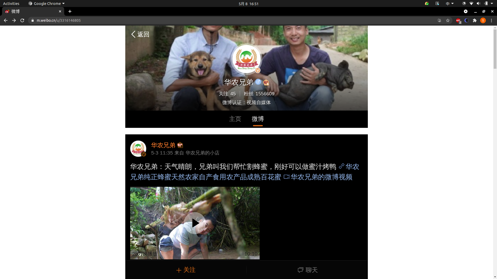
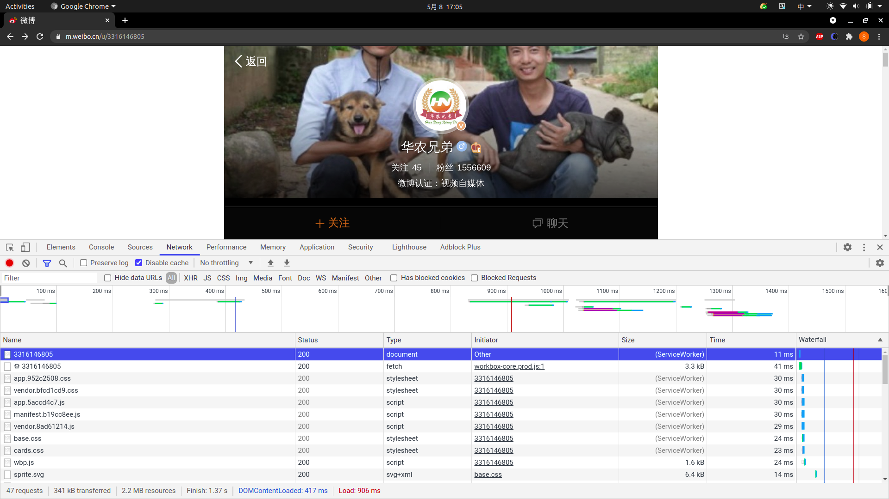
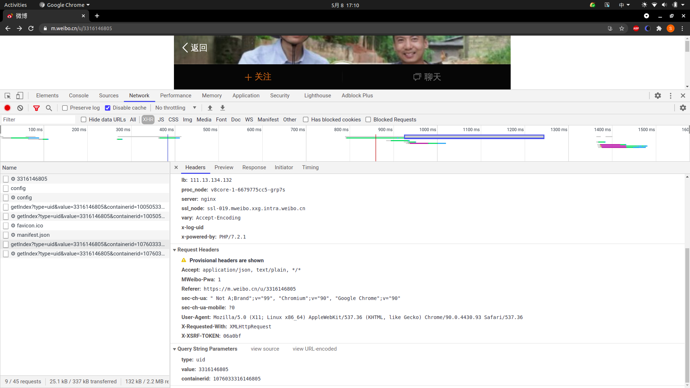
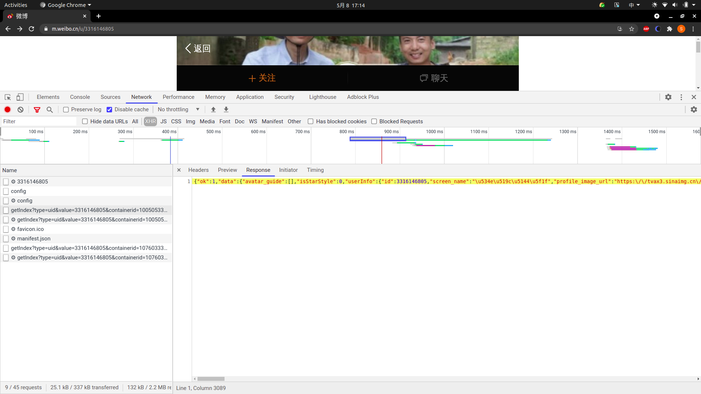
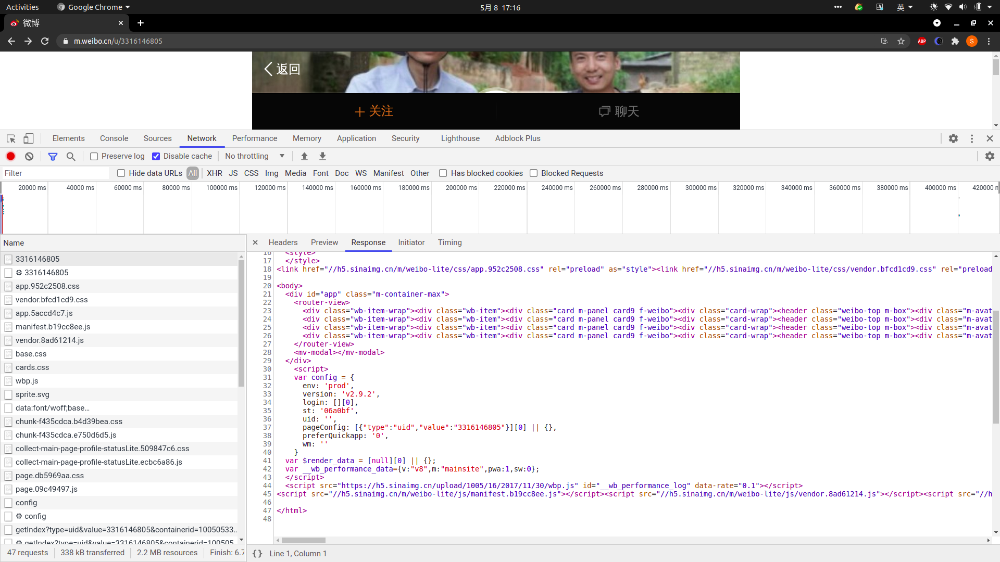
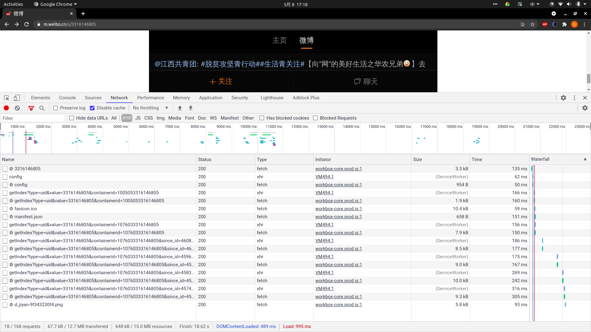
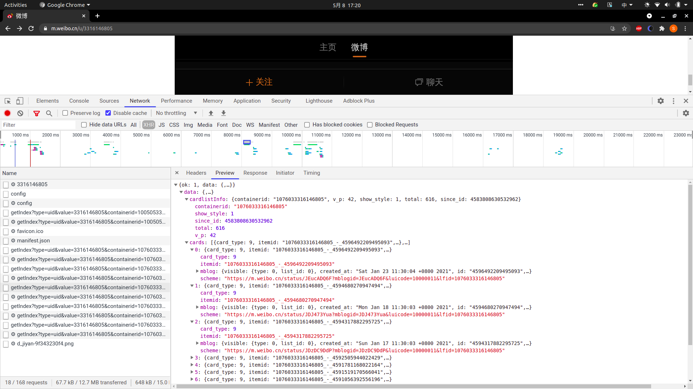

# Ajax 原理和解析

当使用 ```requests``` 抓取页面的时候，得到的结果可能会和在浏览器中看到的不一样：在浏览器中正常显示的页面数据，使用 ```requests``` 却没有得到结果。这是因为 ```requests``` 获取的都是原始 HTML 文档，而浏览器中的页面则是经过 JavaScript 数据处理后生成的结果。

这些数据的来源有多种，可能是通过 Ajax 加载的，可能是包含在 HTML 文档中的，也可能是经过 JavaScript 和特定算法计算后生成的。

对于第 1 种情况，数据加载是一种异步加载方式，原始页面不会包含某些数据，只有在加载完后，才会向服务器请求某个接口获取数据，然后数据才被处理从而呈现到网页上，这个过程实际上就是向服务器接口发送了一个 Ajax 请求。

按照 Web 的发展趋势来看，这种形式的页面将会越来越多。网页的原始 HTML 文档不会包含任何数据，数据都是通过 Ajax 统一加载后再呈现出来的，这样在 Web 开发上可以做到前后端分离，并且降低服务器直接渲染页面带来的压力。

所以如果遇到这样的页面，直接利用 ```requests``` 等库来抓取原始页面，是无法获取有效数据的。这时需要分析网页后台向接口发送的 Ajax 请求，如果可以用 ```requests``` 来模拟 Ajax 请求，就可以成功抓取了。

所以，本课时将了解什么是 Ajax 以及如何去分析和抓取 Ajax 请求。

---
---

## 什么是 Ajax

Ajax，全称为 Asynchronous JavaScript and XML，即异步的 JavaScript 和 XML。它不是一门编程语言，而是利用 JavaScript 在保证页面不被刷新、页面链接不改变的情况下与服务器交换数据并更新部分网页的技术。

传统的网页，如果你想更新其内容，那么必须要刷新整个页面。有了 Ajax，便可以在页面不被全部刷新的情况下更新其内容。在这个过程中，页面实际上在后台与服务器进行了数据交互，获取到数据之后，再利用 JavaScript 改变网页，这样网页内容就会更新了。

你可以到 W3School 上体验几个 Demo 来感受一下：
[https://www.w3school.com.cn/ajax/ajax_xmlhttprequest_send.asp](https://www.w3school.com.cn/ajax/ajax_xmlhttprequest_send.asp)

---

## 实例引入

浏览网页的时候，可以发现右侧的进度条随着页面下滑不断缩短。以华农兄弟微博的主页为例：
[https://m.weibo.cn/u/3316146805](https://m.weibo.cn/u/3316146805)

下滑几个微博后，后面的内容慢慢加载出来，原有的进度条缩短，展示的内容越来越多，如图所示：



其实页面其实并没有整个刷新，页面的链接没有变化，但是网页中却多了新内容，也就是后面刷出来的新微博。这就是通过 Ajax 获取新数据并呈现的过程

---

## 基本原理

发送 Ajax 请求到网页更新的过程可以简单分为以下 3 步：
* 发送请求
* 解析内容
* 渲染网页

下面将详细介绍一下这几个过程

---

### 发送请求

JavaScript 可以实现页面的各种交互功能，Ajax 也不例外，它是由 JavaScript 实现的，实际上执行了如下代码：

```javascript
var xmlhttp;

if (window.XMLHttpRequest) {
    //code for IE7+, Firefox, Chrome, Opera, Safari
    xmlhttp = new XMLHttpRequest();
} else {//code for IE6, IE5
    xmlhttp = new ActiveXObject("Microsoft.XMLHTTP");
}

xmlhttp.onreadystatechange = function () {
    if (xmlhttp.readyState == 4 && xmlhttp.status == 200) {
        document.getElementById("myDiv").innerHTML = xmlhttp.responseText;
    }

}

xmlhttp.open("POST", "/ajax/", true);
xmlhttp.send();
```

这是 JavaScript 对 Ajax 最底层的实现，这个过程实际上是新建了 ```XMLHttpRequest``` 对象，然后调用 ```onreadystatechange``` 属性设置监听，最后调用 ```open()``` 和 ```send()``` 方法向某个链接(也就是服务器)发送请求。

前面我们用 Python 实现请求发送之后，可以得到响应结果，但这里请求的发送由 JavaScript 来完成。由于设置了监听，所以当服务器返回响应时，```onreadystatechange``` 对应的方法便会被触发，我们在这个方法里面解析响应内容即可。

---

### 解析内容

得到响应之后，```onreadystatechange``` 属性对应的方法会被触发，此时利用 ```xmlhttp``` 的 ```responseText``` 属性便可取到响应内容。这类似于 Python 中利用 ```requests``` 向服务器发起请求，然后得到响应的过程。

返回的内容可能是 ```HTML```，也可能是 ```JSON```，接下来我们只需要在方法中用 JavaScript 进一步处理即可。比如，如果返回的内容是 ```JSON``` 的话，直接对它进行解析和转化即可。

---

### 渲染网页

JavaScript 有改变网页内容的能力，解析完响应内容之后，就可以调用 JavaScript 针对解析完的内容对网页进行下一步处理。比如，通过 document.getElementById().innerHTML 这样的操作，对某个元素内的源代码进行更改，这样网页显示的内容就改变了，这种对 Document 网页文档进行如更改、删除等操作也被称作 DOM 操作。

上例中，document.getElementById("myDiv").innerHTML=xmlhttp.responseText这个操作便将 ID 为 myDiv 的节点内部的 HTML 代码更改为服务器返回的内容，这样 myDiv 元素内部便会呈现出服务器返回的新数据，网页的部分内容看上去就更新了。

可以看到，发送请求、解析内容和渲染网页这 3 个步骤其实都是由 JavaScript 完成的。

我们再回想微博的下拉刷新，这其实是 JavaScript 向服务器发送了一个 Ajax 请求，然后获取新的微博数据，将其解析，并将其渲染在网页中的过程。

因此，真实的数据其实都是通过一次次 Ajax 请求得到的，如果想要抓取这些数据，我们就需要知道这些请求到底是怎么发送的，发往哪里，发了哪些参数。

---

## Ajax 分析

这里还是以前面的微博为例，拖动刷新的内容由 Ajax 加载，而且页面的 URL 没有变化，这时我们应该到哪里去查看这些 Ajax 请求呢？

这里还需要借助浏览器的开发者工具，下面以 Chrome 浏览器为例来介绍。

首先，用 Chrome 浏览器打开微博链接 [https://m.weibo.cn/u/3316146805](https://m.weibo.cn/u/3316146805)

随后在页面中点击鼠标右键，从弹出的快捷菜单中选择“检查” 选项，此时便会弹出开发者工具，如图所示：



前面也提到过，这里就是页面加载过程中浏览器与服务器之间发送请求和接收响应的所有记录。

Ajax 有其特殊的请求类型，它叫作 xhr。在图中我们可以发现一个以 getIndex 开头的请求，其 Type 为 xhr，这就是一个 Ajax 请求。用鼠标点击这个请求，可以查看这个请求的详细信息。


在右侧可以观察到 Request Headers、URL 和 Response Headers 等信息。Request Headers 中有一个信息为 X-Requested-With:XMLHttpRequest，这就标记了此请求是 Ajax 请求，如图所示：



随后我们点击 Preview，即可看到响应的内容，它是 JSON 格式的。这里 Chrome 为我们自动做了解析，点击箭头即可展开和收起相应内容。

我们可以观察到，返回结果是博主的个人信息，包括昵称、简介、头像等，这也是用来渲染个人主页所使用的数据。JavaScript 接收到这些数据之后，再执行相应的渲染方法，整个页面就渲染出来了。


另外，我们也可以切换到 Response 选项卡，从中观察到真实的返回数据，如图所示：



接下来，切回到第一个请求，观察一下它的 Response 是什么，如图所示：



这就是最原始链接 [https://m.weibo.cn/u/3316146805](https://m.weibo.cn/u/3316146805) 返回的结果，其代码只有几十行，结构也非常简单，只是执行了一些 JavaScript。

所以说，我们看到的微博页面的真实数据并不是最原始的页面返回的，而是在执行 JavaScript 后再次向后台发送 Ajax 请求，浏览器拿到数据后进一步渲染出来的。

## 过滤请求

接下来，我们再利用 Chrome 开发者工具的筛选功能筛选出所有的 Ajax 请求。在请求的上方有一层筛选栏，直接点击 XHR，此时在下方显示的所有请求便都是 Ajax 请求了，如图所示：



接下来，不断滑动页面，可以看到页面底部有一条条新的微博被刷出，而开发者工具下方也不断地出现 Ajax 请求，这样我们就可以捕获到所有的 Ajax 请求了。

随意点开一个条目，都可以清楚地看到其 Request URL、Request Headers、Response Headers、Response Body 等内容，此时想要模拟请求和提取就非常简单了。

下图所示的内容是某一页微博的列表信息：



到现在为止，我们已经可以分析出 Ajax 请求的一些详细信息了，接下来只需要用程序模拟这些 Ajax 请求，就可以轻松提取我们所需要的信息了。

---
---
