# Ajax 爬取案例实战

上一课时学习了 Ajax 的基本原理和分析方法，这一课时我们结合实际案例，学习 Ajax 分析和爬取页面的具体实现。

准备工作 在开始学习之前，我们需要做好如下的准备工作：

* 安装好 Python 3(最低为 3.6 版本)，并能成功运行 Python 3 程序
* 了解 Python HTTP 请求库 requests 的基本用法
* 了解 Ajax 的基础知识和分析 Ajax 的基本方法。

---
---

## 爬取目标

本课时我们以一个动态渲染网站为例来试验一下 Ajax 的爬取。其链接为： 

[https://dynamic1.scrape.center/](https://dynamic1.scrape.center/)

页面如图所示。

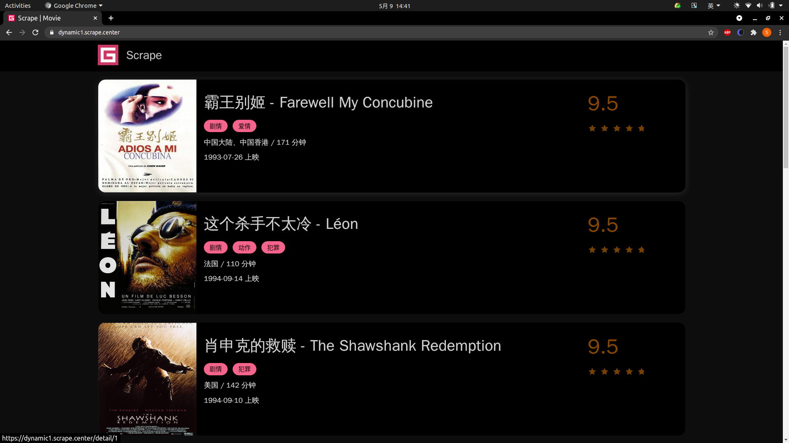

这个页面看似和我们上一课时的案例一模一样，但其实不是，它的后台实现逻辑和数据加载方式与上一课时完全不同，只不过最后呈现的样式是一样的。

这个网站同样支持翻页，可以点击最下方的页码来切换到下一页，如图所示。

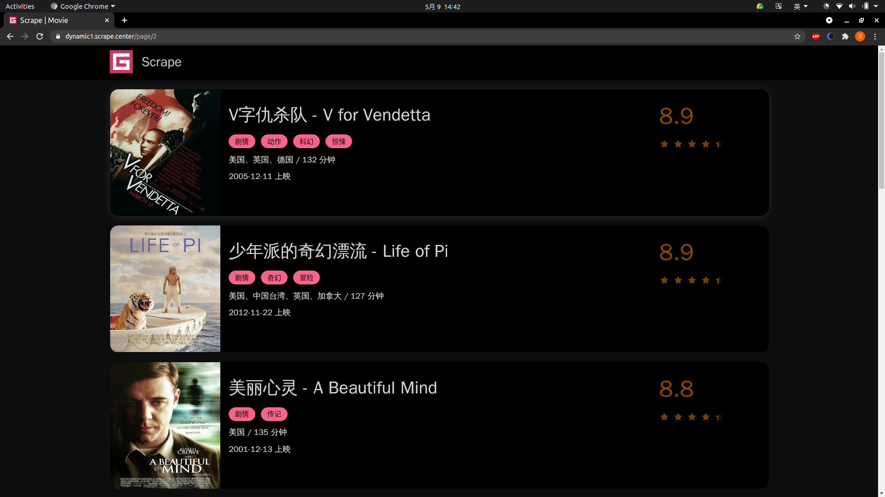

点击每一个电影的链接进入详情页，页面结构也是完全一样的，如图所示。

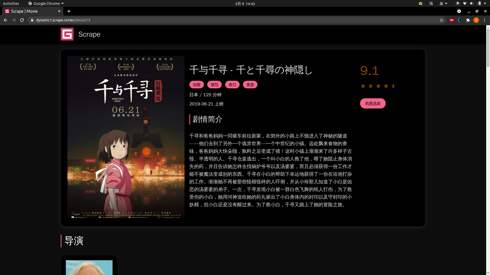

我们需要爬取的数据也和原来是相同的，包括电影的名称、封面、类别、上映日期、评分、剧情简介等信息。

本课时我们需要完成的目标有：

* 分析页面数据的加载逻辑
* 用 ```requests``` 实现 Ajax 数据的爬取。
* 将每部电影的数据保存成一个 JSON 数据文件。

由于本课时主要讲解 Ajax，所以对于数据存储和加速部分就不再展开实现，主要是讲解 Ajax 的分析和爬取。

---

## 初步探索

首先，我们尝试用之前的 ```requests``` 来直接提取页面，看看会得到怎样的结果。用最简单的代码实现一下 ```requests```
获取首页源码的过程，[代码](../../codes/Module_3/lecture_13/lecture_13_2.py) 如下：

```python
# -*- coding: utf-8 -*-

import requests

url = "https://dynamic1.scrape.center/"
headers = {
    'Accept-Encoding': 'gzip, deflate, sdch',
    'Accept-Language': 'en-US,en;q=0.8',
    'User-Agent': 'Mozilla/5.0 (X11; Linux x86_64) AppleWebKit/537.36 (KHTML, like Gecko) Chrome/90.0.4430.72 Safari/537.36',
    'Accept': 'text/html,application/xhtml+xml,application/xml;q=0.9,image/webp,*/*;q=0.8',
    'Connection': 'keep-alive',
}

text = requests.get(url, headers)
print(text.text)
```

结果为:

```html
<!DOCTYPE html>
<html lang=en>
<head>
    <meta charset=utf-8>
    <meta http-equiv=X-UA-Compatible content="IE=edge">
    <meta name=viewport content="width=device-width,initial-scale=1">
    <link rel=icon href=/favicon.ico>
    <title>Scrape | Movie</title>
    <link href=/css/chunk-700f70e1.1126d090.css rel=prefetch>
    <link href=/css/chunk-d1db5eda.0ff76b36.css rel=prefetch>
    <link href=/js/chunk-700f70e1.0548e2b4.js rel=prefetch>
    <link href=/js/chunk-d1db5eda.b564504d.js rel=prefetch>
    <link href=/css/app.ea9d802a.css rel=preload as=style>
    <link href=/js/app.17b3aaa5.js rel=preload as=script>
    <link href=/js/chunk-vendors.683ca77c.js rel=preload as=script>
    <link href=/css/app.ea9d802a.css rel=stylesheet>
</head>
<body>
<noscript><strong>We're sorry but portal doesn't work properly without JavaScript enabled. Please enable it to
    continue.</strong></noscript>
<div id=app></div>
<script src=/js/chunk-vendors.683ca77c.js></script>
<script src=/js/app.17b3aaa5.js></script>
</body>
</html>
```

只爬取到了这么一点 HTML 内容，而在浏览器中打开这个页面却能看到这样的结果，如图所示。


也就是说在 HTML 中只能在源码中看到引用了一些 JavaScript 和 CSS 文件，并没有观察任何有关电影数据的信息。

如果遇到这样的情况，说明当前看到的整个页面是通过 JavaScript 渲染得到的，浏览器执行了 HTML 中所引用的 JavaScript 文件，JavaScript 通过调用一些数据加载和页面渲染的方法，才最终呈现了图中所示的页面。

在一般情况下，这些数据都是通过 Ajax 来加载的， JavaScript 在后台调用这些 Ajax 数据接口，得到数据之后，再把数据进行解析并渲染呈现出来，得到最终的页面。所以说，要想爬取这个页面，我们可以通过直接爬取 Ajax
接口获取数据。

在上一课时中，我们已经了解了用 Ajax 分析的基本方法。下面我们就来分析下 Ajax 接口的逻辑并实现数据爬取吧。

---

## 爬取列表页

首先分析下列表页的 Ajax 接口逻辑，打开浏览器开发者工具，切换到 Network 面板，勾选上 「Preserve Log」并切换到 「XHR」选项卡，如图所示。

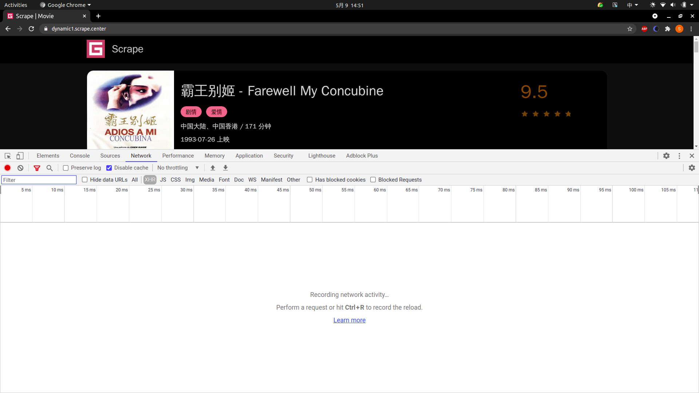

接着，重新刷新页面，然后点击第 2 页、第 3 页、第 4 页的按钮，这时候可以看到页面上的数据发生了变化，同时在开发者工具下方会监听到几个 Ajax 请求，如图所示。

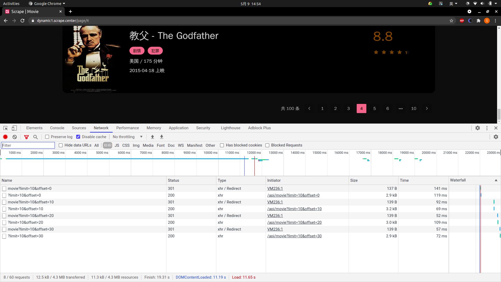

由于我们切换了 4 页，所以这里正好也出现了 4 个 Ajax 请求，我们可以任选一个点击查看其请求详情，观察其请求的 URL、参数以及响应内容是怎样的，如图所示。

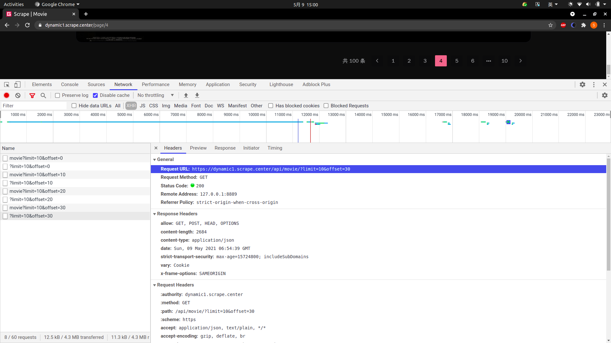

点开第 4 个结果，观察到其 Ajax 接口请求的 URL 地址为：

[https://dynamic1.scrape.center/api/movie?limit=10&offset=30](https://dynamic1.scrape.center/api/movie?limit=10&offset=30)

这里有两个参数，一个是 limit，其值为 10，一个是 offset，它的值也是 10。

通过观察多个 Ajax 接口的参数，可以发现这么一个规律：limit 的值一直为 10，这就正好对应着每页 10 条数据；offset 的值在依次变大，页面每加 1 页，offset 就加 10，这就代表着页面的数据偏移量，比如第 2 页的
offset 值为 10 代表跳过 10 条数据，返回从第 11 条数据开始的结果，再加上 limit 的限制，就代表返回第 11~20 条数据的结果。

接着我们再观察下响应的数据，切换到 Preview 选项卡，结果如图所示。

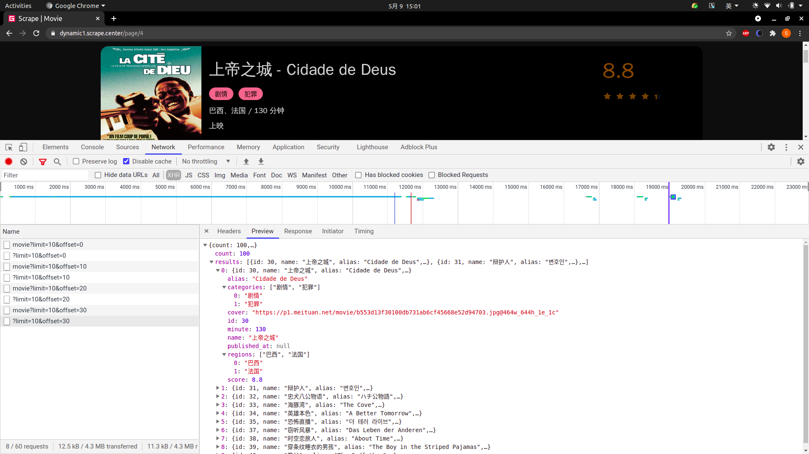

可以看到结果是一些 JSON 数据，它有一个 results 字段，这是一个列表，列表的每一个元素都是一个字典。观察一下字典的内容，发现我们可以看到对应的电影数据的字段了，如
name、alias、cover、categories，对比下浏览器中的真实数据，各个内容是完全一致的，而且这个数据已经非常结构化了，完全就是我们想要爬取的数据，真是得来全不费工夫。

这样的话，我们只需要把所有页面的 Ajax 接口构造出来，那么所有的列表页数据我们都可以轻松获取到了。

我们先定义一些准备工作，导入一些所需的库并定义一些配置，[代码](../../codes/Module_3/lecture_13/lecture_13_2.py)如下：

```python
# -*- coding: utf-8 -*-

import random
import time
import json
import requests
import logging

headers = {
    'Accept-Encoding': 'gzip, deflate, sdch',
    'Accept-Language': 'en-US,en;q=0.8',
    'User-Agent': 'Mozilla/5.0 (X11; Linux x86_64) AppleWebKit/537.36 (KHTML, like Gecko) Chrome/90.0.4430.72 Safari/537.36',
    'Accept': 'text/html,application/xhtml+xml,application/xml;q=0.9,image/webp,*/*;q=0.8',
    'Connection': 'keep-alive',
}
logging.basicConfig(level=logging.INFO, format='%(asctime)s - %(levelname)s: %(message)s')
INDEX_URL = 'https://dynamic1.scrape.center/api/movie/?limit={limit}&offset={offset}'
```

这里我们引入了 requests 和 logging 库，并定义了 logging 的基本配置，接着我们定义 INDEX_URL，这里把 limit 和 offset 预留出来变成占位符，可以动态传入参数构造成一个完整的列表页 URL。

下面我们来实现一下列表页的爬取，还是和原来一样，我们先定义一个通用的爬取方法，代码如下：

```python
def scrape_api(url: str):
    """
    :param url: 
    :return: 
    """
    logging.info('scraping %s...', url)
    try:
        response = requests.get(url, headers)
        if response.status_code == 200:
            return response.json()
        logging.error('get invalid status code %s while scraping %s', response.status_code, url)
    except requests.RequestException:
        logging.error('error occurred while scraping %s', url, exc_info=True)
```

这里我们定义一个 ```scrape_api``` 方法，和之前不同的是，这个方法专门用来处理 JSON 接口，最后的 response 调用的是 json 方法，它可以解析响应的内容并将其转化成 JSON 字符串。

在这个基础之上，我们定义一个爬取列表页的方法，代码如下：

```python
LIMIT = 10


def scrape_index(page: int):
    """
    :param page: 
    :return: 
    """
    url = INDEX_URL.format(limit=LIMIT, offset=LIMIT * (page - 1))
    return scrape_api(url)
```

这里我们定义了一个 ```scrape_index``` 方法，用来接收参数 page，page 代表列表页的页码。

这里我们先构造了一个 URL，通过字符串的 ```format``` 方法，传入 limit 和 offset 的值。这里的 limit 直接使用了全局变量 LIMIT 的值，offset 则是动态计算的，计算方法是页码数减 1 再乘以
limit，比如第 1 页的 offset 值就是 0，第 2 页的 offset 值就是 10，以此类推。构造好 URL 之后，直接调用 ```scrape_api``` 方法并返回结果即可。

这样就完成了列表页的爬取，每次请求都会得到一页 10 部的电影数据。

由于这时爬取到的数据已经是 JSON 类型了，所以我们不用像之前一样去解析 HTML 代码来提取数据，爬到的数据就是我们想要的结构化数据。

到此为止，我们就能成功爬取列表页并提取出电影列表信息了。

---

## 爬取详情页

这时候我们已经可以拿到每一页的电影数据了，但是实际上这些数据还缺少一些我们想要的信息，如剧情简介等，所以我们需要进一步进入到详情页来获取这些内容。

这时候我们点击任意一部电影，如《教父》，进入到其详情页面，这时候可以发现页面的 URL 已经变成了

[https://dynamic1.scrape.center/detail/40](https://dynamic1.scrape.center/detail/40)

页面也成功展示了详情页的信息，如图所示。

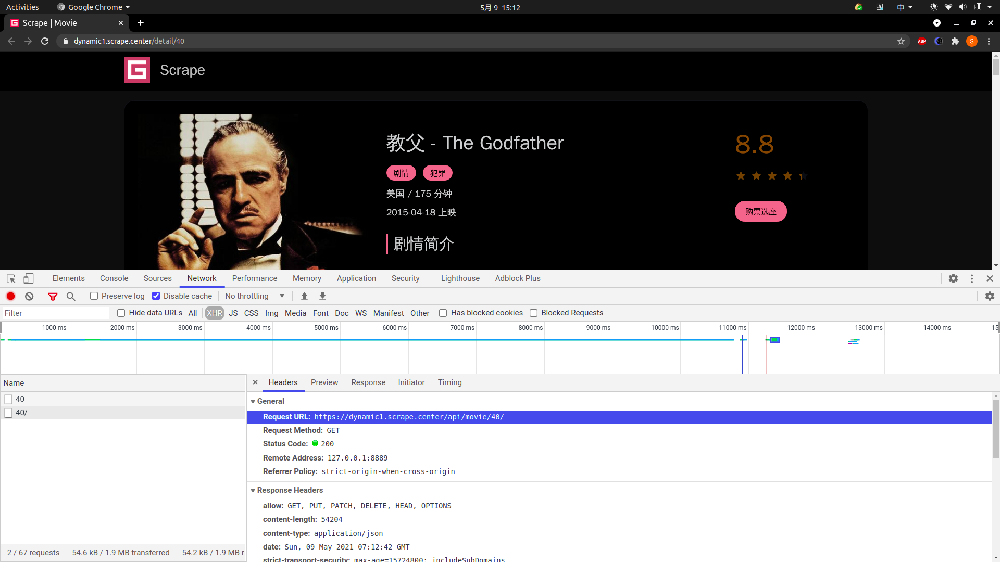

另外我们也可以观察到在开发者工具中又出现了一个 Ajax 请求，其 URL 为

[https://dynamic1.scrape.center/api/movie/40/](https://dynamic1.scrape.center/api/movie/40/)

通过 Preview 选项卡也能看到 Ajax 请求对应响应的信息，如图所示。

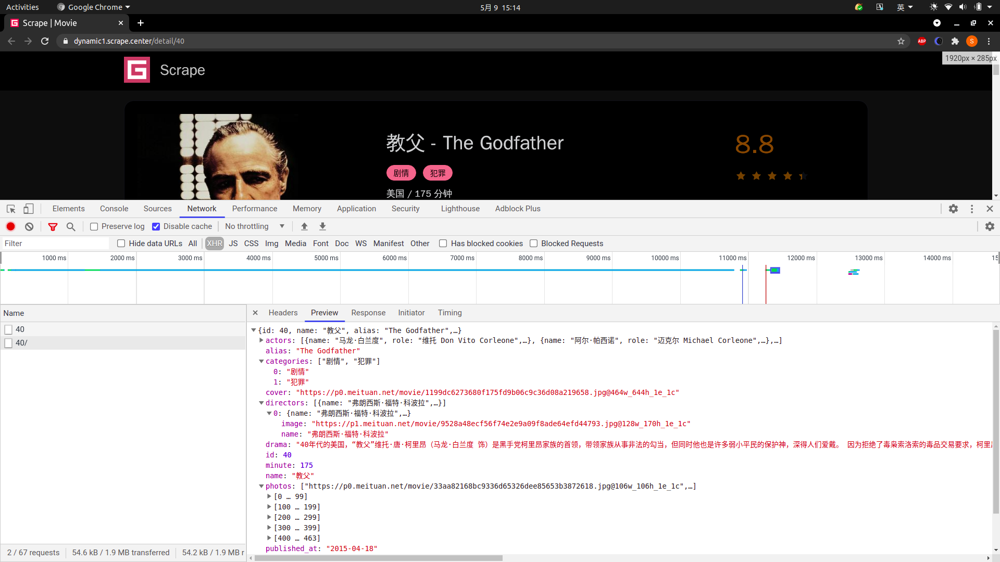

稍加观察我们就可以发现，Ajax 请求的 URL 后面有一个参数是可变的，这个参数就是电影的 id，这里是 40，对应《教父》这部电影。

如果想要获取 id 为 50 的电影，只需要把 URL 最后的参数改成 50
即可，即 [https://dynamic1.scrape.center/api/movie/50/](https://dynamic1.scrape.center/api/movie/50/) ，请求这个新的 URL 我们就能获取 id
为 50 的电影所对应的数据了。

同样的，它响应的结果也是结构化的 JSON 数据，字段也非常规整，直接爬取即可。

分析了详情页的数据提取逻辑，那么怎么把它和列表页关联起来呢？这个 id 又是从哪里来呢？回过头来再看看列表页的接口返回数据，如图所示。

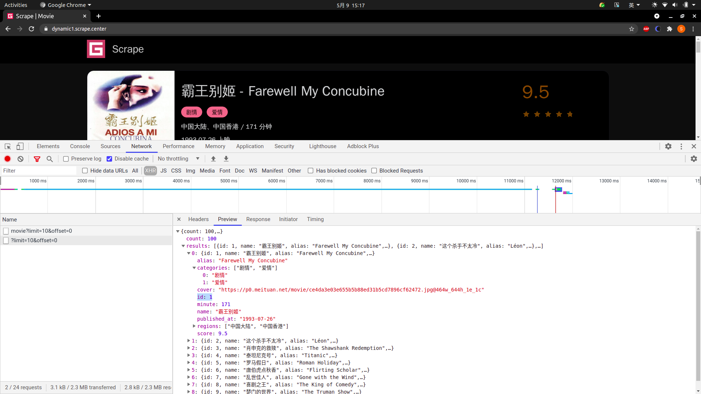

可以看到列表页原本的返回数据就带了 id 这个字段，所以我们只需要拿列表页结果中的 id 来构造详情页中 Ajax 请求的 URL 就好了。

那么接下来，我们就先定义一个详情页的爬取逻辑吧，代码如下：

```python
DETAIL_URL = 'https://dynamic1.scrape.center/api/movie/{id}'


def scrape_detail(id: str):
    """
    :param id: 
    :return: 
    """
    url = DETAIL_URL.format(id=id)
    return scrape_api(url)
```

这里我们定义了一个 ```scrape_detail``` 方法，它接收参数 id。这里的实现也非常简单，先根据定义好的 DETAIL_URL 加上 id，构造一个真实的详情页 Ajax 请求的
URL，然后直接调用 ```scrape_api``` 方法传入这个 URL 即可。

接着，我们定义一个总的调用方法，将以上的方法串联调用起来，代码如下：

```python
TOTAL_PAGE = 10


def main():
    """
    :return:
    """
    for page in range(1, TOTAL_PAGE + 1):
        time.sleep(random.randint(3, 5))
        index_data = scrape_index(page)
        for item in index_data.get('results'):
            time.sleep(random.randint(6, 10) / 10)
            id = item.get('id')
            detail_data = scrape_detail(id)
            logging.info('detail data %s', detail_data)


if __name__ == '__main__':
    """"""
    main()
```

这里我们定义了一个 ```main``` 方法，首先遍历获取页码 page，然后把 page 当成参数传递给 scrape_index 方法，得到列表页的数据。接着我们遍历所有列表页的结果，获取每部电影的 id，然后把 id
当作参数传递给 ```scrape_detail``` 方法，来爬取每部电影的详情数据，赋值为 detail_data，输出即可。

运行结果如下：

```textmate
2021-05-09 15:28:49,432 - INFO: scraping https://dynamic1.scrape.center/api/movie/?limit=10&offset=0...
2021-05-09 15:28:50,608 - INFO: scraping https://dynamic1.scrape.center/api/movie/1...
...
```

由于内容较多，这里省略了部分内容。

可以看到，其实整个爬取工作到这里就已经完成了，这里会先顺次爬取每一页列表页的 Ajax 接口，然后再顺次爬取每部电影详情页的 Ajax 接口，最后打印出每部电影的 Ajax 接口响应数据，而且都是 JSON
格式。这样，所有电影的详情数据都会被我们爬取到了。

---

## 保存数据

最后，将数据保存为 JSON 文本。

定义一个数据保存的方法，代码如下：

```python
def save_data(data):
    """

    :param data:
    :return:
    """
    name = data.get('name')
    data_path = str(name) + ".json"
    json.dump(data, open(data_path, 'w', encoding='utf-8'), ensure_ascii=False, indent=2)
```

定义了保存数据的方法 ```save_data```，首先获取数据的 name 字段，即电影的名称，把电影名称作为 JSON 文件的名称，接着构造 JSON 文件的路径，然后用 ```json``` 的 ```dump```
方法将数据保存成文本格式。

dump 的方法设置了两个参数，一个是 ensure_ascii，我们将其设置为 False，它可以保证中文字符在文件中能以正常的中文文本呈现，而不是 unicode 字符；另一个是 indent，它的数值为
2，这代表生成的 JSON 数据结果有两个空格缩进，让它的格式显得更加美观。

最后，```main``` 方法再调用下 ```save_data``` 方法即可，实现如下：

```python
def main():
    """
    :return:
    """
    for page in range(1, TOTAL_PAGE + 1):
        time.sleep(random.randint(3, 5))
        index_data = scrape_index(page)
        for item in index_data.get('results'):
            time.sleep(random.randint(6, 10) / 10)
            id = item.get('id')
            detail_data = scrape_detail(id)
            logging.info('detail data %s', detail_data)
            save_data(detail_data)


if __name__ == '__main__':
    """"""
    main()
```

重新运行一下，文件夹下出现了各个电影的 JSON 文件，如图所示。

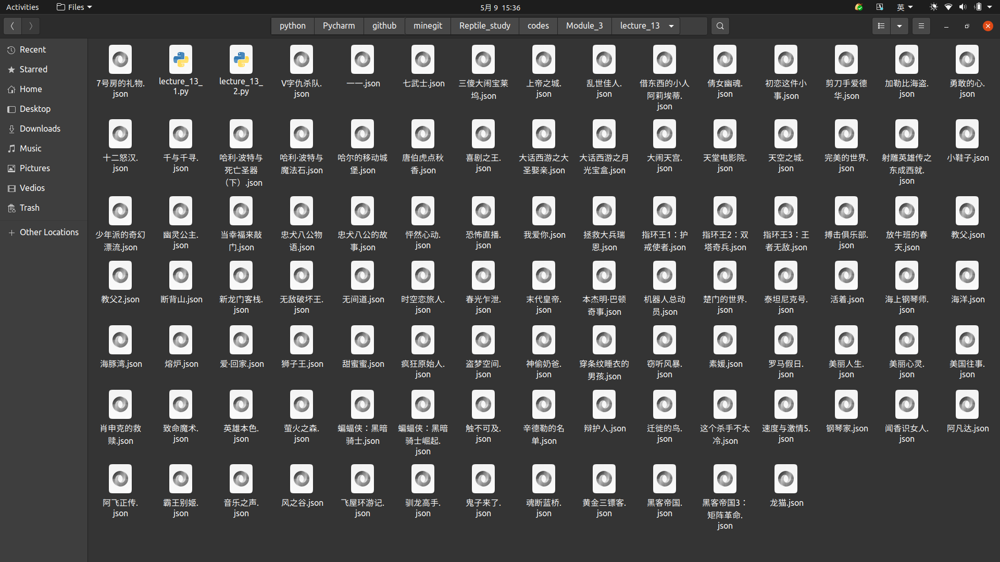

这样就已经把所有的电影数据保存下来了，打开其中一个 JSON 文件，看看保存格式，如图所示。

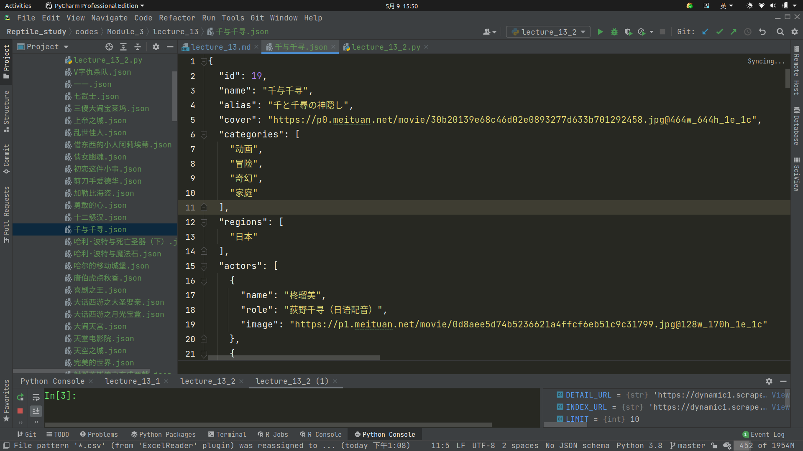

可以看到 JSON 文件里面的数据都是经过格式化的中文文本数据，结构清晰，一目了然。

至此，我们就完成了全站电影数据的爬取并把每部电影的数据保存成了 JSON 文件。

---

## 总结

本课时我们通过一个案例来体会了 Ajax 分析和爬取的基本流程，希望你能够对 Ajax 的分析和爬取的实现更加熟悉。

另外我们也可以观察到，由于 Ajax 接口大部分返回的是 JSON 数据，所以在一定程度上可以避免一些数据提取的工作，减轻我们的工作量。

---
---
