# Selenium 基本使用

上个课时讲解了 Ajax 的分析方法，利用 Ajax 接口我们可以非常方便地完成数据的爬取。只要我们能找到 Ajax 接口的规律，就可以通过某些参数构造出对应的的请求，数据自然就能被轻松爬取到。

但是，在很多情况下，Ajax 请求的接口通常会包含加密的参数，如 token、sign 等，如：

[https://dynamic2.scrape.center/](https://dynamic2.scrape.center/)

它的 Ajax 接口是包含一个 token 参数的，如图所示。

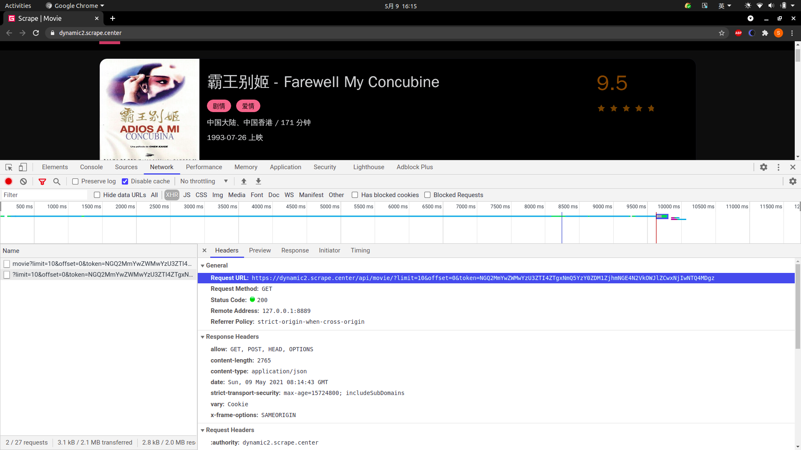

由于接口的请求加上了 token 参数，如果不深入分析并找到 token 的构造逻辑，是难以直接模拟这些 Ajax 请求的。

此时解决方法通常有两种，一种是深挖其中的逻辑，把其中 token 的构造逻辑完全找出来，再用 Python 复现，构造 Ajax
请求；另外一种方法就是直接通过模拟浏览器的方式，绕过这个过程。因为在浏览器里面我们是可以看到这个数据的，如果能直接把看到的数据爬取下来，当然也就能获取对应的信息了。

由于第 1 种方法难度较高，在这里我们就先介绍第 2 种方法，模拟浏览器爬取。

这里使用的工具为 Selenium，我们先来了解一下 Selenium 的基本使用方法。

Selenium 是一个自动化测试工具，利用它可以驱动浏览器执行特定的动作，如点击、下拉等操作，同时还可以获取浏览器当前呈现的页面源代码，做到可见即可爬。对于一些使用 JavaScript 动态渲染的页面来说，此种抓取方式非常有效。

---
---

## 准备工作

本课时以 Chrome 为例来讲解 Selenium 的用法。在开始之前，请确保已经正确安装好了 Chrome 浏览器并配置好了 ChromeDriver。另外，还需要正确安装好 Python 的 Selenium 库。

Ubuntu 20
安装可以参考：[https://blog.csdn.net/xlkjf/article/details/105861965    ](https://blog.csdn.net/xlkjf/article/details/105861965)

---

## 基本使用

准备工作做好之后，首先来看一下 Selenium 有一些怎样的功能。[代码](../../codes/Module_3/lecture_14/lecture_14_1.py)如下：

```python
# -*- coding: utf-8 -*-

import time
from selenium import webdriver
from selenium.webdriver.common.by import By
from selenium.webdriver.common.keys import Keys
from selenium.webdriver.support import expected_conditions as EC
from selenium.webdriver.support.wait import WebDriverWait

url = "https://www.baidu.com"
browser = webdriver.Chrome()
try:
    browser.get(url)
    input = browser.find_element_by_id('kw')
    input.send_keys('Python')
    input.send_keys(Keys.ENTER)
    wait = WebDriverWait(browser, 10)
    wait.until(EC.presence_of_element_located((By.ID, 'content_left')))
    time.sleep(5)
    print(browser.current_url)
    print(browser.get_cookies())
    print(browser.page_source)
finally:
    browser.close()
```

运行代码后会自动弹出一个 Chrome 浏览器，浏览器会跳转到百度，然后在搜索框中输入 Python，接着跳转到搜索结果页，如图所示。

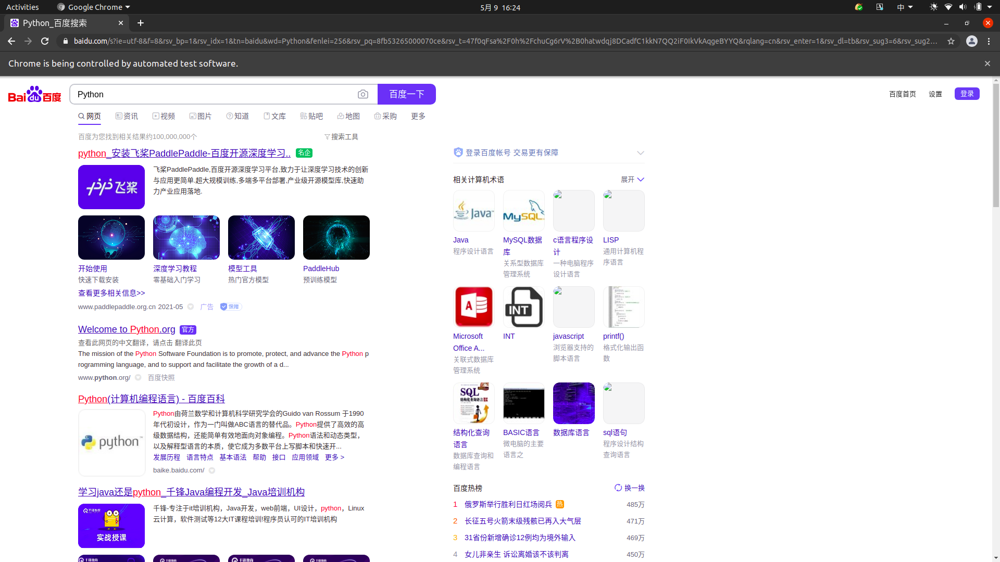

此时在控制台的输出结果如下：

```html
https://www.baidu.com/s?ie=utf-8&f=8&rsv_bp=1&rsv_idx=1&tn=baidu&wd=Python&fenlei=256&rsv_pq=e11f185100004b3b&rsv_t=c556HSyziHG4Ew7%2FUPeFOuAEhwJjHXDl%2FBugcA3DozDi6MhYeuKOm7UhoWU&rqlang=cn&rsv_enter=1&rsv_dl=tb&rsv_sug3=6&rsv_sug2=0&rsv_btype=i&inputT=91&rsv_sug4=91
[{'domain': 'www.baidu.com', 'expiry': 1652085115, 'httpOnly': False, 'name': 'COOKIE_SESSION', 'path': '/', 'secure': False, 'value': '0_0_1_0_0_1_0_0_0_1_1_0_0_0_0_0_0_0_1620549114%7C1%230_0_1620549114%7C1'}, {'domain': 'www.baidu.com', 'httpOnly': False, 'name': 'BDSVRTM', 'path': '/', 'secure': False, 'value': '150'}, {'domain': '.baidu.com', 'expiry': 1620552714, 'httpOnly': False, 'name': 'BA_HECTOR', 'path': '/', 'secure': False, 'value': 'ap05048h8kak0h41s21g9f7fr0q'}, {'domain': '.baidu.com', 'httpOnly': False, 'name': 'H_PS_PSSID', 'path': '/', 'secure': False, 'value': '33798_33966_31254_33848_33760_33607_26350_33894'},
//...
<html>
<head>
    <script charset="utf-8" async=""
            src="https://dss0.bdstatic.com/-0U0bnSm1A5BphGlnYG/tam-ogel/11cd9d09-6515-430d-a19a-29306a4ba761.js"></script>
    <meta http-equiv="Content-Type" content="text/html;charset=utf-8">
    <meta http-equiv="X-UA-Compatible" content="IE=edge,chrome=1">
    <meta content="always" name="referrer">
    <meta name="theme-color" content="#2932e1">
    <meta name="description" content="全球最大的中文搜索引擎、致力于让网民更便捷地获取信息，找到所求。百度超过千亿的中文网页数据库，可以瞬间找到相关的搜索结果。">
    <title>Python_百度搜索</title>
    //...
    <div class="foot-async-script">
        <script defer="" src="//hectorstatic.baidu.com/cd37ed75a9387c5b.js"></script>
    </div>
    </body>
</html>
```

源代码过长，在此省略。可以看到，当前得到的 URL、Cookies 和源代码都是浏览器中的真实内容。

所以说，如果用 Selenium 来驱动浏览器加载网页的话，就可以直接拿到 JavaScript 渲染的结果了，不用担心使用的是什么加密系统。

下面来详细了解一下 Selenium 的用法。

---

## 声明浏览器对象

Selenium 支持非常多的浏览器，如 Chrome、Firefox、Edge 等，还有 Android、BlackBerry 等手机端的浏览器。

此外，我们可以用如下方式进行初始化，[代码](../../codes/Module_3/lecture_14/lecture_14_2.py)如下：

```python
# -*- coding: utf-8 -*-

from selenium import webdriver

browserChrome = webdriver.Chrome()
browserFirefox = webdriver.Firefox()
browserEdge = webdriver.Edge()
browserSafari = webdriver.Safari()
```

这样就完成了浏览器对象的初始化并将其赋值为 browser 对象。接下来，我们要做的就是调用 browser 对象，让其执行各个动作以模拟浏览器操作。

当然这里需要按照浏览器对应的驱动 webdriver。

---

## 访问页面

我们可以用 ```get``` 方法来请求网页，只需要把参数传入链接 URL 即可。比如，这里用 ```get```
方法访问淘宝，然后打印出源代码，[代码](../../codes/Module_3/lecture_14/lecture_14_3.py)如下：

```python
# -*- coding: utf-8 -*-

from selenium import webdriver

browser = webdriver.Chrome()
browser.get('https://www.taobao.com/')
print(browser.page_source)
browser.close()
```

运行后会弹出 Chrome 浏览器并且自动访问淘宝，然后控制台会输出淘宝页面的源代码，随后浏览器关闭。

通过这几行简单的代码，我们就可以驱动浏览器并获取网页源码，非常便捷。

---

## 查找节点

Selenium 可以驱动浏览器完成各种操作，比如填充表单、模拟点击等。举个例子，当我们想要完成向某个输入框输入文字的操作时，首先需要知道这个输入框在哪，而 Selenium
提供了一系列查找节点的方法，我们可以用这些方法来获取想要的节点，以便执行下一步动作或者提取信息。

---

### 单个节点

当我们想要从淘宝页面中提取搜索框这个节点，首先要观察它的源代码，如图所示。

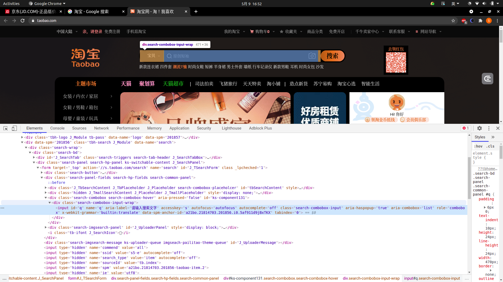

可以发现，它的 id 是 q，name 也是 q，此外还有许多其他属性。此时我们就可以用多种方式获取它了。

比如，find_element_by_name 代表根据 name 值获取，find_element_by_id 则是根据 id 获取，另外，还有根据 XPath、CSS 选择器等获取的方式。

用[代码](../../codes/Module_3/lecture_14/lecture_14_4.py)实现一下：

```python
# -*- coding: utf-8 -*-

from selenium import webdriver

browser = webdriver.Chrome()
browser.get('https://www.taobao.com')
input_first = browser.find_element_by_id('q')
input_second = browser.find_element_by_css_selector('#q')
input_third = browser.find_element_by_xpath('//*[@id="q"]')
print(input_first, input_second, input_third)
browser.close()
```

这里我们使用 3 种方式获取输入框，分别是根据 id、CSS 选择器和 XPath 获取，它们返回的结果完全一致。运行结果如下：

```textmate
<selenium.webdriver.remote.webelement.WebElement (session="5e3ed6492cb6be3f537fbba7169b0c41", element="ba727588-e54e-4f20-a188-db9fbf1cfe0c")> 
<selenium.webdriver.remote.webelement.WebElement (session="5e3ed6492cb6be3f537fbba7169b0c41", element="ba727588-e54e-4f20-a188-db9fbf1cfe0c")> 
<selenium.webdriver.remote.webelement.WebElement (session="5e3ed6492cb6be3f537fbba7169b0c41", element="ba727588-e54e-4f20-a188-db9fbf1cfe0c")>

```

可以看到，这 3 个节点的类型是一致的，都是 WebElement。

这里列出所有获取单个节点的方法：

```python
find_element_by_id
find_element_by_name
find_element_by_xpath
find_element_by_link_text
find_element_by_partial_link_text
find_element_by_tag_name
find_element_by_class_name
find_element_by_css_selector
```

另外，Selenium 还提供了 ```find_element``` 这个通用方法，它需要传入两个参数：查找方式 By 和值。实际上，find_element 就是 ```find_element_by_id```
这种方法的通用函数版本，比如 ```find_element_by_id(id)``` 就等价于 ```find_element(By.ID, id)```，二者得到的结果完全一致。

我们用[代码](../../codes/Module_3/lecture_14/lecture_14_5.py)实现一下：

```python
# -*- coding: utf-8 -*-

from selenium import webdriver
from selenium.webdriver.common.by import By

browser = webdriver.Chrome()
browser.get('https://www.taobao.com')
input_first = browser.find_element(By.ID, 'q')
print(input_first)
browser.close()
```

结果为:

```textmate
<selenium.webdriver.remote.webelement.WebElement (session="33b3c7079bd4afb300e03dd934a957ab", element="2edb5d06-e193-4f58-9547-ce6e48da7cfa")>
```

这种查找方式的功能和上面列举的查找函数完全一致，不过参数更加灵活。

---

### 多个节点

如果在网页中只查找一个目标，那么完全可以用 ```find_element``` 方法。但如果有多个节点需要查找，再用 ```find_element``` 方法，就只能得到第 1
个节点了。如果要查找所有满足条件的节点，需要用 ```find_elements```
这样的方法。注意，在这个方法的名称中，element 多了一个 s，注意区分。

举个例子，假如你要查找淘宝左侧导航条的所有条目，就可以这样来实现，[代码](../../codes/Module_3/lecture_14/lecture_14_6.py)如下：

```python
# -*- coding: utf-8 -*-

from selenium import webdriver

browser = webdriver.Chrome()
browser.get('https://www.taobao.com')
lis = browser.find_elements_by_css_selector('.service-bd li')
print(lis)
browser.close()
```

运行结果如下：

```textmate
[
    <selenium.webdriver.remote.webelement.WebElement (session="6e665aac0e27f53aa67145b81615c4cd", element="ecd55185-e205-4494-ad55-9bb6200f7926")>, 
    <selenium.webdriver.remote.webelement.WebElement (session="6e665aac0e27f53aa67145b81615c4cd", element="96bfdd43-fd80-4f88-8ee7-c50a118f098f")>, 
    <selenium.webdriver.remote.webelement.WebElement (session="6e665aac0e27f53aa67145b81615c4cd", element="ed1c704c-54e0-4b0f-9661-afa0007c651d")>, 
    <selenium.webdriver.remote.webelement.WebElement (session="6e665aac0e27f53aa67145b81615c4cd", element="3d64af24-70ec-46a3-a7fc-079e4d3f606d")>, 
    <selenium.webdriver.remote.webelement.WebElement (session="6e665aac0e27f53aa67145b81615c4cd", element="9359ae27-d070-45da-80ea-a5101671aa93")>, 
    <selenium.webdriver.remote.webelement.WebElement (session="6e665aac0e27f53aa67145b81615c4cd", element="8092ebf4-21f5-4069-89ff-074537009c09")>, 
    <selenium.webdriver.remote.webelement.WebElement (session="6e665aac0e27f53aa67145b81615c4cd", element="0476b1f8-fae7-4e03-8805-0b452fbdb146")>, 
    <selenium.webdriver.remote.webelement.WebElement (session="6e665aac0e27f53aa67145b81615c4cd", element="a7a455ac-c3be-468a-b6d4-d21b4ad196ef")>, 
    <selenium.webdriver.remote.webelement.WebElement (session="6e665aac0e27f53aa67145b81615c4cd", element="73f63b36-bd34-48f7-a673-4b9b57c4d6e3")>, 
    <selenium.webdriver.remote.webelement.WebElement (session="6e665aac0e27f53aa67145b81615c4cd", element="93d4a434-3669-44fa-97c2-84509ea3ec41")>, 
    <selenium.webdriver.remote.webelement.WebElement (session="6e665aac0e27f53aa67145b81615c4cd", element="9bf4d504-207c-4e2f-bc18-1e84fd1562bc")>, 
    <selenium.webdriver.remote.webelement.WebElement (session="6e665aac0e27f53aa67145b81615c4cd", element="f919553c-bf5d-44ee-82fe-52b2c5eb91fe")>, 
    <selenium.webdriver.remote.webelement.WebElement (session="6e665aac0e27f53aa67145b81615c4cd", element="e4399cba-9ea5-46ce-95fb-29d23a5d4f2a")>, 
    <selenium.webdriver.remote.webelement.WebElement (session="6e665aac0e27f53aa67145b81615c4cd", element="132b65f5-c13f-4388-bc9d-740fab158bb6")>, 
    <selenium.webdriver.remote.webelement.WebElement (session="6e665aac0e27f53aa67145b81615c4cd", element="5acc4275-3724-4222-92e6-8de4564ea5a6")>
]
```

可以看到，得到的内容变成了列表类型，列表中的每个节点都是 WebElement 类型。

也就是说，如果用 find_element 方法，只能获取匹配的第一个节点，结果是 WebElement 类型。如果用 find_elements 方法，则结果是列表类型，列表中的每个节点是 WebElement 类型。

这里列出所有获取多个节点的方法：

```python
find_elements_by_id
find_elements_by_name
find_elements_by_xpath
find_elements_by_link_text
find_elements_by_partial_link_text
find_elements_by_tag_name
find_elements_by_class_name
find_elements_by_css_selector
```

当然，我们也可以直接用 find_elements 方法来选择，这时可以这样写：

```python
lis = browser.find_elements(By.CSS_SELECTOR, '.service-bd li')
```

结果是完全一致的。

---

## 节点交互

Selenium 可以驱动浏览器来执行一些操作，或者说可以让浏览器模拟执行一些动作。比较常见的用法有：输入文字时用 send_keys 方法，清空文字时用 clear 方法，点击按钮时用 click 方法。

[示例](../../codes/Module_3/lecture_14/lecture_14_7.py)如下：

```python
# -*- coding: utf-8 -*-

import time
from selenium import webdriver

browser = webdriver.Chrome()
browser.get('https://www.taobao.com')
input = browser.find_element_by_id('q')
input.send_keys('iPhone')
time.sleep(1)
input.clear()
input.send_keys('iPad')
button = browser.find_element_by_class_name('btn-search')
button.click()
browser.close()
```

这里首先驱动浏览器打开淘宝，用 ```find_element_by_id``` 方法获取输入框，然后用 ```send_keys``` 方法输入 iPhone 文字，等待一秒后用 ```clear```
方法清空输入框，接着再次调用 ```send_keys``` 方法输入 iPad 文字，之后再用 ```find_element_by_class_name``` 方法获取搜索按钮，最后调用 ```click``` 方法完成搜索动作。

通过上面的方法，我们就完成了一些常见节点的动作操作，更多的操作可以参见官方文档的交互动作介绍:

[https://selenium-python.readthedocs.io/api.html#module-selenium.webdriver.remote.webelement%E3%80%82](https://selenium-python.readthedocs.io/api.html#module-selenium.webdriver.remote.webelement%E3%80%82)

---

## 动作链

在上面的实例中，一些交互动作都是针对某个节点执行的。比如，对于输入框，我们调用它的输入文字和清空文字方法；对于按钮，我们调用它的点击方法。其实，还有另外一些操作，它们没有特定的执行对象，比如鼠标拖拽、键盘按键等，这些动作用另一种方式来执行，那就是动作链。

比如，现在要实现一个节点的拖拽操作，将某个节点从一处拖拽到另外一处，可以这样实现，[代码](../../codes/Module_3/lecture_14/lecture_14_8.py)如下：

```python
# -*- coding: utf-8 -*-

import time
from selenium import webdriver
from selenium.webdriver import ActionChains

browser = webdriver.Chrome()
url = 'http://www.runoob.com/try/try.php?filename=jqueryui-api-droppable'
browser.get(url)
browser.switch_to.frame('iframeResult')
source = browser.find_element_by_css_selector('#draggable')
target = browser.find_element_by_css_selector('#droppable')
actions = ActionChains(browser)
actions.drag_and_drop(source, target)
actions.perform()
time.sleep(4)
browser.close()
```

首先，打开网页中的一个拖拽实例，依次选中要拖拽的节点和拖拽到的目标节点，接着声明 ActionChains 对象并将其赋值为 actions 变量，然后通过调用 actions 变量的 ```drag_and_drop```
方法，再调用 ```perform``` 方法执行动作，此时就完成了拖拽操作，如图所示：

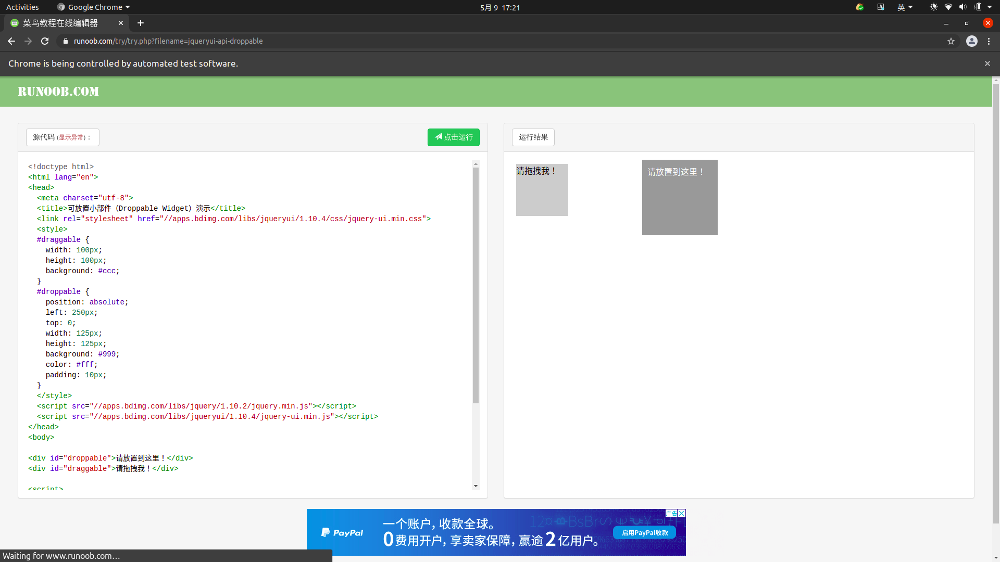

拖拽前页面

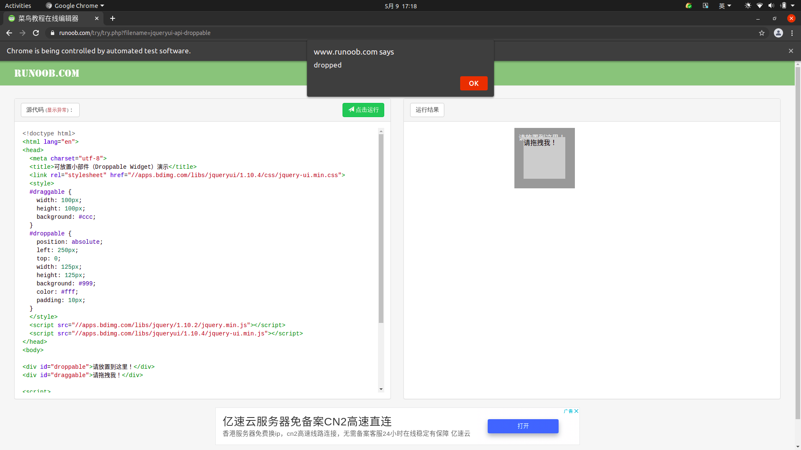

拖拽后页面

以上两图分别为在拖拽前和拖拽后的结果。

更多的动作链操作可以参考官方文档的动作链介绍：

[https://selenium-python.readthedocs.io/api.html#module-selenium.webdriver.common.action_chains%E3%80%82](https://selenium-python.readthedocs.io/api.html#module-selenium.webdriver.common.action_chains%E3%80%82)

---

## 执行 JavaScript

Selenium API 并没有提供实现某些操作的方法，比如，下拉进度条。但它可以直接模拟运行 JavaScript，此时使用 ```execute_script```
方法即可实现，[代码](../../codes/Module_3/lecture_14/lecture_14_9.py)如下：

```python
# -*- coding: utf-8 -*-

from selenium import webdriver

browser = webdriver.Chrome()
browser.get('https://www.zhihu.com/explore')
browser.execute_script('window.scrollTo(0, document.body.scrollHeight)')
browser.execute_script('alert("To Bottom")')
browser.close()
```

这里利用 execute_script 方法将进度条下拉到最底部，然后弹出 alert 提示框。

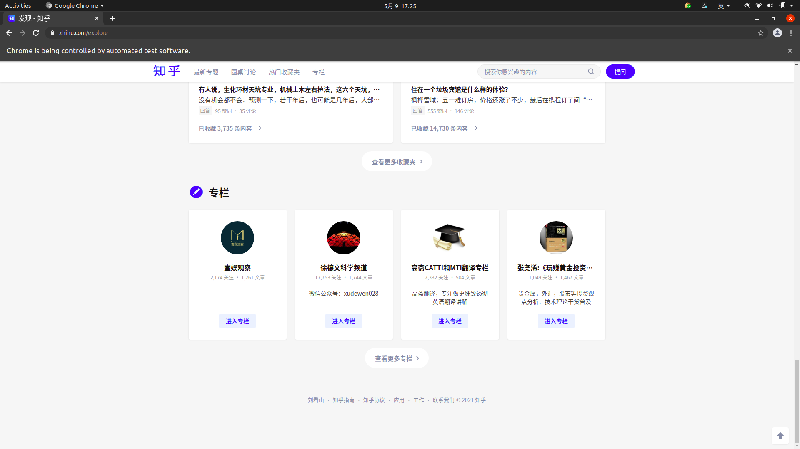

有了这个方法，基本上 API 没有提供的所有功能都可以用执行 JavaScript 的方式来实现了。

---

## 获取节点信息

前面说过，通过 ```page_source``` 属性可以获取网页的源代码，接着就可以使用解析库(如正则表达式、Beautiful Soup、pyquery等)来提取信息了。

不过，既然 Selenium 已经提供了选择节点的方法，并且返回的是 WebElement 类型，那么它也有相关的方法和属性来直接提取节点信息，如属性、文本等。这样的话，我们就可以不用通过解析源代码来提取信息了，非常方便。

---

### 获取属性

我们可以使用 ```get_attribute``` 方法来获取节点的属性，但是前提是得先选中这个节点，[示例](../../codes/Module_3/lecture_14/lecture_14_10.py)如下：

```python
# -*- coding: utf-8 -*-

from selenium import webdriver

browser = webdriver.Chrome()
url = 'https://dynamic2.scrape.center/'
browser.get(url)
logo = browser.find_element_by_class_name('logo-image')
print(logo)
print(logo.get_attribute('src'))
browser.close()
```

运行之后，程序便会驱动浏览器打开该页面，然后获取 class 为 logo-image 的节点，最后打印出它的 src 属性。

控制台的输出结果如下：

```textmate
<selenium.webdriver.remote.webelement.WebElement (session="c79d88c6236b7b6b13df72251c112623", element="06c5ab5b-8c4d-4d54-bcf2-3914d82c111b")>
https://dynamic2.scrape.center/img/logo.a508a8f0.png
```

通过 ```get_attribute``` 方法，我们只需要传入想要获取的属性名，就可以得到它的值了。

---

### 获取文本值

每个 WebElement 节点都有 text 属性，直接调用这个属性就可以得到节点内部的文本信息，这相当于 pyquery 的 text
方法，[示例](../../codes/Module_3/lecture_14/lecture_14_11.py)如下：

```python
# -*- coding: utf-8 -*-

from selenium import webdriver

browser = webdriver.Chrome()
url = 'https://dynamic2.scrape.center/'
browser.get(url)
input = browser.find_element_by_class_name('logo-title')
print(input.text)
browser.close()
```

这里依然先打开页面，然后获取 class 为 logo-title 这个节点，再将其文本值打印出来。

控制台的输出结果如下：

```textmate
Scrape
```

---

## 获取 ID、位置、标签名、大小

另外，WebElement 节点还有一些其他属性，比如 id 属性可以获取节点 id，location 属性可以获取该节点在页面中的相对位置，tag_name 属性可以获取标签名称，size
属性可以获取节点的大小，也就是宽高，这些属性有时候还是很有用的。[示例](../../codes/Module_3/lecture_14/lecture_14_12.py)如下：

```python
# -*- coding: utf-8 -*-

from selenium import webdriver

browser = webdriver.Chrome()
url = 'https://dynamic2.scrape.center/'
browser.get(url)
input = browser.find_element_by_class_name('logo-title')
print(input.id)
print(input.location)
print(input.tag_name)
print(input.size)
browser.close()
```

结果为：

```textmate
82ff3587-edd4-44f6-8695-40b01e4834c9
{'x': 170, 'y': 13}
span
{'height': 40, 'width': 70}
```

这里首先获得 class 为 logo-title 这个节点，然后调用其 id、location、tag_name、size 属性来获取对应的属性值。

---

## 切换 Frame

我们知道网页中有一种节点叫作 iframe，也就是子 Frame，相当于页面的子页面，它的结构和外部网页的结构完全一致。Selenium 打开页面后，默认是在父级 Frame 里面操作，而此时如果页面中还有子 Frame，Selenium
是不能获取到子 Frame 里面的节点的。这时就需要使用 switch_to.frame 方法来切换 Frame。[示例](../../codes/Module_3/lecture_14/lecture_14_13.py)如下：

```python
# -*- coding: utf-8 -*-

from selenium import webdriver
from selenium.common.exceptions import NoSuchElementException

browser = webdriver.Chrome()
url = 'http://www.runoob.com/try/try.php?filename=jqueryui-api-droppable'
browser.get(url)
browser.switch_to.frame('iframeResult')
try:
    logo = browser.find_element_by_class_name('logo')
except NoSuchElementException:
    print('NO LOGO')

browser.switch_to.parent_frame()
logo = browser.find_element_by_class_name('logo')
print(logo)
print(logo.text)
browser.close()
```

控制台输出：

```textmate
NO LOGO
<selenium.webdriver.remote.webelement.WebElement (session="a3371d7c0af95bfdb87408f5c3a59360", element="b249c47f-556e-4c5c-8b3b-c50aaa248160")>
RUNOOB.COM
```

这里还是以前面演示动作链操作的网页为例，首先通过 ```switch_to.frame``` 方法切换到子 Frame 里面，然后尝试获取子 Frame 里的 logo 节点（这是不能找到的），如果找不到的话，就会抛出
NoSuchElementException 异常，异常被捕捉之后，就会输出 NO LOGO。接下来，我们需要重新切换回父级 Frame，然后再次重新获取节点，发现此时可以成功获取了。

所以，当页面中包含子 Frame 时，如果想获取子 Frame 中的节点，需要先调用 ```switch_to.frame``` 方法切换到对应的 Frame，然后再进行操作。

---

## 延时等待

在 Selenium 中，```get``` 方法会在网页框架加载结束后结束执行，此时如果获取 page_source，可能并不是浏览器完全加载完成的页面，如果某些页面有额外的 Ajax
请求，我们在网页源代码中也不一定能成功获取到。所以，这里需要延时等待一定时间，确保节点已经加载出来。

这里等待的方式有两种：一种是隐式等待，一种是显式等待。

---

### 隐式等待

当使用隐式等待执行测试的时候，如果 Selenium 没有在 DOM 中找到节点，将继续等待，超出设定时间后，则抛出找不到节点的异常。换句话说，隐式等待可以在我们查找节点而节点并没有立即出现的时候，等待一段时间再查找 DOM，默认的时间是
0。

[示例](../../codes/Module_3/lecture_14/lecture_14_14.py)如下：

```python
# -*- coding: utf-8 -*-

from selenium import webdriver

browser = webdriver.Chrome()
browser.implicitly_wait(10)
browser.get('https://dynamic2.scrape.center/')
output = browser.find_element_by_class_name('logo-image')
print(output)
browser.close()
```

结果为

```textmate
<selenium.webdriver.remote.webelement.WebElement (session="a03ccd5dac80b7b3528562d326b5f1a4", element="d1c5577c-a8fd-46d2-8fd7-9db1c489e050")>
```

这里用 implicitly_wait 方法实现了隐式等待。

---

### 显式等待

隐式等待的效果其实并没有那么好，因为我们只规定了一个固定时间，而页面的加载时间会受到网络条件的影响。

这里还有一种更合适的显式等待方法，它指定要查找的节点，然后指定一个最长等待时间。如果在规定时间内加载出来了这个节点，就返回查找的节点；如果到了规定时间依然没有加载出该节点，则抛出超时异常。[示例](../../codes/Module_3/lecture_14/lecture_14_15.py)
如下：

```python
# -*- coding: utf-8 -*-

from selenium import webdriver
from selenium.webdriver.common.by import By
from selenium.webdriver.support.ui import WebDriverWait
from selenium.webdriver.support import expected_conditions as EC

browser = webdriver.Chrome()
browser.get('https://www.taobao.com/')
wait = WebDriverWait(browser, 10)
input = wait.until(EC.presence_of_element_located((By.ID, 'q')))
button = wait.until(EC.element_to_be_clickable((By.CSS_SELECTOR, '.btn-search')))
print(input, button)
browser.close()
```

这里首先引入 WebDriverWait 这个对象，指定最长等待时间，然后调用它的 until() 方法，传入要等待条件 ```expected_conditions```
。比如，这里传入了 ```presence_of_element_located```
这个条件，代表节点出现，其参数是节点的定位元组，也就是 ID 为 q 的节点搜索框。

这样做的效果就是，在 10 秒内如果 ID 为 q 的节点(即搜索框)成功加载出来，就返回该节点；如果超过 10 秒还没有加载出来，就抛出异常。

对于按钮，我们可以更改一下等待条件，比如改为 ```element_to_be_clickable```，也就是可点击，所以查找按钮时先查找 CSS 选择器为.btn-search 的按钮，如果 10
秒内它是可点击的，也就代表它成功加载出来了，就会返回这个按钮节点；如果超过 10 秒还不可点击，也就是没有加载出来，就抛出异常。

运行代码，它在网速较佳的情况下是可以成功加载出来的。

控制台的输出如下：

```textmate
<selenium.webdriver.remote.webelement.WebElement (session="e1c83f23b3da22376630594279086419", element="86c17298-7c00-4a5b-a79b-b9861c10ed71")> 
<selenium.webdriver.remote.webelement.WebElement (session="e1c83f23b3da22376630594279086419", element="5ece87bc-3b56-479e-9775-d18a61f32840")>
```

可以看到，控制台成功输出了两个节点，它们都是 WebElement 类型。

如果网络有问题，10 秒内没有成功加载，那就抛出 ```TimeoutException``` 异常，此时控制台的输出如下：

```text
TimeoutException Traceback (most recent call last) 
<ipython-input-4-f3d73973b223> in <module>()
      7 browser.get('https://www.taobao.com/')
      8 wait = WebDriverWait(browser, 10) 
----> 9 input = wait.until(EC.presence_of_element_located((By.ID, 'q')))
```

关于等待条件，其实还有很多，比如判断标题内容，判断某个节点内是否出现了某文字等。下表列出了所有的等待条件。

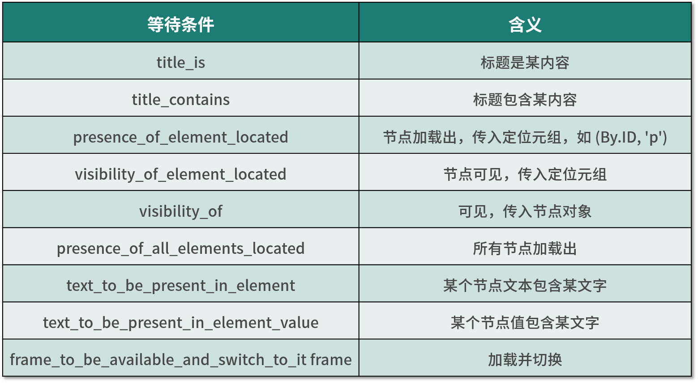

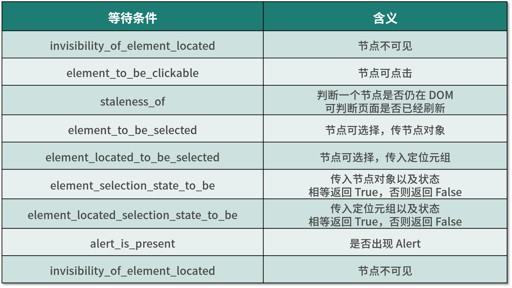

更多详细的等待条件的参数及用法介绍可以参考官方文档：

[https://selenium-python.readthedocs.io/api.html#module-selenium.webdriver.support.expected_conditions%E3%80%82](https://selenium-python.readthedocs.io/api.html#module-selenium.webdriver.support.expected_conditions%E3%80%82)

---

## 前进后退

平常使用的浏览器都有前进和后退功能，Selenium 也可以完成这个操作，它使用 ```back``` 方法后退，使用 ```forward```
方法前进。[示例](../../codes/Module_3/lecture_14/lecture_14_16.py)如下：

```python
# -*- coding: utf-8 -*-

import time
from selenium import webdriver

browser = webdriver.Chrome()
browser.get('https://www.baidu.com/')
browser.get('https://www.taobao.com/')
browser.get('https://www.python.org/')
browser.back()
time.sleep(5)
browser.forward()
browser.close()
```

这里我们连续访问 3 个页面，然后调用 ```back``` 方法回到第 2 个页面，接下来再调用 ```forward``` 方法又可以前进到第 3 个页面。

---

## Cookies

使用 Selenium，还可以方便地对 Cookies 进行操作，例如获取、添加、删除 Cookies 等。[示例](../../codes/Module_3/lecture_14/lecture_14_17.py)如下：

```python
# -*- coding: utf-8 -*-

from selenium import webdriver

browser = webdriver.Chrome()
browser.get('https://www.zhihu.com/explore')
print(browser.get_cookies())
browser.add_cookie({'name': 'name', 'domain': 'www.zhihu.com', 'value': 'germey'})
print(browser.get_cookies())
browser.delete_all_cookies()
print(browser.get_cookies())
browser.close()
```

首先，访问知乎，加载完成后，浏览器实际上已经生成 Cookies 了。 接着，调用 ```get_cookies``` 方法获取所有的 Cookies。 然后，我们再添加一个 Cookie，这里传入一个字典，有 name、domain 和
value 等内容。 接下来，再次获取所有的 Cookies，可以发现，结果会多出这一项新加的 Cookie。 最后，调用 ```delete_all_cookies``` 方法删除所有的 Cookies。再重新获取，发现结果就为空了。

控制台的输出如下：

```json5
[
  {
    'domain': 'www.zhihu.com',
    'httpOnly': False,
    'name': 'KLBRSID',
    'path': '/',
    'secure': False,
    'value': 'b5ffb4aa1a842930a6f64d0a8f93e9bf|1620571227|1620571225'
  },
  {
    'domain': '.zhihu.com',
    'expiry': 1652107227,
    'httpOnly': False,
    'name': 'Hm_lvt_98beee57fd2ef70ccdd5ca52b9740c49',
    'path': '/',
    'secure': False,
    'value': '1620571227'
  },
  {
    'domain': '.zhihu.com',
    'httpOnly': False,
    'name': 'Hm_lpvt_98beee57fd2ef70ccdd5ca52b9740c49',
    'path': '/',
    'secure': False,
    'value': '1620571227'
  },
  {
    'domain': '.zhihu.com',
    'expiry': 1715179225,
    'httpOnly': False,
    'name': 'd_c0',
    'path': '/',
    'secure': False,
    'value': '"ANDe-kp4FBOPTp-AVgjDqgC53wwLRELRmCk=|1620571225"'
  },
  {
    'domain': '.zhihu.com',
    'httpOnly': False,
    'name': '_xsrf',
    'path': '/',
    'secure': False,
    'value': 'bc250700-1c07-4489-b31d-1c6b09dedc32'
  },
  {
    'domain': '.zhihu.com',
    'expiry': 1683643225,
    'httpOnly': False,
    'name': '_zap',
    'path': '/',
    'secure': False,
    'value': 'acbac145-3fa0-4d6a-bc9e-caab9c8bf43a'
  }
]
[
  {
    'domain': '.www.zhihu.com',
    'httpOnly': False,
    'name': 'name',
    'path': '/',
    'secure': True,
    'value': 'germey'
  },
  {
    'domain': 'www.zhihu.com',
    'httpOnly': False,
    'name': 'KLBRSID',
    'path': '/',
    'secure': False,
    'value': 'b5ffb4aa1a842930a6f64d0a8f93e9bf|1620571227|1620571225'
  },
  {
    'domain': '.zhihu.com',
    'expiry': 1652107227,
    'httpOnly': False,
    'name': 'Hm_lvt_98beee57fd2ef70ccdd5ca52b9740c49',
    'path': '/',
    'secure': False,
    'value': '1620571227'
  },
  {
    'domain': '.zhihu.com',
    'httpOnly': False,
    'name': 'Hm_lpvt_98beee57fd2ef70ccdd5ca52b9740c49',
    'path': '/',
    'secure': False,
    'value': '1620571227'
  },
  {
    'domain': '.zhihu.com',
    'expiry': 1715179225,
    'httpOnly': False,
    'name': 'd_c0',
    'path': '/',
    'secure': False,
    'value': '"ANDe-kp4FBOPTp-AVgjDqgC53wwLRELRmCk=|1620571225"'
  },
  {
    'domain': '.zhihu.com',
    'httpOnly': False,
    'name': '_xsrf',
    'path': '/',
    'secure': False,
    'value': 'bc250700-1c07-4489-b31d-1c6b09dedc32'
  },
  {
    'domain': '.zhihu.com',
    'expiry': 1683643225,
    'httpOnly': False,
    'name': '_zap',
    'path': '/',
    'secure': False,
    'value': 'acbac145-3fa0-4d6a-bc9e-caab9c8bf43a'
  }
]
[]
```

通过以上方法来操作 Cookies 还是非常方便的。

---

## 选项卡管理

在访问网页的时候，我们通常会开启多个选项卡。在 Selenium 中，我们也可以对选项卡进行操作。[示例](../../codes/Module_3/lecture_14/lecture_14_18.py)如下

```python
# -*- coding: utf-8 -*-

import time
from selenium import webdriver

browser = webdriver.Chrome()
browser.get('https://www.baidu.com')
browser.execute_script('window.open()')
print(browser.window_handles)
browser.switch_to.window(browser.window_handles[1])
browser.get('https://www.taobao.com')
time.sleep(1)
browser.switch_to.window(browser.window_handles[0])
browser.get('https://python.org')
browser.close()
```

控制台输出如下：

```json5
[
  'CDwindow-B1D564AD19B1F17A1EBA455C39E5B300',
  'CDwindow-153B85540A6D799718A5F36A90DD14BD'
]
```

首先访问百度，然后调用 ```execute_script``` 方法，这里我们传入 ```window.open``` 这个 JavaScript 语句新开启一个选项卡，然后切换到该选项卡，调用 ```window_handles```
属性获取当前开启的所有选项卡，后面的参数代表返回选项卡的代号列表。要想切换选项卡，只需要调用 ```switch_to.window``` 方法即可，其中的参数是选项卡的代号。这里我们将第 2 个选项卡代号传入，即跳转到第 2
个选项卡，接下来在第 2 个选项卡下打开一个新页面，如果你想要切换回第 2 个选项卡，只需要重新调用 ```switch_to.window``` 方法，再执行其他操作即可。

---

## 异常处理

在使用 Selenium 的过程中，难免会遇到一些异常，例如超时、节点未找到等错误，一旦出现此类错误，程序便不会继续运行了。这里我们可以使用 ```try except``` 语句来捕获各种异常。

首先，演示一下节点未找到的异常，[示例](../../codes/Module_3/lecture_14/lecture_14_19.py)如下：

```python
# -*- coding: utf-8 -*-

from selenium import webdriver

browser = webdriver.Chrome()
browser.get('https://www.baidu.com')
browser.find_element_by_id('hello')
browser.close()
```

这里我们首先打开百度页面，然后尝试选择一个并不存在的节点，此时就会遇到异常。

运行之后控制台的输出如下：

```textmate
...
    raise exception_class(message, screen, stacktrace)
selenium.common.exceptions.NoSuchElementException: Message: no such element: Unable to locate element: {"method":"css selector","selector":"[id="hello"]"}
  (Session info: chrome=90.0.4430.93)
```

可以看到，这里抛出了 ```NoSuchElementException```
异常，通常代表节点未找到。为了防止程序遇到异常而中断，需要捕获这些异常，[示例](../../codes/Module_3/lecture_14/lecture_14_20.py)如下：

```python
# -*- coding: utf-8 -*-

from selenium import webdriver
from selenium.common.exceptions import TimeoutException, NoSuchElementException

browser = webdriver.Chrome()
try:
    browser.get('https://www.baidu.com')
except TimeoutException:
    print('Time Out')
try:
    browser.find_element_by_id('hello')
except NoSuchElementException:
    print('No Element')
finally:
    browser.close()
```

这里我们使用 ```try except``` 来捕获各类异常。比如，我们用 ```find_element_by_id``` 查找节点的方法捕获 NoSuchElementException
异常，这样一旦出现这样的错误，就进行异常处理，程序也不会中断了。

控制台的输出如下：

```textmate
No Element
```

关于更多的异常类，可以参考官方文档：

[https://selenium-python.readthedocs.io/api.html#module-selenium.common.exceptions](https://selenium-python.readthedocs.io/api.html#module-selenium.common.exceptions)

---

## 反屏蔽

现在很多网站都加上了对 Selenium 的检测，来防止一些爬虫的恶意爬取。即如果检测到有人在使用 Selenium 打开浏览器，那就直接屏蔽。

一部分情况的检测原理是检测当前浏览器窗口下的 ```window.navigator``` 对象是否包含 ```webdriver``` 这个属性。因为在正常使用浏览器的情况下，这个属性是 undefined，然而一旦我们使用了
Selenium，Selenium 会给 ```window.navigator``` 设置 webdriver 属性。很多网站就通过 JavaScript 判断如果 webdriver 属性存在，那就直接屏蔽。

这边有一个典型的案例网站：[https://antispider1.scrape.center/](https://antispider1.scrape.center/)

这个网站就是使用了上述原理实现了 WebDriver 的检测，如果使用 Selenium 直接爬取的话，那就会返回如下页面：

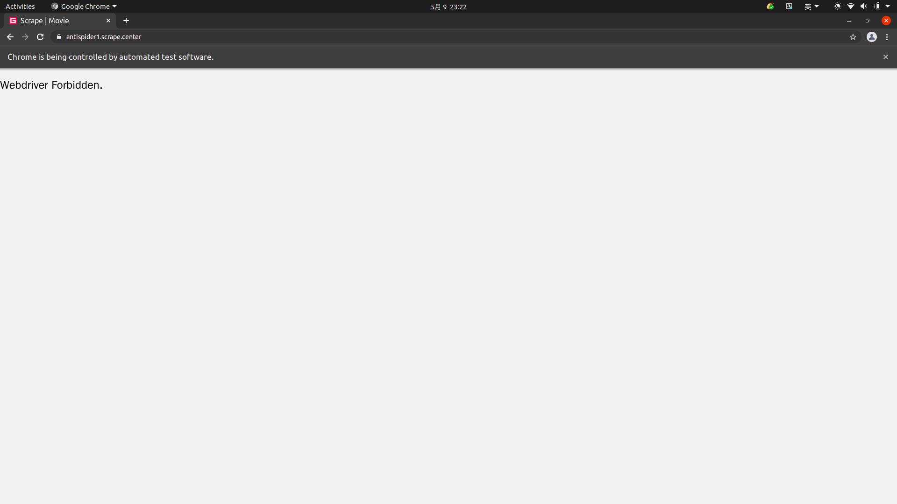

这时候我们可能想到直接使用 JavaScript 直接把这个 webdriver 属性置空，比如通过调用 ```execute_script``` 方法来执行如下代码：

```javascript
Object.defineProperty(navigator, "webdriver", {
    get: () => undefined
})
```

这行 JavaScript 的确是可以把 webdriver 属性置空，但是 ```execute_script``` 调用这行 JavaScript 语句实际上是在页面加载完毕之后才执行的，执行太晚了，网站早在最初页面渲染之前就已经对
webdriver 属性进行了检测，所以用上述方法并不能达到效果。

在 Selenium 中，我们可以使用 CDP(即 Chrome Devtools-Protocol，Chrome 开发工具协议)来解决这个问题，通过 CDP 我们可以实现在每个页面刚加载的时候执行 JavaScript 代码，执行的
CDP 方法叫作 ```Page.addScriptToEvaluateOnNewDocument```，然后传入上文的 JavaScript 代码即可，这样我们就可以在每次页面加载之前将 webdriver 属性置空了。

另外我们还可以加入几个选项来隐藏 WebDriver 提示条和自动化扩展信息，[代码](../../codes/Module_3/lecture_14/lecture_14_21.py)实现如下：

```python
# -*- coding: utf-8 -*-

import time
from selenium import webdriver
from selenium.webdriver import ChromeOptions

option = ChromeOptions()
option.add_experimental_option('excludeSwitches', ['enable-automation'])
option.add_experimental_option('useAutomationExtension', False)
browser = webdriver.Chrome(options=option)
browser.execute_cdp_cmd('Page.addScriptToEvaluateOnNewDocument', {
    'source': 'Object.defineProperty(navigator, "webdriver", {get: () => undefined})'
})
browser.get('https://antispider1.scrape.center/')
time.sleep(7)
browser.close()
```

这样整个页面就能被加载出来了：

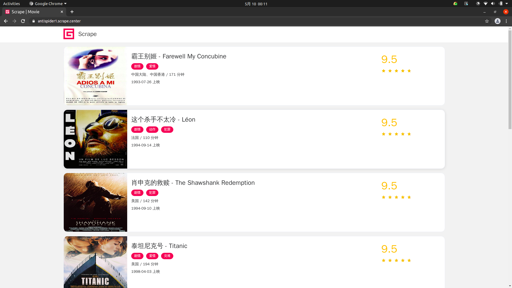

对于大多数的情况，以上的方法均可以实现 Selenium 反屏蔽。但对于一些特殊的网站，如果其有更多的 WebDriver 特征检测，可能需要具体排查。

更高级的一些反屏蔽措施，可以看下面这个[例子](../../codes/Module_3/lecture_14/lecture_14_22.py)

```python
# -*- coding: utf-8 -*-

from selenium.webdriver import Chrome
from selenium.webdriver.chrome.options import Options


def gain_driver():
    """

    :return:
    """
    chrome_options = Options()
    chrome_options.add_experimental_option('excludeSwitches', ['enable-automation'])
    chrome_options.add_experimental_option('useAutomationExtension', False)
    chrome_options.add_argument("--headless")
    chrome_options.add_argument("--disable-blink-features-AutomationControlled")
    chrome_options.add_argument(
        'user-agent=Mozilla/5.0 (X11; Linux x86_64) AppleWebKit/537.36 (KHTML, like Gecko) Chrome/90.0.4430.72 Safari/537.36'
    )
    driver = Chrome('chromedriver', options=chrome_options)
    driver.set_window_size(1366, 768)
    with open('stealth.min.js') as f:
        js = f.read()

    driver.execute_cdp_cmd("Page.addScriptToEvaluateOnNewDocument", {
        "source": js
    })
    return driver


if __name__ == '__main__':
    """"""
    driver = gain_driver()
    '''test'''
    url = "https://bot.sannysoft.com/"
    driver.get(url)
    source = driver.page_source
    with open('result.html', 'w') as f:
        f.write(source)
```

[https://bot.sannysoft.com/](https://bot.sannysoft.com/) 是一个测试网站，结果如下：


---

## 无头模式

上面的案例在运行的时候，我们可以观察到其总会弹出一个浏览器窗口，虽然有助于观察页面爬取状况，但在有些时候窗口弹来弹去也会形成一些干扰。

Chrome 浏览器从 60 版本已经支持了无头模式，即 Headless。无头模式在运行的时候不会再弹出浏览器窗口，减少了干扰，而且它减少了一些资源的加载，如图片等资源，所以也在一定程度上节省了资源加载时间和网络带宽。

我们可以借助于 ```ChromeOptions``` 来开启 Chrome Headless 模式，[代码](../../codes/Module_3/lecture_14/lecture_14_23.py)实现如下：

```python
# -*- coding: utf-8 -*-

from selenium import webdriver
from selenium.webdriver import ChromeOptions

option = ChromeOptions()
option.add_argument('--headless')
browser = webdriver.Chrome(options=option)
browser.set_window_size(1366, 768)
browser.get('https://www.baidu.com')
browser.get_screenshot_as_file('preview.png')
browser.close()
```

这里我们通过 ```ChromeOptions``` 的 ```add_argument``` 方法添加了一个参数 --headless，开启了无头模式。在无头模式下，我们最好需要设置下窗口的大小，接着打开页面，最后我们调用
```get_screenshot_as_file``` 方法输出了页面的截图。

运行代码之后，我们发现 Chrome 窗口就不会再弹出来了，代码依然正常运行，最后输出了页面截图如图所示。

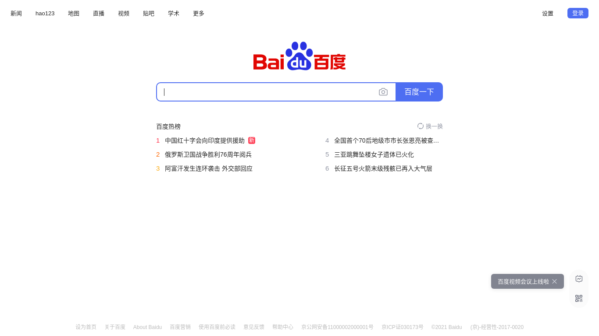

这样就在无头模式下完成了页面的抓取和截图操作。

现在，我们基本对 Selenium 的常规用法有了大体的了解。使用 Selenium，处理 JavaScript 渲染的页面不再是难事。

---
---
