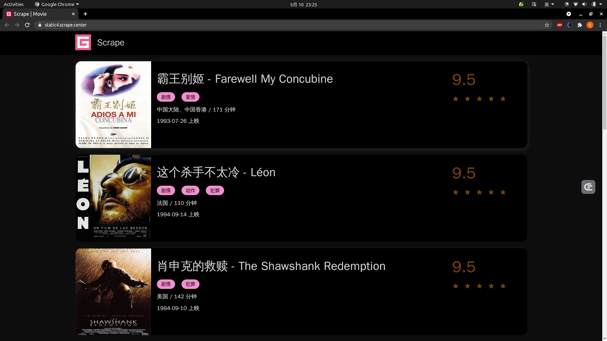

# 异步爬虫原理和解析

爬虫是 IO 密集型任务，如果使用 requests
库来爬取某个站点的话，发出一个请求之后，程序必须要等待网站返回响应之后才能接着运行，而在等待响应的过程中，整个爬虫程序是一直在等待的，实际上没有做任何的事情。对于这种情况我们有没有优化方案呢？

---
---

## 实例引入

看这么一个示例网站：[https://static4.scrape.center/](https://static4.scrape.center/) ，如图所示。



这个网站在内部实现返回响应的逻辑的时候特意加了 5 秒的延迟，也就是说如果我们用 requests 来爬取其中某个页面的话，至少需要 5 秒才能得到响应。

另外这个网站的逻辑结构在之前的案例中也分析过，其内容就是电影数据，一共 100 部，每个电影的详情页是一个自增 ID，从 1~
100，比如 [https://static4.scrape.center/detail/43](https://static4.scrape.center/detail/43) 就代表第 43 部电影，如图所示。


下面我们来用 requests 写一个遍历程序，直接遍历 1~100 部电影数据，[代码](../../codes/Module_3/lecture_16/lecture_16_1.py)实现如下：

```python
# -*- coding: utf-8 -*-

import time
import requests
import logging

headers = {
    'Accept-Encoding': 'gzip, deflate, sdch',
    'Accept-Language': 'en-US,en;q=0.8',
    'User-Agent': 'Mozilla/5.0 (X11; Linux x86_64) AppleWebKit/537.36 (KHTML, like Gecko) Chrome/90.0.4430.72 Safari/537.36',
    'Accept': 'text/html,application/xhtml+xml,application/xml;q=0.9,image/webp,*/*;q=0.8',
    'Connection': 'keep-alive',
}
logging.basicConfig(level=logging.INFO, format='%(asctime)s - %(levelname)s: %(message)s')
TOTAL_NUMBER = 100
BASE_URL = 'https://static4.scrape.center/detail/{id}'
start_time = time.time()
for id in range(1, TOTAL_NUMBER + 1):
    url = BASE_URL.format(id=id)
    logging.info('scraping %s', url)
    response = requests.get(url, headers)
end_time = time.time()
logging.info('total time %s seconds', end_time - start_time)
```

这里我们直接用循环的方式构造了 100 个详情页的爬取，使用的是 requests 单线程，在爬取之前和爬取之后记录下时间，最后输出爬取了 100 个页面消耗的时间。

运行结果如下：

```textmate
2021-05-10 23:35:58,509 - INFO: scraping https://static4.scrape.center/detail/1
2021-05-10 23:36:15,808 - INFO: scraping https://static4.scrape.center/detail/2
2021-05-10 23:36:28,916 - INFO: scraping https://static4.scrape.center/detail/3
2021-05-10 23:36:44,290 - INFO: scraping https://static4.scrape.center/detail/4
2021-05-10 23:36:56,887 - INFO: scraping https://static4.scrape.center/detail/5
...
```

由于每个页面都至少要等待 5 秒才能加载出来，因此 100 个页面至少要花费 500 秒的时间。

这个在实际情况下是很常见的，有些网站本身加载速度就比较慢，稍慢的可能 1~3 秒，更慢的说不定 10 秒以上才可能加载出来。如果我们用 requests
单线程这么爬取的话，总的耗时是非常多的。此时如果我们开了多线程或多进程来爬取的话，其爬取速度确实会成倍提升，但有没有更好的解决方案呢？

本课时我们就来了解一下使用异步执行方式来加速的方法，此种方法对于 IO 密集型任务非常有效。如将其应用到网络爬虫中，爬取效率甚至可以成百倍地提升。

---

## 基本了解

在了解异步协程之前，首先得了解一些基础概念，如阻塞和非阻塞、同步和异步、多进程和协程。

---

### 阻塞

阻塞状态指程序未得到所需计算资源时被挂起的状态。程序在等待某个操作完成期间，自身无法继续处理其他的事情，则称该程序在该操作上是阻塞的。

常见的阻塞形式有：网络 I/O 阻塞、磁盘 I/O 阻塞、用户输入阻塞等。阻塞是无处不在的，包括 CPU 切换上下文时，所有的进程都无法真正处理事情，它们也会被阻塞。如果是多核 CPU 则正在执行上下文切换操作的核不可被利用。

---

### 非阻塞

程序在等待某操作过程中，自身不被阻塞，可以继续处理其他的事情，则称该程序在该操作上是非阻塞的。

非阻塞并不是在任何程序级别、任何情况下都可以存在的。仅当程序封装的级别可以囊括独立的子程序单元时，它才可能存在非阻塞状态。

非阻塞的存在是因为阻塞存在，正因为某个操作阻塞导致的耗时与效率低下，我们才要把它变成非阻塞的。

---

### 同步

不同程序单元为了完成某个任务，在执行过程中需靠某种通信方式以协调一致，我们称这些程序单元是同步执行的。

例如购物系统中更新商品库存，需要用“行锁”作为通信信号，让不同的更新请求强制排队顺序执行，那更新库存的操作是同步的。

简言之，同步意味着有序。

---

### 异步

为完成某个任务，不同程序单元之间过程中无需通信协调，也能完成任务的方式，不相关的程序单元之间可以是异步的。

例如，爬虫下载网页。调度程序调用下载程序后，即可调度其他任务，而无需与该下载任务保持通信以协调行为。不同网页的下载、保存等操作都是无关的，也无需相互通知协调。这些异步操作的完成时刻并不确定。

简言之，异步意味着无序。

---

### 多进程

多进程就是利用 CPU 的多核优势，在同一时间并行地执行多个任务，可以大大提高执行效率。

---

### 协程

协程，英文叫作 Coroutine，又称微线程、纤程，协程是一种用户态的轻量级线程。

协程拥有自己的寄存器上下文和栈。协程调度切换时，将寄存器上下文和栈保存到其他地方，在切回来的时候，恢复先前保存的寄存器上下文和栈。因此协程能保留上一次调用时的状态，即所有局部状态的一个特定组合，每次过程重入时，就相当于进入上一次调用的状态。

协程本质上是个单进程，协程相对于多进程来说，无需线程上下文切换的开销，无需原子操作锁定及同步的开销，编程模型也非常简单。

我们可以使用协程来实现异步操作，比如在网络爬虫场景下，我们发出一个请求之后，需要等待一定的时间才能得到响应，但其实在这个等待过程中，程序可以干许多其他的事情，等到响应得到之后才切换回来继续处理，这样可以充分利用 CPU
和其他资源，这就是协程的优势。

---

## 协程用法

接下来，我们来了解下协程的实现，从 Python 3.4 开始，Python 中加入了协程的概念，但这个版本的协程还是以生成器对象为基础的，在 Python 3.5 则增加了 async/await，使得协程的实现更加方便。

Python 中使用协程最常用的库莫过于 ```asyncio```，所以本文会以 ```asyncio``` 为基础来介绍协程的使用。

首先了解下面几个概念。

* event_loop：事件循环，相当于一个无限循环，我们可以把一些函数注册到这个事件循环上，当满足条件发生的时候，就会调用对应的处理方法
* coroutine：中文翻译叫协程，在 Python 中常指代为协程对象类型，我们可以将协程对象注册到时间循环中，它会被事件循环调用。我们可以使用 ```async```
  关键字来定义一个方法，这个方法在调用时不会立即被执行，而是返回一个协程对象
* task：任务，它是对协程对象的进一步封装，包含了任务的各个状态
* future：代表将来执行或没有执行的任务的结果，实际上和 ```task``` 没有本质区别

另外我们还需要了解 ```async/await``` 关键字，它是从 Python 3.5 才出现的，专门用于定义协程。其中，```async``` 定义一个协程，```await``` 用来挂起阻塞方法的执行。

---

## 定义协程

首先我们来定义一个协程，体验一下它和普通进程在实现上的不同之处，[代码](../../codes/Module_3/lecture_16/lecture_16_2.py)如下：

```python
# -*- coding: utf-8 -*-

import asyncio


async def execute(x):
    print('Number:', x)


coroutine = execute(1)
print('Coroutine:', coroutine)
print('After calling execute')
loop = asyncio.get_event_loop()
loop.run_until_complete(coroutine)
print('After calling loop')
```

运行结果：

```textmate
Coroutine: <coroutine object execute at 0x7f11e1a2ba40>
After calling execute
Number: 1
After calling loop
```

首先我们引入了 ```asyncio``` 这个包，这样我们才可以使用 ```async``` 和 ```await```，然后我们使用 ```async``` 定义了一个 ```execute```
方法，方法接收一个数字参数，方法执行之后会打印这个数字。

随后我们直接调用了这个方法，然而这个方法并没有执行，而是返回了一个 ```coroutine``` 协程对象。随后我们使用 ```get_event_loop``` 方法创建了一个事件循环 ```loop```
，并调用了 ```loop``` 对象的 ```run_until_complete```
方法将协程注册到事件循环 ```loop``` 中，然后启动。最后我们才看到了 ```execute``` 方法打印了输出结果。

可见，```async``` 定义的方法就会变成一个无法直接执行的 ```coroutine``` 对象，必须将其注册到事件循环中才可以执行。

上面我们还提到了 ```task```，它是对 ```coroutine``` 对象的进一步封装，它里面相比 ```coroutine``` 对象多了运行状态，比如 ```running、finished```
等，我们可以用这些状态来获取协程对象的执行情况。

在上面的例子中，当我们将 ```coroutine``` 对象传递给 ```run_until_complete``` 方法的时候，实际上它进行了一个操作就是将 ```coroutine``` 封装成了 ```task```
对象，我们也可以显式地进行声明，[如下](../../codes/Module_3/lecture_16/lecture_16_3.py)所示：

```python
# -*- coding: utf-8 -*-

import asyncio


async def execute(x):
    print('Number:', x)
    return x


coroutine = execute(1)
print('Coroutine:', coroutine)
print('After calling execute')
loop = asyncio.get_event_loop()
task = loop.create_task(coroutine)
print('Task:', task)
loop.run_until_complete(task)
print('Task:', task)
print('After calling loop')
```

运行结果：

```textmate
Coroutine: <coroutine object execute at 0x7f8465db6a40>
After calling execute
Task: <Task pending name='Task-1' coro=<execute() running at /codes/Module_3/lecture_16/lecture_16_3.py:6>>
Number: 1
Task: <Task finished name='Task-1' coro=<execute() done, defined at /codes/Module_3/lecture_16/lecture_16_3.py:6> result=1>
After calling loop
```

这里我们定义了 ```loop``` 对象之后，接着调用了它的 ```create_task``` 方法将 ```coroutine``` 对象转化为了 ```task``` 对象，随后我们打印输出一下，发现它是 ```pending```
状态。接着我们将 ```task```
对象添加到事件循环中得到执行，随后我们再打印输出一下 ```task``` 对象，发现它的状态就变成了 ```finished```，同时还可以看到其 result 变成了 1，也就是我们定义的 ```execute``` 方法的返回结果。

另外定义 ```task``` 对象还有一种方式，就是直接通过 ```asyncio``` 的 ```ensure_future``` 方法，返回结果也是 ```task``` 对象，这样的话我们就可以不借助于 ```loop```
来定义，即使我们还没有声明 ```loop``` 也可以提前定义好 ```task```
对象，[写法](../../codes/Module_3/lecture_16/lecture_16_4.py)如下：

```python
# -*- coding: utf-8 -*-

import asyncio


async def execute(x):
    print('Number:', x)
    return x


coroutine = execute(1)
print('Coroutine:', coroutine)
print('After calling execute')
task = asyncio.ensure_future(coroutine)
print('Task:', task)
loop = asyncio.get_event_loop()
loop.run_until_complete(task)
print('Task:', task)
print('After calling loop')
```

运行结果：

```textmate
Coroutine: <coroutine object execute at 0x7fb1e97aca40>
After calling execute
Task: <Task pending name='Task-1' coro=<execute() running at /home/dfs/common/Codes/python/Pycharm/github/minegit/Reptile_study/codes/Module_3/lecture_16/lecture_16_4.py:6>>
Number: 1
Task: <Task finished name='Task-1' coro=<execute() done, defined at /home/dfs/common/Codes/python/Pycharm/github/minegit/Reptile_study/codes/Module_3/lecture_16/lecture_16_4.py:6> result=1>
After calling loop
```

发现其运行效果都是一样的。

---

## 绑定回调

另外也可以为某个 ```task``` 绑定一个回调方法，来看下面的[例子](../../codes/Module_3/lecture_16/lecture_16_5.py)：

```python
# -*- coding: utf-8 -*-

import asyncio
import requests

headers = {
    'Accept-Encoding': 'gzip, deflate, sdch',
    'Accept-Language': 'en-US,en;q=0.8',
    'User-Agent': 'Mozilla/5.0 (X11; Linux x86_64) AppleWebKit/537.36 (KHTML, like Gecko) Chrome/90.0.4430.72 Safari/537.36',
    'Accept': 'text/html,application/xhtml+xml,application/xml;q=0.9,image/webp,*/*;q=0.8',
    'Connection': 'keep-alive',
}


async def request():
    url = 'https://www.baidu.com'
    status = requests.get(url, headers)
    return status


def callback(task):
    print('Status:', task.result())


coroutine = request()
task = asyncio.ensure_future(coroutine)
task.add_done_callback(callback)
print('Task:', task)

loop = asyncio.get_event_loop()
loop.run_until_complete(task)
print('Task:', task)
```

在这里我们定义了一个 ```request``` 方法，请求了百度，获取其状态码，但是这个方法里面我们没有任何 ```print``` 语句。随后我们定义了一个 ```callback```
方法，这个方法接收一个参数，是 ```task``` 对象，然后调用 ```print``` 方法打印了 task 对象的结果。这样我们就定义好了一个 coroutine 对象和一个回调方法，我们现在希望的效果是，当 coroutine
对象执行完毕之后，就去执行声明的 ```callback``` 方法。

那么它们二者怎样关联起来呢？很简单，只需要调用 ```add_done_callback``` 方法即可，我们将 ```callback``` 方法传递给了封装好的 ```task``` 对象，这样当 ```task```
执行完毕之后就可以调用 ```callback```
方法了，同时 ```task``` 对象还会作为参数传递给 ```callback``` 方法，调用 ```task``` 对象的 ```result``` 方法就可以获取返回结果了。

运行结果：

```textmate
Task: <Task pending name='Task-1' coro=<request() running at /codes/Module_3/lecture_16/lecture_16_5.py:15> cb=[callback() at /codes/Module_3/lecture_16/lecture_16_5.py:21]>
Status: <Response [200]>
Task: <Task finished name='Task-1' coro=<request() done, defined at /codes/Module_3/lecture_16/lecture_16_5.py:15> result=<Response [200]>>
```

实际上不用回调方法，直接在 ```task``` 运行完毕之后也可以直接调用 ```result``` 方法获取结果，[如下](../../codes/Module_3/lecture_16/lecture_16_6.py)所示：

```python
# -*- coding: utf-8 -*-

import asyncio
import requests

headers = {
    'Accept-Encoding': 'gzip, deflate, sdch',
    'Accept-Language': 'en-US,en;q=0.8',
    'User-Agent': 'Mozilla/5.0 (X11; Linux x86_64) AppleWebKit/537.36 (KHTML, like Gecko) Chrome/90.0.4430.72 Safari/537.36',
    'Accept': 'text/html,application/xhtml+xml,application/xml;q=0.9,image/webp,*/*;q=0.8',
    'Connection': 'keep-alive',
}


async def request():
    url = 'https://www.baidu.com'
    status = requests.get(url, headers)
    return status


coroutine = request()
task = asyncio.ensure_future(coroutine)
print('Task:', task)

loop = asyncio.get_event_loop()
loop.run_until_complete(task)
print('Task:', task)
print('Task Result:', task.result())
```

运行结果是一样的：

```textmate
Task: <Task pending name='Task-1' coro=<request() running at /codes/Module_3/lecture_16/lecture_16_6.py:15>>
Task: <Task finished name='Task-1' coro=<request() done, defined at /codes/Module_3/lecture_16/lecture_16_6.py:15> result=<Response [200]>>
Task Result: <Response [200]>
```

---

## 多任务协程

上面的例子我们只执行了一次请求，如果我们想执行多次请求应该怎么办呢？

我们可以定义一个 ```task``` 列表，然后使用 ```asyncio``` 的 ```wait``` 方法即可执行，看下面的[例子](../../codes/Module_3/lecture_16/lecture_16_7.py)：

```python
# -*- coding: utf-8 -*-

import asyncio
import requests

headers = {
    'Accept-Encoding': 'gzip, deflate, sdch',
    'Accept-Language': 'en-US,en;q=0.8',
    'User-Agent': 'Mozilla/5.0 (X11; Linux x86_64) AppleWebKit/537.36 (KHTML, like Gecko) Chrome/90.0.4430.72 Safari/537.36',
    'Accept': 'text/html,application/xhtml+xml,application/xml;q=0.9,image/webp,*/*;q=0.8',
    'Connection': 'keep-alive',
}


async def request():
    url = 'https://www.baidu.com'
    status = requests.get(url)
    return status


tasks = [asyncio.ensure_future(request()) for _ in range(5)]
print('Tasks:', tasks)

loop = asyncio.get_event_loop()
loop.run_until_complete(asyncio.wait(tasks))

for task in tasks:
    print('Task Result:', task.result())
```

这里我们使用一个 for 循环创建了五个 ```task```，组成了一个列表，然后把这个列表首先传递给了 ```asyncio``` 的 ```wait()```
方法，然后再将其注册到时间循环中，就可以发起五个任务了。运行结果如下：

```textmate
Tasks: Tasks: 
[
    <Task pending name='Task-1' coro=<request() running at /codes/Module_3/lecture_16/lecture_16_7.py:15>>, 
    <Task pending name='Task-2' coro=<request() running at /codes/Module_3/lecture_16/lecture_16_7.py:15>>, 
    <Task pending name='Task-3' coro=<request() running at /codes/Module_3/lecture_16/lecture_16_7.py:15>>, 
    <Task pending name='Task-4' coro=<request() running at /codes/Module_3/lecture_16/lecture_16_7.py:15>>, 
    <Task pending name='Task-5' coro=<request() running at /codes/Module_3/lecture_16/lecture_16_7.py:15>>
]
Task Result: <Response [200]>
Task Result: <Response [200]>
Task Result: <Response [200]>
Task Result: <Response [200]>
Task Result: <Response [200]>
```

可以看到五个任务被顺次执行了，并得到了运行结果。

---

## 协程实现

上面的代码中，我们用一个网络请求作为示例，这就是一个耗时等待的操作，因为我们请求网页之后需要等待页面响应并返回结果。耗时等待的操作一般都是 IO
操作，比如文件读取、网络请求等等。协程对于处理这种操作是有很大优势的，当遇到需要等待的情况的时候，程序可以暂时挂起，转而去执行其他的操作，从而避免一直等待一个程序而耗费过多的时间，充分利用资源。

为了表现出协程的优势，我们还是拿本课时开始介绍的网站 [https://static4.scrape.center/](https://static4.scrape.center/)
为例来进行演示，因为该网站响应比较慢，所以我们可以通过爬取时间来直观地感受到爬取速度的提升。

为了让你更好地理解协程的正确使用方法，这里我们先来看看使用协程时常犯的错误，后面再给出正确的例子来对比一下。

首先，我们还是拿之前的 requests 来进行网页请求，接下来我们再重新使用上面的方法请求一遍，[代码](../../codes/Module_3/lecture_16/lecture_16_8.py)：

```python
# -*- coding: utf-8 -*-

import time
import asyncio
import requests

headers = {
    'Accept-Encoding': 'gzip, deflate, sdch',
    'Accept-Language': 'en-US,en;q=0.8',
    'User-Agent': 'Mozilla/5.0 (X11; Linux x86_64) AppleWebKit/537.36 (KHTML, like Gecko) Chrome/90.0.4430.72 Safari/537.36',
    'Accept': 'text/html,application/xhtml+xml,application/xml;q=0.9,image/webp,*/*;q=0.8',
    'Connection': 'keep-alive',
}

start = time.time()


async def request():
    url = 'https://static4.scrape.center/'
    print('Waiting for', url)
    response = requests.get(url, headers)
    print('Get response from', url, 'response', response)


tasks = [asyncio.ensure_future(request()) for _ in range(10)]
loop = asyncio.get_event_loop()
loop.run_until_complete(asyncio.wait(tasks))

end = time.time()
print('Cost time:', end - start)
```

在这里我们还是创建了 10 个 ```task```，然后将 ```task``` 列表传给 ```wait``` 方法并注册到时间循环中执行。

运行结果如下：

```textmate
Waiting for https://static4.scrape.center/
Get response from https://static4.scrape.center/ response <Response [200]>
Waiting for https://static4.scrape.center/
Get response from https://static4.scrape.center/ response <Response [200]>
Waiting for https://static4.scrape.center/
... Get response from https://static4.scrape.center/ response <Response [200]>
Waiting for https://static4.scrape.center/
Get response from https://static4.scrape.center/ response <Response [200]>
Waiting for https://static4.scrape.center/
Get response from https://static4.scrape.center/ response <Response [200]>
Cost time: 51.422438859939575
```

可以发现和正常的请求并没有什么两样，依然还是顺次执行的，耗时 51 秒，平均一个请求耗时 5 秒，说好的异步处理呢？

其实，要实现异步处理，我们得先要有挂起的操作，当一个任务需要等待 IO 结果的时候，可以挂起当前任务，转而去执行其他任务，这样我们才能充分利用好资源。

要实现异步，接下来我们需要了解一下 ```await``` 的用法，使用 ```await``` 可以将耗时等待的操作挂起，让出控制权。当协程执行的时候遇到 ```await```
，时间循环就会将本协程挂起，转而去执行别的协程，直到其他的协程挂起或执行完毕。

所以，我们可能会将代码中的 ```request``` 方法改成如下的样子：

```python
async def request():
    url = 'https://static4.scrape.center/'
    print('Waiting for', url)
    response = await requests.get(url, headers)
    print('Get response from', url, 'response', response)
```

仅仅是在 ```requests``` 前面加了一个 ```await```，然而执行以下代码，会得到如下报错：

````textmate
Waiting for https://static4.scrape.center/
Waiting for https://static4.scrape.center/
Waiting for https://static4.scrape.center/
Waiting for https://static4.scrape.center/
... Task exception was never retrieved future: <Task finished coro=<request() done, defined at lecture_16_8.py:8>
exception=TypeError("object Response can't be used in 'await' expression")>
Traceback (most recent call last):
File "demo.py", line 11, in request response = await requests.get(url)
TypeError: object Response can't be used in 'await' expression
````

这次它遇到 await 方法确实挂起了，也等待了，但是最后却报了这么个错，这个错误的意思是 ```requests``` 返回的 ```Response``` 对象不能和 ```await```
一起使用，为什么呢？因为根据官方文档说明，```await```
后面的对象必须是如下格式之一：

* A native coroutine object returned from a native coroutine function，一个原生 coroutine 对象
* A generator-based coroutine object returned from a function decorated with types.coroutine，一个由 types.coroutine
  修饰的生成器，这个生成器可以返回 coroutine 对象
* An object with an __await__ method returning an iterator，一个包含 __await__ 方法的对象返回的一个迭代器

可以参见：

[https://www.python.org/dev/peps/pep-0492/#await-expression](https://www.python.org/dev/peps/pep-0492/#await-expression)

```requests``` 返回的 ```Response``` 不符合上面任一条件，因此就会报上面的错误了。

那么你可能会发现，既然 await 后面可以跟一个 coroutine 对象，那么我用 async 把请求的方法改成 coroutine 对象不就可以了吗？所以就改写成如下的样子：

复制代码 import asyncio import requests import time

start = time.time()

async def get(url):
return requests.get(url)

async def request():
url = 'https://static4.scrape.center/'
print('Waiting for', url)
response = await get(url)
print('Get response from', url, 'response', response)

tasks = [asyncio.ensure_future(request()) for _ in range(10)]
loop = asyncio.get_event_loop()
loop.run_until_complete(asyncio.wait(tasks))

end = time.time()
print('Cost time:', end - start)
这里我们将请求页面的方法独立出来，并用 async 修饰，这样就得到了一个 coroutine 对象，我们运行一下看看：

复制代码 Waiting for https://static4.scrape.center/
Get response from https://static4.scrape.center/ response <Response [200]>
Waiting for https://static4.scrape.center/
Get response from https://static4.scrape.center/ response <Response [200]>
Waiting for https://static4.scrape.center/
... Get response from https://static4.scrape.center/ response <Response [200]>
Waiting for https://static4.scrape.center/
Get response from https://static4.scrape.center/ response <Response [200]>
Waiting for https://static4.scrape.center/
Get response from https://static4.scrape.center/ response <Response [200]>
Cost time: 51.394437756259273 还是不行，它还不是异步执行，也就是说我们仅仅将涉及 IO 操作的代码封装到 async
修饰的方法里面是不可行的！我们必须要使用支持异步操作的请求方式才可以实现真正的异步，所以这里就需要 aiohttp 派上用场了。

使用 aiohttp aiohttp 是一个支持异步请求的库，利用它和 asyncio 配合我们可以非常方便地实现异步请求操作。

安装方式如下：

复制代码 pip3 install aiohttp 官方文档链接为：https://aiohttp.readthedocs.io/，它分为两部分，一部分是 Client，一部分是 Server，详细的内容可以参考官方文档。

下面我们将 aiohttp 用上来，将代码改成如下样子：

复制代码 import asyncio import aiohttp import time

start = time.time()

async def get(url):
session = aiohttp.ClientSession()
response = await session.get(url)
await response.text()
await session.close()
return response

async def request():
url = 'https://static4.scrape.center/'
print('Waiting for', url)
response = await get(url)
print('Get response from', url, 'response', response)

tasks = [asyncio.ensure_future(request()) for _ in range(10)]
loop = asyncio.get_event_loop()
loop.run_until_complete(asyncio.wait(tasks))

end = time.time()
print('Cost time:', end - start)
在这里我们将请求库由 requests 改成了 aiohttp，通过 aiohttp 的 ClientSession 类的 get 方法进行请求，结果如下：

复制代码 Waiting for https://static4.scrape.center/
Waiting for https://static4.scrape.center/
Waiting for https://static4.scrape.center/
Waiting for https://static4.scrape.center/
Waiting for https://static4.scrape.center/
Waiting for https://static4.scrape.center/
Waiting for https://static4.scrape.center/
Waiting for https://static4.scrape.center/
Waiting for https://static4.scrape.center/
Waiting for https://static4.scrape.center/
Get response from https://static4.scrape.center/ response <ClientResponse(https://static4.scrape.center/) [200 OK]>
<CIMultiDictProxy('Server': 'nginx/1.17.8', 'Date': 'Tue, 31 Mar 2020 09:35:43 GMT', 'Content-Type': 'text/html;
charset=utf-8', 'Transfer-Encoding': 'chunked', 'Connection': 'keep-alive', 'Vary': 'Accept-Encoding', '
X-Frame-Options': 'SAMEORIGIN', 'Strict-Transport-Security': 'max-age=15724800; includeSubDomains', '
Content-Encoding': 'gzip')>
... Get response from https://static4.scrape.center/ response <ClientResponse(https://static4.scrape.center/) [200 OK]>
<CIMultiDictProxy('Server': 'nginx/1.17.8', 'Date': 'Tue, 31 Mar 2020 09:35:44 GMT', 'Content-Type': 'text/html;
charset=utf-8', 'Transfer-Encoding': 'chunked', 'Connection': 'keep-alive', 'Vary': 'Accept-Encoding', '
X-Frame-Options': 'SAMEORIGIN', 'Strict-Transport-Security': 'max-age=15724800; includeSubDomains', '
Content-Encoding': 'gzip')>
Cost time: 6.1102519035339355 成功了！我们发现这次请求的耗时由 51 秒变直接成了 6 秒，耗费时间减少了非常非常多。

代码里面我们使用了 await，后面跟了 get 方法，在执行这 10 个协程的时候，如果遇到了 await，那么就会将当前协程挂起，转而去执行其他的协程，直到其他的协程也挂起或执行完毕，再进行下一个协程的执行。

开始运行时，时间循环会运行第一个 task，针对第一个 task 来说，当执行到第一个 await 跟着的 get 方法时，它被挂起，但这个 get 方法第一步的执行是非阻塞的，挂起之后立马被唤醒，所以立即又进入执行，创建了
ClientSession 对象，接着遇到了第二个 await，调用了 session.get 请求方法，然后就被挂起了，由于请求需要耗时很久，所以一直没有被唤醒。

当第一个 task 被挂起了，那接下来该怎么办呢？事件循环会寻找当前未被挂起的协程继续执行，于是就转而执行第二个 task 了，也是一样的流程操作，直到执行了第十个 task 的 session.get 方法之后，全部的 task
都被挂起了。所有 task 都已经处于挂起状态，怎么办？只好等待了。5 秒之后，几个请求几乎同时都有了响应，然后几个 task 也被唤醒接着执行，输出请求结果，最后总耗时，6 秒！

怎么样？这就是异步操作的便捷之处，当遇到阻塞式操作时，任务被挂起，程序接着去执行其他的任务，而不是傻傻地等待，这样可以充分利用 CPU 时间，而不必把时间浪费在等待 IO 上。

你可能会说，既然这样的话，在上面的例子中，在发出网络请求后，既然接下来的 5 秒都是在等待的，在 5 秒之内，CPU 可以处理的 task 数量远不止这些，那么岂不是我们放 10 个、20 个、50 个、100 个、1000 个 task
一起执行，最后得到所有结果的耗时不都是差不多的吗？因为这几个任务被挂起后都是一起等待的。

理论来说确实是这样的，不过有个前提，那就是服务器在同一时刻接受无限次请求都能保证正常返回结果，也就是服务器无限抗压，另外还要忽略 IO 传输时延，确实可以做到无限 task
一起执行且在预想时间内得到结果。但由于不同服务器处理的实现机制不同，可能某些服务器并不能承受这么高的并发，因此响应速度也会减慢。

在这里我们以百度为例，来测试下并发数量为 1、3、5、10、...、500 的情况下的耗时情况，代码如下：

复制代码 import asyncio import aiohttp import time

def test(number):
start = time.time()

async def get(url):
session = aiohttp.ClientSession()
response = await session.get(url)
await response.text()
await session.close()
return response

async def request():
url = 'https://www.baidu.com/'
await get(url)

tasks = [asyncio.ensure_future(request()) for _ in range(number)]
loop = asyncio.get_event_loop()
loop.run_until_complete(asyncio.wait(tasks))

end = time.time()
print('Number:', number, 'Cost time:', end - start)

for number in [1, 3, 5, 10, 15, 30, 50, 75, 100, 200, 500]:
test(number)
运行结果如下：

复制代码 Number: 1 Cost time: 0.05885505676269531 Number: 3 Cost time: 0.05773782730102539 Number: 5 Cost time:
0.05768704414367676 Number: 10 Cost time: 0.15174412727355957 Number: 15 Cost time: 0.09603095054626465 Number: 30 Cost
time: 0.17843103408813477 Number: 50 Cost time: 0.3741800785064697 Number: 75 Cost time: 0.2894289493560791 Number: 100
Cost time: 0.6185381412506104 Number: 200 Cost time: 1.0894129276275635 Number: 500 Cost time: 1.8213098049163818
可以看到，即使我们增加了并发数量，但在服务器能承受高并发的前提下，其爬取速度几乎不太受影响。

综上所述，使用了异步请求之后，我们几乎可以在相同的时间内实现成百上千倍次的网络请求，把这个运用在爬虫中，速度提升是非常可观的。

总结 以上便是 Python 中协程的基本原理和用法，在后面一课时会详细介绍 aiohttp 的使用和爬取实战，实现快速高并发的爬取。
