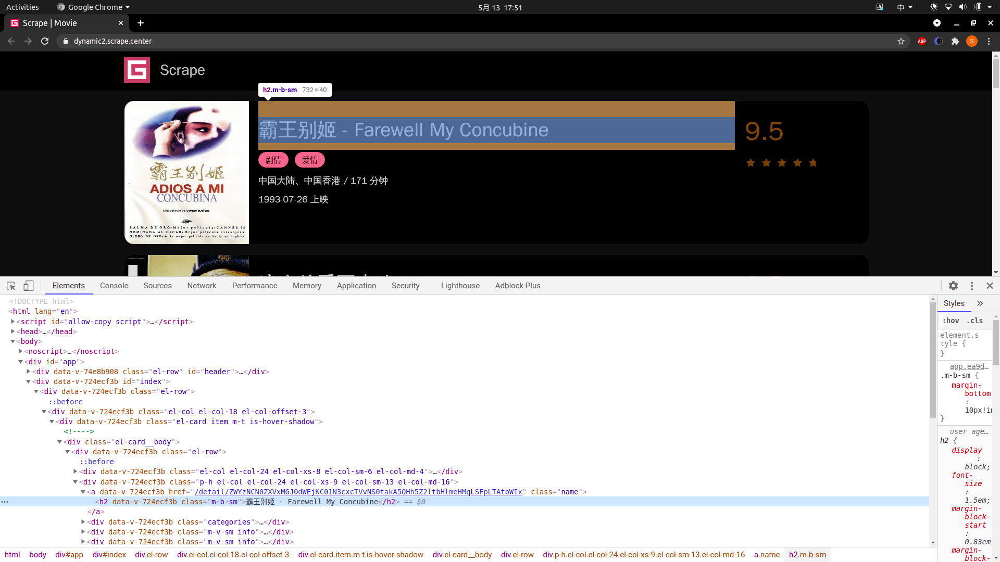

# Pyppeteer 爬取实战

在上一课时我们了解了 Pyppeteer 的基本用法，确实我们可以发现其相比 Selenium 有很多方便之处。

本课时我们就来使用 Pyppeteer 针对之前的 Selenium 案例做一次改写，来体会一下二者的不同之处，同时也加强一下对 Pyppeteer 的理解和掌握情况。

---
---

## 爬取目标

本课时我们要爬取的目标和之前是一样的，还是 Selenium 的那个案例，地址为：[https://dynamic2.scrape.center/](https://dynamic2.scrape.center/)


这个网站的每个详情页的 URL 都是带有加密参数的，同时 Ajax 接口也都有加密参数和时效性。具体的介绍可以看下 Selenium 课时。

---

## 本节目标

爬取目标和那一节也是一样的：

* 遍历每一页列表页，然后获取每部电影详情页的 URL
* 爬取每部电影的详情页，然后提取其名称、评分、类别、封面、简介等信息
* 爬取到的数据存为 JSON 文件
* 要求和之前也是一样的，只不过我们这里的实现就全用 Pyppeteer 了

---

## 准备工作

在本课时开始之前，我们需要做好如下准备工作：

* 安装好 Python(最低为 Python 3.6)版本，并能成功运行 Python 程序
* 安装好 Pyppeteer 并能成功运行示例

其他的浏览器、驱动配置就不需要了，这也是相比 Selenium 更加方便的地方。

页面分析在这里就不多介绍了，还是 列表页 + 详情页 的结构，具体可以参考 Selenium 一课时的内容。

---

## 爬取列表页

首先我们先做一些准备工作，定义一些基础的配置，包括日志定义、变量等等并引入一些必要的包，[代码](../../codes/Module_3/lecture_19/lecture_19_1.py)如下：

```python

```

这里大多数的配置和之前是一样的，不过这里我们额外定义了窗口的宽高信息，这里定义为 1920 x 1080，你也可以随意指定适合自己屏幕的宽高信息。另外这里定义了一个变量 HEADLESS，用来指定是否启用 Pyppeteer
的无头模式，如果为 ```False```，那么启动 Pyppeteer 的时候就会弹出一个 Chromium 浏览器窗口。

接着我们再定义一个初始化 Pyppeteer 的方法，包括启动 Pyppeteer，新建一个页面选项卡，设置窗口大小等操作，代码实现如下：

```python
async def init():
    """
    
    :return: 
    """
    global browser, tab
    browser = await launch(
        headless=HEADLESS,
        args=[
            '--disable-infobars',
            f'--window-size={WINDOW_WIDTH},{WINDOW_HEIGHT}'
        ]
    )
    tab = await browser.newPage()
    await tab.setViewport({'width': WINDOW_WIDTH, 'height': WINDOW_HEIGHT})
```

在这里我们先声明了一个 ```browser``` 对象，代表 Pyppeteer 所用的浏览器对象，```tab``` 代表新建的页面选项卡，这里把两项设置为全局变量，方便其他的方法调用。

另外定义了一个 ```init``` 方法，调用了 Pyppeteer 的 ```launch``` 方法，传入了 ```headless``` 为 ```HEADLESS```，将其设置为无头模式，另外还通过 ```args```
指定了隐藏提示条并设定了窗口的宽高。

接下来我们像之前一样，定义一个通用的爬取方法，代码如下：

```python
async def scrape_page(url: str, selector: str):
    """
    
    :param url: 
    :param selector: 
    :return: 
    """
    logging.info('scraping %s', url)
    try:
        await tab.goto(url)
        await tab.waitForSelector(
            selector, options={
                'timeout': TIMEOUT * 1000
            })
    except TimeoutError:
        logging.error('error occurred while scraping %s', url, exc_info=True)
```

这里我们定义了一个 ```scrape_page``` 方法，它接收两个参数，一个是 ```url```，代表要爬取的链接，使用 ```goto``` 方法调用即可；另外一个是 ```selector```
，即要等待渲染出的节点对应的 ```CSS``` 选择器，这里我们使用 ```waitForSelector``` 方法并传入了 ```selector```，并通过 ```options``` 指定了最长等待时间。

这样的话在运行时页面会首先访问这个 URL，然后等待某个符合 ```selector``` 的节点加载出来，最长等待 10 秒，如果 10 秒内加载出来了，那就接着往下执行，否则抛出异常，捕获 ```TimeoutError```
并输出错误日志。

接下来，我们就实现一下爬取列表页的方法，代码实现如下：

```python
async def scrape_index(page):
    """
    
    :param page: 
    :return: 
    """
    url = INDEX_URL.format(page=page)
    await scrape_page(url, '.item .name')
```

这里我们定义了 ```scrape_index``` 方法来爬取页面，其接受一个参数 ```page```，代表要爬取的页码，这里我们首先通过 ```INDEX_URL``` 构造了列表页的
URL，然后调用 ```scrape_page``` 方法传入了 ```url``` 和要等待加载的选择器。

这里的选择器我们使用的是 ```.item .name```，这就是列表页中每部电影的名称，如果这个加载出来了，那么就代表页面加载成功了，如图所示。



好，接下来我们可以再定义一个解析列表页的方法，提取出每部电影的详情页 URL，定义如下：

```python
async def parse_index():
    """
    
    :return: 
    """
    return await tab.querySelectorAllEval(
        '.item .name', 'nodes => nodes.map(node => node.href)'
    )
```

这里我们调用了 ```querySelectorAllEval``` 方法，它接收两个参数，第一个参数是 ```selector```，代表要选择的节点对应的 CSS 选择器；第二个参数是 ```pageFunction```
，代表的是要执行的 JavaScript 方法，这里需要传入的是一段 JavaScript 字符串，整个方法的作用是选择 ```selector``` 对应的节点，然后对这些节点通过 ```pageFunction```
定义的逻辑抽取出对应的结果并返回。

所以这里第一个参数 ```selector``` 就传入电影名称对应的节点，其实是超链接 ```a``` 节点。由于提取结果有多个，所以这里 JavaScript 对应的 ```pageFunction``` 输入参数就是
```nodes```，输出结果是调用了 ```map``` 方法得到每个 ```node```，然后调用 ```node``` 的 ```href``` 属性即可。这样返回结果就是当前列表页的所有电影的详情页 URL 组成的列表了。

好，接下来我们来串联调用一下看看，代码实现如下：

```python
async def main():
    """
    
    :return: 
    """
    await init()
    try:
        for page in range(1, TOTAL_PAGE + 1):
            await scrape_index(page)
            detail_urls = await parse_index()
            logging.info('detail_urls %s', detail_urls)
    finally:
        await browser.close()


if __name__ == '__main__':
    """"""
    asyncio.get_event_loop().run_until_complete(main())
```

这里我们定义了一个 ```mian``` 方法，将前面定义的几个方法串联调用了一下。首先调用了 init 方法，然后循环遍历页码，调用了 ```scrape_index```
方法爬取了每一页列表页，接着我们调用了 ```parse_index``` 方法，从列表页中提取出详情页的每个 URL，然后输出结果。

运行结果如下：

```textmate
[I:pyppeteer.launcher] Browser listening on: ws://127.0.0.1:44419/devtools/browser/c9d5e84c-2c04-46f4-bf07-a687457de0b3
2021-05-13 17:55:05,991 - INFO: scraping https://dynamic2.scrape.center/page/1
2021-05-13 17:55:29,378 - INFO: detail_urls ['https://dynamic2.scrape.center/detail/ZWYzNCN0ZXVxMGJ0dWEjKC01N3cxcTVvNS0takA5OHh5Z2ltbHlmeHMqLSFpLTAtbWIx', 'https://dynamic2.scrape.center/detail/ZWYzNCN0ZXVxMGJ0dWEjKC01N3cxcTVvNS0takA5OHh5Z2ltbHlmeHMqLSFpLTAtbWIy', 'https://dynamic2.scrape.center/detail/ZWYzNCN0ZXVxMGJ0dWEjKC01N3cxcTVvNS0takA5OHh5Z2ltbHlmeHMqLSFpLTAtbWIz', 'https://dynamic2.scrape.center/detail/ZWYzNCN0ZXVxMGJ0dWEjKC01N3cxcTVvNS0takA5OHh5Z2ltbHlmeHMqLSFpLTAtbWI0', 'https://dynamic2.scrape.center/detail/ZWYzNCN0ZXVxMGJ0dWEjKC01N3cxcTVvNS0takA5OHh5Z2ltbHlmeHMqLSFpLTAtbWI1', 'https://dynamic2.scrape.center/detail/ZWYzNCN0ZXVxMGJ0dWEjKC01N3cxcTVvNS0takA5OHh5Z2ltbHlmeHMqLSFpLTAtbWI2', 'https://dynamic2.scrape.center/detail/ZWYzNCN0ZXVxMGJ0dWEjKC01N3cxcTVvNS0takA5OHh5Z2ltbHlmeHMqLSFpLTAtbWI3', 'https://dynamic2.scrape.center/detail/ZWYzNCN0ZXVxMGJ0dWEjKC01N3cxcTVvNS0takA5OHh5Z2ltbHlmeHMqLSFpLTAtbWI4', 'https://dynamic2.scrape.center/detail/ZWYzNCN0ZXVxMGJ0dWEjKC01N3cxcTVvNS0takA5OHh5Z2ltbHlmeHMqLSFpLTAtbWI5', 'https://dynamic2.scrape.center/detail/ZWYzNCN0ZXVxMGJ0dWEjKC01N3cxcTVvNS0takA5OHh5Z2ltbHlmeHMqLSFpLTAtbWIxMA==']
2021-05-13 17:55:29,378 - INFO: scraping https://dynamic2.scrape.center/page/2
2021-05-13 17:55:30,012 - INFO: detail_urls ['https://dynamic2.scrape.center/detail/ZWYzNCN0ZXVxMGJ0dWEjKC01N3cxcTVvNS0takA5OHh5Z2ltbHlmeHMqLSFpLTAtbWIxMQ==', 'https://dynamic2.scrape.center/detail/ZWYzNCN0ZXVxMGJ0dWEjKC01N3cxcTVvNS0takA5OHh5Z2ltbHlmeHMqLSFpLTAtbWIxMg==', 'https://dynamic2.scrape.center/detail/ZWYzNCN0ZXVxMGJ0dWEjKC01N3cxcTVvNS0takA5OHh5Z2ltbHlmeHMqLSFpLTAtbWIxMw==', 'https://dynamic2.scrape.center/detail/ZWYzNCN0ZXVxMGJ0dWEjKC01N3cxcTVvNS0takA5OHh5Z2ltbHlmeHMqLSFpLTAtbWIxNA==', 'https://dynamic2.scrape.center/detail/ZWYzNCN0ZXVxMGJ0dWEjKC01N3cxcTVvNS0takA5OHh5Z2ltbHlmeHMqLSFpLTAtbWIxNQ==', 'https://dynamic2.scrape.center/detail/ZWYzNCN0ZXVxMGJ0dWEjKC01N3cxcTVvNS0takA5OHh5Z2ltbHlmeHMqLSFpLTAtbWIxNg==', 'https://dynamic2.scrape.center/detail/ZWYzNCN0ZXVxMGJ0dWEjKC01N3cxcTVvNS0takA5OHh5Z2ltbHlmeHMqLSFpLTAtbWIxNw==', 'https://dynamic2.scrape.center/detail/ZWYzNCN0ZXVxMGJ0dWEjKC01N3cxcTVvNS0takA5OHh5Z2ltbHlmeHMqLSFpLTAtbWIxOA==', 'https://dynamic2.scrape.center/detail/ZWYzNCN0ZXVxMGJ0dWEjKC01N3cxcTVvNS0takA5OHh5Z2ltbHlmeHMqLSFpLTAtbWIxOQ==', 'https://dynamic2.scrape.center/detail/ZWYzNCN0ZXVxMGJ0dWEjKC01N3cxcTVvNS0takA5OHh5Z2ltbHlmeHMqLSFpLTAtbWIyMA==']
2021-05-13 17:55:30,012 - INFO: scraping https://dynamic2.scrape.center/page/3
...
```

由于内容较多，这里省略了部分内容。

在这里可以看到，每一次的返回结果都会是当前列表页提取出来的所有详情页 URL 组成的列表，我们下一步就可以用这些 URL 来接着爬取了。

---

## 爬取详情页

拿到详情页的 URL 之后，下一步就是爬取每一个详情页然后提取信息了，首先我们定义一个爬取详情页的方法，代码如下：

```python
async def scrape_detail(url: str):
    """
    
    :param url: 
    :return: 
    """
    await scrape_page(url, 'h2')
```

代码非常简单，就是直接调用了 ```scrape_page``` 方法，然后传入了要等待加载的节点的选择器，这里我们就直接用了 ```h2``` 了，对应的就是详情页的电影名称，如图所示。


如果顺利运行，那么当前 Pyppeteer 就已经成功加载出详情页了，下一步就是提取里面的信息了。

接下来我们再定义一个提取详情信息的方法，代码如下：

```python
async def parse_detail():
    """
    
    :return: 
    """
    url = tab.url
    name = await tab.querySelectorEval('h2', 'node => node.innerText')
    categories = await tab.querySelectorAllEval('.categories button span', 'nodes => nodes.map(node => node.innerText)')
    cover = await tab.querySelectorEval('.cover', 'node => node.src')
    score = await tab.querySelectorEval('.score', 'node => node.innerText')
    drama = await tab.querySelectorEval('.drama p', 'node => node.innerText')

    return {
        'url': url,
        'name': name,
        'categories': categories,
        'cover': cover,
        'score': score,
        'drama': drama
    }
```

这里我们定义了一个 ```parse_detail``` 方法，提取了 URL、名称、类别、封面、分数、简介等内容，提取方式如下：

* URL：直接调用 ```tab``` 对象的 ```url``` 属性即可获取当前页面的 URL
* 名称：由于名称只有一个节点，所以这里我们调用了 ```querySelectorEval``` 方法来提取，而不是 ```querySelectorAllEval```，第一个参数传入
  ```h2```，提取到了名称对应的节点，然后第二个参数传入提取的 ```pageFunction```，调用了 ```node``` 的 ```innerText``` 属性提取了文本值，即电影名称
* 类别：类别有多个，所以我们这里调用了 ```querySelectorAllEval``` 方法来提取，其对应的 CSS 选择器为 ```.categories button span```
  ，可以选中多个类别节点。接下来还是像之前提取详情页 URL 一样，```pageFunction``` 使用 ```nodes``` 参数，然后调用 ```map``` 方法提取 ```node``` 的 ```innerText```
  就得到所有类别结果了
* 封面：同样地，可以使用 CSS 选择器 ```.cover``` 直接获取封面对应的节点，但是由于其封面的 URL 对应的是 ```src``` 这个属性，所以这里提取的是 ```src``` 属性
* 分数：分数对应的 CSS 选择器为 ```.score``` ，类似的原理，提取 ```node``` 的 ```innerText``` 即可
* 简介：同样可以使用 CSS 选择器 ```.drama p``` 直接获取简介对应的节点，然后调用 ```innerText``` 属性提取文本即可

最后我们将提取结果汇总成一个字典然后返回即可。

接下来 ```main``` 方法里面，我们增加 ```scrape_detail``` 和 ```parse_detail``` 方法的调用，```main``` 方法改写如下：

```python
async def main():
    """

    :return:
    """
    await init()
    try:
        for page in range(1, TOTAL_PAGE + 1):
            time.sleep(random.randint(3, 5))
            await scrape_index(page)
            detail_urls = await parse_index()
            for detail_url in detail_urls:
                time.sleep(random.randint(3, 5) / 2)
                await scrape_detail(detail_url)
                detail_data = await parse_detail()
                logging.info('data %s', detail_data)
                # await save_data(detail_data)
    finally:
        await browser.close()
```

重新看下运行结果，运行结果如下：

```textmate
[I:pyppeteer.launcher] Browser listening on: ws://127.0.0.1:53835/devtools/browser/4a191062-6cbf-4c22-976f-93c9dee9370d
2021-05-13 18:04:23,567 - INFO: scraping https://dynamic2.scrape.center/page/1
2021-05-13 18:04:33,435 - INFO: scraping https://dynamic2.scrape.center/detail/ZWYzNCN0ZXVxMGJ0dWEjKC01N3cxcTVvNS0takA5OHh5Z2ltbHlmeHMqLSFpLTAtbWIx
2021-05-13 18:04:35,231 - INFO: data {'url': 'https://dynamic2.scrape.center/detail/ZWYzNCN0ZXVxMGJ0dWEjKC01N3cxcTVvNS0takA5OHh5Z2ltbHlmeHMqLSFpLTAtbWIx', 'name': '霸王别姬 - Farewell My Concubine', 'categories': ['剧情', '爱情'], 'cover': 'https://p0.meituan.net/movie/ce4da3e03e655b5b88ed31b5cd7896cf62472.jpg@464w_644h_1e_1c', 'score': '9.5', 'drama': '影片借一出《霸王别姬》的京戏，牵扯出三个人之间一段随时代风云变幻的爱恨情仇。段小楼（张丰毅 饰）与程蝶衣（张国荣 饰）是一对打小一起长大的师兄弟，两人一个演生，一个饰旦，一向配合天衣无缝，尤其一出《霸王别姬》，更是誉满京城，为此，两人约定合演一辈子《霸王别姬》。但两人对戏剧与人生关系的理解有本质不同，段小楼深知戏非人生，程蝶衣则是人戏不分。段小楼在认为该成家立业之时迎娶了名妓菊仙（巩俐 饰），致使程蝶衣认定菊仙是可耻的第三者，使段小楼做了叛徒，自此，三人围绕一出《霸王别姬》生出的爱恨情仇战开始随着时代风云的变迁不断升级，终酿成悲剧。'}
2021-05-13 18:04:35,231 - INFO: scraping https://dynamic2.scrape.center/detail/ZWYzNCN0ZXVxMGJ0dWEjKC01N3cxcTVvNS0takA5OHh5Z2ltbHlmeHMqLSFpLTAtbWIy
2021-05-13 18:04:36,019 - INFO: data {'url': 'https://dynamic2.scrape.center/detail/ZWYzNCN0ZXVxMGJ0dWEjKC01N3cxcTVvNS0takA5OHh5Z2ltbHlmeHMqLSFpLTAtbWIy', 'name': '这个杀手不太冷 - Léon', 'categories': ['剧情', '动作', '犯罪'], 'cover': 'https://p1.meituan.net/movie/6bea9af4524dfbd0b668eaa7e187c3df767253.jpg@464w_644h_1e_1c', 'score': '9.5', 'drama': '里昂（让·雷诺 饰）是名孤独的职业杀手，受人雇佣。一天，邻居家小姑娘马蒂尔德（纳塔丽·波特曼 饰）敲开他的房门，要求在他那里暂避杀身之祸。原来邻居家的主人是警方缉毒组的眼线，只因贪污了一小包毒品而遭恶警（加里·奥德曼 饰）杀害全家的惩罚。马蒂尔德 得到里昂的留救，幸免于难，并留在里昂那里。里昂教小女孩使枪，她教里昂法文，两人关系日趋亲密，相处融洽。 女孩想着去报仇，反倒被抓，里昂及时赶到，将女孩救回。混杂着哀怨情仇的正邪之战渐次升级，更大的冲突在所难免……'}
2021-05-13 18:04:36,020 - INFO: scraping https://dynamic2.scrape.center/detail/ZWYzNCN0ZXVxMGJ0dWEjKC01N3cxcTVvNS0takA5OHh5Z2ltbHlmeHMqLSFpLTAtbWIz
2021-05-13 18:04:36,793 - INFO: data {'url': 'https://dynamic2.scrape.center/detail/ZWYzNCN0ZXVxMGJ0dWEjKC01N3cxcTVvNS0takA5OHh5Z2ltbHlmeHMqLSFpLTAtbWIz', 'name': '肖申克的救赎 - The Shawshank Redemption', 'categories': ['剧情', '犯罪'], 'cover': 'https://p0.meituan.net/movie/283292171619cdfd5b240c8fd093f1eb255670.jpg@464w_644h_1e_1c', 'score': '9.5', 'drama': '20世纪40年代末，小有成就的青年银行家安迪（蒂姆·罗宾斯 饰）因涉嫌杀害妻子及她的情人而锒铛入狱。在这座名为肖申克的监狱内，希望似乎虚无缥缈，终身监禁的惩罚无疑注定了安迪接下来灰暗绝望的人生。未过多久，安迪尝试接近囚犯中颇有声望的瑞德（摩根·弗里曼 饰），请求对方帮自己搞来小锤子。以此为契机，二人逐渐熟稔，安迪也仿佛在鱼龙混杂、罪恶横生、黑白混淆的牢狱中找到属于自己的求生之道。他利用自身的专业知识，帮助监狱管理层逃税、洗黑钱，同时凭借与瑞德的交往在犯人中间也渐渐受到礼遇。表面看来，他已如瑞德那样对那堵高墙从憎恨转变为处之泰然，但是对自由的渴望仍促使他朝着心中的希望和目标前进。而关于其罪行的真相，似乎更使这一切朝前推进了一步……'}
...
```

这里可以看到，首先先爬取了列表页，然后提取出了详情页之后接着开始爬详情页，然后提取出我们想要的电影信息之后，再接着去爬下一个详情页。

这样，所有的详情页都会被我们爬取下来。

---

## 数据存储

最后，我们再像之前一样添加一个数据存储的方法，为了方便，这里还是保存为 JSON 文本文件，实现如下：

```python
async def save_data(data):
    """
    
    :param data: 
    :return: 
    """
    name = data.get('name')
    data_path = str(name) + ".json"
    json.dump(
        data, open(data_path, 'w', encoding='utf-8'), ensure_ascii=False, indent=2
    )
```

这里原理和之前是完全相同的，但是由于这里我们使用的是 Pyppeteer，是异步调用，所以 ```save_data``` 方法前面需要加 ```async```。

最后添加上 ```save_data``` 的调用，完整看下运行效果。


---

## 问题排查

在运行过程中，由于 Pyppeteer 本身实现的原因，可能连续运行 20 秒之后控制台就会出现如下错误：

```textmate
pyppeteer.errors.NetworkError: Protocol Error (Runtime.evaluate): Session closed. Most likely the page has been
closed
```

其原因是 Pyppeteer 内部使用了 Websocket，在 Websocket 客户端发送 ping 信号 20 秒之后仍未收到 ping 应答，就会中断连接。

问题的解决方法和详情描述见 [https://github.com/miyakogi/pyppeteer/issues/178](https://github.com/miyakogi/pyppeteer/issues/178)
，此时我们可以通过修改 Pyppeteer
源代码来解决这个问题，对应的代码修改见：[https://github.com/miyakogi/pyppeteer/pull/160/files](https://github.com/miyakogi/pyppeteer/pull/160/files)
，即把 ```connect``` 方法添加 ```ping_interval=None, ping_timeout=None``` 两个参数即可。

另外也可以复写一下 ```Connection```
的实现，其解决方案同样可以在 [https://github.com/miyakogi/pyppeteer/pull/160](https://github.com/miyakogi/pyppeteer/pull/160) 找到，如
```patch_pyppeteer``` 的定义。

---

## 总结

本课时通过实例来讲解了 Pyppeteer 爬取一个完整网站的过程，从而对 Pyppeteer 的使用有进一步的掌握。

---

## 后续

我们在 [Selenium 基本使用](lecture_14.md) 中提到了 Selenium 反屏蔽措施，[代码](../../codes/Module_3/lecture_14/lecture_14_22.py)

```python
# -*- coding: utf-8 -*-

from selenium.webdriver import Chrome
from selenium.webdriver.chrome.options import Options


def gain_driver():
    """

    :return:
    """
    chrome_options = Options()
    chrome_options.add_experimental_option('excludeSwitches', ['enable-automation'])
    chrome_options.add_experimental_option('useAutomationExtension', False)
    chrome_options.add_argument("--headless")
    chrome_options.add_argument("--disable-blink-features-AutomationControlled")
    chrome_options.add_argument(
        'user-agent=Mozilla/5.0 (X11; Linux x86_64) AppleWebKit/537.36 (KHTML, like Gecko) Chrome/90.0.4430.72 Safari/537.36'
    )
    driver = Chrome('chromedriver', options=chrome_options)
    driver.set_window_size(1366, 768)
    with open('stealth.min.js') as f:
        js = f.read()

    driver.execute_cdp_cmd("Page.addScriptToEvaluateOnNewDocument", {
        "source": js
    })
    return driver


if __name__ == '__main__':
    """"""
    driver = gain_driver()
    '''test'''
    url = "https://bot.sannysoft.com/"
    driver.get(url)
    source = driver.page_source
    with open('result.html', 'w') as f:
        f.write(source)
```

[https://bot.sannysoft.com/](https://bot.sannysoft.com/) 是一个测试网站，[结果](../../codes/Module_3/lecture_14/result.html)如下：


在使用 pyppeteer 的时候，我想采用相同的办法，执行 ```stealth.min.js``` 文件，但是没有得到和 Selenium
类似的结果，[代码](../../codes/Module_3/lecture_18/lecture_18_18.py)

```python
# -*- coding: utf-8 -*-

import asyncio
from pyppeteer import launch, launcher


async def gain_driver():
    """

    :return:
    """
    browser = await launch(headless=True)
    page = await browser.newPage()
    await page.setViewport(
        {'width': 1920, 'height': 1080}
    )
    with open('stealth.min.js') as f:
        js = f.read()
    await page.evaluateOnNewDocument(js)
    # await page.evaluateOnNewDocument(
    #     'Object.defineProperty(navigator, "webdriver", {get: () => undefined})'
    # )
    # return page
    # page = await gain_driver()
    '''test'''
    url = "https://bot.sannysoft.com/"
    await page.goto(url)
    source = await page.content()
    with open('result.html', 'w') as f:
        f.write(source)


if __name__ == '__main__':
    """"""
    asyncio.get_event_loop().run_until_complete(gain_driver())
```

[结果](../../codes/Module_3/lecture_18/result.html)如下：


同时我也将 ```launcher.py``` 部分参数注释了


而

```python
await page.evaluateOnNewDocument(
    'Object.defineProperty(navigator, "webdriver", {get: () => undefined})'
)
```

将此处取消注释，检测结果并没有改进，总而言之，Pyppeteer 的方检测效果没有 Selenium 好，仅仅改变 ```webdriver```，其实意义不大，因为还有很多其他特征。

当然，在不使用任何反屏蔽措施，Selenium 更容易暴露更多特征，Pyppeteer 效果好一些，但是有部分特征展示无法隐藏。

Pyppeteer 和 Selenium 各有千秋，前者支持异步，api 友好，但是不是官方支持，现有版本已经很久没更新了；后者有一些 bug，但是用的人多，问题好解决。


虽然工具只是辅佐作用，最好还是使用官方支持的，生态好的，更好用的。建议使用 Selenium，或者 直接用 Pupppeteer，用 ```nodejs``` 写爬虫，用的人多，官方支持，微软的 Playwright
更加方便，[https://playwright.dev/](https://playwright.dev/)，比 Pyppeteer 更好。

---
---

