# JavaScript 逆向爬取实(上)

之前我们介绍了网页防护技术，包括接口加密和 JavaScript 压缩、加密和混淆。如果碰到了这样的网站，那该怎么去分析和爬取呢？

本课时就通过一个案例来介绍一下这种网站的爬取思路，本课时介绍的这个案例网站不仅在 API 接口层有加密，而且前端 JavaScript 也带有压缩和混淆，其前端压缩打包工具使用了现在流行的
Webpack，混淆工具是使用了 ```javascript-obfuscator```，这二者结合起来，前端的代码会变得难以阅读和分析。

如果不使用 Selenium 或 Pyppeteer 等工具来模拟浏览器的形式爬取的话，要想直接从接口层面上获取数据，基本上需要一点点调试分析 JavaScript 的调用逻辑、堆栈调用关系来弄清楚整个网站加密的实现方法，这个过程称为
JavaScript 逆向。这些接口的加密参数往往都是一些加密算法或编码的组合，完全搞明白其中的逻辑之后，就能把这个算法用 Python 模拟出来，从而实现接口的请求了。

---
---

## 案例介绍

案例的地址为：[https://dynamic6.scrape.center/](https://dynamic6.scrape.center/) ，页面如图所示。

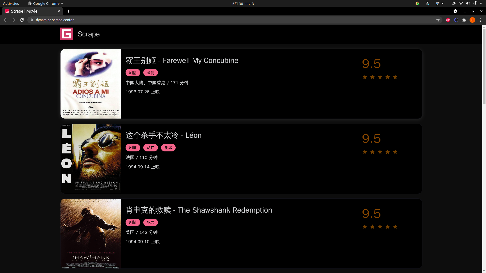

初看之下并没有什么特殊的，但仔细观察可以发现其 Ajax 请求接口和每部电影的 URL 都包含了加密参数。

比如我们点击任意一部电影，观察一下 URL 的变化，如图所示。

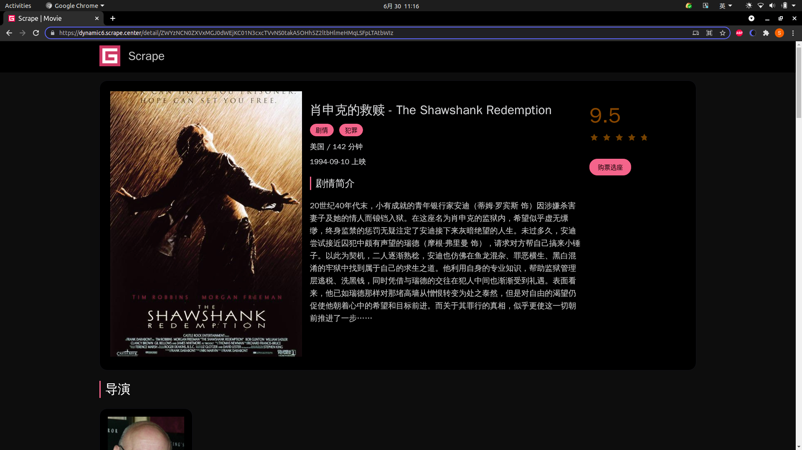

可以看到详情页的 URL 包含了一个长字符串，看似是一个 Base64 编码的内容。

那么接下来看看 Ajax 的请求，从列表页的第 1 页到第 10 页依次点一下，观察 Ajax 请求，如图所示。

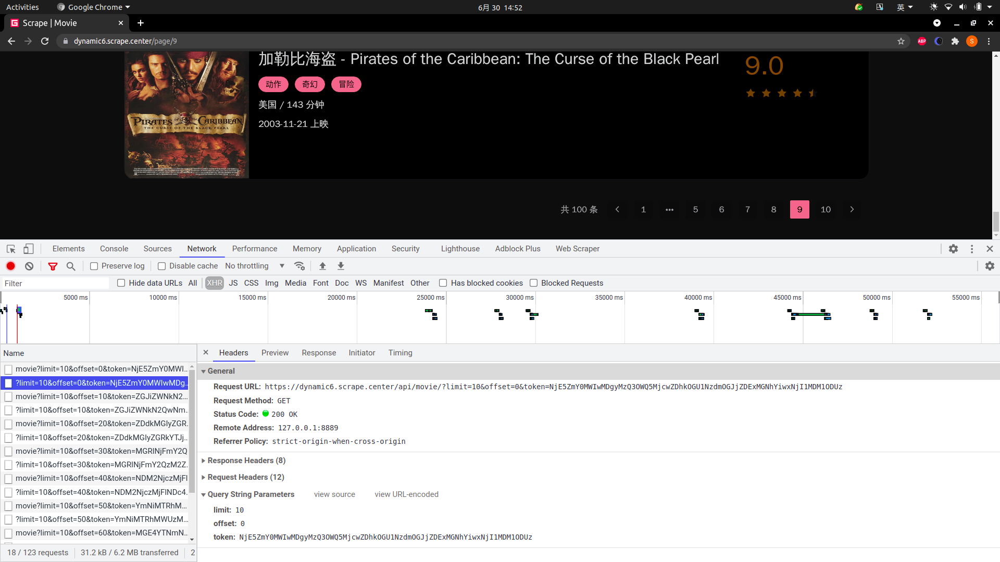

可以看到 Ajax 接口的 URL 里面多了一个 ```token```，而且不同的页码 ```token``` 是不一样的，这个 ```token``` 同样看似是一个 Base64 编码的字符串。

而这个接口还是有时效性的，如果我们把 Ajax 接口 URL 直接复制下来，短期内是可以访问的，但是过段时间之后就无法访问了，会直接返回 401 状态码。

接下来我们再看下列表页的返回结果，打开第一个请求，看看第一部电影数据的返回结果，如图所示。

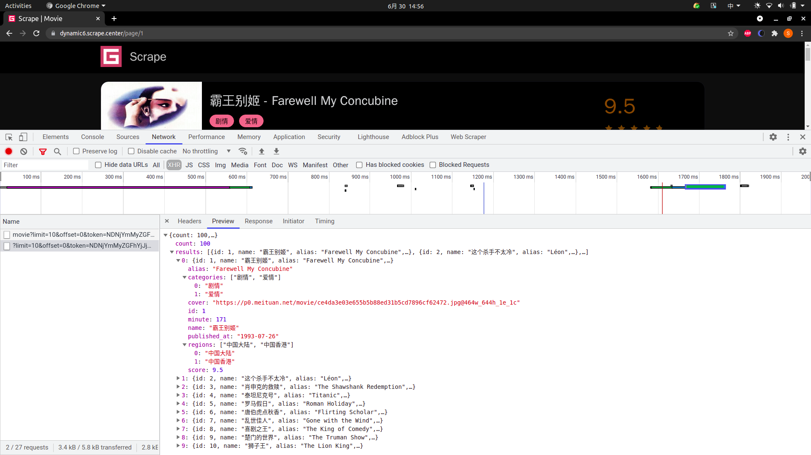

这里我们把看似是第一部电影的返回结果全展开了，但是刚才我们观察到第一部电影的 URL
的链接却为 [https://dynamic6.scrape.center/detail/ZWYzNCN0ZXVxMGJ0dWEjKC01N3cxcTVvNS0takA5OHh5Z2ltbHlmeHMqLSFpLTAtbWIx](https://dynamic6.scrape.center/detail/ZWYzNCN0ZXVxMGJ0dWEjKC01N3cxcTVvNS0takA5OHh5Z2ltbHlmeHMqLSFpLTAtbWIx)

看起来是 ```Base64``` 编码，解码一下，[link](https://stackabuse.com/encoding-and-decoding-base64-strings-in-python)

结果为

```textmate
ef34#teuq0btua#(-57w1q5o5--j@98xygimlyfxs*-!i-0-mb1
```

但是看起来似乎还是毫无规律，这个解码后的结果又是怎么来的呢？返回结果里面也并不包含这个字符串，那这又是怎么构造的呢？

再然后，这仅仅是某一个详情页页面的 URL，其真实数据是通过 Ajax 加载的，那么 Ajax 请求又是怎样的呢，如图所示。

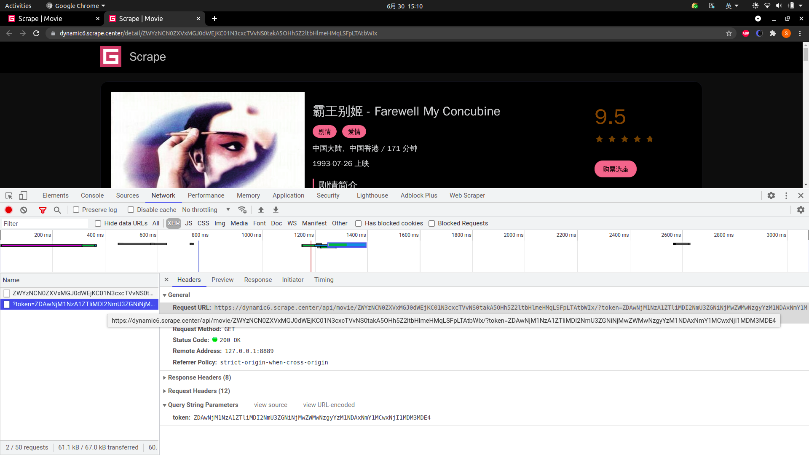

这里我们发现其 Ajax 接口除了包含刚才所说的 URL 中携带的字符串，又多了一个 ```token```，同样也是类似 ```Base64``` 编码的内容。

那么总结下来这个网站就有如下特点：

* 列表页的 Ajax 接口参数带有加密的 ```token```
* 详情页的 URL 带有加密 ```id```
* 详情页的 Ajax 接口参数带有加密 ```id``` 和加密 ```token```

那如果我们要想通过接口的形式来爬取，必须要把这些加密 ```id``` 和 ```token``` 构造出来才行，而且必须要一步步来，首先我们要构造出列表页 Ajax 接口的 ```token```
参数，然后才能获取每部电影的数据信息，然后根据数据信息构造出加密 ```id``` 和 ```token```。

到现在为止我们就知道了这个网站接口的加密情况了，下一步就是去找这个加密实现逻辑了。

由于是网页，所以其加密逻辑一定藏在前端代码中，但前面我们也说了，前端为了保护其接口加密逻辑不被轻易分析出来，会采取压缩、混淆的方式来加大分析的难度。

接下来，我们就来看看这个网站的源代码和 JavaScript 文件是怎样的。

首先看看网站源代码，我们在网站上点击右键，弹出选项菜单，然后点击“查看源代码”，可以看到结果如图所示。

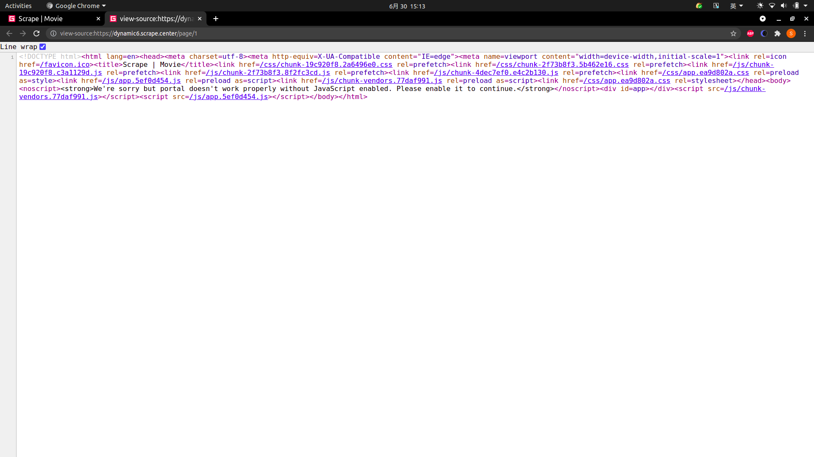

内容如下：

```html
<!DOCTYPE html>
<html lang=en>
<head>
    <meta charset=utf-8>
    <meta http-equiv=X-UA-Compatible content="IE=edge">
    <meta name=viewport content="width=device-width,initial-scale=1">
    <link rel=icon href=/favicon.ico>
    <title>Scrape | Movie</title>
    <link href=/css/chunk-19c920f8.2a6496e0.css rel=prefetch>
    <link href=/css/chunk-2f73b8f3.5b462e16.css rel=prefetch>
    <link href=/js/chunk-19c920f8.c3a1129d.js rel=prefetch>
    <link href=/js/chunk-2f73b8f3.8f2fc3cd.js rel=prefetch>
    <link href=/js/chunk-4dec7ef0.e4c2b130.js rel=prefetch>
    <link href=/css/app.ea9d802a.css rel=preload as=style>
    <link href=/js/app.5ef0d454.js rel=preload as=script>
    <link href=/js/chunk-vendors.77daf991.js rel=preload as=script>
    <link href=/css/app.ea9d802a.css rel=stylesheet>
</head>
<body>
<noscript><strong>We're sorry but portal doesn't work properly without JavaScript enabled. Please enable it to
    continue.</strong></noscript>
<div id=app></div>
<script src=/js/chunk-vendors.77daf991.js></script>
<script src=/js/app.5ef0d454.js></script>
</body>
</html>
```

这是一个典型的 SPA(单页 Web 应用)的页面， 其 JavaScript 文件名带有编码字符、chunk、vendors 等关键字，整体就是经过 Webpack
打包压缩后的源代码，目前主流的前端开发，如 ```Vue.js、React.js``` 的输出结果都是类似这样的结果。

再看下其 JavaScript 代码是什么样子的，我们在开发者工具中打开 Sources 选项卡下的 Page 选项卡，然后打开 js 文件夹，这里我们就能看到 JavaScript 的源代码，如图所示。

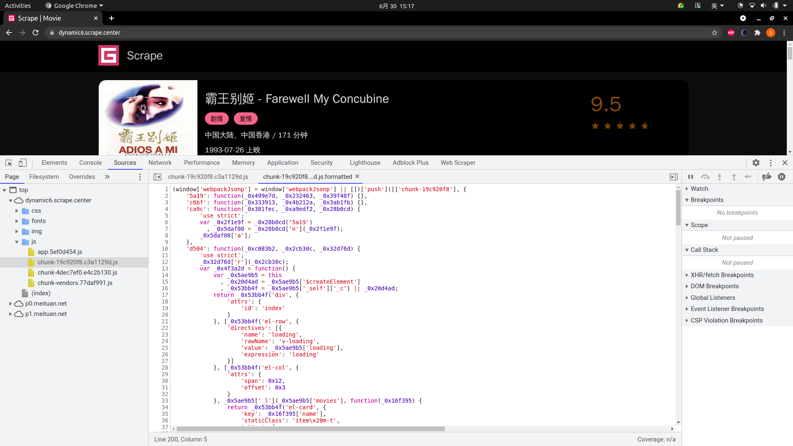

可以看到一些变量都是一些十六进制字符串，而且代码全被压缩了。

而我们就是要从这里面找出 ```token``` 和 ```id``` 的构造逻辑。

要完全分析出整个网站的加密逻辑还是有一定难度的，本课时会一步步地讲解逆向的思路、方法和技巧，如果能跟着这个过程学习完，相信还是能学会一定的 JavaScript 逆向技巧的。

```textmate
为了适当降低难度，本课时案例的 JavaScript 混淆其实并没有设置的特别复杂，并没有开启字符串编码、控制流扁平化等混淆方式。
```

---

## 列表页 Ajax 入口寻找

接下来，我们就开始第一步入口的寻找吧，这里简单介绍两种寻找入口的方式：

* 全局搜索标志字符串
* 设置 Ajax 断点。

---

### 全局搜索标志字符串

一些关键的字符串通常会作为找寻 JavaScript 混淆入口的依据，我们可以通过全局搜索的方式来查找，然后根据搜索到的结果大体观察是否是我们想找的入口。

然后，我们重新打开列表页的 Ajax 接口，看下请求的 Ajax 接口，如图所示。

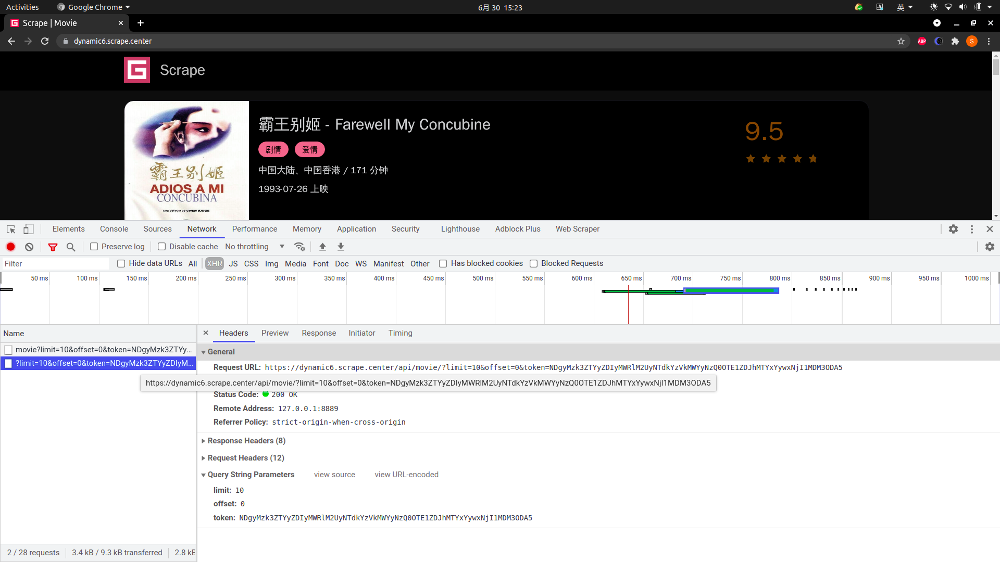

这里的 Ajax 接口的 URL
为 [https://dynamic6.scrape.center/api/movie/?limit=10&offset=0&token=NDgyMzk3ZTYyZDIyMWRlM2UyNTdkYzVkMWYyNzQ0OTE1ZDJhMTYxYywxNjI1MDM3ODA5](https://dynamic6.scrape.center/api/movie/?limit=10&offset=0&token=NDgyMzk3ZTYyZDIyMWRlM2UyNTdkYzVkMWYyNzQ0OTE1ZDJhMTYxYywxNjI1MDM3ODA5)

可以看到带有 ```limit、offset、token``` 三个参数，入口寻找关键就是找 ```token```，我们全局搜索下 ```token``` 是否存在，可以点击开发者工具右上角的下拉选项卡，然后点击 Search，如图所示。

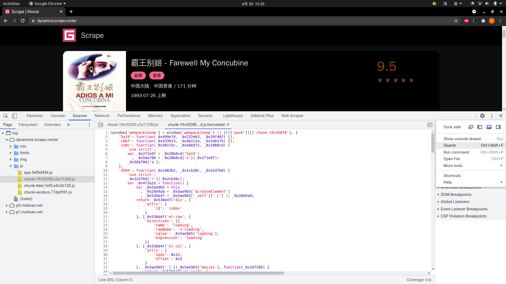

这样我们就能进入到一个全局搜索模式，搜索 ```token```，可以看到的确搜索到了几个结果，如图所示。

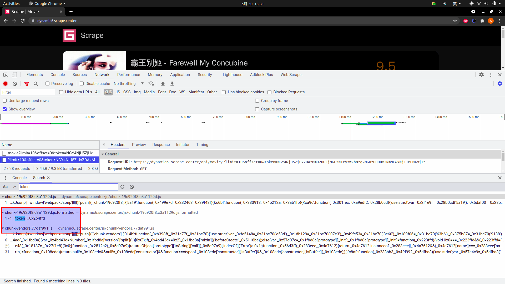

观察一下，下面的两个结果可能是我们想要的，我们点击进入第一个看下，定位到了一个 JavaScript 文件，如图所示。

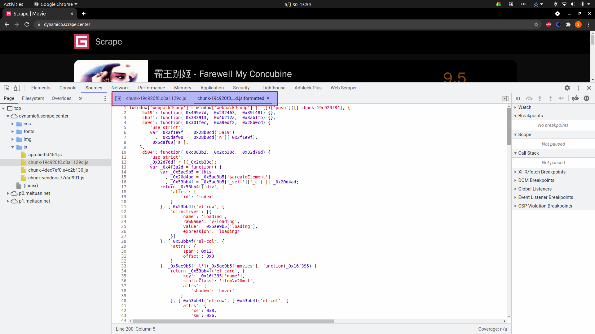

这时可以看到这里弹出来了一个新的选项卡，其名称是 JavaScript 文件名加上了 ```:formatted```，代表格式化后代码结果，在这里我们再次定位到 ```token``` 观察一下。

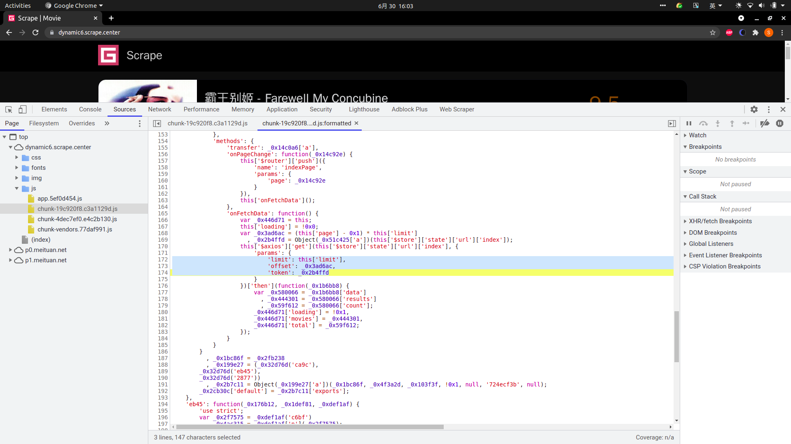

可以看到这里有 ```limit、offset、token```，然后观察下其他的逻辑，基本上能够确定这就是构造 Ajax 请求的地方了，如果不是的话可以继续搜索其他的文件观察下。

那现在，混淆的入口点我们就成功找到了，这是一个首选的找入口的方法。

---

### XHR 断点

这里的 ```token``` 字符串并没有被混淆，所以上面的这个方法是奏效的。但这种字符串由于非常容易成为找寻入口点的依据，这样的字符串也会被混淆成类似 ```Unicode、Base64、RC4```
的一些编码形式，这样我们就没法轻松搜索到了。

那如果遇到这种情况可以通过打 XHR 断点的方式来寻找入口。

XHR 断点，顾名思义，就是在发起 XHR 的时候进入断点调试模式，JavaScript 会在发起 Ajax 请求的时候停住，这时候我们可以通过当前的调用栈的逻辑顺着找到入口。怎么设置呢？我们可以在 Sources
选项卡的右侧，```XHR/fetch Breakpoints``` 处添加一个断点选项。

首先点击 + 号，然后输入匹配的 URL 内容，由于 Ajax 接口的形式是 ```/api/movie/?limit=10...``` 这样的格式，这里截取一段填进去就好了，这里填的就是 ```/api/movie```，如图所示。

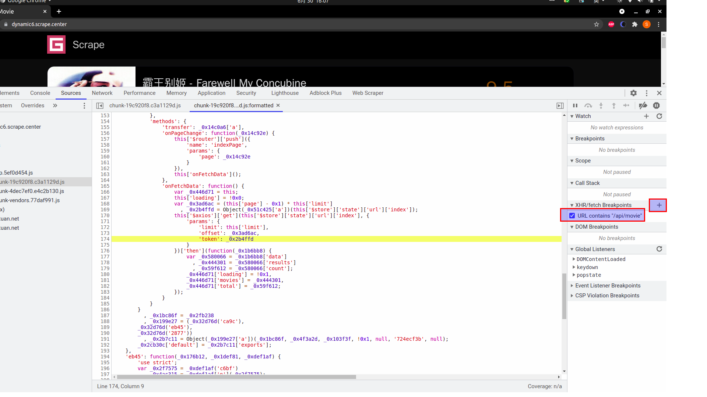

添加完毕之后重新刷新页面，可以发现进入了断点模式，如图所示。

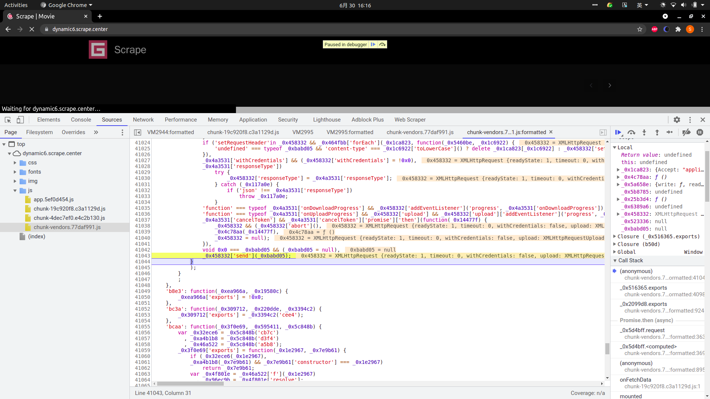

那这里看到有个 ```send``` 的字符，可以初步猜测这就是相当于发送 Ajax 请求的一瞬间。

到了这里感觉 Ajax 马上就要发出去了，而我们想找的是构造 Ajax 的时刻来分析 Ajax 参数。这里我们可以通过调用栈就可以找回去。点击右侧的 Call Stack，这里记录了 JavaScript 的方法逐层调用过程，如图所示。

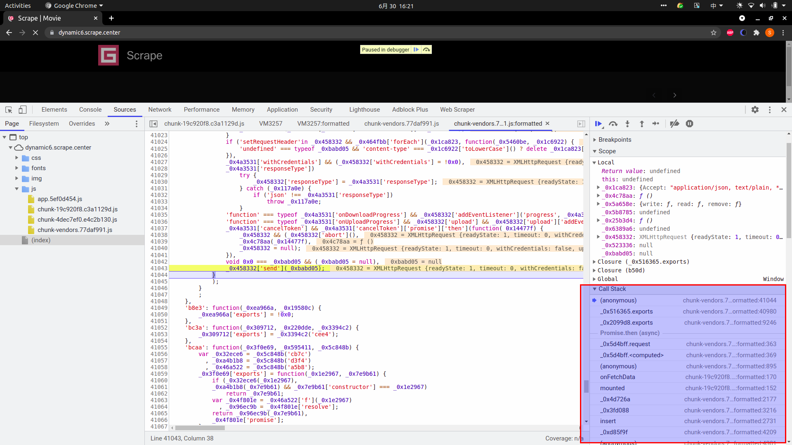

这里当前指向的是一个名字为 ```anonymouns```，也就是匿名的调用，在它的下方就显示了调用这个 ```anonymouns``` 的方法，名字叫作 ```0x516365```
，然后再下一层就又显示了调用 ```0x516365``` 这个方法的方法，依次类推。

这里我们可以逐个往下查找，然后通过一些观察看看有没有 ```token``` 这样的信息，就能找到对应的位置了，最后我们就可以找到 ```onFetchData``` 这个方法里面实现了这个 ```token```
的构造逻辑，这样我们也成功找到 ```token``` 的参数构造的位置了，如图所示。

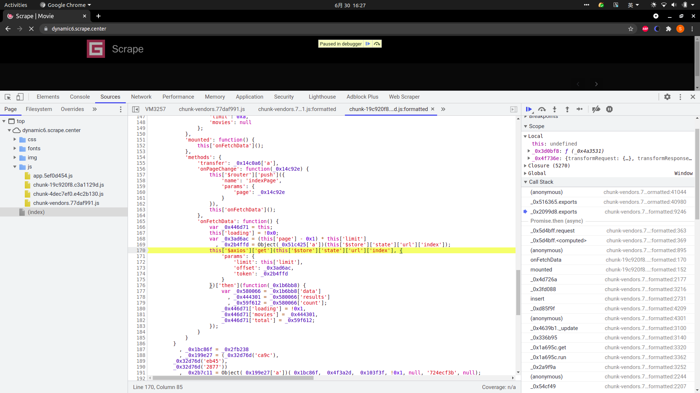

好，到现在为止我们就通过两个方法找到入口点了。

其实还有其他的寻找入口的方式，比如 ```Hook``` 关键函数的方式，稍后的课程里我们会讲到，这里就暂时不讲了。

---

## 列表页加密逻辑寻找

接下来我们已经找到 ```token``` 的位置了，可以观察一下这个 ```token``` 对应的变量叫作 ```_0x2b4ffd```，所以我们的关键就是要找这个变量是哪里来的了。

怎么找呢？我们打个断点看下这个变量是在哪里生成的就好了，我们在对应的行打一个断点，如果打了刚才的 XHR 断点的话可以先取消掉，如图所示。

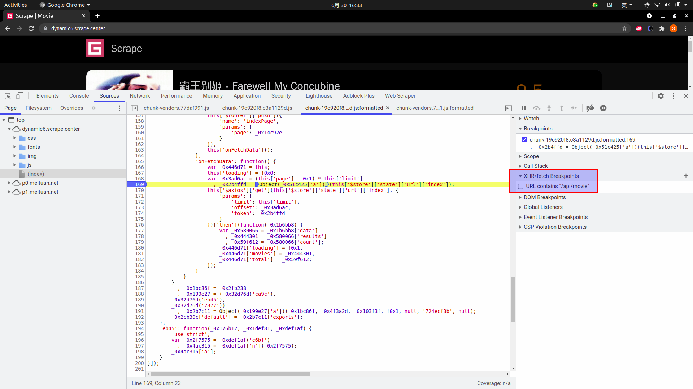

这时候我们就设置了一个新的断点了。由于只有一个断点，可以重新刷新下网页，会发现网页停在了新的断点上面。

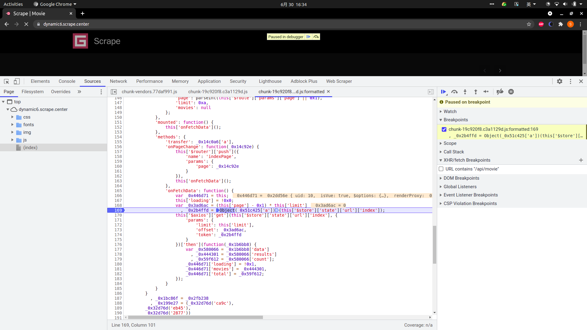

这里我们就可以观察下运行的一些变量了，比如我们把鼠标放在各个变量上面去，可以看到变量的一些值和类型，比如我们看 ```0x51c425``` 这个变量，会有一个浮窗显示，如图所示。

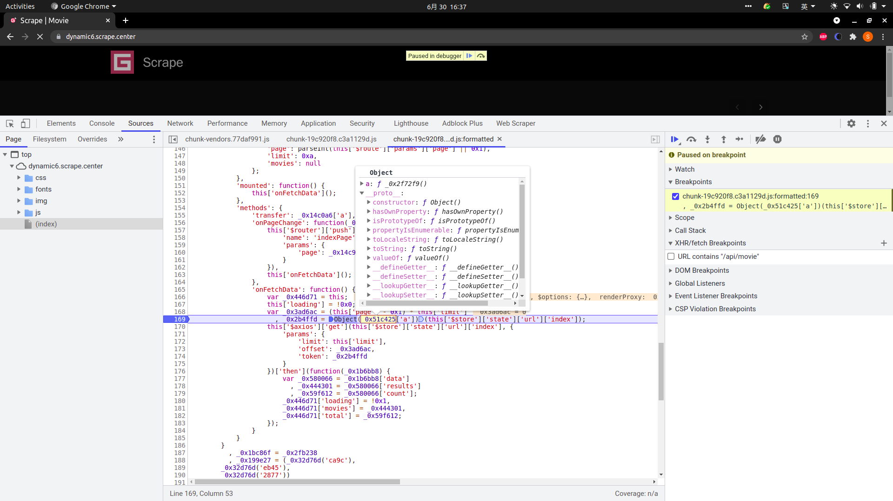

另外我们还可以通过在右侧的 Watch 面板添加想要查看的变量名称，如这行代码的内容为：

```javascript
,
_0x2b4ffd = Object(_0x51c425['a'])(this['$store']['state']['url']['index']);
```

我们比较感兴趣的可能就是 ```_0x51c425``` 还有 ```this``` 里面的这个值了，我们可以展开 Watch 面板，然后点击 + 号，把想看的变量添加到 Watch 面板里面，如图所示。

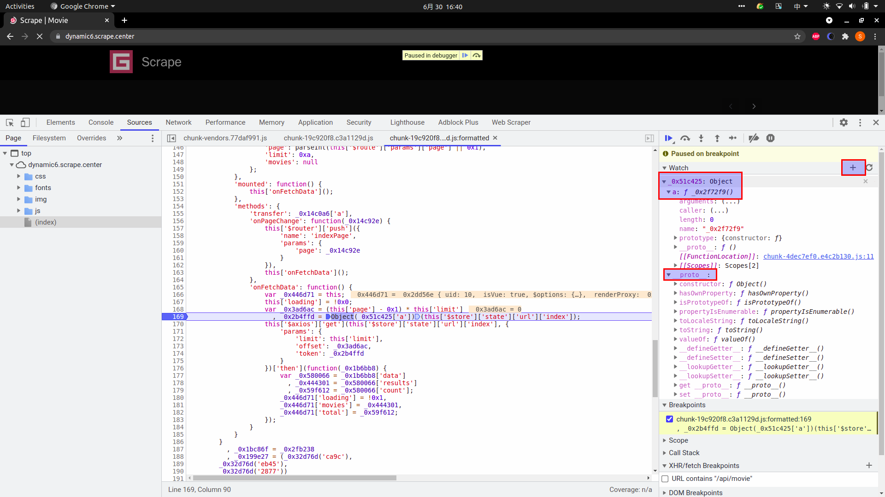

观察下可以发现 ```_0x51c425``` 是一个 ```Object```，它有个 ```a``` 属性，其值是一个 ```function```
，然后 ```this['$store']['state']['url']['index']``` 的值其实就是 ```/api/movie```，就是 Ajax 请求 URL 的 Path。```_0x2b4ffd```
就是调用了前者这个 ```function``` 然后传入了 ```/api/movie``` 得到的。

那么下一步就是去寻找这个 ```function``` 在哪里了，我们可以把 Watch 面板的 ```_0x51c425``` 展开，这里会显示一个 ```FunctionLocation```，就是这个 ```function```
的代码位置，如图所示。

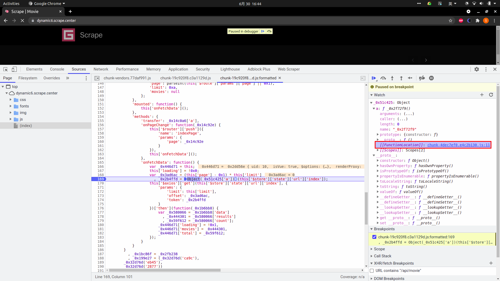

点击进入之后发现其仍然是未格式化的代码，再次点击 {} 格式化代码。

这时候我们就进入了一个新的名字为 ```_0x2f72f9``` 的方法里面，这个方法里面应该就是 ```token``` 的生成逻辑了，我们再打上断点，然后执行面板右上角蓝色箭头状的 Resume 按钮，如图所示。

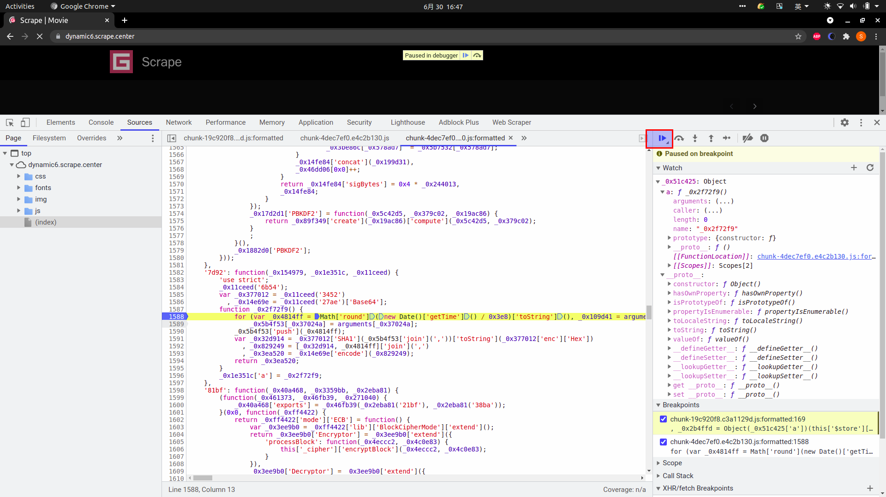

这时候发现我们已经单步执行到这个位置了。

```javascript
function _0x2f72f9() {
    for (var _0x4814ff = Math['round'](new Date()['getTime']() / 0x3e8)['toString'](), _0x109d41 = arguments['length'], _0x5b4f53 = new Array(_0x109d41), _0x37024a = 0x0; _0x37024a < _0x109d41; _0x37024a++)
        _0x5b4f53[_0x37024a] = arguments[_0x37024a];
    _0x5b4f53['push'](_0x4814ff);
    var _0x32d914 = _0x377012['SHA1'](_0x5b4f53['join'](','))['toString'](_0x377012['enc']['Hex'])
        , _0x829249 = [_0x32d914, _0x4814ff]['join'](',')
        , _0x3ea520 = _0x14e69e['encode'](_0x829249);
    return _0x3ea520;
}
```

接下来我们不断进行单步调试，观察这里面的执行逻辑和每一步调试过程中结果都有什么变化，如图所示。

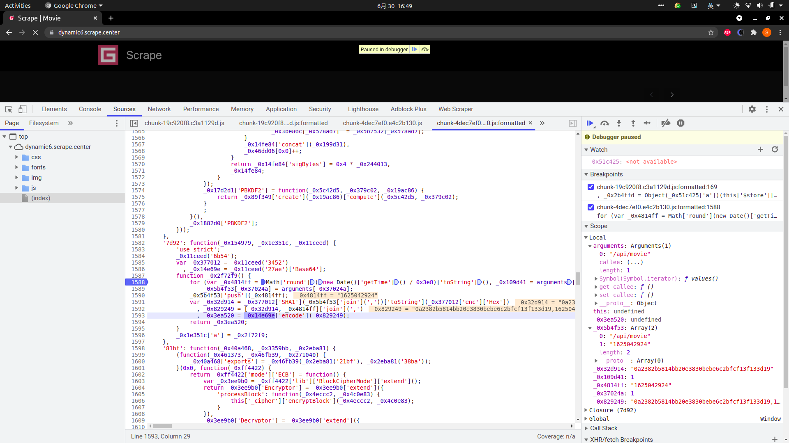

在每步的执行过程中，我们可以发现一些运行值会被打到代码的右侧并带有高亮表示，同时在 watch 面板还能看到每步的变量的具体结果。

最后我们总结出这个 ```token``` 的构造逻辑如下：

* 传入的 ```/api/movie``` 会构造一个初始化列表，变量命名为 ```param1```
* 获取当前的时间戳，命名为 ```param2```，```push``` 到 ```param1``` 这个变量里面
* 将 ```param1``` 变量用 "," 拼接，然后进行 ```SHA1``` 编码，命名为 ```param3```
* 将 ```param3``` (```SHA1``` 编码的结果)和 ```param2``` （时间戳）用逗号拼接，命名为 ```param4```
* 将 ```param4```进行 ```Base64``` 编码，命名为 ```param5```，得到最后的 ```token```

以上的一些逻辑经过反复的观察就可以比较轻松地总结出来了，其中有些变量可以实时查看，构造逻辑可以通过 ```_0x2f72f9()``` 方法得到，同时也可以自己输入到控制台上进行反复验证。

加密逻辑我们就分析出来了，基本的思路就是：

* 先将 ```/api/movie``` 放到一个列表里面
* 列表中加入当前时间戳
* 将列表内容用逗号拼接
* 将拼接的结果进行 ```SHA1``` 编码
* 将编码的结果和时间戳再次拼接
* 将拼接后的结果进行 ```Base64``` 编码

验证下逻辑没问题的话，我们就可以用 Python 来实现出来。

---

## Python 实现列表页的爬取

要用 Python 实现这个逻辑，需要借助于两个库，一个是 ```hashlib```，它提供了 ```sha1``` 方法；另外一个是 ```base64``` 库，它提供了 ```b64encode```
方法对结果进行 ```Base64``` 编码。

代码实现[如下](../../codes/Module_4/lecture_28/lecture_28_2.py)：

```python
# -*- coding: utf-8 -*-


import hashlib
import time
import base64
from typing import List, Any
import requests

headers = {
    'Accept-Encoding': 'gzip, deflate, sdch',
    'Accept-Language': 'en-US,en;q=0.8',
    'User-Agent': 'Mozilla/5.0 (X11; Linux x86_64) AppleWebKit/537.36 (KHTML, like Gecko) HeadlessChrome/91.0.4472.101 Safari/537.36',
    'Accept': 'text/html,application/xhtml+xml,application/xml;q=0.9,image/webp,*/*;q=0.8',
    'Connection': 'keep-alive',
}

INDEX_URL = 'https://dynamic6.scrape.center/api/movie?limit={limit}&offset={offset}&token={token}'
LIMIT = 10
OFFSET = 0


def get_token(args: List[Any]):
    """

    :param args:
    :return:
    """
    timestamp = str(int(time.time()))
    args.append(timestamp)
    sign = hashlib.sha1(','.join(args).encode('utf-8')).hexdigest()
    return base64.b64encode(','.join([sign, timestamp]).encode('utf-8')).decode('utf-8')


args = ['/api/movie']
token = get_token(args=args)
index_url = INDEX_URL.format(limit=LIMIT, offset=OFFSET, token=token)
response = requests.get(index_url, headers=headers)
print('response')
print(response.json())
```

结果为:

```json5
{
  'count': 100,
  'results': [
    {
      'id': 1,
      'name': '霸王别姬',
      'alias': 'Farewell My Concubine',
      'cover': 'https://p0.meituan.net/movie/ce4da3e03e655b5b88ed31b5cd7896cf62472.jpg@464w_644h_1e_1c',
      'categories': [
        '剧情',
        '爱情'
      ],
      'published_at': '1993-07-26',
      'minute': 171,
      'score': 9.5,
      'regions': [
        '中国大陆',
        '中国香港'
      ]
    },
    {
      'id': 2,
      'name': '这个杀手不太冷',
      'alias': 'Léon',
      'cover': 'https://p1.meituan.net/movie/6bea9af4524dfbd0b668eaa7e187c3df767253.jpg@464w_644h_1e_1c',
      'categories': [
        '剧情',
        '动作',
        '犯罪'
      ],
      'published_at': '1994-09-14',
      'minute': 110,
      'score': 9.5,
      'regions': [
        '法国'
      ]
    },
    {
      'id': 3,
      'name': '肖申克的救赎',
      'alias': 'The Shawshank Redemption',
      'cover': 'https://p0.meituan.net/movie/283292171619cdfd5b240c8fd093f1eb255670.jpg@464w_644h_1e_1c',
      'categories': [
        '剧情',
        '犯罪'
      ],
      'published_at': '1994-09-10',
      'minute': 142,
      'score': 9.5,
      'regions': [
        '美国'
      ]
    },
    {
      'id': 4,
      'name': '泰坦尼克号',
      'alias': 'Titanic',
      'cover': 'https://p1.meituan.net/movie/b607fba7513e7f15eab170aac1e1400d878112.jpg@464w_644h_1e_1c',
      'categories': [
        '剧情',
        '爱情',
        '灾难'
      ],
      'published_at': '1998-04-03',
      'minute': 194,
      'score': 9.5,
      'regions': [
        '美国'
      ]
    },
    {
      'id': 5,
      'name': '罗马假日',
      'alias': 'Roman Holiday',
      'cover': 'https://p0.meituan.net/movie/289f98ceaa8a0ae737d3dc01cd05ab052213631.jpg@464w_644h_1e_1c',
      'categories': [
        '剧情',
        '喜剧',
        '爱情'
      ],
      'published_at': '1953-08-20',
      'minute': 118,
      'score': 9.5,
      'regions': [
        '美国'
      ]
    },
    {
      'id': 6,
      'name': '唐伯虎点秋香',
      'alias': 'Flirting Scholar',
      'cover': 'https://p0.meituan.net/movie/da64660f82b98cdc1b8a3804e69609e041108.jpg@464w_644h_1e_1c',
      'categories': [
        '喜剧',
        '爱情',
        '古装'
      ],
      'published_at': '1993-07-01',
      'minute': 102,
      'score': 9.5,
      'regions': [
        '中国香港'
      ]
    },
    {
      'id': 7,
      'name': '乱世佳人',
      'alias': 'Gone with the Wind',
      'cover': 'https://p0.meituan.net/movie/223c3e186db3ab4ea3bb14508c709400427933.jpg@464w_644h_1e_1c',
      'categories': [
        '剧情',
        '爱情',
        '历史',
        '战争'
      ],
      'published_at': '1939-12-15',
      'minute': 238,
      'score': 9.5,
      'regions': [
        '美国'
      ]
    },
    {
      'id': 8,
      'name': '喜剧之王',
      'alias': 'The King of Comedy',
      'cover': 'https://p0.meituan.net/movie/1f0d671f6a37f9d7b015e4682b8b113e174332.jpg@464w_644h_1e_1c',
      'categories': [
        '剧情',
        '喜剧',
        '爱情'
      ],
      'published_at': '1999-02-13',
      'minute': 85,
      'score': 9.5,
      'regions': [
        '中国香港'
      ]
    },
    {
      'id': 9,
      'name': '楚门的世界',
      'alias': 'The Truman Show',
      'cover': 'https://p0.meituan.net/movie/8959888ee0c399b0fe53a714bc8a5a17460048.jpg@464w_644h_1e_1c',
      'categories': [
        '剧情',
        '科幻'
      ],
      'published_at': None,
      'minute': 103,
      'score': 9.0,
      'regions': [
        '美国'
      ]
    },
    {
      'id': 10,
      'name': '狮子王',
      'alias': 'The Lion King',
      'cover': 'https://p0.meituan.net/movie/27b76fe6cf3903f3d74963f70786001e1438406.jpg@464w_644h_1e_1c',
      'categories': [
        '动画',
        '歌舞',
        '冒险'
      ],
      'published_at': '1995-07-15',
      'minute': 89,
      'score': 9.0,
      'regions': [
        '美国'
      ]
    }
  ]
}
```

根据上面的逻辑就把加密流程实现出来了，这里我们先模拟爬取了第一页的内容，最后就可以得到最终的输出结果了。

---
---


