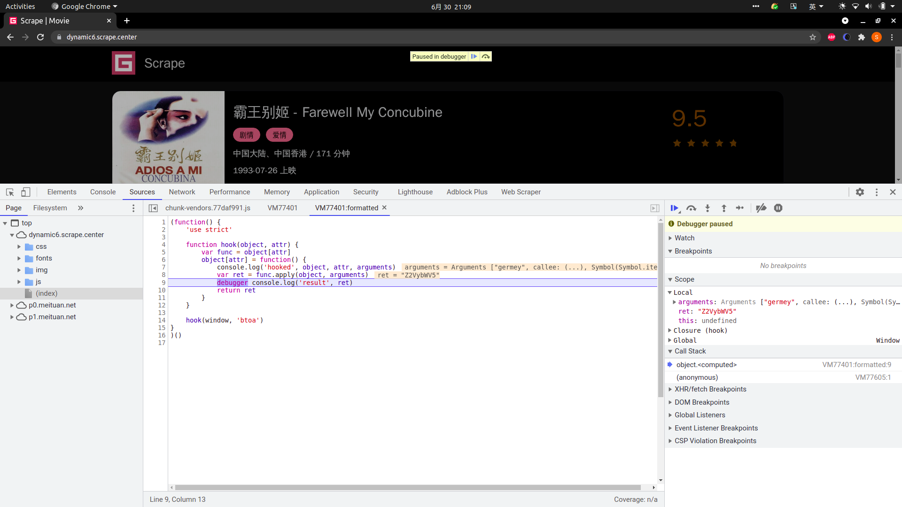

# JavaScript 逆向爬取实战(下)

接着[上一课](lecture_28.md)

---
---

## 详情页加密 id 入口的寻找

接着上一课时的内容往下讲，我们观察下上一步的输出结果，把结果格式化一下：

```json5
{
  'count': 100,
  'results': [
    {
      'id': 1,
      'name': '霸王别姬',
      'alias': 'Farewell My Concubine',
      'cover': 'https://p0.meituan.net/movie/ce4da3e03e655b5b88ed31b5cd7896cf62472.jpg@464w_644h_1e_1c',
      'categories': [
        '剧情',
        '爱情'
      ],
      'published_at': '1993-07-26',
      'minute': 171,
      'score': 9.5,
      'regions': [
        '中国大陆',
        '中国香港'
      ]
    },
    {
      'id': 2,
      'name': '这个杀手不太冷',
      'alias': 'Léon',
      'cover': 'https://p1.meituan.net/movie/6bea9af4524dfbd0b668eaa7e187c3df767253.jpg@464w_644h_1e_1c',
      'categories': [
        '剧情',
        '动作',
        '犯罪'
      ],
      'published_at': '1994-09-14',
      'minute': 110,
      'score': 9.5,
      'regions': [
        '法国'
      ]
    },
    {
      'id': 3,
      'name': '肖申克的救赎',
      'alias': 'The Shawshank Redemption',
      'cover': 'https://p0.meituan.net/movie/283292171619cdfd5b240c8fd093f1eb255670.jpg@464w_644h_1e_1c',
      'categories': [
        '剧情',
        '犯罪'
      ],
      'published_at': '1994-09-10',
      'minute': 142,
      'score': 9.5,
      'regions': [
        '美国'
      ]
    },
    {
      'id': 4,
      'name': '泰坦尼克号',
      'alias': 'Titanic',
      'cover': 'https://p1.meituan.net/movie/b607fba7513e7f15eab170aac1e1400d878112.jpg@464w_644h_1e_1c',
      'categories': [
        '剧情',
        '爱情',
        '灾难'
      ],
      'published_at': '1998-04-03',
      'minute': 194,
      'score': 9.5,
      'regions': [
        '美国'
      ]
    },
    {
      'id': 5,
      'name': '罗马假日',
      'alias': 'Roman Holiday',
      'cover': 'https://p0.meituan.net/movie/289f98ceaa8a0ae737d3dc01cd05ab052213631.jpg@464w_644h_1e_1c',
      'categories': [
        '剧情',
        '喜剧',
        '爱情'
      ],
      'published_at': '1953-08-20',
      'minute': 118,
      'score': 9.5,
      'regions': [
        '美国'
      ]
    },
    {
      'id': 6,
      'name': '唐伯虎点秋香',
      'alias': 'Flirting Scholar',
      'cover': 'https://p0.meituan.net/movie/da64660f82b98cdc1b8a3804e69609e041108.jpg@464w_644h_1e_1c',
      'categories': [
        '喜剧',
        '爱情',
        '古装'
      ],
      'published_at': '1993-07-01',
      'minute': 102,
      'score': 9.5,
      'regions': [
        '中国香港'
      ]
    },
    {
      'id': 7,
      'name': '乱世佳人',
      'alias': 'Gone with the Wind',
      'cover': 'https://p0.meituan.net/movie/223c3e186db3ab4ea3bb14508c709400427933.jpg@464w_644h_1e_1c',
      'categories': [
        '剧情',
        '爱情',
        '历史',
        '战争'
      ],
      'published_at': '1939-12-15',
      'minute': 238,
      'score': 9.5,
      'regions': [
        '美国'
      ]
    },
    {
      'id': 8,
      'name': '喜剧之王',
      'alias': 'The King of Comedy',
      'cover': 'https://p0.meituan.net/movie/1f0d671f6a37f9d7b015e4682b8b113e174332.jpg@464w_644h_1e_1c',
      'categories': [
        '剧情',
        '喜剧',
        '爱情'
      ],
      'published_at': '1999-02-13',
      'minute': 85,
      'score': 9.5,
      'regions': [
        '中国香港'
      ]
    },
    {
      'id': 9,
      'name': '楚门的世界',
      'alias': 'The Truman Show',
      'cover': 'https://p0.meituan.net/movie/8959888ee0c399b0fe53a714bc8a5a17460048.jpg@464w_644h_1e_1c',
      'categories': [
        '剧情',
        '科幻'
      ],
      'published_at': None,
      'minute': 103,
      'score': 9.0,
      'regions': [
        '美国'
      ]
    },
    {
      'id': 10,
      'name': '狮子王',
      'alias': 'The Lion King',
      'cover': 'https://p0.meituan.net/movie/27b76fe6cf3903f3d74963f70786001e1438406.jpg@464w_644h_1e_1c',
      'categories': [
        '动画',
        '歌舞',
        '冒险'
      ],
      'published_at': '1995-07-15',
      'minute': 89,
      'score': 9.0,
      'regions': [
        '美国'
      ]
    }
  ]
}
```

这里我们看到有个 ```id``` 是 1，另外还有一些其他的字段如电影名称、封面、类别，等等，那么这里面一定有什么信息是用来唯一区分某个电影的。

但是呢，这里我们点击下第一个部电影的信息，可以看到它跳转电影详细信息页面，URL 为

[https://dynamic6.scrape.center/detail/ZWYzNCN0ZXVxMGJ0dWEjKC01N3cxcTVvNS0takA5OHh5Z2ltbHlmeHMqLSFpLTAtbWIx](https://dynamic6.scrape.center/detail/ZWYzNCN0ZXVxMGJ0dWEjKC01N3cxcTVvNS0takA5OHh5Z2ltbHlmeHMqLSFpLTAtbWIx)

可以看到这里 URL 里面有一个加密 ```id``` 为 ```ZWYzNCN0ZXVxMGJ0dWEjKC01N3cxcTVvNS0takA5OHh5Z2ltbHlmeHMqLSFpLTAtbWIx```
，那么这个和电影的这些信息有什么关系呢？

这里，如果你仔细观察其实是可以比较容易地找出规律来的，但是这总归是观察出来的，如果遇到一些观察不出规律的那就不好处理了。所以还是需要靠技巧去找到它真正加密的位置。

这时候我们该怎么办呢？首先为我们分析一下，这个加密 ```id``` 到底是什么生成的。

在点击详情页的时候就看到它访问的 URL 里面就带上了 ```ZWYzNCN0ZXVxMGJ0dWEjKC01N3cxcTVvNS0takA5OHh5Z2ltbHlmeHMqLSFpLTAtbWIx``` 这个加密 ```id```
了，而且不同的详情页的加密 ```id``` 是不同的，这说明这个加密 ```id``` 的构造依赖于列表页 Ajax 的返回结果，所以可以确定这个加密 ```id``` 的生成是发生在 Ajax 请求完成后或者点击详情页的一瞬间。

为了进一步确定是发生在何时，我们看看页面源码，可以看到在没有点击之前，详情页链接的 ```href``` 里面就已经带有加密 ```id``` 了，如图所示。


由此我们可以确定，这个加密 ```id``` 是在 Ajax 请求完成之后生成的，而且肯定也是由 JavaScript 生成的了。

那怎么再去查找 Ajax 完成之后的事件呢？是否应该去找 Ajax 完成之后的事件呢？

可以是可以，我们可以看到在 Sources 面板的右侧，有一个 Event Listener Breakpoints，这里有一个 XHR 的监听，包括发起时、成功后、发生错误时的一些监听，这里我们勾选上 readystatechange
事件，代表 Ajax 得到响应时的事件，其他的断点可以都删除了，然后刷新下页面看下，如图所示。


可以看到就停在了 Ajax 得到响应时的位置了。

那我们怎么才能弄清楚这个 ```id``` 是怎么加密的呢？可以选择一个断点一个断点地找下去，但估计找的过程会崩溃掉，因为这里可能会逐渐调用到页面 UI 渲染的一些底层实现，甚至可能即使找到了也不知道具体找到哪里去了。

这里我们再介绍一种定位的方法，那就是 ```Hook```。

```Hook``` 技术中文又叫作钩子技术，它就是在程序运行的过程中，对其中的某个方法进行重写，在原有的方法前后加入我们自定义的代码。相当于在系统没有调用该函数之前，钩子程序就先捕获该消息，可以先得到控制权，这时钩子函数便可以加工处理(
改变)该函数的执行行为。

通俗点来说，比如我要 ```Hook``` 一个方法 ```a```，可以先临时用一个变量存一下，把它存成 ```_a```，然后呢，我再重新声明一个方法 ```a```
，里面添加自己的逻辑，比如加点调试语句、输出语句等等，然后再调用 ```_a```，这里调用的 ```_a``` 就是之前的 ```a```。

这样就相当于新的方法 ```a``` 里面混入了我们自己定义的逻辑，同时又把原来的方法 ```a``` 也执行了一遍。所以这不会影响原有的执行逻辑和运行效果，但是我们通过这种改写便可以顺利在原来的 ```a```
方法前后加上了我们自己的逻辑，这就是 ```Hook```。

那么，我们这里怎么用 ```Hook``` 的方式来找到加密 ```id``` 的加密入口点呢？

想一下，这个加密 ```id``` 是一个 ```Base64``` 编码的字符串，那么生成过程中想必就调用了 JavaScript 的 ```Base64``` 编码的方法，这个方法名叫作 ```btoa```，这个 ```btoa```
方法可以将参数转化成 ```Base64``` 编码。当然 ```Base64``` 也有其他的实现方式，比如利用 ```crypto-js``` 这个库实现的，这个可能底层调用的就不是 ```btoa``` 方法了。

所以，其实现在并不确定是不是调用的 ```btoa``` 方法实现的 ```Base64``` 编码，那就先试试吧。要实现 ```Hook```，其实关键在于将原来的方法改写，这里我们其实就是 ```Hook btoa```
这个方法了，```btoa``` 这个方法属于 ```window``` 对象，我们将 ```window``` 对象的 ```btoa``` 方法进行改写即可。

改写的逻辑如下：

```javascript
(function () {
    'use strict'

    function hook(object, attr) {
        var func = object[attr]
        object[attr] = function () {
            console.log('hooked', object, attr, arguments)
            var ret = func.apply(object, arguments)
            debugger
            console.log('result', ret)
            return ret
        }
    }

    hook(window, 'btoa')
})()
```

我们定义了一个 ```hook``` 方法，传入 ```object``` 和 ```attr``` 参数，意思就是 ```Hook object``` 对象的 ```attr``` 参数。例如我们如果想 ```Hook```
一个 ```alert``` 方法，那就把 ```object``` 设置为 ```window```，把 ```attr``` 设置为 ```alert``` 字符串。这里我们想要 ```Hook Base64```
的编码方法，那么这里就只需要 ```Hook window``` 对象的 ```btoa``` 方法就好了。

我们来看下，首先是 ```var func = object[attr]```，相当于先把它赋值为一个变量，我们调用 ```func```
方法就可以实现和原来相同的功能。接着，我们再直接改写这个方法的定义，直接改写 ```object[attr]```，将其改写成一个新的方法，在新的方法中，通过 ```func.apply``` 方法又重新调用了原来的方法。

这样我们就可以保证，前后方法的执行效果是不受什么影响的，之前这个方法该干啥就还是干啥的。但是和之前不同的是，我们自定义方法之后，现在可以在 ```func``` 方法执行的前后，再加入自己的代码，如 ```console.log```
将信息输出到控制台，如 ```debugger``` 进入断点等等。

这个过程中，我们先临时保存下来了 ```func``` 方法，然后定义一个新的方法，接管程序控制权，在其中自定义我们想要的实现，同时在新的方法里面再重新调回 ```func```
方法，保证前后结果是不受影响的。所以，我们达到了在不影响原有方法效果的前提下，可以实现在方法的前后实现自定义的功能，就是 ```Hook``` 的完整实现过程。

最后，我们调用 ```hook``` 方法，传入 ```window``` 对象和 ```btoa``` 字符串即可。

那这样，怎么去注入这个代码呢？这里我们介绍三种注入方法。

* 直接控制台注入
* 复写 JavaScript 代码
* Tampermonkey 注入

---

### 控制台注入

对于我们这个场景，控制台注入其实就够了，我们先来介绍这个方法。

其实控制台注入很简单，就是直接在控制台输入这行代码运行，如图所示。


执行完这段代码之后，相当于我们就已经把 ```window``` 的 ```btoa``` 方法改写了，可以控制台调用下 ```btoa``` 方法试试，如：

```javascript
btoa('germey')
```

回车之后就可以看到它进入了我们自定义的 debugger 的位置停下了，如图所示。



我们把断点向下执行，点击 Resume 按钮，然后看看控制台的输出，可以看到也输出了一些对应的结果，如被 ```Hook``` 的对象，```Hook``` 的属性，调用的参数，调用后的结果等，如图所示。


这里我们就可以看到，我们通过 ```Hook``` 的方式改写了 ```btoa``` 方法，使其每次在调用的时候都能停到一个断点，同时还能输出对应的结果。

接下来我们看下怎么用 ```Hook``` 找到对应的加密 ```id``` 的加密入口？

由于此时我们是在控制台直接输入的 ```Hook``` 代码，所以页面一旦刷新就无效了，但由于我们这个网站是 SPA 式的页面，所以在点击详情页的时候页面是不会整个刷新的，所以这段代码依然还会生效。但是如果不是 SPA
式的页面，即每次访问都需要刷新页面的网站，这种注入方式就不生效了。

我们的目的是为了 ```Hook``` 列表页 Ajax 加载完成后的加密 ```id``` 的 ```Base64``` 编码的过程，那怎么在不刷新页面的情况下再次复现这个操作呢？很简单，点下一页就好了。

这时候我们可以点击第 2 页的按钮，可以看到它确实再次停到了 ```Hook``` 方法的 debugger 处，由于列表页的 Ajax 和加密 ```id``` 都会带有 ```Base64``` 编码的操作，因此它每一个都能 Hook
到，通过观察对应的 Arguments 或当前网站的行为或者观察栈信息，我们就能大体知道现在走到了哪个位置了，从而进一步通过栈的调用信息找到调用 Base64 编码的位置。

我们可以根据调用栈的信息来观察这些变量是在哪一层发生变化的，比如最后的这一层，我们可以很明显看到它执行了 ```Base64``` 编码，编码前的结果是：

```textmate
ef34#teuq0btua#(-57w1q5o5--j@98xygimlyfxs\*-!i-0-mb1
```

编码后的结果是：

```textmate
ZWYzNCN0ZXVxMGJ0dWEjKC01N3cxcTVvNS0takA5OHh5Z2ltbHlmeHMqLSFpLTAtbWIx
```

如图所示。


这里很明显。

那么核心问题就来了，编码前的结果 ```ef34#teuq0btua#(-57w1q5o5--j@98xygimlyfxs*-!i-0-mb1```
又是怎么来的呢？我们展开栈的调用信息，一层层看看这个字符串的变化情况。如果不变那就看下一层，如果变了那就停下来仔细看看。

最后可以在第五层找到它的变化过程，如图所示。


那这里我们就一目了然了，看到了 ```_0x2a20db``` 是一个写死的字符串 ```ef34#teuq0btua#(-57w1q5o5--j@98xygimlyfxs*-!i-0-mb```
，然后和传入的这个 ```0x2f0999``` 拼接起来就形成了最后的字符串。

那这个 ```0x2f0999``` 又是怎么来的呢？再往下追一层，那就一目了然了，其实就是 Ajax 返回结果的单个电影信息的 ```id```。

所以，这个加密逻辑的就清楚了，其实非常简单，就是 ```ef34#teuq0btua#(-57w1q5o5--j@98xygimlyfxs*-!i-0-mb1``` 加上电影 ```id```，然后 ```Base64``` 编码即可。

到此，我们就成功用 ```Hook``` 的方式找到加密的 ```id``` 生成逻辑了。

刚才其实也说了，我们的 Hook 代码是在控制台手动输入的，一旦刷新页面就不生效了，这的确是个问题。而且它必须是在页面加载完了才注入的，所以它并不能在一开始就生效。

下面我们再介绍几种 Hook 注入方式。

---

### 重写 JavaScript

我们可以借助于 Chrome 浏览器的 Overrides 功能实现某些 JavaScript 文件的重写和保存，它会在本地生成一个 JavaScript 文件副本，以后每次刷新的时候会使用副本的内容。

这里我们需要切换到 Sources 选项卡的 Overrides 选项卡，然后选择一个文件夹，比如这里我自定了一个文件夹名字叫作 ```modify```，如图所示。


随便选一个 JavaScript 脚本，后面贴上这段注入脚本，如图所示。


保存文件。此时可能提示页面崩溃，但是不用担心，重新刷新页面就好了，这时候我们就发现现在浏览器加载的 JavaScript 文件就是我们修改过后的了，文件的下方会有一个标识符，如图所示。


同时我们还注意到这时候它就直接进入了断点模式，成功 ```Hook``` 到了 ```btoa``` 这个方法了。其实 Overrides 的这个功能非常有用，有了它我们可以持久化保存我们任意修改的 JavaScript
代码，所以我们想在哪里改都可以了，甚至可以直接修改 JavaScript 的原始执行逻辑也都是可以的。

---

### Tampermonkey 注入

如果我们不想用 Overrides 的方式改写 JavaScript 的方式注入的话，还可以借助于浏览器插件来实现注入，这里推荐的浏览器插件叫作 Tampermonkey，中文叫作“油猴”。它是一款浏览器插件，支持
Chrome。利用它我们可以在浏览器加载页面时自动执行某些 JavaScript 脚本。由于执行的是 JavaScript，所以我们几乎可以在网页中完成任何我们想实现的效果，如自动爬虫、自动修改页面、自动响应事件等等。

首先我们需要安装 Tampermonkey，这里我们使用的浏览器是 Chrome。直接在 Chrome 应用商店或者在 Tampermonkey
的官网 [https://www.tampermonkey.net/](https://www.tampermonkey.net/) 下载安装即可。

安装完成之后，在 Chrome 浏览器的右上角会出现 Tampermonkey 的图标，这就代表安装成功了。


我们也可以自己编写脚本来实现想要的功能，只要懂一些 JavaScript 的语法即可。另外除了懂 JavaScript 语法，我们还需要遵循脚本的一些写作规范，这其中就包括一些参数的设置。

下面我们就简单实现一个小的脚本，实现某个功能。

首先我们可以点击 Tampermonkey 插件图标，点击“管理面板”按钮，打开脚本管理页面 Dashboard。

界面类似显示如下图所示。


在这里会显示了已经有的一些 Tampermonkey 脚本，包括我们自行创建的，也包括从第三方网站下载安装的。

另外这里也提供了编辑、调试、删除等管理功能，我们可以方便地对脚本进行管理。接下来我们来创建一个新的脚本来试试，点击左侧的“+”号，会显示如图所示的页面。


初始化的代码如下：

```javascript
// ==UserScript==
// @name         New Userscript
// @namespace    http://tampermonkey.net/
// @version      0.1
// @description  try to take over the world!
// @author       You
// @match        https://dynamic6.scrape.center/
// @icon         https://www.google.com/s2/favicons?domain=scrape.center
// @grant        none
// ==/UserScript==

(function () {
    'use strict';

    // Your code here...
})();
```

这里最上面是一些注释，但这些注释是非常有用的，这部分内容叫作 ```UserScript Header``` ，我们可以在里面配置一些脚本的信息，如名称、版本、描述、生效站点等等。

在 ```UserScript Header``` 下方是 JavaScript 函数和调用的代码，其中 ```use strict``` 标明代码使用 JavaScript 的严格模式，在严格模式下可以消除 Javascript
语法的一些不合理、不严谨之处，减少一些怪异行为，如不能直接使用未声明的变量，这样可以保证代码的运行安全，同时提高编译器的效率，提高运行速度。在下方 // Your code here... 这里我们就可以编写自己的代码了。

将脚本改写为[如下](../../codes/Module_4/lecture_29/file.js)内容：

```javascript
// ==UserScript==
// @name         HookBase64
// @namespace   https://scrape.center/
// @version     0.1
// @description Hook Base64 encode function
// @author       Germey
// @match       https://dynamic6.scrape.center/
// @grant       none
// @run-at     document-start
// ==/UserScript==
(function () {
    'use strict'

    function hook(object, attr) {
        var func = object[attr]
        console.log('func', func)
        object[attr] = function () {
            console.log('hooked', object, attr)
            var ret = func.apply(object, arguments)
            debugger
            return ret
        }
    }

    hook(window, 'btoa')
})()
```

这时候启动脚本，重新刷新页面，可以发现也可以成功 ```Hook``` 住 ```btoa``` 方法，如图所示。


然后我们再顺着找调用逻辑就好啦。

以上，我们就成功通过 ```Hook``` 的方式找到加密 ```id``` 的实现了。

---

## 详情页 Ajax 的 token 寻找

现在我们已经找到详情页的加密 ```id``` 了，但是还差一步，其 Ajax 请求也有一个 ```token```，如图所示。


其实这个 ```token``` 和详情页的 ```token``` 构造逻辑是一样的了。

这里就不再展开说了，可以运用上文的几种找入口的方法来找到对应的加密逻辑。

---

## Python 实现详情页爬取

现在我们已经成功把详情页的加密 ```id``` 和 Ajax 请求的 ```token``` 找出来了，下一步就能使用 Python 完成爬取了，这里只实现第一页的爬取了，代码示例如下：

```python
# -*- coding: utf-8 -*-


import hashlib
import time
import base64
from typing import List, Any
import requests

headers = {
    'Accept-Encoding': 'gzip, deflate, sdch',
    'Accept-Language': 'en-US,en;q=0.8',
    'User-Agent': 'Mozilla/5.0 (X11; Linux x86_64) AppleWebKit/537.36 (KHTML, like Gecko) HeadlessChrome/91.0.4472.101 Safari/537.36',
    'Accept': 'text/html,application/xhtml+xml,application/xml;q=0.9,image/webp,*/*;q=0.8',
    'Connection': 'keep-alive',
}

INDEX_URL = 'https://dynamic6.scrape.center/api/movie?limit={limit}&offset={offset}&token={token}'
DETAIL_URL = 'https://dynamic6.scrape.center/api/movie/{id}?token={token}'
LIMIT = 10
OFFSET = 0
SECRET = 'ef34#teuq0btua#(-57w1q5o5--j@98xygimlyfxs*-!i-0-mb'


def get_token(args: List[Any]):
    """

    :param args:
    :return:
    """
    timestamp = str(int(time.time()))
    args.append(timestamp)
    sign = hashlib.sha1(','.join(args).encode('utf-8')).hexdigest()
    return base64.b64encode(','.join([sign, timestamp]).encode('utf-8')).decode('utf-8')


args = ['/api/movie']
token = get_token(args=args)
index_url = INDEX_URL.format(limit=LIMIT, offset=OFFSET, token=token)
response = requests.get(index_url, headers=headers)
print('response', response.json())

result = response.json()
for item in result['results']:
    id = item['id']
    encrypt_id = base64.b64encode((SECRET + str(id)).encode('utf-8')).decode('utf-8')
    args = [f'/api/movie/{encrypt_id}']
    token = get_token(args=args)
    detail_url = DETAIL_URL.format(id=encrypt_id, token=token)
    response = requests.get(detail_url, headers=headers)
    print('response', response.json())
```

结果为：


这里模拟了详情页的加密 ```id``` 和 ```token``` 的构造过程，然后请求了详情页的 Ajax 接口，这样就可以爬取到详情页的内容了。

---

## 总结

本课时内容很多，一步步介绍了整个网站的 JavaScript 逆向过程，其中的技巧有：

* 全局搜索查找入口
* 代码格式化
* XHR 断点
* 变量监听
* 断点设置和跳过
* 栈查看
* Hook 原理
* Hook 注入
* Overrides 功能
* Tampermonkey 插件
* Python 模拟实现

掌握了这些技巧我们能对 JavaScript 逆向分析有一些了解。

其实这两节的内容涉及到的面还是比较多，但相对于 JavaScript 逆向仅仅是皮毛，需要更多的学习。

有时间的话，我也会进行逆向案例的练习，[demo](https://github.com/Gedanke/ReptileDemo)

---
---


