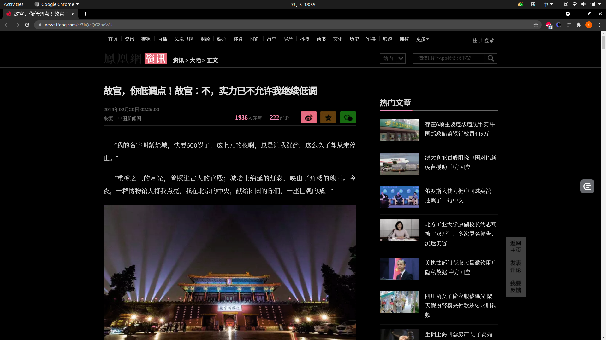

# 什么是智能化解析

爬虫是帮助我们快速获取有效信息的。然而在做爬虫的过程中，解析是件麻烦事。

比如一篇新闻，链接是：[https://news.ifeng.com/c/7kQcQG2peWU](https://news.ifeng.com/c/7kQcQG2peWU)，页面预览图如下：



我们需要从页面中提取出标题、发布人、发布时间、发布内容、图片等内容。一般情况下我们需要怎么办？答案是写规则。

规则都有什么呢？比如正则、CSS 选择器、XPath。我们需要对标题、发布时间、来源等内容做规则匹配，更有甚者需要正则表达式来辅助。我们可能需要用 ```re、BeautifulSoup、PyQuery``` 等库来实现内容的提取和解析。

如果有成千上万个不同样式的页面呢？它们来自成千上万个站点，难道我们还需要对它们一一写规则来匹配吗？另外这些万一处理不好还会出现解析问题。比如正则表达式在某些情况下匹配不了，CSS、XPath 选择器选错位也会出现问题。

想必你可能见过现在的浏览器有阅读模式，我们把这个页面用 Chrome 浏览器打开，然后开启阅读模式，或者使用一些具有阅读模式的插件，我使用的是 readermode ，看看什么效果：


页面马上变得非常清爽，只保留了标题和需要读的内容。原先页面多余的导航栏、侧栏、评论等等都被去除了。它怎么做到的？难道是有人在里面写好规则了？当然不可能。其实，这里面就用到了智能化解析了。

那么本课时，我们就来了解一下页面的智能化解析的相关知识。

---
---

## 智能化解析

所谓爬虫的智能化解析，顾名思义就是不再需要我们针对某一些页面来专门写提取规则了，我们可以利用一些算法来计算出页面特定元素的位置和提取路径。比如一个页面中的一篇文章，我们可以通过算法计算出来，它的标题应该是什么，正文应该是哪部分区域，发布时间等等。

其实智能化解析是非常难的一项任务，比如说你给人看一个网页的一篇文章，人可以迅速找到这篇文章的标题是什么，发布时间是什么，正文是哪一块，或者哪一块是广告位，哪一块是导航栏。但给机器来识别的话，它面临的是什么？仅仅是一系列的 HTML
代码而已。那究竟机器是怎么做到智能化提取的呢？其实这里面融合了多方面的信息。

* 比如标题。一般它的字号是比较大的，而且长度不长，位置一般都在页面上方，而且大部分情况下它应该和 ```title``` 标签里的内容是一致的。
* 比如正文。它的内容一般是最多的，而且会包含多个段落 ```p``` 或者图片 ```img``` 标签，另外它的宽度一般可能会占用到页面的三分之二区域，并且密度（字数除以标签数量）会比较大
* 比如时间。不同语言的页面可能不同，但时间的格式是有限的，如 2019-02-20 或者 2019/02/20 等等，也有可能是美式的记法，顺序不同，这些也有特定的模式可以识别。
* 比如广告。它的标签一般可能会带有 ```ads``` 这样的字样，另外大多数可能会处于文章底部、页面侧栏，并可能包含一些特定的外链内容

另外还有一些特点就不再一一赘述了，这其中包含了区块位置、区块大小、区块标签、区块内容、区块疏密度等等多种特征，另外很多情况下还需要借助于视觉的特征，所以说这里面其实结合了算法计算、视觉处理、自然语言处理等各个方面的内容。如果能把这些特征综合运用起来，再经过大量的数据训练，是可以得到一个非常不错的效果的。

---

## 业界进展

未来，页面也会越来越多，页面的渲染方式也会发生很大的变化，爬虫也会越来越难做，智能化爬虫也将会变得越来越重要。

目前工业界，其实已经有落地的算法应用了。目前有这么几种算法或者服务对页面的智能化解析做得比较好：

* Diffbot，国外的一家专门做智能化解析服务的公司，[https://www.diffbot.com](https://www.diffbot.com)
* Boilerpipe，Java 语言编写的一个页面解析算法，[https://github.com/kohlschutter/boilerpipe](https://github.com/kohlschutter/boilerpipe)
* Embedly，提供页面解析服务的公司，[https://embed.ly/extract](https://embed.ly/extract)
* Readability，是一个页面解析算法，但现在官方的服务已经关闭了，[https://www.readability.com/](https://www.readability.com/)
* Mercury，Readability 的替代品，[https://mercury.postlight.com/](https://mercury.postlight.com/)
* Goose，Java 语音编写的页面解析算法，[https://github.com/GravityLabs/goose](https://github.com/GravityLabs/goose)

Driffbot 官方曾做过一个对比评测，使用 Google 新闻的一些文章，使用不同的算法依次摘出其中的标题和文本，然后与真实标注的内容进行比较，比较的指标就是文字的准确率和召回率，以及根据二者计算出的 F1 分数。

其结果对比如下：

|Service/Software|Precision|Recall|F1-Score|
|:----:|:----:|:----:|:----:|
|Diffbot|0.968|0.978|0.971|
|Boilerpipe|0.893|0.924|0.893|
|Readability|0.819|0.911|0.854|
|AlchemyAPI|0.876|0.892|0.850|
|Embedly|0.786|0.880|0.822|
|Goose|0.498|0.815|0.608|

经过对比我们可以发现，Diffbot 的准确率和召回率都还比较高。这是一家专门做网页智能化提取的公司，Diffbot 自 2010 年以来就致力于提取 Web 页面数据，并提供许多 API
来自动解析各种页面。其中他们的算法依赖于自然语言技术、机器学习、计算机视觉、标记检查等多种算法，并且所有的页面都会考虑到当前页面的样式以及可视化布局，另外还会分析其中包含的图像内容、CSS 甚至 Ajax
请求。另外在计算一个区块的置信度时还考虑到了和其他区块的关联关系，基于周围的标记来计算每个区块的置信度。总之，Diffbot 也一直致力于这一方面的服务，整个 Diffbot
就是页面解析起家的，现在也一直专注于页面解析服务，准确率高也就不足为怪了。

但它们的算法并没有开源，只是以商业化 API 来售卖的，也没有找到相关的论文介绍它们自己的具体算法。

不过，这里我们不妨拿它来做案例，稍微体会一下智能解析算法能达到一个怎样的效果。

接下来的内容，我们就以 Diffbot 为例来介绍下智能解析所能达到的效果。

---

## Diffbot 页面解析

首先我们需要注册一个账号，它有 15 天的免费试用，注册之后会获得一个 Developer Token，这就是使用 Diffbot 接口服务的凭证。

接下来切换到它的测试页面中，链接为：[https://www.diffbot.com/dev/home/](https://www.diffbot.com/dev/home/) ，我们来测试一下它的解析效果到底是怎样的。

这里我们选择的测试页面就是上文所述的页面，链接为：[https://news.ifeng.com/c/7kQcQG2peWU](https://news.ifeng.com/c/7kQcQG2peWU) ，API 类型选择 Article
API，然后点击 Test Drive 按钮，接下来它就会出现当前页面的解析结果：


这时候我们可以看到，它帮我们提取出来了标题、发布时间、发布机构、发布机构链接、正文内容等等各种结果。目前来看都十分正确，时间也在自动识别后做了转码，是一个标准的时间格式。

接下来我们继续下滑，我们还可以看到有 ```html``` 字段，它和 ```text``` 不同的是 ```html``` 包含了文章内容的真实 HTML 代码，因此图片也会包含在里面，如图所示：


另外最后面还有 ```images``` 字段，它以列表形式返回了文章套图及每一张图的链接，另外还有文章的站点名称、页面所用语言等等结果，如图所示：


当然我们也可以选择 JSON 格式的返回结果，其内容会更加丰富，例如图片还返回了其宽度、高度、图片描述等等内容，另外还有各种其他的结果如面包屑导航等等结果，如图所示：


经过手工核对，发现其返回的结果都是完全正确的，准确率还是很高的。

如果你对准确率要求没有那么非常非常严苛的情况下，使用 Diffbot 的服务可以帮助我们快速地提取页面中所需的结果，省去了我们绝大多数的手工劳动。

Diffbot 也提供了官方的 API 文档，让我们来一探究竟。

---

## Diffbot API

Driffbot 提供了多种 API，如 Analyze API、Article API、Disscussion API 等。

下面我们以 Article API
为例来说明一下它的用法，其官方文档地址为：[https://www.diffbot.com/dev/docs/article/](https://www.diffbot.com/dev/docs/article/) ，API 调用地址为：

```shell
https://api.diffbot.com/v3/article
```

我们可以用 ```GET``` 方式来进行请求，其中的 ```Token``` 和 ```URL``` 都可以以参数形式传递给这个 API，其必备的参数有：

* ```token```：即 ```Developer Token```
* ```url```：即要解析的 URL 链接

另外它还有几个可选参数。

* ```fields```：用来指定返回哪些字段，默认已经有了一些固定字段，这个参数可以指定还可以额外返回可选字段
* ```paging```：针对多页文章，如果将这个参数设置为 ```false``` 则可以禁止多页内容拼接
* ```maxTags```：可以设置返回的 ```Tag``` 最大数量，默认是 10 个
* ```tagConfidence```：设置置信度的阈值，超过这个值的 ```Tag``` 才会被返回，默认是 0.5
* ```discussion```：如果将这个参数设置为 ```false```，那么就不会解析评论内容
* ```timeout```：在解析的时候等待的最长时间，默认是 30 秒
* ```callback```：为 JSONP 类型的请求而设计的回调

```fields``` 字段如下。

* ```type```：文本的类型，这里就是 ```article```
* ```title```：文章的标题
* ```text```：文章的纯文本内容，如果是分段内容，那么其中会以换行符来分隔
* ```html```：提取结果的 HTML 内容。
* ```date```：文章的发布时间，其格式为 RFC 1123
* ```estimatedDate```：如果日期时间不太明确，会返回一个预估的时间，如果文章超过两天或者没有发布日期，那么这个字段就不会返回
* ```author```：作者
* ```authorUrl```：作者的链接
* ```discussion```：评论内容，和 ```Disscussion API``` 返回结果一样
* ```humanLanguage```：语言类型，如英文还是中文等
* ```numPages```：如果文章是多页的，这个参数会控制最大的翻页拼接数目
* ```nextPages```：如果文章是多页的，这个参数可以指定文章后续链接
* ```siteName```：站点名称
* ```publisherRegion```：文章发布地区
* ```publisherCountry```：文章发布国家
* ```pageUrl```：文章链接
* ```resolvedPageUrl```：如果文章是从 ```pageUrl``` 重定向过来的，则返回此内容
* ```tags```：文章的标签或者文章包含的实体，根据自然语言处理技术和 ```DBpedia``` 计算生成，是一个列表，里面又包含了子字段：
    * ```label```：标签名
    * ```count```：标签出现的次数
    * ```score```：标签置信度
    * ```rdfTypes```：如果实体可以由多个资源表示，那么则返回相关的 URL
    * ```type```：类型
    * ```uri```：```Diffbot Knowledge Graph``` 中的实体链接
* ```images```：文章中包含的图片
* ```videos```：文章中包含的视频
* ```breadcrumb```：面包屑导航信息
* ```diffbotUri```：Diffbot 内部的 URL 链接

以上的预定字段就是如果可以返回那就会返回的字段，是不能定制化配置的，另外我们还可以通过 ```fields``` 参数来指定扩展如下可选字段。

* ```quotes```：引用信息
* ```sentiment```：文章的情感值，-1 ~ 1 之间
* ```links```：所有超链接的顶级链接
* ```querystring```：请求的参数列表

以上便是这个 API 的用法，申请之后使用这个 API 来做智能化解析了。

下面我们用一个实例来看一下这个 API 的用法，代码[如下](../../codes/Module_6/lecture_37/lecture_37_1.py)：

```python
# -*- coding: utf-8 -*-


import json
import requests

headers = {
    'Accept-Encoding': 'gzip, deflate, sdch',
    'Accept-Language': 'en-US,en;q=0.8',
    'User-Agent': 'Mozilla/5.0 (X11; Linux x86_64) AppleWebKit/537.36 (KHTML, like Gecko) HeadlessChrome/91.0.4472.101 Safari/537.36',
    'Accept': 'text/html,application/xhtml+xml,application/xml;q=0.9,image/webp,*/*;q=0.8',
    'Connection': 'keep-alive',
}
url = 'https://api.diffbot.com/v3/article'
params = {
    'token': '77b41f6fbb24496d5113d528306528fa',
    'url': 'https://news.ifeng.com/c/7kQcQG2peWU',
    'fields': 'meta'
}
response = requests.get(url, params=params, headers=headers)
print(json.dumps(response.json(), indent=2, ensure_ascii=False))
```

这里首先定义了 API 的链接，然后指定了 ```params``` 参数，即 ```GET``` 请求参数。

参数中包含了必选的 ```token、url``` 字段，也设置了可选的 ```fields``` 字段，其中 ```fields``` 为可选的扩展字段 ```meta``` 标签。

来看下运行结果，结果如下：

```json5
{
  "request": {
    "pageUrl": "https://news.ifeng.com/c/7kQcQG2peWU",
    "api": "article",
    "fields": "sentiment, meta",
    "version": 3
  },
  "objects": [
    {
      "date": "Wed, 20 Feb 2019 02:26:00 GMT",
      "images": [
        {
          "naturalHeight": 460,
          "width": 640,
          "diffbotUri": "image|3|-1139316034",
          "url": "http://e0.ifengimg.com/02/2019/0219/1731DC8A29EB2219C7F2773CF9CF319B3503D0A1_size382_w690_h460.png",
          "naturalWidth": 690,
          "primary": true,
          "height": 426
        },
        // ...
      ],
      "author": "中国新闻网",
      "estimatedDate": "Wed, 20 Feb 2019 06:47:52 GMT",
      "diffbotUri": "article|3|1591137208",
      "siteName": "ifeng.com",
      "type": "article",
      "title": "故宫，你低调点！故宫：不，实力已不允许我继续低调",
      "breadcrumb": [
        {
          "link": "https://news.ifeng.com/",
          "name": "资讯"
        },
        {
          "link": "https://news.ifeng.com/shanklist/3-35197-/",
          "name": "大陆"
        }
      ],
      "humanLanguage": "zh",
      "meta": {
        "og": {
          "og:time ": "2019-02-20 02:26:00",
          "og:image": "https://e0.ifengimg.com/02/2019/0219/1731DC8A29EB2219C7F2773CF9CF319B3503D0A1_size382_w690_h460.png",
          "og:category ": "凤凰资讯",
          "og: webtype": "news",
          "og:title": "故宫，你低调点！故宫：不，实力已不允许我继续低调",
          "og:url": "https://news.ifeng.com/c/7kQcQG2peWU",
          "og:description": "  “我的名字叫紫禁城，快要600岁了，这上元的夜啊，总是让我沉醉，这么久了却从未停止。”   “重"
        },
        "referrer": "always",
        "description": "  “我的名字叫紫禁城，快要600岁了，这上元的夜啊，总是让我沉醉，这么久了却从未停止。”   “重",
        "keywords": "故宫 紫禁城 故宫博物院 灯光 元宵节 博物馆 一票难求 元之 中新社 午门 杜洋 藏品 文化 皇帝 清明上河图 元宵 千里江山图卷 中英北京条约 中法北京条约 天津条约",
        "title": "故宫，你低调点！故宫：不，实力已不允许我继续低调_凤凰资讯"
      },
      "authorUrl": "https://feng.ifeng.com/author/308904",
      "pageUrl": "https://news.ifeng.com/c/7kQcQG2peWU",
      "html": "<p>&ldquo;我的名字叫紫禁城，快要600岁了，这上元的夜啊，总是让我沉醉，这么久了却从未停止。...</blockquote> </blockquote>",
      "text": "“我的名字叫紫禁城，快要600岁了，这上元的夜啊，总是让我沉醉，这么久了却从未停止。”\n“...",
      "authors": [
        {
          "name": "中国新闻网",
          "link": "https://feng.ifeng.com/author/308904"
        }
      ]
    }
  ]
}
```

可见其返回了如上的内容，是一个完整的 JSON 格式，其中包含了标题、正文、发布时间等等各种内容。

不需要我们配置任何提取规则，我们就可以完成页面的分析和抓取，得来全不费功夫。

另外 Diffbot 还提供了几乎所有语言的 SDK 支持，我们也可以使用 SDK
来实现如上功能，链接为：[https://www.diffbot.com/dev/docs/libraries/](https://www.diffbot.com/dev/docs/libraries/) ，如果你使用 Python
的话，可以直接使用 Python 的 SDK 即可，Python 的 SDK
链接为：[https://github.com/diffbot/diffbot-python-client](https://github.com/diffbot/diffbot-python-client) 。

这个库并没有发布到 ```PyPi```，需要自己下载并导入使用，另外这个库是使用 Python 2 写的，其实本质上就是调用了 ```requests``` 库，感兴趣的话可以看一下。

下面是一个调用[示例](../../codes/Module_6/lecture_37/lecture_37_2.py)：

```python
# -*- coding: utf-8 -*-


from client import DiffbotClient, DiffbotCrawl

headers = {
    'Accept-Encoding': 'gzip, deflate, sdch',
    'Accept-Language': 'en-US,en;q=0.8',
    'User-Agent': 'Mozilla/5.0 (X11; Linux x86_64) AppleWebKit/537.36 (KHTML, like Gecko) HeadlessChrome/91.0.4472.101 Safari/537.36',
    'Accept': 'text/html,application/xhtml+xml,application/xml;q=0.9,image/webp,*/*;q=0.8',
    'Connection': 'keep-alive',
}

diffbot = DiffbotClient()
token = 'your_token'
url = 'http://shichuan.github.io/javascript-patterns/'
api = 'article'
response = diffbot.request(url, token, api, headers=headers)
```

通过这行代码我们就可以通过调用 Article API 来分析我们想要的 URL 链接了，返回结果是类似的。 具体的用法你直接看下它的源码注释就一目了然了，还是很清楚的。

---

## 总结

好，以上便是对智能化提取页面原理的基本介绍以及对 Diffbot 的用法的讲解，后面我会继续介绍其他的智能化解析方法以及一些相关实战。

---
---

