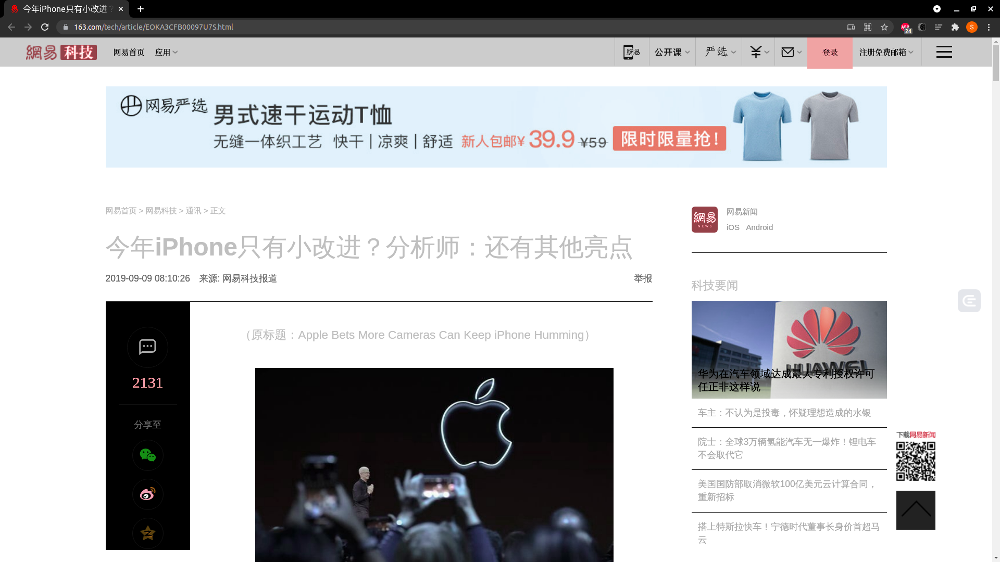

# 智能化解析解析工具使用

上一课时介绍了智能化解析技术的一些基本原理和效果，并且通过 Diffbot 体验了一下智能化解析能达到的效果。

但 Diffbot 是商业化应用，是收费的。本课时将再介绍几个开源的智能解析库，稍微分析一下它们的源码逻辑。虽然准确率并不是很高，但深入研究它的一些源码和实现，我们可以对智能解析有更深入地认识。

---
---

## 智能文本提取

目前来说，智能文本提取可以分为三类：

* 基于网页文档内容的提取方法
* 基于 DOM 结构信息的提取方法
* 基于视觉信息的提取方法

基于网页文档的提取方法将 HTML
文档视为文本进行处理，适用于处理含有大量文本信息且结构简单易于处理的单记录网页，或者具有实时要求的在线分析网页应用。这种方式主要利用自然语言处理的相关技术实现，通过理解文本语义、分析上下文、设定提取规则等，实现对大段网页文档的快速处理。其中，较为知名的方法有
TSIMMIS、Web-OQL、Serrano、FAR-SW 和 FOREST，但这些方法通常需要人工的参与，且存在耗时长、效率低的弊端。

基于 DOM 结构信息的方法将 HTML 文档解析为相应的 DOM 树，然后根据 DOM 树的语法结构创建提取规则， 相对于以前的方法而言有了更高的性能和准确率。 W4F 和 XWRAP 将 HTML 文档解析成 DOM
树，然后通过组件化引导用户通过人工选择或者标记生成目标包装器代码。Omini、IEPAD 和 ITE 提取 DOM 树上的关键路径，获取其中存在的重复模式。MDR 和 DEPTA 挖掘了页面中的数据区域，得到数据记录的模式。CECWS
通过聚类算法从数据库中提取出自同一网站的一组页面，并进行 DOM 树结构的对比，删除其中的静态部分，保留动态内容作为信息提取的结果。

虽然此类方法相对于上一类方法具有较高的提取精度，且克服了对大段连续文本的依赖，但由于网页的 DOM 树通常较深，且含有大量 DOM 节点，因此基于 DOM 结构信息的方法具有较高的时间和空间消耗。目前来说，大部分原理还是基于 DOM
节点的文本密度、标点符号密度等计算的，其准确率还是比较可观的。今天所介绍的 Readability 和 Newspaper 的库，其实现原理是类似的。

目前比较先进的是基于视觉信息的网页信息提取方法，通过浏览器接口或者内核对目标网页预渲染，然后基于网页的视觉规律提取网页数据记录。经典的 VIPS 算法首先从 DOM 树中提取出所有合适的页面区域，然后根据这些页面和分割条重新构建 Web
页面的语义结构。作为对 VIPS 的拓展，ViNT、ViPER、ViDE 也成功利用了网页的视觉特征来实现数据提取。CMDR 为通过神经网络学习多记录型页面中的特征，结合基于 DOM 结构信息的 MDR 方法，挖掘社区论坛页面的数据区域。

与上述方法不同，VIBS 将图像领域的 CNN 卷积神经网络运用于网页的截图，同时通过类 VIPS 算法生成视觉块，最后结合两个阶段的结果识别网页的正文区域。另外还有最新的国内提出的 VBIE
方法，基于网页视觉的基础上改进，可以实现无监督的网页信息提取。

以上内容主要参考自论文：《王卫红等：基于可视块的多记录型复杂网页信息提取算法》，算法可从该论文参考文献查阅。

下面我们来介绍两个比较基础的工具包 ```Readability 和 Newspaper``` 的用法，这两个包其实准确率并不是很好，主要是让我们大致对智能解析有初步的理解。后面还会介绍一些更加强大的智能化解析算法。

---

## Readability

```Readability``` 实际上是一个算法，并不是一个针对某个语言的库，其主要原理是计算了 DOM 的文本密度。另外根据一些常见的 DOM 属性如 ```id、class``` 等计算了一些 DOM 的权重，最后分析得到了对应的
DOM 区块，进而提取出具体的文本内容。

搜索 ```Readability``` 其实已经找不到了，取而代之的是一个 JavaScript 工具包，即 ```mercury-parser```，现在也做成了一个 Chrome 插件，大家可以下载使用一下。

这次主要介绍的是 Python 的 ```Readability```
实现，现在其实有很多开源版本，本课时选取的是 [https://github.com/buriy/python-readability](https://github.com/buriy/python-readability)
，是基于最早的 Python 版本的 ```Readability``` 库二次开发的，现在已经发布到了 PyPi，可以直接下载安装使用。

通过 ```pip``` 安装即可：

```shell
pip3 install readability-lxml
```

安装好了之后便可以通过导入 ```readability``` 了。从网上找一个新闻页面，其页面截图如 [下图](https://www.163.com/tech/article/EOKA3CFB00097U7S.html) 所示：



我们的目的就是它的正文、标题等内容。下面用 ```Readability``` 试一下，示例[如下](../../codes/Module_6/lecture_38/lecture_38_1.py)：

```python
# -*- coding: utf-8 -*-


import requests
from readability import Document

headers = {
    'Accept-Encoding': 'gzip, deflate, sdch',
    'Accept-Language': 'en-US,en;q=0.8',
    'User-Agent': 'Mozilla/5.0 (X11; Linux x86_64) AppleWebKit/537.36 (KHTML, like Gecko) HeadlessChrome/91.0.4472.101 Safari/537.36',
    'Accept': 'text/html,application/xhtml+xml,application/xml;q=0.9,image/webp,*/*;q=0.8',
    'Connection': 'keep-alive',
}

url = 'https://tech.163.com/19/0909/08/EOKA3CFB00097U7S.html'
html = requests.get(url, headers=headers).content
doc = Document(html)
print('title:', doc.title())
print('content:', doc.summary(html_partial=True))
```

在这里用 ```requests``` 库对网页进行了请求，获取了其 HTML 页面内容，赋值为 ```html```。

然后引入了 ```readability``` 里的 ```Document``` 类，使用 ```html``` 变量对其进行初始化，接着分别调用了 ```title``` 方法和 ```summary``` 方法获得了其标题和正文内容。

这里 ```title``` 方法就是获取文章标题的，```summary``` 是获取文章正文的，但是它获取的正文可能包含了一些 HTML 标签。这个 ```summary``` 方法可以接收一个 ```html_partial```
参数，如果设置为 ```true```，返回的结果则不会再带有 ```<html><body>``` 标签。

看下运行结果：

```html
title: 今年iPhone只有小改进？分析师：还有其他亮点|iphone|苹果手表|新款iphone|新iphone|apple_网易科技
content:
<div>
    <div class="post_body">

        <p class="otitle">
            （原标题：Apple Bets More Cameras Can Keep iPhone Humming）
        </p>

        <p class="f_center"><span>图示：苹果首席执行官蒂姆·库克(Tim Cook)在6月份举行的苹果全球开发者大会上。</span>
        </p>
        <p>网易科技讯 9月9日消息，据国外媒体报道，和过去的12个年头一样，新款<a target="_blank" href="https://news.163.com/news/search?keyword=iPhone">iPhone</a>将成为苹果公司本周所举行年度宣传活动的主角。但人们的注意力正转向需要推动增长的其他苹果产品和服务。
        </p>
        <p></p>
        <p>
            据知情人士透露，苹果本周二计划发布三款新iPhone，增加后置摄像头数量，增强了低光照条件下的照片处理能力。分析人士预计，这几款新手机还将配备速度更快的处理器、绿色或紫色等新的外观颜色，以及对AirPods无线耳机等其他设备的反向无线充电功能。</p>
        <p>这些预期中的更新并没有真正刺激到华尔街，一些分析师和投资者预测即将发布的iPhone将会很无聊。随着旧款iPhone手机的销量不断下滑，苹果正在扩充其联网产品和服务组合，包括<a target="_blank"
                                                                                                     href="https://news.163.com/news/search?keyword=%E8%8B%B9%E6%9E%9C%E6%89%8B%E8%A1%A8">苹果手表</a>、AirPods无线耳机以及苹果电视节目和视频游戏的订阅服务。
        </p>
        <p>资产管理公司Synovus Trust高级投资组合经理丹·摩根(Dan
            Morgan)说，“他们现在没有任何真正深入的进展，只是想继续让iPhone这款业务继续转下去。”他乐观地认为，今年发布的新款手机将有足够多的新功能，“为一个非常成熟的产品增加额外的功能，让火车继续前进。”</p>
        <p>这种仅限于此的态度说明了苹果自2007年发布首款iPhone以来所面临的挑战。iPhone销售占苹果公司总营收的一半以上，这让苹果陷入了一个尴尬的境地：既要维持核心产品的销量，另一方面又需要减少对它的依赖。</p>
        <p>
            瑞银(UBS)今年5月份对8000名智能手机用户进行了相关调查，其发布的年度全球调查报告显示，最近iPhone在人脸识别技术等方面的进步并没有引起一些消费者的共鸣，他们基本上都认为苹果产品没有过去几年那么独特或者惊艳，品牌也没有过去几年那么有吸引力。很多人使用老款手机的时间更长，自己认为也没有必要升级到平均售价949美元的新款iPhone。</p>
        <p>苹果需要在明年销售足够多的iPhone，以避免像去年9月份iPhone XR和iPhone XS机型发布后那种令人失望的业绩重演。iPhone XR和iPhone
            XS的销售疲软状况迫使苹果在1月份下调了业绩预期，这是逾15年来的第一次。</p>
        <p>据贸易公司Susquehanna International Group的数据，苹果预计今年年底前将售出约7000万部新iPhone，比2014年发布最新款iPhone的9800万部销量峰值少了近30%。</p>
        <p>苹果对2019年iPhone销量的温和预测让投资者已经把目光放远到了2020年，届时苹果预计将发布首款搭载5G网络连接的iPhone。</p>
        <p>
            未来几周内，或许有新的动力推动苹果从iPhone向后iPhone时代过渡。本周公司除了将要推出新款智能手机之外，有望发布第五代苹果手表。分析人士说，新一代苹果手表将会配置新的外壳并进一步提高电池寿命，引入的完整应用商店有助于帮助其从iPhone的附件中解放出来。</p>
        <p>分析师表示，新款苹果手表预计将增加诸如睡眠模式追踪等更多健康功能。</p>
        <p>苹果首席执行官蒂姆·库克(Tim
            Cook)表示，这些功能的增加将推动苹果业务继续向健康领域进军。2018年发布的第四代苹果手表配备了电极和传感器，能够测量用户的心脏电活动并将其转换成心电图，从而检测出潜在的危险疾病。</p>
        <p>市场研究公司Strategy
            Analytics的数据显示，健康功能帮助苹果在最近一个季度将智能手表出货量提高至570万部，同比增长50%。在本财年前三个季度，智能手表的销售帮助包括AirPods无线耳机在内的苹果可穿戴设备和配件业务增长了35%，达到近180亿美元。</p>
        <p>苹果还即将推出包括电视节目和视频游戏等内容的新订阅服务。分析师表示，该公司最早可能在本周宣布TV+和Arcade等服务的价格和上线时间。</p>
        <p>Strategy Analytics的尼尔·莫斯顿(Neil
            Mawston)表示，可穿戴设备和服务的结合将是苹果业务超越iPhone的关键。他说，上一家手机巨头诺基亚公司在试图进行类似业务转型时就陷入了困境之中。（辰辰）</p>
        <p><b>相关报道：</b></p>
        <p><a href="https://tech.163.com/19/0908/09/EOHS53RK000999LD.html" target="_self" urlmacroreplace="false">iPhone
            11背部苹果Logo改为居中：为反向无线充电</a></p>
        <p><a href="https://tech.163.com/19/0907/08/EOF60CBC00097U7S.html" target="_self" urlmacroreplace="false">2019年新iPhone传言汇总，你觉得哪些能成真</a>  
        </p>
        <p></p>

    </div>


    <div class="post_author">
        <a href="https://tech.163.com/"></a>
        <p>

            本文来源：网易科技报道


            责任编辑：
            王凤枝_NT2541
        </p></div>


</div>
```

可以看到，标题提取是正确的，正文其实也是正确的，不过这里还包含了一些 HTML 标签，比如 ```、<p>``` 等，我们可以进一步通过一些解析库来解析。

看下源码，比如提取标题的方法：

```python
def normalize_entities(cur_title):
    entities = {
        u"\u2014": "-",
        u"\u2013": "-",
        u"&mdash;": "-",
        u"&ndash;": "-",
        u"\u00A0": " ",
        u"\u00AB": '"',
        u"\u00BB": '"',
        u"&quot;": '"',
    }
    for c, r in entities.items():
        if c in cur_title:
            cur_title = cur_title.replace(c, r)

    return cur_title


def norm_title(title):
    return normalize_entities(normalize_spaces(title))


def get_title(doc):
    title = doc.find(".//title")
    if title is None or title.text is None or len(title.text) == 0:
        return "[no-title]"

    return norm_title(title.text)


def title(self):
    """Returns document title"""
    return get_title(self._html(True))
```

```title``` 方法实际上就是调用了一个 ```get_title``` 方法，它是怎么做的呢？

实际上就是用了一个 ```XPath``` 只解析了 ```<title>``` 标签里面的内容，别的没了。如果没有，那就返回 ```[no-title]```。

```python
def summary(self, html_partial=False):
    """
    Given a HTML file, extracts the text of the article.

    :param html_partial: return only the div of the document, don't wrap
                         in html and body tags.

    Warning: It mutates internal DOM representation of the HTML document,
    so it is better to call other API methods before this one.
    """
    try:
        ruthless = True
        while True:
            self._html(True)
            for i in self.tags(self.html, "script", "style"):
                i.drop_tree()
            for i in self.tags(self.html, "body"):
                i.set("id", "readabilityBody")
            if ruthless:
                self.remove_unlikely_candidates()
            self.transform_misused_divs_into_paragraphs()
            candidates = self.score_paragraphs()

            best_candidate = self.select_best_candidate(candidates)

            if best_candidate:
                article = self.get_article(
                    candidates, best_candidate, html_partial=html_partial
                )
            else:
                if ruthless:
                    log.info("ruthless removal did not work. ")
                    ruthless = False
                    log.debug(
                        (
                            "ended up stripping too much - "
                            "going for a safer _parse"
                        )
                    )
                    # try again
                    continue
                else:
                    log.debug(
                        (
                            "Ruthless and lenient parsing did not work. "
                            "Returning raw html"
                        )
                    )
                    article = self.html.find("body")
                    if article is None:
                        article = self.html
            cleaned_article = self.sanitize(article, candidates)

            article_length = len(cleaned_article or "")
            retry_length = self.retry_length
            of_acceptable_length = article_length >= retry_length
            if ruthless and not of_acceptable_length:
                ruthless = False
                # Loop through and try again.
                continue
            else:
                return cleaned_article
    except Exception as e:
        log.exception("error getting summary: ")
        if sys.version_info[0] == 2:
            from .compat.two import raise_with_traceback
        else:
            from .compat.three import raise_with_traceback
        raise_with_traceback(Unparseable, sys.exc_info()[2], str_(e))
```

这里我删除了一些冗余的调试代码，只保留了核心代码，其核心实现就是先去除一些干扰内容，然后找出一些疑似正文的 ```candidates```，接着再去寻找最佳匹配的 ```candidates```，最后提取其内容返回即可。

然后再找到获取 ```candidates``` 方法里面的 ```score_paragraphs``` 方法，又追踪到一个 ```score_node``` 方法，就是为每一个节点打分的，其实现如下：

```python
def score_node(self, elem):
    content_score = self.class_weight(elem)
    name = elem.tag.lower()
    if name in ["div", "article"]:
        content_score += 5
    elif name in ["pre", "td", "blockquote"]:
        content_score += 3
    elif name in ["address", "ol", "ul", "dl", "dd", "dt", "li", "form", "aside"]:
        content_score -= 3
    elif name in ["h1", "h2", "h3", "h4", "h5", "h6", "th", "header", "footer", "nav"]:
        content_score -= 5
    return {
        'content_score': content_score,
        'elem': elem
    }
```

如果这个节点标签是 ```div``` 或者 ```article``` 等可能表征正文区块的话，就加 5 分；如果是 ```aside``` 等表示侧栏内容的话，就减 3 分。这些打分也没有什么非常标准的依据，可能是根据经验累积的规则。

另外还有一些方法里面引用了一些正则匹配来进行打分或者替换，其定义如下：

```python
REGEXES = {
    'unlikelyCandidatesRe': re.compile(
        'combx|comment|community|disqus|extra|foot|header|menu|remark|rss|shoutbox|sidebar|sponsor|ad-break|agegate|pagination|pager|popup|tweet|twitter',
        re.I),
    'okMaybeItsACandidateRe': re.compile('and|article|body|column|main|shadow', re.I),
    'positiveRe': re.compile('article|body|content|entry|hentry|main|page|pagination|post|text|blog|story', re.I),
    'negativeRe': re.compile(
        'combx|comment|com-|contact|foot|footer|footnote|masthead|media|meta|outbrain|promo|related|scroll|shoutbox|sidebar|sponsor|shopping|tags|tool|widget',
        re.I),
    'divToPElementsRe': re.compile('<(a|blockquote|dl|div|img|ol|p|pre|table|ul)', re.I),
    # 'replaceBrsRe': re.compile('(<br[^>]*>[ \n\r\t]*){2,}',re.I),
    # 'replaceFontsRe': re.compile('<(\/?)font[^>]*>',re.I),
    # 'trimRe': re.compile('^\s+|\s+$/'),
    # 'normalizeRe': re.compile('\s{2,}/'),
    # 'killBreaksRe': re.compile('(<br\s*\/?>(\s|&nbsp;?)*){1,}/'),
    'videoRe': re.compile('https?:\/\/(www\.)?(youtube|vimeo)\.com', re.I),
    # skipFootnoteLink:      /^\s*(\[?[a-z0-9]{1,2}\]?|^|edit|citation needed)\s*$/i,
}
```

比如这里定义了 ```unlikelyCandidatesRe```，就是不像 ```candidates``` 的 ```pattern```，比如 ```foot、comment``` 等，碰到这样的标签或 ```pattern```
的话，在计算分数的时候都会减分，另外还有其他的 ```positiveRe、negativeRe``` 也是一样的原理，分别对匹配到的内容进行加分或者减分。

这就是 ```Readability``` 的原理，即基于一些规则匹配的打分模型，很多规则其实来源于经验的累积，分数的计算规则应该也是不断地调优得出来的。

其他的就没了，```Readability``` 并没有提供提取时间、作者的方法，另外此种方法的准确率也是有限的，但多少还是省去了一些人工成本。

---

### Newspaper

另外还有一个智能解析的库，叫作 ```Newspaper```，提供的功能更强一些，但是准确率上个人感觉和 ```Readability``` 差不太多。

这个库分为 Python2 和 Python3 两个版本，Python2 下的版本叫作 ```newspaper```，Python3 下的版本叫作 ```newspaper3k```。这里我们使用 Python3 版本来进行测试。

点击这里获取 GitHub [地址](https://github.com/codelucas/newspaper) ，点击这里获取官方文档[地址](https://newspaper.readthedocs.io/)

在安装之前需要安装一些依赖库，点击这里可参考官方的[说明](https://github.com/codelucas/newspaper#get-it-now)

安装好必要的依赖库之后，就可以使用 ```pip``` 安装了：

```shell
pip3 install newspaper3k
```

安装成功之后便可以导入使用了。

下面我们先用官方提供的实例来过一遍它的用法，其页面截图[如下](https://www.fox13now.com/2013/12/30/new-year-new-laws-obamacare-pot-guns-and-drones/)


下面用一个[实例](../../codes/Module_6/lecture_38/lecture_38_2.py)来感受一下：

```shell
# -*- coding: utf-8 -*-


from newspaper import Article

url = 'https://fox13now.com/2013/12/30/new-year-new-laws-obamacare-pot-guns-and-drones/'
article = Article(url)
article.download()
# print('html:', article.html)
article.parse()
print('authors:', article.authors)
print('date:', article.publish_date)
print('text:', article.text)
print('top image:', article.top_image)
print('movies:', article.movies)
article.nlp()
print('keywords:', article.keywords)
print('summary:', article.summary)
```

这里从 ```newspaper``` 库里面先导入了 ```Article``` 类，然后直接传入 ```url``` 即可。首先需要调用它的 ```download``` 方法，将网页爬取下来，否则直接进行解析会抛出错误。

但这个设计挺不友好的，```parse``` 方法不能判断下，如果没执行 ```download``` 就自动执行 ```download``` 方法吗，如果不 ```download``` 其他的不什么都干不了吗。。。

然后我们再执行 ```parse``` 方法进行网页的智能解析，这个功能就比较全了，能解析 ```authors、publish_date、text``` 等，除了正文还能解析作者、发布时间等。

另外这个库还提供了一些 NLP 的方法，比如获取关键词、获取文本摘要等，在使用前需要先执行以下 ```nlp``` 方法。

最后运行结果如下：

```textmate
authors: []
date: 2013-12-30 00:00:00
text: By Leigh Ann Caldwell

WASHINGTON (CNN) — Not everyone subscribes to a New Year’s resolution, but Americans will be required to follow new laws in 2014.

Some 40,000 measures taking effect range from sweeping, national mandates under Obamacare to marijuana legalization in Colorado, drone prohibition in Illinois and transgender protections in California.

Although many new laws are controversial, they made it through legislatures, public referendum or city councils and represent the shifting composition of American beliefs.

Federal: Health care, of course, and vending machines

The biggest and most politically charged change comes at the federal level with the imposition of a new fee for those adults without health insurance.

For 2014, the penalty is either $95 per adult or 1% of family income, whichever results in a larger fine.

The Obamacare, of Affordable Care Act, mandate also requires that insurers cover immunizations and some preventive care.

Additionally, millions of poor Americans will receive Medicaid benefits starting January 1.

Thousands of companies will have to provide calorie counts for products sold in vending machines.

Local: Guns, family leave and shark fins

Connecticut: While no national legislation was approved to tighten gun laws a year after the Newtown school shooting, Connecticut is implementing a final round of changes to its books: All assault weapons and large capacity magazines must be registered.

Oregon: Family leave in Oregon has been expanded to allow eligible employees two weeks of paid leave to handle the death of a family member.

California: Homeless youth are eligible to receive food stamps. The previous law had a minimum wage requirement.

Delaware: Delaware is the latest in a growing number of states where residents can no longer possess, sell or distribute shark fins, which is considered a delicacy in some East Asian cuisine.

Illinois and drones

Illinois: passed two laws limiting the use of drones. One prohibits them from interfering with hunters and fisherman. The measure passed after the group People for the Ethical Treatment of Animals said it would use drones to monitor hunters. PETA said it aims through its “air angels” effort to protect against “cruel” and “illegal” hunting.

Also in Illinois, another law prohibits the use of drones for law enforcement without a warrant.

Gender and voting identity

California: Students can use bathrooms and join school athletic teams “consistent with their gender identity,” even if it’s different than their gender at birth.

Arkansas: The state becomes the latest state requiring voters show a picture ID at the voting booth.

Minimum wage and former felon employment

Workers in 13 states and four cities will see increases to the minimum wage.

While most amount to less than 15 cents per hour, workers in places like New Jersey, and Connecticut.

New Jersey residents voted to raise the state’s minimum wage by $1 to $8.25 per hour. And in Connecticut, lawmakers voted to raise it between 25 and 75 cents to $8.70. The wage would go up to $8 in Rhode Island and New York.

California is also raising its minimum wage to $9 per hour, but workers must wait until July to see the addition.

Rhode Island: It is the latest state to prohibit employers from requiring job applicants to signify if they have a criminal record on a job application.

Social media and pot

Oregon: Employers and schools can’t require a job or student applicant to provide passwords to social media accounts.

Colorado: Marijuana becomes legal in the state for buyers over 21 at a licensed retail dispensary.

(Sourcing: much of this list was obtained from the National Conference of State Legislatures).
top image: https://fox13now.com/apple-touch-icon.png
movies: []
keywords: ['guns', 'states', 'leave', 'family', 'state', 'wage', 'drones', 'laws', 'law', 'obamacare', 'minimum', 'latest', 'national', 'pot']
summary: Oregon: Family leave in Oregon has been expanded to allow eligible employees two weeks of paid leave to handle the death of a family member.
Arkansas: The state becomes the latest state requiring voters show a picture ID at the voting booth.
Minimum wage and former felon employmentWorkers in 13 states and four cities will see increases to the minimum wage.
New Jersey residents voted to raise the state’s minimum wage by $1 to $8.25 per hour.
California is also raising its minimum wage to $9 per hour, but workers must wait until July to see the addition.
```

可以看到作者、日期、正文、关键词、标签、缩略图等信息都被打印出来了，还算是不错的。

但这个毕竟是官方的实例，肯定是好的。我们再测试一下刚才的例子，看看效果如何，[网址链接](https://www.163.com/tech/article/EOKA3CFB00097U7S.html) ，改写代码[如下](
../../codes/Module_6/lecture_38/lecture_38_3.py)：

```python
# -*- coding: utf-8 -*-


from newspaper import Article

url = 'https://tech.163.com/19/0909/08/EOKA3CFB00097U7S.html'
article = Article(url, language='zh')
article.download()
# print('html:', article.html)
article.parse()
print('authors:', article.authors)
print('title:', article.title)
print('date:', article.publish_date)
print('text:', article.text)
print('top image:', article.top_image)
print('movies:', article.movies)
article.nlp()
print('keywords:', article.keywords)
print('summary:', article.summary)
```

这里我们将链接换成了新闻的链接，另外在 ```Article``` 初始化的时候还加了一个参数 ```language```，其值为 ```zh```，代表中文。

然后我们看下运行结果：

```textmate
Building prefix dict from ~/.local/lib/python3.8/site-packages/jieba/dict.txt ...
Dumping model to file cache /tmp/jieba.cache
Loading model cost 1.305006504058838 seconds.
Prefix dict has been built succesfully.
authors: []
title: 今年iPhone只有小改进？分析师：还有其他亮点
date: 2019-09-09 08:10:26+08:00
text: （原标题：Apple Bets More Cameras Can Keep iPhone Humming）

图示：苹果首席执行官蒂姆·库克(Tim Cook)在6月份举行的苹果全球开发者大会上。

网易科技讯 9月9日消息，据国外媒体报道，和过去的12个年头一样，新款iPhone将成为苹果公司本周所举行年度宣传活动的主角。但人们的注意力正转向需要推动增长的其他苹果产品和服务。

据知情人士透露，苹果本周二计划发布三款新iPhone，增加后置摄像头数量，增强了低光照条件下的照片处理能力。分析人士预计，这几款新手机还将配备速度更快的处理器、绿色或紫色等新的外观颜色，以及对AirPods无线耳机等其他设备的反向无线充电功能。

这些预期中的更新并没有真正刺激到华尔街，一些分析师和投资者预测即将发布的iPhone将会很无聊。随着旧款iPhone手机的销量不断下滑，苹果正在扩充其联网产品和服务组合，包括苹果手表、AirPods无线耳机以及苹果电视节目和视频游戏的订阅服务。

资产管理公司Synovus Trust高级投资组合经理丹·摩根(Dan Morgan)说，“他们现在没有任何真正深入的进展，只是想继续让iPhone这款业务继续转下去。”他乐观地认为，今年发布的新款手机将有足够多的新功能，“为一个非常成熟的产品增加额外的功能，让火车继续前进。”

这种仅限于此的态度说明了苹果自2007年发布首款iPhone以来所面临的挑战。iPhone销售占苹果公司总营收的一半以上，这让苹果陷入了一个尴尬的境地：既要维持核心产品的销量，另一方面又需要减少对它的依赖。

瑞银(UBS)今年5月份对8000名智能手机用户进行了相关调查，其发布的年度全球调查报告显示，最近iPhone在人脸识别技术等方面的进步并没有引起一些消费者的共鸣，他们基本上都认为苹果产品没有过去几年那么独特或者惊艳，品牌也没有过去几年那么有吸引力。很多人使用老款手机的时间更长，自己认为也没有必要升级到平均售价949美元的新款iPhone。

苹果需要在明年销售足够多的iPhone，以避免像去年9月份iPhone XR和iPhone XS机型发布后那种令人失望的业绩重演。iPhone XR和iPhone XS的销售疲软状况迫使苹果在1月份下调了业绩预期，这是逾15年来的第一次。

据贸易公司Susquehanna International Group的数据，苹果预计今年年底前将售出约7000万部新iPhone，比2014年发布最新款iPhone的9800万部销量峰值少了近30%。

苹果对2019年iPhone销量的温和预测让投资者已经把目光放远到了2020年，届时苹果预计将发布首款搭载5G网络连接的iPhone。

未来几周内，或许有新的动力推动苹果从iPhone向后iPhone时代过渡。本周公司除了将要推出新款智能手机之外，有望发布第五代苹果手表。分析人士说，新一代苹果手表将会配置新的外壳并进一步提高电池寿命，引入的完整应用商店有助于帮助其从iPhone的附件中解放出来。

分析师表示，新款苹果手表预计将增加诸如睡眠模式追踪等更多健康功能。

苹果首席执行官蒂姆·库克(Tim Cook)表示，这些功能的增加将推动苹果业务继续向健康领域进军。2018年发布的第四代苹果手表配备了电极和传感器，能够测量用户的心脏电活动并将其转换成心电图，从而检测出潜在的危险疾病。

市场研究公司Strategy Analytics的数据显示，健康功能帮助苹果在最近一个季度将智能手表出货量提高至570万部，同比增长50%。在本财年前三个季度，智能手表的销售帮助包括AirPods无线耳机在内的苹果可穿戴设备和配件业务增长了35%，达到近180亿美元。

苹果还即将推出包括电视节目和视频游戏等内容的新订阅服务。分析师表示，该公司最早可能在本周宣布TV+和Arcade等服务的价格和上线时间。

Strategy Analytics的尼尔·莫斯顿(Neil Mawston)表示，可穿戴设备和服务的结合将是苹果业务超越iPhone的关键。他说，上一家手机巨头诺基亚公司在试图进行类似业务转型时就陷入了困境之中。（辰辰）

相关报道：

iPhone 11背部苹果Logo改为居中：为反向无线充电

2019年新iPhone传言汇总，你觉得哪些能成真
top image: https://static.ws.126.net/163/f2e/product/post_nodejs/static/logo.png
movies: []
keywords: ['今年iphone只有小改进分析师还有其他亮点', 'keep', 'more', 'xs机型发布后那种令人失望的业绩重演iphone', '原标题apple', 'xr和iphone', 'trust高级投资组合经理丹摩根dan', 'iphone', 'mawston表示可穿戴设备和服务的结合将是苹果业务超越iphone的关键他说上一家手机巨头诺基亚公司在试图进行类似业务转型时就陷入了困境之中辰辰相关报道iphone', 'xs的销售疲软状况迫使苹果在1月份下调了业绩预期这是逾15年来的第一次据贸易公司susquehanna', 'morgan说他们现在没有任何真正深入的进展只是想继续让iphone这款业务继续转下去他乐观地认为今年发布的新款手机将有足够多的新功能为一个非常成熟的产品增加额外的功能让火车继续前进这种仅限于此的态度说明了苹果自2007年发布首款iphone以来所面临的挑战iphone销售占苹果公司总营收的一半以上这让苹果陷入了一个尴尬的境地既要维持核心产品的销量另一方面又需要减少对它的依赖瑞银ubs今年5月份对8000名智能手机用户进行了相关调查其发布的年度全球调查报告显示最近iphone在人脸识别技术等方面的进步并没有引起一些消费者的共鸣他们基本上都认为苹果产品没有过去几年那么独特或者惊艳品牌也没有过去几年那么有吸引力很多人使用老款手机的时间更长自己认为也没有必要升级到平均售价949美元的新款iphone苹果需要在明年销售足够多的iphone以避免像去年9月份iphone']
summary: （原标题：Apple Bets More Cameras Can Keep iPhone Humming）图示：苹果首席执行官蒂姆·库克(Tim Cook)在6月份举行的苹果全球开发者大会上。网易科技讯 9月9日消息，据国外媒体报道，和过去的12个年头一样，新款iPhone将成为苹果公司本周所举行年度宣传活动的主角。但人们的注意力正转向需要推动增长的其他苹果产品和服务。据知情人士透露，苹果本周二计划发布三款新iPhone，增加后置摄像头数量，增强了低光照条件下的照片处理能力。分析人士预计，这几款新手机还将配备速度更快的处理器、绿色或紫色等新的外观颜色，以及对AirPods无线耳机等其他设备的反向无线充电功能。这些预期中的更新并没有真正刺激到华尔街，一些分析师和投资者预测即将发布的iPhone将会很无聊。随着旧款iPhone手机的销量不断下滑，苹果正在扩充其联网产品和服务组合，包括苹果手表、AirPods无线耳机以及苹果电视节目和视频游戏的订阅服务。资产管理公司Synovus Trust高级投资组合经理丹·摩根(Dan Morgan)说，“他们现在没有任何真正深入的进展，只是想继续让iPhone这款业务继续转下去。”他乐观地认为，今年发布的新款手机将有足够多的新功能，“为一个非常成熟的产品增加额外的功能，让火车继续前进。”这种仅限于此的态度说明了苹果自2007年发布首款iPhone以来所面临的挑战。iPhone销售占苹果公司总营收的一半以上，这让苹果陷入了一个尴尬的境地：既要维持核心产品的销量，另一方面又需要减少对它的依赖。瑞银(UBS)今年5月份对8000名智能手机用户进行了相关调查，其发布的年度全球调查报告显示，最近iPhone在人脸识别技术等方面的进步并没有引起一些消费者的共鸣，他们基本上都认为苹果产品没有过去几年那么独特或者惊艳，品牌也没有过去几年那么有吸引力。很多人使用老款手机的时间更长，自己认为也没有必要升级到平均售价949美元的新款iPhone。苹果需要在明年销售足够多的iPhone，以避免像去年9月份iPhone XR和iPhone XS机型发布后那种令人失望的业绩重演。iPhone XR和iPhone XS的销售疲软状况迫使苹果在1月份下调了业绩预期，这是逾15年来的第一次。据贸易公司Susquehanna International Group的数据，苹果预计今年年底前将售出约7000万部新iPhone，比2014年发布最新款iPhone的9800万部销量峰值少了近30%。苹果对2019年iPhone销量的温和预测让投资者已经把目光放远到了2020年，届时苹果预计将发布首款搭载5G网络连接的iPhone。未来几周内，或许有新的动力推动苹果从iPhone向后iPhone时代过渡。本周公司除了将要推出新款智能手机之外，有望发布第五代苹果手表。分析人士说，新一代苹果手表将会配置新的外壳并进一步提高电池寿命，引入的完整应用商店有助于帮助其从iPhone的附件中解放出来。分析师表示，新款苹果手表预计将增加诸如睡眠模式追踪等更多健康功能。苹果首席执行官蒂姆·库克(Tim Cook)表示，这些功能的增加将推动苹果业务继续向健康领域进军。2018年发布的第四代苹果手表配备了电极和传感器，能够测量用户的心脏电活动并将其转换成心电图，从而检测出潜在的危险疾病。市场研究公司Strategy Analytics的数据显示，健康功能帮助苹果在最近一个季度将智能手表出货量提高至570万部，同比增长50%。在本财年前三个季度，智能手表的销售帮助包括AirPods无线耳机在内的苹果可穿戴设备和配件业务增长了35%，达到近180亿美元。苹果还即将推出包括电视节目和视频游戏等内容的新订阅服务。分析师表示，该公司最早可能在本周宣布TV+和Arcade等服务的价格和上线时间。Strategy Analytics的尼尔·莫斯顿(Neil Mawston)表示，可穿戴设备和服务的结合将是苹果业务超越iPhone的关键。他说，上一家手机巨头诺基亚公司在试图进行类似业务转型时就陷入了困境之中。（辰辰）相关报道：iPhone 11背部苹果Logo改为居中：为反向无线充电2019年新iPhone传言汇总，你觉得哪些能成真
```

可以看到运行时首先加载了一些中文的库包，比如 ```jieba``` 所依赖的词表等。

解析结果中，日期的确是解析对了，因为这个日期格式的确比较规整，但这里还自动给我们加了东八区的时区，贴心了。作者没有提取出来，可能是没匹配到来源两个字吧，或者词库里面没有，标题、正文的提取还算比较正确，也或许这个案例的确比较简单。

另外对于 NLP 部分，获取的关键词长度有点太长了，```summary``` 也有点冗余。

另外 ```Newspaper``` 还提供了一个较为强大的功能，就是 ```build``` 构建信息源。官方的介绍其功能就是构建一个新闻源，可以根据传入的 URL 来提取相关文章、分类、RSS 订阅信息等。

我们用[实例](../../codes/Module_6/lecture_38/lecture_38_4.py)感受一下：

```python
# -*- coding: utf-8 -*-

import newspaper

source = newspaper.build('http://www.sina.com.cn/', language='zh')
for category in source.category_urls():
    print(category)
for article in source.articles:
    print(article.url)
    print(article.title)

for feed_url in source.feed_urls():
    print(feed_url)
```

在这里我们传入了新浪的官网，调用了 build 方法，构建了一个 source，然后输出了相关的分类、文章、RSS 订阅等内容，运行结果如下：

```textmate
https://games.sina.com.cn
http://www.sina.com.cn/
https://jr.sina.com.cn
http://gif.sina.com.cn
http://games.sina.com.cn
http://slide.astro.sina.com.cn
http://91.jiaju.sina.com.cn
//..
http://sh.sina.com.cn/news/s/2021-02-24/detail-ikftssap8390077.shtml
用八百根三星内存条冒充华为内存条 一公司总经理获刑
http://sh.sina.com.cn/news/s/2021-02-24/detail-ikftssap8389377.shtml
猪肉摊老板对女子图谋不轨杀人分尸 沪23年前命案告破
http://sh.sina.com.cn/news/s/2021-02-23/detail-ikftpnny9287607.shtml
一对姐弟在南京路步行街撒钱 调查发现两人患精神疾病
http://sh.sina.com.cn/news/s/2021-02-23/detail-ikftssap8289570.shtml
在沪伤人致死后嫌犯骑行6天回老家 18年后终被抓
http://sh.sina.com.cn/news/s/2021-02-23/detail-ikftssap8288871.shtml
上海皮革服装抽检:不合格率为14%
http://sh.sina.com.cn/news/s/2021-02-23/detail-ikftssap8281011.shtml
上海一轿车高速上漏油 加油站工人急速救险解除警报
http://sh.sina.com.cn/news/s/2021-02-23/detail-ikftpnny9174427.shtml
男子花18万低价购入200万豪车 买完第二天被原车主盗走
http://sh.sina.com.cn/news/s/2021-02-23/detail-ikftpnny9105973.shtml
失智女子卷入窃案被松江民警发现 丈夫寻妻半年终得音讯
http://sh.sina.com.cn/news/s/2021-02-22/detail-ikftpnny9105495.shtml
中国石化化工销售华东分公司原党委书记殷济海被决定逮捕
```

可以看到它输出了非常多的类别链接，另外还有很多文章列表，由于没有 RSS 订阅内容，这里没有显示。

```Newspaper``` 的基本用法先介绍到这里，更加详细的用法可以参考官方文档：[https://newspaper.readthedocs.io](https://newspaper.readthedocs.io)

个人感觉其中的智能解析可以用用，不过还是很多解析不对或者解析不全的。

以上便是 ```Readability``` 和 ```Newspaper``` 的介绍。

---

## 其他方案

另外除了这两个库其实还有一些比较优秀的算法，由于我们处理的大多数为中文文档，所以一些在中文上面的研究还是比较有效的，在这里列几个值得借鉴的中文论文供大家参考：

* 洪鸿辉等，基于文本及符号密度的网页正文提取方法
* 梁东等，基于支持向量机的网页正文内容提取方法
* 王卫红等，基于可视块的多记录型复杂网页信息提取算法

后面我们还会再根据一些论文的基本原理并结合一些优秀的开源实现来深入讲解智能解析算法。

---
---

