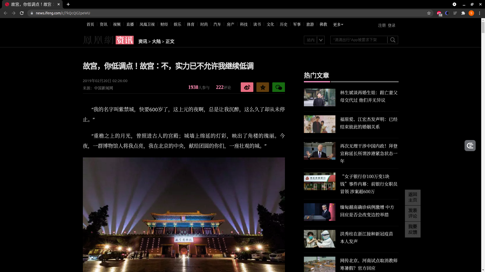
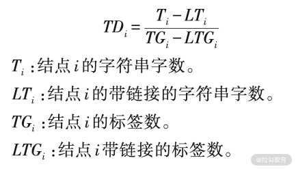
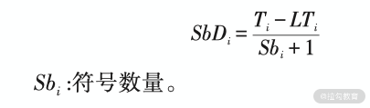
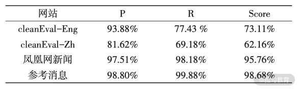

# 页面智能解析算法原理解析

在前面的课时中我们了解了智能化解析技术的一些提取效果和相关开源工具，接下来我们就来深入剖析一下智能解析算法的原理。

---
---

## 目标

还是以新闻网站为例，比如这个链接：[https://news.ifeng.com/c/7kQcQG2peWU](https://news.ifeng.com/c/7kQcQG2peWU) ，页面预览如图所示：



在第一节我们讲解了利用 Diffbot 提取其中的标题、发布人、发布时间、正文、图片等信息，准确率还是不错的，但这毕竟是一个收费服务，不能了解到其实现原理。

接下来我们就来深入剖析一下这些字段的解析方法，虽然本节介绍的不一定是准确率最高、最前沿的方法，但是经过一些验证，其效果还是相对不错的。

本节我们会针对新闻详情页，介绍如下几个字段的智能解析方法：

* 标题
* 正文
* 发布时间
* 作者

这四个字段是新闻详情页里面最重要的信息，所以这里主要就介绍这四个字段的提取方法。

---

### 标题

一般来说，标题是相对比较好提取的，因为一般新闻会把标题放在 ```title``` 这个标签之下。我们可以看一下网页 ```title``` 部分的源码，内容如下：

```html
<title>故宫，你低调点！故宫：不，实力已不允许我继续低调_凤凰网</title>
```

这里如果我们直接提取的话，得到的内容如下：

```textmate
故宫，你低调点！故宫：不，实力已不允许我继续低调_凤凰网
```

但实际上，```title``` 的内容应该为：

```textmate
故宫，你低调点！故宫：不，实力已不允许我继续低调
```

如果我们一味地提取 ```title``` 标签内的内容是不准确的，因为网站本身会额外增加一些信息，比如拼接上站点本身的信息等等。

在绝大部分情况下，标题是通过 ```h``` 节点来表示的，一般为 ```h1、h2、h3、h4``` 等，其内部的文本一般就代表完整的标题，那问题又来了，HTML 里面那么多 ```h```
节点，我们又怎么确定标题对应的是哪个 ```h``` 节点呢？

我们可以用 ```title``` 的内容和 ```h``` 节点的内容结合起来进行判断。

这里我们就能总结出两个提取思路：

* 提取页面的 ```h``` 节点，如 ```h1、h2``` 等节点内容，然后将内容和 ```title``` 的文本进行比对，找出和 ```title``` 最相似的内容。比对的方法可以使用编辑距离或最长公共子串
* 如果未找到 ```h``` 节点，则只能使用 ```title``` 节点

一般来说，使用以上方法几乎可以应对 90% 以上标题的提取。

另外，如果某些网站为了 SEO 效果比较好，通常会添加一些 ```meta``` 标签，如 ```url、title、keywords、category``` 等信息，这些信息也可以成为一些参考依据，进一步校验或补充网站的基本信息。

比如在上面的例子中，可以看到有一个 ```meta``` 节点，其内容如下：

```html

<meta property="og:title" content="故宫，你低调点！故宫：不，实力已不允许我继续低调">
```

这里我们可以看到这个 ```meta``` 节点指定了 ```property``` 为 ```og:title```，这是一种常见写法，其内容正好就是标题的信息，通过这部分信息我们也能进行标题的提取。

因此，综上所述，结合 ```meta、title、h``` 节点，我们就可以应对绝大多数标题的提取了。

---

### 正文

正文可以说是新闻页面最难提取且最为重要的部分了，如果我们不能有效地把正文内容提取出来，那么这次解析就算是失败了一大半了。

在之前介绍过的 ```Readability``` 算法中，我们大致上可以得知其中有一个打分算法，比如我们可以将 HTML 代码进行解析，形成 DOM
树，然后对其中的每个节点进行打分，比如给非正文的节点 ```style、script、sidebar、footer``` 等打负分，对一些 ```p、article```
节点打正分，最后得到一系列节点打分结果，但如果仅仅靠这种算法，其准确率还是比较低的。

但在这个过程中，我们可以得到一些启发，比如：

* 正文内容一般会被包含在 ```body``` 节点的 ```p``` 节点中，而且 ```p``` 节点一般不会独立存在，一般都会存在于 ```div``` 等节点内
* 正文内容对应的 ```p``` 节点也不一定全都是正文内容，可能掺杂其他的噪声，如网站的版权信息、发布人、文末广告等，这部分属于噪声
* 正文内容对应的 ```p``` 节点中会夹杂一些 ```style、script``` 等节点，并非正文内容
* 正文内容对应的 ```p``` 节点内可能包含 ```code、span``` 等节点，这些大部分属于正文中的特殊样式字符，多数情况下也需要归类到正文中

受开源项目 [https://github.com/kingname/GeneralNewsExtractor](https://github.com/kingname/GeneralNewsExtractor) 和论文《洪鸿辉，等
基于文本符号密度的网页正文提取方法》的启发，我们得知了一个有效的正文文本提取依据指标，那就是文本密度。

那么文本密度是什么呢？其实就类似单位节点所包含的文字个数。我们借用上述论文的内容，定义一个节点的文本密度：

如果 ```i``` 为 HTML DOM 树中的一个节点，那么该节点的文本密度定义为：



这里四个指标你需要好好理解下，其实就基本上等同于单位标签内所包含的文字个数，但这里额外考虑了超链接的情况。因为一般来说，正文中所带的超链接是比较少的，而对于一些侧边栏、底栏一些区域，带有超链接的比率是非常高的，文本密度就会低下来，因此就容易排除了。

另外论文还提到了一个指标，叫作符号密度。论文研究发现，正文中一般都带有标点符号，而网页链接、广告信息由于文字比较少，通常是不包含标点符号的，所以我们可以通过符号密度来排除一些内容。

符号密度的定义如下：



这里符号密度为文字数量和符号数量的比值。

在论文中，通过二者结合来提取，正文提取的准确率几乎可以达到 99%，论文作者对以上算法进行了评测，计算了在不同网站上 ```Precision、Recall、F1``` 值，结果如下：



可以看到该算法在凤凰网新闻上的表现整体可以达到 95% 以上。

另外除了基于密度的算法，我们还可以结合视觉来对正文进行识别。一般来说，正文所占的版面是最大的，所以我们可以通过计算节点所占区域的大小来排除一些干扰，比如如果我们查找到两块内容都疑似正文区域，而这两块区域的网页面积却一个很大，一个很小，那么面积大的是正文内容的可能性会更高。

---

### 时间

对于发布时间来说，也是有一些线索供提取的。

一些正规的网站同样会把时间信息放到 ```meta``` 节点内，如上述例子中就多了这样的一个 ```meta``` 节点，内容如下：

```html

<meta name="og:time " content="2019-02-20 02:26:00">
```

可以看到这个 ```meta``` 节点指定了 ```property``` 为 ```og:time```，这是一种常见写法，其内容正好就是时间的信息，通过这部分信息我们也能进行时间的提取。

但并不是所有的网页都会包含这个 ```meta``` 节点，多数情况下网站其实是没有这个节点的。

时间通常都有固定的一些写法，如 ```2019-02-20 02:26:00```，而且对于发布时间来说，其通常会包含一些关键的字符，如「发布」、「发表于」等关键字也可以作为参考依据，所以利用一些正则表达式匹配往往能起到不错的效果。

对于时间的提取，我们可以定义一些时间的正则表达式，基于某种特定的模式来提取时间信息。

如果这篇文章本身包含了时间，或者在侧栏或底栏部分包含了时间，那又怎么办呢？

* 对于文章本身包含时间的情况，我们可以根据上一步的结果，对正文内容对应的节点从节点列表里面删除，这样就会排除文章本身的干扰了
* 对于侧栏或底栏部分包含了时间的情况又怎么分辨呢？这时候我们可以根据节点距离来进行计算。比如发布时间往往和正文距离较近或者紧贴着，而侧栏或底栏的时间却又分布在其他的区块，所以这些日期节点和正文节点相对较远，这样就能找到权重最高的时间节点了

因此，综上所述，时间的提取标准有：

* 根据 ```meta``` 节点的信息进行提取
* 根据一些正则表达式来提取
* 根据节点和正文的距离来筛选更优节点

---

### 作者

这个字段其实相对不太好提取，但是它的重要性相对会低一点，因此如果错误率相比其他的字段有一定的升高的话，还是能够忍受的。

还是上文所述的内容，一些标准的网站会把 ```author``` 信息也加到 ```meta``` 节点里面，所以我们可以根据这个信息来提取。

其他的情况我们同样需要根据一些固定的写法来匹配了，如一些关键字 "作者""编辑""撰稿"，等等关键字。另外我们还可以根据一些常用的姓氏来进行一些优化和提取。

如果在提取的时候有多个候选，我们还可以利用上一步的结果，那就是和日期节点之间的距离来判断，因为一般来说，作者信息旁边大概率会有时间的相关信息，这个指标也可以成为筛选的依据。

因此，综上所述，作者的提取标准有：

* 根据 ```meta``` 节点的信息进行提取
* 根据一些固定的关键词写法，用正则表达式来提取
* 根据一些常用的姓氏来对提取结果进行筛选
* 对和时间节点之间的距离进行计算，同样也可以成为筛选的依据

---

## 总结

本节我们就大体介绍了智能解析算法的提取原理，在下一节我们会用代码来实现其中的一些解析算法。

---
---


