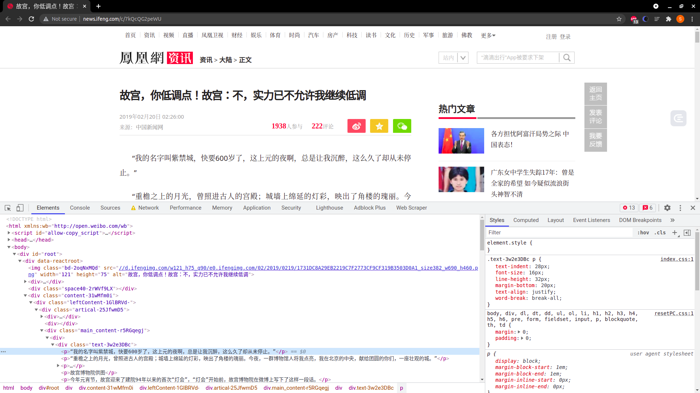

# 实现智能化解析算法

在上一节课介绍了智能解析算法的实现原理，接下来就一起动手用代码来实现一下智能解析算法吧。

---
---

## 学习目标

这里使用的案例还是凤凰网的一篇资讯文章，链接为: [http://news.ifeng.com/c/7kQcQG2peWU](http://news.ifeng.com/c/7kQcQG2peWU)
，本节我们主要实现的提取字段为标题、时间、正文内容。

我们会用 Python 来对上一节讲解的智能解析算法进行实现，实现新闻内容的提取。

---

## 准备工作

首先让我们将上述 URL 打开，然后在浏览器里面打开开发者工具，并打开 Elements 选项卡，最后把 HTML 代码复制下来，如图所示:



复制下来之后我们把源代码保存成一个 html 文件，名字叫作 [sample.html](../../codes/Module_6/lecture_40/sample.html)

然后我们定义如下代码，将 html 里面的字符转化成 lxml 里面的 HtmlElement 对象，代码[如下](../../codes/Module_6/lecture_40/lecture_40_1.py):

```python
# -*- coding: utf-8 -*-


from lxml.html import HtmlElement, fromstring

html = open('sample.html', encoding='utf-8').read()
element = fromstring(html=html)
```

这里 element 对象其实就是整个网页对应的 HtmlElement 对象，其根节点就是 html，下面我们会用到它来进行页面解析，从这个 HtmlElement 对象里面提取出我们想要的时间、标题、正文内容。

---

## 时间

对于时间来说，我们这里就根据两个方面来进行提取，一个就是 meta 标签，如果里面包含了发布时间的相关信息，一般提取出来就是对的，可信度非常高，如果提取不到，那就用正则表达式来匹配一些时间规则进行提取。

首先我们就来进行 meta 标签的提取，这里我们列出来了一些用来匹配发布时间的 XPath 规则，内容如下:

```python
METAS = [
    '//meta[starts-with(@property, "rnews:datePublished")]/@content',
    '//meta[starts-with(@property, "article:published_time")]/@content',
    '//meta[starts-with(@property, "og:published_time")]/@content',
    '//meta[starts-with(@property, "og:release_date")]/@content',
    '//meta[starts-with(@itemprop, "datePublished")]/@content',
    '//meta[starts-with(@itemprop, "dateUpdate")]/@content',
    '//meta[starts-with(@name, "OriginalPublicationDate")]/@content',
    '//meta[starts-with(@name, "article_date_original")]/@content',
    '//meta[starts-with(@name, "og:time")]/@content',
    '//meta[starts-with(@name, "apub:time")]/@content',
    '//meta[starts-with(@name, "publication_date")]/@content',
    '//meta[starts-with(@name, "sailthru.date")]/@content',
    '//meta[starts-with(@name, "PublishDate")]/@content',
    '//meta[starts-with(@name, "publishdate")]/@content',
    '//meta[starts-with(@name, "PubDate")]/@content',
    '//meta[starts-with(@name, "pubtime")]/@content',
    '//meta[starts-with(@name, "_pubtime")]/@content',
    '//meta[starts-with(@name, "weibo: article:create_at")]/@content',
    '//meta[starts-with(@pubdate, "pubdate")]/@content',
]
```

在这里我们就定义一个 ```extract_by_meta``` 的方法，它接受一个 HtmlElement 对象，定义如下:

```python
def extract_by_meta(element: HtmlElement) -> str:
    """
    
    :param element: 
    :return: 
    """
    for xpath in METAS:
        datetime = element.xpath(xpath)
        if datetime:
            return ''.join(datetime)
```

这里我们其实就是对 METAS 进行逐个遍历，然后查找整个 HtmlElement 里面是不是有匹配的内容，比如说:

```textmate
//meta[starts-with(@property, "og:published_time")]/ @content
```

这个就是查找 meta 节点中是不是存在以 ```og:published_time``` 开头的 property 属性，如果存在，那就提取出其中的 content 属性内容。 比如说我们的案例中刚好有一个 meta 节点，内容为:

```html

<meta name="og:time " content="2019-02-20 02:26:00">
```

经过处理，它会匹配到这个 XPath 表达式:

```textmate
//meta[starts-with(@name, "og:time")]/@content
```

这样其实 ```extract_by_meta``` 方法就成功匹配到时间信息，然后提取出 2019-02-20 02:26:00 这个值了。

这就相当于时间提取的第一步成功了，而且一般来说匹配到的结果可信度都是非常高的，我们可以直接将这个内容返回作为最终的提取结果即可。

可是并不是所有的页面都会包含这个 meta 标签，如果不包含的话，我们还需要进行第二步的提取。

下面我们再来实现第二步，也就是根据一些时间正则表达式来进行提取的方法。这里我们其实就是定义一些时间的正则表达式写法，内容如下:

```python
REGEXES = [
    "(\d{4}[-|/|.]\d{1,2}[-|/|.]\d{1,2}\s*?[0-1]?[0-9]:[0-5]?[0-9]:[0-5]?[0-9])",
    "(\d{4}[-|/|.]\d{1,2}[-|/|.]\d{1,2}\s*?[2][0-3]:[0-5]?[0-9]:[0-5]?[0-9])",
    "(\d{4}[-|/|.]\d{1,2}[-|/|.]\d{1,2}\s*?[0-1]?[0-9]:[0-5]?[0-9])",
    "(\d{4}[-|/|.]\d{1,2}[-|/|.]\d{1,2}\s*?[2][0-3]:[0-5]?[0-9])",
    "(\d{4}[-|/|.]\d{1,2}[-|/|.]\d{1,2}\s*?[1-24]\d时[0-60]\d分)([1-24]\d时)",
    "(\d{2}[-|/|.]\d{1,2}[-|/|.]\d{1,2}\s*?[0-1]?[0-9]:[0-5]?[0-9]:[0-5]?[0-9])",
    "(\d{2}[-|/|.]\d{1,2}[-|/|.]\d{1,2}\s*?[2][0-3]:[0-5]?[0-9]:[0-5]?[0-9])",
    "(\d{2}[-|/|.]\d{1,2}[-|/|.]\d{1,2}\s*?[0-1]?[0-9]:[0-5]?[0-9])",
    "(\d{2}[-|/|.]\d{1,2}[-|/|.]\d{1,2}\s*?[2][0-3]:[0-5]?[0-9])",
    "(\d{2}[-|/|.]\d{1,2}[-|/|.]\d{1,2}\s*?[1-24]\d时[0-60]\d分)([1-24]\d时)",
    "(\d{4}年\d{1,2}月\d{1,2}日\s*?[0-1]?[0-9]:[0-5]?[0-9]:[0-5]?[0-9])",
    "(\d{4}年\d{1,2}月\d{1,2}日\s*?[2][0-3]:[0-5]?[0-9]:[0-5]?[0-9])",
    "(\d{4}年\d{1,2}月\d{1,2}日\s*?[0-1]?[0-9]:[0-5]?[0-9])",
    "(\d{4}年\d{1,2}月\d{1,2}日\s*?[2][0-3]:[0-5]?[0-9])",
    "(\d{4}年\d{1,2}月\d{1,2}日\s*?[1-24]\d时[0-60]\d分)([1-24]\d时)",
    "(\d{2}年\d{1,2}月\d{1,2}日\s*?[0-1]?[0-9]:[0-5]?[0-9]:[0-5]?[0-9])",
    "(\d{2}年\d{1,2}月\d{1,2}日\s*?[2][0-3]:[0-5]?[0-9]:[0-5]?[0-9])",
    "(\d{2}年\d{1,2}月\d{1,2}日\s*?[0-1]?[0-9]:[0-5]?[0-9])",
    "(\d{2}年\d{1,2}月\d{1,2}日\s*?[2][0-3]:[0-5]?[0-9])",
    "(\d{2}年\d{1,2}月\d{1,2}日\s*?[1-24]\d时[0-60]\d分)([1-24]\d时)",
    "(\d{1,2}月\d{1,2}日\s*?[0-1]?[0-9]:[0-5]?[0-9]:[0-5]?[0-9])",
    "(\d{1,2}月\d{1,2}日\s*?[2][0-3]:[0-5]?[0-9]:[0-5]?[0-9])",
    "(\d{1,2}月\d{1,2}日\s*?[0-1]?[0-9]:[0-5]?[0-9])",
    "(\d{1,2}月\d{1,2}日\s*?[2][0-3]:[0-5]?[0-9])",
    "(\d{1,2}月\d{1,2}日\s*?[1-24]\d时[0-60]\d分)([1-24]\d时)",
    "(\d{4}[-|/|.]\d{1,2}[-|/|.]\d{1,2})",
    "(\d{2}[-|/|.]\d{1,2}[-|/|.]\d{1,2})",
    "(\d{4}年\d{1,2}月\d{1,2}日)",
    "(\d{2}年\d{1,2}月\d{1,2}日)",
    "(\d{1,2}月\d{1,2}日)"
]
```

由于内容比较多，这里省略了部分内容。其实这里就是一些日期的常见写法格式，由于日期的写法是有限的，所以我们通过一些有限的正则表达就能进行匹配。

接下来我们就定义一个正则搜索的方法，实现如下:

```python
def extract_by_regex(element: HtmlElement) -> str:
    """

    :param element:
    :return:
    """
    text = ''.join(element.xpath('.//text()'))
    for regex in REGEXES:
        result = re.search(regex, text)
        if result:
            return result.group(1)
```

这里我们先查找了 element 的文本内容，然后对文本内容进行正则表达式搜索，符合条件的就直接返回。

最后，时间提取的方法我们直接定义为:

```python
extract_by_meta(element) or extract_by_regex(element)
```

即可，这样就会优先提取 meta，其次根据正则表达式提取。

---

## 标题

接下来我们来实现标题的提取，根据上节内容，标题的提取我们在这里实现三个来源的提取:

查找 meta 节点里面的标题信息。

查找 title 节点的标题信息。

查找 h 节点的信息。

首先就是从 meta 节点提取，其实过程还是类似的，我们定义如下的 meta 节点的 XPath 提取规则，内容如下:

```python
METAS = [
    '//meta[starts-with(@property, "og:title")]/@content',
    '//meta[starts-with(@name, "og:title")]/@content',
    '//meta[starts-with(@property, "title")]/@content',
    '//meta[starts-with(@name, "title")]/@content',
    '//meta[starts-with(@property, "page:title")]/@content',
]
```

实现的提取方法也是完全一样的:

```python
def extract_by_meta(element: HtmlElement) -> str:
    """
    
    :param element: 
    :return: 
    """
    for xpath in METAS:
        title = element.xpath(xpath)
        if title:
            return ''.join(title)
```

关于这一部分就不再展开说明了。

接下来我们还可以提取 title 和 h 节点的信息，通过基本的 XPath 表达式就可以实现，代码如下:

```python
def extract_by_title(element: HtmlElement):
    """
    
    :param element: 
    :return: 
    """
    return ''.join(element.xpath('//title//text()')).strip()


def extract_by_h(element: HtmlElement):
    """
    
    :param element: 
    :return: 
    """
    return ''.join(
        element.xpath('(//h1//text() | //h2//text() | //h3//text())')).strip()
```

这里我们提取了 title、h1~h3 节点的信息，然后返回了它们的纯文本内容。

紧接着，我们分别调用以下这三个方法，看看针对这个案例，其结果是怎样的，调用如下:

```python
title_extracted_by_meta = extract_by_meta(element)
title_extracted_by_h = extract_by_h(element)
title_extracted_by_title = extract_by_title(element)
print("title_extracted_by_meta")
print(title_extracted_by_meta)
print("title_extracted_by_h")
print(title_extracted_by_h)
print("title_extracted_by_title")
print(title_extracted_by_title)
```

运行结果如下:

```textmate
title_extracted_by_meta
2019-02-20 02:26:00
title_extracted_by_h
故宫，你低调点！故宫: 不，实力已不允许我继续低调
title_extracted_by_title
故宫，你低调点！故宫: 不，实力已不允许我继续低调_凤凰网
```

这里我们观察到，三个方法都返回了差不多的结果，但是后缀还是不太一样。

```title_extracted_by_meta``` 实际上是完全正确的内容，可以直接返回，一般来说，它的可信度也非常高，如果匹配到，那就直接返回就好了。

但是如果不存在 ```title_extracted_by_meta``` 的结果呢？那只能靠 ```title_extracted_by_title``` 和 ```title_extracted_by_h``` 了。

这里我们观察到 ```title_extracted_by_title``` 和 ```title_extracted_by_h``` 包含一些冗余信息，仔细想想确实是这样的，因为 title 一般来说会再加上网站的名称，而 h
节点众多，通常会包含很多噪音。

这里我们可以提取它们的公共连续内容其实就好了，这里用到一个算法，就是最长连续公共子串，即 Longest Common String，这里我们直接借助于 Python 的 difflib 库来实现即可，如果你感兴趣的话也可以手动实现一下。

这里我们的实现如下:

```python
def lcs(a, b):
    """
    
    :param a: 
    :param b: 
    :return: 
    """
    match = SequenceMatcher(None, a, b).find_longest_match(0, len(a), 0, len(b))
    return a[match[0]: match[0] + match[2]]
```

这里定义了一个 ```lcs``` 方法，它接收两个字符串类型的参数，比如 abcd 和 bcde，那么它的返回结果就是它们的公共部分，即 bcd。

好，那么对于 ```title_extracted_by_title``` 和 ```title_extracted_by_h```，我们调用下 lcs 方法就好了，实现如下:

```python
lcs(title_extracted_by_title, title_extracted_by_h)
```

最终我们可以把标题的提取定义成一个方法，实现如下:

```python
def extract_title(element: HtmlElement):
    """
    
    :param element: 
    :return: 
    """
    title_extracted_by_meta = extract_by_meta(element)
    title_extracted_by_h = extract_by_h(element)
    title_extracted_by_title = extract_by_title(element)
    if title_extracted_by_meta:
        return title_extracted_by_meta
    if title_extracted_by_title and title_extracted_by_h:
        return lcs(title_extracted_by_title, title_extracted_by_h)
    if title_extracted_by_title:
        return title_extracted_by_title
    return title_extracted_by_h
```

这里我们就定义了一些优先级判定逻辑，如:

* 如果存在 ```title_extracted_by_meta```，由于其可信度非常高，直接返回即可
* 如果不存在 ```title_extracted_by_meta```，而 ```title_extracted_by_title``` 和 ```title_extracted_by_h``` 同时存在，取二者的最长公共子串返回即可
* 如果上述条件不成立，```title_extracted_by_title``` 存在，返回 ```title_extracted_by_title``` 即可
* 如果上述条件不成立，只能返回 ```title_extracted_by_h``` 了

以上就是我们的标题提取逻辑。

---

## 正文

接下来终于轮到重头戏，正文提取了。在上一节课我们介绍了利用文本密度和符号密度进行提取的方法，下面我们就来实现一下吧。

正文的提取需要我们做一些预处理工作，比如一个 html 标签内有很多噪音，非常影响正文的提取，比如说 script、style 这些内容，一定不会包含正文，但是它们会严重影响文本密度的计算，所以这里我们先定义一个预处理操作。

```python
from lxml.html import HtmlElement, etree

CONTENT_USELESS_TAGS = ['meta', 'style', 'script', 'link', 'video', 'audio', 'iframe', 'source', 'svg', 'path',
                        'symbol', 'img']
CONTENT_STRIP_TAGS = ['span', 'blockquote']
CONTENT_NOISE_XPATHS = [
    '//div[contains(@class, "comment")]',
    '//div[contains(@class, "advertisement")]',
    '//div[contains(@class, "advert")]',
    '//div[contains(@style, "display: none")]',
]


def preprocess4content(element: HtmlElement):
    # remove tag and its content
    etree.strip_elements(element, *CONTENT_USELESS_TAGS)
    # only move tag pair
    etree.strip_tags(element, *CONTENT_STRIP_TAGS)
    # remove noise tags
    remove_children(element, CONTENT_NOISE_XPATHS)

    for child in children(element):

        # merge text in span or strong to parent p tag
        if child.tag.lower() == 'p':
            etree.strip_tags(child, 'span')
            etree.strip_tags(child, 'strong')

            if not (child.text and child.text.strip()):
                remove_element(child)

        # if a div tag does not contain any sub node, it could be converted to p node.
        if child.tag.lower() == 'div' and not child.getchildren():
            child.tag = 'p'
```

这里定义了一些规则，比如 ```CONTENT_USELESS_TAGS``` 代表一些噪音节点，可以直接调用 ```strip_elements``` 把整个节点和它的内容删除。

另外定义了 ```CONTENT_STRIP_TAGS```，这些节点文本内容需要保留，但是它的标签是可以删掉的。

另外还定义了 ```CONTENT_NOISE_XPATHS```，这是一些很明显不是正文的节点，如评论、广告等，直接移除就好。

这里还依赖于几个工具方法，定义如下:

```python
def remove_element(element: HtmlElement):
    parent = element.getparent()
    if parent is not None:
        parent.remove(element)


def remove_children(element: HtmlElement, xpaths=None):
    if not xpaths:
        return
    for xpath in xpaths:
        nodes = element.xpath(xpath)
        for node in nodes:
            remove_element(node)
    return element


def children(element: HtmlElement):
    yield element
    for child_element in element:
        if isinstance(child_element, HtmlElement):
            yield from children(child_element)
```

另外对于一些节点我们还做了特殊处理，如 p 节点内部的 span、strong 节点去掉标签，只留内容。如果是 div 节点，而且没有子节点了，那么可以换成 p 节点。

当然还有一些细节的处理，你如果想到了可以继续优化。预处理完毕之后，整个 element 就比较规整了，去除了很多噪声和干扰数据。

接下来我们就来实现文本密度和符号密度的计算吧。为了方便处理，这里我把节点定义成了一个 Python Object，名字叫作 ElementInfo，它里面有很多字段，代表了某一个节点的信息，比如文本密度、符号密度等，定义如下:

```python
from lxml.html import HtmlElement
from pydantic import BaseModel


class ElementInfo(BaseModel):
    id: int = None
    tag_name: str = None
    element: HtmlElement = None
    number_of_char: int = 0
    number_of_linked_char: int = 0
    number_of_tag: int = 0
    number_of_linked_tag: int = 0
    number_of_p_tag: int = 0
    number_of_punctuation: int = 0
    density_of_punctuation: int = 1
    density_of_text: int = 0
    density_score: int = 0

    class Config:
        arbitrary_types_allowed = True
```

这里定义了几个字段。

* ```id```: 节点的唯一 id
* ```tag_name```: 节点的标签值，如 p、div、img 等
* ```element```: 节点对应的 HtmlElement 对象
* ```number_of_char```: 节点的总字符数
* ```number_of_linked_char```: 节点带超链接的字符数
* ```number_of_tag```: 节点的标签数
* ```number_of_linked_tag```: 节点的带链接的标签数，即 a 的标签数
* ```number_of_p_tag```: 节点的 p 标签数
* ```number_of_punctuation```: 节点包含的标点符号数
* ```density_of_punctuation```: 节点的符号密度
* ```density_of_text```: 节点的文本密度
* ```density_score```: 最终评分

好，下面我们要做的就是对整个 HTML 的所有节点进行处理，然后得到每个节点的信息，实现如下:

```python
# start to evaluate every child element
element_infos = []
child_elements = children_of_body(element)
for child_element in child_elements:
    # new element info
    element_info = ElementInfo()
    element_info.element = child_element
    element_info = fill_element_info(element_info)
    element_infos.append(element_info)
```

这里先调用了 ```children_of_body``` 获取了最初 ```element``` 节点的所有子节点，然后对节点进行处理。

其中这里依赖 ```children_of_body``` 和 ```fill_element_info``` 方法，分别是获取所有 body 内的子节点(包括 body)以及计算节点信息，实现如下:

```python
def children_of_body(element: HtmlElement):
    body_xpath = '//body'
    elements = element.xpath(body_xpath)
    if elements:
        return children(elements[0])
    return []


def fill_element_info(element_info: ElementInfo):
    element = element_info.element

    # fill id
    element_info.id = hash(element)
    element_info.tag_name = element.tag

    # fill number_of_char
    element_info.number_of_char = number_of_char(element)
    element_info.number_of_linked_char = number_of_linked_char(element)
    element_info.number_of_tag = number_of_tag(element)
    element_info.number_of_linked_tag = number_of_linked_tag(element)
    element_info.number_of_p_tag = number_of_p_tag(element)
    element_info.number_of_punctuation = number_of_punctuation(element)

    # fill density
    element_info.density_of_text = density_of_text(element_info)
    element_info.density_of_punctuation = density_of_punctuation(element_info)
    return element_info
```

这里 ```fill_element_info``` 方法非常重要，其实就是填充了 ```element_info```
的几乎所有指标信息，这里又依赖了 ```number_of_char、number_of_linked_char、number_of_tag、number_of_linked_tag、number_of_p_tag、number_of_punctuation、density_of_text、density_of_punctuation```
方法，实现如下:

```python
def number_of_char(element: HtmlElement):
    text = ''.join(element.xpath('.//text()'))
    text = re.sub(r'\s*', '', text, flags=re.S)
    return len(text)


def number_of_linked_char(element: HtmlElement):
    text = ''.join(element.xpath('.//a//text()'))
    text = re.sub(r'\s*', '', text, flags=re.S)
    return len(text)


def number_of_tag(element: HtmlElement):
    return len(element.xpath('.//*'))


def number_of_p_tag(element: HtmlElement):
    return len(element.xpath('.//p'))


def number_of_linked_tag(element: HtmlElement):
    return len(element.xpath('.//a'))


def density_of_text(element_info: ElementInfo):
    # if denominator is 0, just return 0
    if element_info.number_of_tag - element_info.number_of_linked_tag == 0:
        return 0
    return (element_info.number_of_char - element_info.number_of_linked_char) /
    (element_info.number_of_tag - element_info.number_of_linked_tag)


def density_of_punctuation(element_info: ElementInfo):
    result = (element_info.number_of_char - element_info.number_of_linked_char) /
    (element_info.number_of_punctuation + 1)
    # result should not be zero
    return result or 1


def number_of_punctuation(element: HtmlElement):
    text = ''.join(element.xpath('.//text()'))
    text = re.sub(r'\s*', '', text, flags=re.S)
    punctuations = [c for c in text if c in PUNCTUATION]
    return len(punctuations)
```

这里比较重要的就是 ```density_of_text``` 和 ```density_of_punctuation``` 两个方法了，分别代表文本密度和符号密度，其算法原理在上一节已经提到了，可以参考论文《洪鸿辉，等
基于文本富豪密度的网页正文提取方法》的内容。

好，这样运行完毕之后，就可以得到每个节点的各个指标。最后，我们继续参考论文《洪鸿辉，等 基于文本富豪密度的网页正文提取方法》的公式，根据各个指标计算每个节点的得分情况，最后提取内容即可:

```python
import numpy as np

# start to evaluate every child element
element_infos = []
child_elements = children_of_body(element)
for child_element in child_elements:
    # new element info
    element_info = ElementInfo()
    element_info.element = child_element
    element_info = fill_element_info(element_info)
    element_infos.append(element_info)
    # get std of density_of_text among all elements
    density_of_text = [element_info.density_of_text for element_info in element_infos]
    density_of_text_std = np.std(density_of_text, ddof=1)
    # get density_score of every element
    for element_info in element_infos:
        score = np.log(density_of_text_std) *
        element_info.density_of_text *
        np.log10(element_info.number_of_p_tag + 2) *
        np.log(element_info.density_of_punctuation)
element_info.density_score = score
# sort element info by density_score
element_infos = sorted(element_infos, key=lambda x: x.density_score, reverse=True)
element_info_first = element_infos[0] if element_infos else None
text = '\n'.join(element_info_first.element.xpath('.//p//text()'))
```

这里我们首先计算了 ```density_of_text``` 的标准差，然后对各个节点计算了最终的密度得分，最后排序得到最高的节点，获取文本值即可。

运行结果如下:

```shell
"“我的名字叫紫禁城，快要600岁了，这上元的夜啊，总是让我沉醉，这么久了却从未停止。”\n“重檐之上的月光，曾照进古人的宫殿；城墙上绵延的灯彩，映出了角楼的瑰丽。今夜，一群博物馆人将我点一段话。\n半小时后，“紫禁城上元之夜”的灯光点亮了北京夜空。\n午门城楼及东西雁翅楼用白、黄、红三种颜色光源装扮！\n太和门广场变成了超大的夜景灯光秀场！\n图片来源: 东方IC 版权作品 请勿转载\n午门城宫博物院供图\n故宫的角楼被灯光装点出满满的节日气氛！\n故宫博物院供图\n令人惊叹的是，故宫的“网红”藏品《清明上河图》《千里江山图卷》在“灯会”中展开画卷。\n灯光版《清明上河图》\n以灯为笔，以屋顶为，故宫博物院最北端神武门也被灯光点亮！\n故宫博物院供图\n上元之夜，故宫邀请了劳动模范、北京榜样、快递小哥、环卫工人、解放军和武警官兵、消防指战员、公安干警等各界代表以及预约成功的观众，共3000人故宫博物院供图\n时间退回到两天前，故宫博物院发布了2月19日(正月十五)、20日(正月十六)即将举办“紫禁城上元之夜”文化活动的消息。\n图片来源: 视觉中国\n18日凌晨，一众网友前往故宫博物院官网抢票，网站甚节就有诸多讲究。\n有灯无月不娱人，有月无灯不算春。\n春到人间人似玉，灯烧月下月如怠。\n满街珠翠游村女，沸地笙歌赛社神。\n不展芳尊开口笑，如何消得此良辰。\n——唐伯虎《元宵》\n明代宫中过上元节，皇宵节晚会”。\n2月18日，北京故宫午门调试灯光。中新社记者 杜洋 摄\n其中，灯戏颇为有趣。由多人舞灯拼出吉祥文字及图案，每人手执彩灯、身着不同颜色的服装，翩翩起舞，类似于现代的大型团体操表演。\n但这紫禁城，恭亲王奕 与英法联军交换了《天津条约》批准书，并订立《中英北京条约》《中法北京条约》作为补充。\n战争结束了，侵略者摇身一变成了游客。一位外国“摄影师”拍下了当年的紫禁城，并在日记里写到，百年。\n直到上世纪40年代时，故宫的环境仍然并不是想象中的博物馆的状态。\n曾有故宫博物院工作人员撰文回忆，当时的故宫内杂草丛生，房倒屋漏，有屋顶竟长出了树木。光是清理当时宫中存留的垃圾、杂草就用单霁翔到任故宫院长。那时，他拿到的故宫博物院介绍，写了这座博物馆诸多的“世界之最”。\n可他觉得，当自己真正走到观众中间，这些“世界之最”都没有了。\n2月18日，北京故宫午门调试灯光。中新社记者 杜洋 摄外环境进行了大整治。\n游客没有地方休息，那就拆除了宫中的临时建筑、新增供游客休息的椅子；\n游客排队上厕所，那就将一个职工食堂都改成了洗手间；\n游客买票难，那就全面采用电子购票，新增多个售票点；馆。\n今年，持续整个正月的“过大年”展览和“紫禁城上元之夜”，让本该是淡季的故宫变得一票难求。\n在不少普通人眼中，近600岁的故宫正变得越来越年轻。\n资料图: 故宫博物院院长单霁翔。中新社记者 刘关关 摄元宵节活动进行评估后，或结合二十四节气等重要时间节点推出夜场活动。\n你期待吗？\n作者: 上官云 宋宇晟"
可以看到，正文就被成功提取出来了。
```

---

## 整理

最后整理一下，三者结果合并，输出为 JSON 格式，实现如下:

```python
def extract(html):
    return {
        'title': extract_title(html),
        'datetime': extract_datetime(html),
        'content': extract_content(html)
    }
```

到此为止，我们就成功提取出来了标题、时间和正文内容并输出为 JSON 格式了。其他的一些字段相对没有那么重要，你可以根据类似的方法来进行提取和实验。

本节代码: [https://github.com/Gerapy/GerapyAutoExtractor](https://github.com/Gerapy/GerapyAutoExtractor)

---
---

