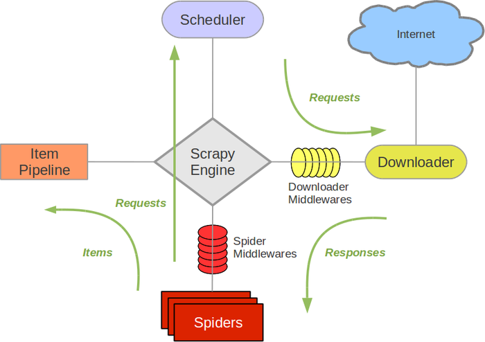

# Scrapy 爬虫框架介绍

在前面编写爬虫的时候，如果使用 requests、aiohttp 等库，需要从头至尾把爬虫完整地实现一遍，比如说异常处理、爬取调度等，如果写的多了，的确会比较麻烦。

那么有没有什么办法可以提升我们编写爬虫的效率呢？当然是有的，那就是利用现有的爬虫框架。

说到 Python 的爬虫框架，Scrapy 当之无愧是最流行最强大的框架了。本节就来初步认识一下 Scrapy，后面的课时会对 Scrapy 的功能模块进行详细介绍。

---
---

## Scrapy 介绍

Scrapy 是一个基于 Twisted 的异步处理框架，是纯 Python 实现的爬虫框架，其架构清晰，模块之间的耦合程度低，可扩展性极强，可以灵活完成各种需求。我们只需要定制开发几个模块就可以轻松实现一个爬虫。

首先来看下 Scrapy 框架的架构，如图所示:



它可以分为如下的几个部分。

* Engine(引擎): 用来处理整个系统的数据流处理、触发事务，是整个框架的核心
* Item(项目): 定义了爬取结果的数据结构，爬取的数据会被赋值成该对象
* Scheduler(调度器): 用来接受引擎发过来的请求并加入队列中，并在引擎再次请求的时候提供给引擎
* Downloader(下载器): 用于下载网页内容，并将网页内容返回给蜘蛛
* Spiders(蜘蛛): 其内定义了爬取的逻辑和网页的解析规则，它主要负责解析响应并生成提取结果和新的请求
* Item Pipeline(项目管道): 负责处理由蜘蛛从网页中抽取的项目，它的主要任务是清洗、验证和存储数据
* Downloader Middlewares(下载器中间件): 位于引擎和下载器之间的钩子框架，主要是处理引擎与下载器之间的请求及响应
* Spider Middlewares(蜘蛛中间件): 位于引擎和蜘蛛之间的钩子框架，主要工作是处理蜘蛛输入的响应和输出的结果及新的请求

初看起来的确比较懵，不过不用担心，我们在后文会结合案例来对 Scrapy 的功能模块进行介绍，相信你会慢慢地理解各个模块的含义及功能。

---

## 数据流

了解了架构，下一步就是要了解它是怎样进行数据爬取和处理的，所以我们接下来需要了解 Scrapy 的数据流机制。

Scrapy 中的数据流由引擎控制，其过程如下:

* Engine 首先打开一个网站，找到处理该网站的 Spider 并向该 Spider 请求第一个要爬取的 URL
* Engine 从 Spider 中获取到第一个要爬取的 URL 并通过 Scheduler 以 Request 的形式调度
* Engine 向 Scheduler 请求下一个要爬取的 URL
* Scheduler 返回下一个要爬取的 URL 给 Engine，Engine 将 URL 通过 Downloader Middlewares 转发给 Downloader 下载
* 一旦页面下载完毕， Downloader 生成一个该页面的 Response，并将其通过 Downloader Middlewares 发送给 Engine
* Engine 从下载器中接收到 Response 并通过 Spider Middlewares 发送给 Spider 处理
* Spider 处理 Response 并返回爬取到的 Item 及新的 Request 给 Engine
* Engine 将 Spider 返回的 Item 给 Item Pipeline，将新的 Request 给 Scheduler
* 重复第二步到最后一步，直到 Scheduler 中没有更多的 Request，Engine 关闭该网站，爬取结束

通过多个组件的相互协作、不同组件完成工作的不同、组件对异步处理的支持，Scrapy 最大限度地利用了网络带宽，大大提高了数据爬取和处理的效率。

---

## 安装

了解了 Scrapy 的基本情况之后，下一步让我们来动手安装一下吧。

Scrapy
的安装方法当然首推官方文档，其地址为: [https://docs.scrapy.org/en/latest/intro/install.html](https://docs.scrapy.org/en/latest/intro/install.html)

安装完成之后，如果可以正常使用 scrapy 命令，那就是可以了。

---

## 项目结构

既然 Scrapy 是框架，那么 Scrapy 一定帮我们预先配置好了很多可用的组件和编写爬虫时所用的脚手架，也就是预生成一个项目框架，我们可以基于这个框架来快速编写爬虫。

Scrapy 框架是通过命令行来创建项目的，创建项目的命令如下:

```shell
scrapy startproject demo
```

执行完成之后，在当前运行目录下便会出现一个文件夹，叫作 demo，这就是一个 Scrapy 项目框架，我们可以基于这个项目框架来编写爬虫。 项目文件结构如下所示:

```shell
scrapy.cfg
project/
   __init__.py
   items.py
   pipelines.py
   settings.py
   middlewares.py
   spiders/
     __init__.py
     spider1.py
     spider2.py
     ...
```

在此要将各个文件的功能描述如下:

* scrapy.cfg: 它是 Scrapy 项目的配置文件，其内定义了项目的配置文件路径、部署相关信息等内容
* items.py: 它定义 Item 数据结构，所有的 Item 的定义都可以放这里
* pipelines.py: 它定义 Item Pipeline 的实现，所有的 Item Pipeline 的实现都可以放这里
* settings.py: 它定义项目的全局配置
* middlewares.py: 它定义 Spider Middlewares 和 Downloader Middlewares 的实现
* spiders: 其内包含一个个 Spider 的实现，每个 Spider 都有一个文件

好了，到现在为止我们就大体知道了 Scrapy 的基本架构并实操创建了一个 Scrapy 项目，后面会详细了解 Scrapy 的用法，感受它的强大，下节课见。

更多信息可以参见: [官方文档](https://docs.scrapy.org/en/latest/)

---
---
 
